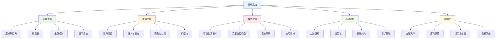

# 逻辑系统

## 目录

- [逻辑系统](#逻辑系统)
  - [目录](#目录)
  - [1. 概述](#1-概述)
    - [1.1 主题定位](#11-主题定位)
    - [1.2 学习目标](#12-学习目标)
  - [2. 学习路径](#2-学习路径)
    - [2.1 初级路径（基础逻辑）](#21-初级路径基础逻辑)
    - [2.2 中级路径（谓词逻辑）](#22-中级路径谓词逻辑)
    - [2.3 高级路径（高级逻辑）](#23-高级路径高级逻辑)
  - [3. 知识体系](#3-知识体系)
    - [3.1 概念层次结构](#31-概念层次结构)
    - [3.2 依赖关系](#32-依赖关系)
    - [3.3 学习资源](#33-学习资源)
  - [4. 核心概念](#4-核心概念)
    - [4.1 基础概念](#41-基础概念)
    - [4.2 逻辑系统概念](#42-逻辑系统概念)
    - [4.3 证明概念](#43-证明概念)
  - [5. 重要定理](#5-重要定理)
    - [5.1 基础定理](#51-基础定理)
    - [5.2 完备性定理](#52-完备性定理)
    - [5.3 不完备性定理](#53-不完备性定理)
  - [6. 应用领域](#6-应用领域)
    - [6.1 数学内部应用](#61-数学内部应用)
    - [6.2 计算机科学应用](#62-计算机科学应用)
    - [6.3 其他学科应用](#63-其他学科应用)
  - [7. 历史发展](#7-历史发展)
    - [7.1 古典时期](#71-古典时期)
    - [7.2 现代发展](#72-现代发展)
    - [7.3 当代发展](#73-当代发展)
    - [7.4 重要人物](#74-重要人物)
  - [8. 参考文献](#8-参考文献)
    - [8.1 经典教材](#81-经典教材)
    - [8.2 中文教材](#82-中文教材)
    - [8.3 在线资源](#83-在线资源)
    - [8.4 研究论文](#84-研究论文)
  - [9. 学习建议](#9-学习建议)
    - [9.1 学习方法](#91-学习方法)
    - [9.2 常见误区](#92-常见误区)
    - [9.3 进阶方向](#93-进阶方向)

---

## 1. 概述

逻辑系统是数学推理的基础，为数学证明提供了严格的规则和方法。本主题涵盖从命题逻辑到高阶逻辑的完整体系，包括形式化推理、证明论、模型论等高级内容。

### 1.1 主题定位

- **学科地位**：数学推理的基础理论
- **应用范围**：所有数学分支的推理工具
- **学习难度**：初级到高级
- **前置知识**：基本集合论概念

### 1.2 学习目标

通过本主题的学习，您将能够：

1. **理解逻辑系统的基本概念**：命题、联结词、推理规则等
2. **掌握形式化推理方法**：学会构造严格的数学证明
3. **运用不同逻辑系统**：命题逻辑、谓词逻辑、模态逻辑等
4. **理解逻辑系统的性质**：完备性、一致性、可判定性等
5. **建立逻辑思维**：培养严格的逻辑推理能力

---

## 2. 学习路径

### 2.1 初级路径（基础逻辑）


**学习内容**：

1. **命题逻辑基础** (3-4小时)
   - 命题的概念
   - 原子命题与复合命题
   - 命题的真值

2. **逻辑联结词** (4-5小时)
   - 否定 (¬)
   - 合取 (∧)
   - 析取 (∨)
   - 蕴含 (→)
   - 等价 (↔)

3. **真值表** (2-3小时)
   - 真值表的构造
   - 重言式与矛盾式
   - 逻辑等价

4. **推理规则** (3-4小时)
   - 分离规则 (Modus Ponens)
   - 否定后件 (Modus Tollens)
   - 三段论
   - 其他基本规则

5. **证明方法** (4-5小时)
   - 直接证明
   - 反证法
   - 数学归纳法
   - 构造性证明

### 2.2 中级路径（谓词逻辑）


**学习内容**：

1. **谓词逻辑基础** (5-6小时)
   - 个体词与谓词
   - 函数符号
   - 项与公式

2. **量词理论** (4-5小时)
   - 全称量词 (∀)
   - 存在量词 (∃)
   - 量词的辖域
   - 自由变量与约束变量

3. **语义与语法** (6-8小时)
   - 形式语言
   - 解释与赋值
   - 满足关系
   - 有效性

4. **完备性定理** (4-5小时)
   - 哥德尔完备性定理
   - 紧致性定理
   - 洛文海姆-斯科伦定理

5. **模型论基础** (5-6小时)
   - 模型与理论
   - 初等等价
   - 模型构造

### 2.3 高级路径（高级逻辑）


**学习内容**：

1. **模态逻辑** (6-8小时)
   - 必然与可能
   - 可能世界语义
   - 克里普克模型
   - 模态系统

2. **直觉主义逻辑** (5-6小时)
   - 构造性证明
   - 海廷代数
   - 直觉主义语义
   - 与经典逻辑的关系

3. **高阶逻辑** (6-8小时)
   - 二阶逻辑
   - 高阶量词
   - 类型层次
   - 表达能力

4. **类型论** (8-10小时)
   - 简单类型论
   - 依赖类型论
   - 同伦类型论
   - 与集合论的关系

5. **证明论** (6-8小时)
   - 自然演绎
   - 序列演算
   - 证明复杂性
   - 截断消去

---

## 3. 知识体系

### 3.1 概念层次结构



### 3.2 依赖关系

**基础依赖**：

- 集合论基础 → 逻辑系统
- 命题逻辑 → 谓词逻辑
- 谓词逻辑 → 模态逻辑
- 谓词逻辑 → 高阶逻辑

**交叉依赖**：

- 逻辑系统 ↔ 证明论
- 模型论 ↔ 逻辑系统
- 类型论 ↔ 高阶逻辑
- 直觉主义逻辑 ↔ 经典逻辑

### 3.3 学习资源

**核心文档**：

- [命题逻辑基础](./01-命题逻辑基础.md)
- [谓词逻辑系统](./02-谓词逻辑系统.md)
- [模态逻辑理论](./03-模态逻辑理论.md)
- [高阶逻辑与类型论](./04-高阶逻辑与类型论.md)
- [证明论基础](./05-证明论基础.md)

**补充资源**：

- [逻辑系统历史发展](./06-历史发展.md)
- [逻辑系统应用实例](./07-应用实例.md)
- [逻辑系统哲学思考](./08-哲学思考.md)

---

## 4. 核心概念

### 4.1 基础概念

| 概念 | 定义 | 重要性 | 应用 |
|------|------|--------|------|
| 命题 | 能判断真假的陈述句 | 逻辑推理的基本单位 | 所有逻辑系统的基础 |
| 逻辑联结词 | 连接命题的符号 | 构建复合命题的工具 | 形式化推理的基础 |
| 推理规则 | 从前提推导结论的规则 | 保证推理有效性的工具 | 数学证明的基础 |
| 真值表 | 命题真值的表格表示 | 验证逻辑等价的方法 | 逻辑设计的基础 |
| 量词 | 表示数量范围的符号 | 处理无限域的工具 | 数学语言的基础 |

### 4.2 逻辑系统概念

| 系统 | 特点 | 表达能力 | 应用领域 |
|------|------|----------|----------|
| 命题逻辑 | 处理简单命题关系 | 有限 | 数字电路、布尔代数 |
| 谓词逻辑 | 处理个体与性质 | 中等 | 数学证明、数据库理论 |
| 模态逻辑 | 处理必然与可能 | 中等 | 哲学、人工智能 |
| 直觉主义逻辑 | 强调构造性证明 | 中等 | 计算机科学、数学哲学 |
| 高阶逻辑 | 处理高阶量词 | 强 | 数学基础、类型论 |

### 4.3 证明概念

| 概念 | 定义 | 重要性 | 应用 |
|------|------|--------|------|
| 形式证明 | 按规则构造的证明序列 | 保证推理严格性 | 数学证明的标准 |
| 自然演绎 | 直观的证明系统 | 接近人类思维 | 逻辑教学 |
| 序列演算 | 对称的证明系统 | 便于证明分析 | 证明论研究 |
| 证明复杂性 | 证明的度量指标 | 评估证明效率 | 算法分析 |
| 截断消去 | 证明的规范化 | 保证证明可靠性 | 证明验证 |

---

## 5. 重要定理

### 5.1 基础定理

**德摩根律**

```
¬(P ∧ Q) ↔ (¬P ∨ ¬Q)
¬(P ∨ Q) ↔ (¬P ∧ ¬Q)
```

**分配律**

```
P ∧ (Q ∨ R) ↔ (P ∧ Q) ∨ (P ∧ R)
P ∨ (Q ∧ R) ↔ (P ∨ Q) ∧ (P ∨ R)
```

**双重否定律**

```
¬¬P ↔ P
```

### 5.2 完备性定理

**哥德尔完备性定理**

```
一阶谓词逻辑是完备的，即所有有效公式都是可证的。
```

**紧致性定理**

```
如果一阶理论的所有有限子集都有模型，则该理论有模型。
```

**洛文海姆-斯科伦定理**

```
如果一阶理论有无限模型，则对任意基数κ≥|L|，该理论有基数为κ的模型。
```

### 5.3 不完备性定理

**哥德尔第一不完备性定理**

```
任何包含算术的一致形式系统都是不完备的。
```

**哥德尔第二不完备性定理**

```
任何包含算术的一致形式系统都不能证明自身的一致性。
```

---

## 6. 应用领域

### 6.1 数学内部应用

**数学证明**

- 形式化证明系统
- 定理证明助手
- 证明验证工具
- 数学知识管理

**数学基础**

- 集合论公理化
- 数论形式化
- 分析学基础
- 代数结构

**数学哲学**

- 数学实在论
- 形式主义
- 直觉主义
- 构造主义

### 6.2 计算机科学应用

**人工智能**

- 知识表示
- 自动推理
- 专家系统
- 逻辑编程

**软件工程**

- 程序验证
- 形式化方法
- 模型检测
- 类型系统

**数据库理论**

- 关系代数
- 查询语言
- 约束理论
- 数据完整性

### 6.3 其他学科应用

**哲学**

- 形而上学
- 认识论
- 语言哲学
- 科学哲学

**语言学**

- 语义学
- 语用学
- 形式语法
- 计算语言学

**认知科学**

- 推理心理学
- 认知模型
- 思维过程
- 学习理论

---

## 7. 历史发展

### 7.1 古典时期

**亚里士多德时代 (公元前4世纪)**

- 三段论理论
- 古典形式逻辑
- 范畴理论
- 证明理论

**中世纪发展 (5-15世纪)**

- 经院哲学逻辑
- 模态逻辑发展
- 语义理论
- 逻辑教学

### 7.2 现代发展

**布尔时代 (19世纪)**

- 布尔代数
- 符号逻辑
- 代数化方法
- 逻辑计算

**弗雷格时代 (19-20世纪)**

- 概念文字
- 谓词逻辑
- 数学基础
- 形式化方法

**现代逻辑 (20世纪)**

- 集合论基础
- 模型论
- 证明论
- 递归论

### 7.3 当代发展

**计算机时代 (20-21世纪)**

- 自动定理证明
- 逻辑编程
- 形式化验证
- 人工智能

**哲学逻辑 (20-21世纪)**

- 模态逻辑
- 时态逻辑
- 道义逻辑
- 认知逻辑

**数学基础 (20-21世纪)**

- 类型论
- 同伦类型论
- 范畴逻辑
- 构造数学

### 7.4 重要人物

| 逻辑学家 | 贡献 | 时期 |
|----------|------|------|
| 亚里士多德 | 古典逻辑 | 公元前4世纪 |
| 布尔 | 布尔代数 | 19世纪 |
| 弗雷格 | 谓词逻辑 | 19-20世纪 |
| 罗素 | 类型论 | 20世纪初 |
| 哥德尔 | 不完备性定理 | 20世纪 |
| 克里普克 | 可能世界语义 | 20世纪 |

---

## 8. 参考文献

### 8.1 经典教材

1. **Enderton, H. B.** (2001). *A Mathematical Introduction to Logic*. Academic Press.
2. **Boolos, G., Burgess, J. P., & Jeffrey, R. C.** (2007). *Computability and Logic*. Cambridge University Press.
3. **Hodges, W.** (1997). *A Shorter Model Theory*. Cambridge University Press.
4. **Girard, J.-Y., Lafont, Y., & Taylor, P.** (1989). *Proofs and Types*. Cambridge University Press.

### 8.2 中文教材

1. **王宪钧** (1982). *数理逻辑引论*. 北京大学出版社.
2. **胡世华** (1981). *数理逻辑基础*. 科学出版社.
3. **张锦文** (1991). *公理集合论导引*. 科学出版社.

### 8.3 在线资源

1. **Stanford Encyclopedia of Philosophy**: Logic
2. **Wikipedia**: Mathematical Logic
3. **MathWorld**: Logic
4. **ProofWiki**: Logic

### 8.4 研究论文

1. **Gödel, K.** (1931). "Über formal unentscheidbare Sätze der Principia Mathematica und verwandter Systeme"
2. **Tarski, A.** (1936). "Der Wahrheitsbegriff in den formalisierten Sprachen"
3. **Kripke, S.** (1963). "Semantical Considerations on Modal Logic"
4. **Gentzen, G.** (1935). "Untersuchungen über das logische Schließen"

---

## 9. 学习建议

### 9.1 学习方法

1. **循序渐进**：从命题逻辑开始，逐步深入复杂系统
2. **多做练习**：通过具体例子理解抽象概念
3. **注重证明**：理解重要定理的证明过程
4. **联系应用**：关注逻辑在其他领域的应用

### 9.2 常见误区

1. **混淆语法与语义**：注意形式系统与解释的区别
2. **忽视元理论**：理解逻辑系统的性质很重要
3. **轻视哲学基础**：逻辑与哲学密切相关
4. **忽略历史**：了解历史发展有助于理解概念

### 9.3 进阶方向

1. **模型论**：研究形式理论与数学结构的关系
2. **证明论**：研究形式证明系统的性质
3. **递归论**：研究可计算性和可判定性
4. **哲学逻辑**：研究逻辑的哲学问题

---

*逻辑系统是数学推理的基础，掌握逻辑系统对于理解整个数学体系至关重要。通过严格的定义、证明和应用，我们建立了坚实的推理基础。*
