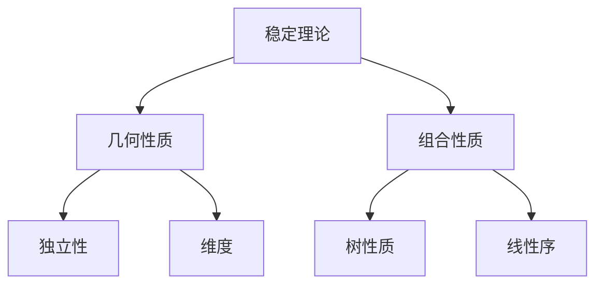
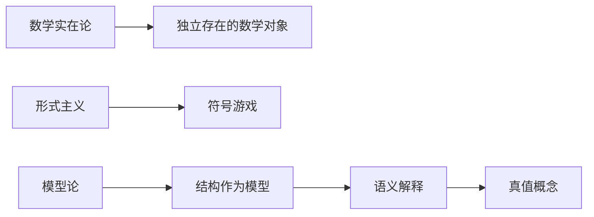

# 模型论

## 目录

- [模型论](#模型论)
  - [目录](#目录)
  - [1. 引言](#1-引言)
    - [1.1 模型论的历史发展](#11-模型论的历史发展)
    - [1.2 模型论的重要性](#12-模型论的重要性)
  - [2. 核心概念](#2-核心概念)
    - [2.1 形式语言与结构](#21-形式语言与结构)
      - [2.1.1 一阶语言](#211-一阶语言)
      - [2.1.2 结构](#212-结构)
    - [2.2 模型与满足关系](#22-模型与满足关系)
      - [2.2.1 项的解释](#221-项的解释)
      - [2.2.2 公式的满足关系](#222-公式的满足关系)
      - [2.2.3 句子与理论](#223-句子与理论)
    - [2.3 同构与初等等价](#23-同构与初等等价)
      - [2.3.1 同构](#231-同构)
      - [2.3.2 初等等价](#232-初等等价)
  - [3. 基本定理](#3-基本定理)
    - [3.1 可靠性定理](#31-可靠性定理)
    - [3.2 哥德尔完备性定理](#32-哥德尔完备性定理)
    - [3.3 紧致性定理](#33-紧致性定理)
    - [3.4 Löwenheim-Skolem定理](#34-löwenheim-skolem定理)
  - [4. 模型构造技术](#4-模型构造技术)
    - [4.1 超积构造](#41-超积构造)
      - [4.1.1 超滤子](#411-超滤子)
      - [4.1.2 超积](#412-超积)
    - [4.2 饱和模型](#42-饱和模型)
      - [4.2.1 类型](#421-类型)
      - [4.2.2 饱和性](#422-饱和性)
    - [4.3 省略类型定理](#43-省略类型定理)
  - [5. 稳定性理论](#5-稳定性理论)
    - [5.1 稳定性概念](#51-稳定性概念)
      - [5.1.1 稳定性](#511-稳定性)
      - [5.1.2 稳定性层次](#512-稳定性层次)
    - [5.2 分类理论](#52-分类理论)
      - [5.2.1 几何稳定性理论](#521-几何稳定性理论)
      - [5.2.2 主要结果](#522-主要结果)
  - [6. 应用与扩展](#6-应用与扩展)
    - [6.1 代数应用](#61-代数应用)
      - [6.1.1 域论](#611-域论)
      - [6.1.2 群论](#612-群论)
    - [6.2 几何应用](#62-几何应用)
      - [6.2.1 代数几何](#621-代数几何)
      - [6.2.2 微分代数](#622-微分代数)
    - [6.3 计算应用](#63-计算应用)
      - [6.3.1 自动推理](#631-自动推理)
      - [6.3.2 程序验证](#632-程序验证)
  - [7. 批判性分析](#7-批判性分析)
    - [7.1 形式化的哲学问题](#71-形式化的哲学问题)
      - [7.1.1 语义与语法的关系](#711-语义与语法的关系)
      - [7.1.2 数学实在论 vs 形式主义](#712-数学实在论-vs-形式主义)
    - [7.2 计算复杂性](#72-计算复杂性)
      - [7.2.1 模型检查的复杂性](#721-模型检查的复杂性)
      - [7.2.2 自动推理的局限性](#722-自动推理的局限性)
    - [7.3 现代发展](#73-现代发展)
      - [7.3.1 抽象模型论](#731-抽象模型论)
      - [7.3.2 几何模型论](#732-几何模型论)
      - [7.3.3 连续模型论](#733-连续模型论)
  - [8. 总结](#8-总结)

---

## 1. 引言

模型论是数理逻辑的一个重要分支，它研究形式语言的语义，关注数学结构与形式语句之间的关系。模型论的核心思想是：给定一个形式语言和一个数学结构，研究该结构在什么意义上"满足"或"实现"该语言中的语句。

### 1.1 模型论的历史发展

模型论起源于20世纪初，主要贡献者包括：

- **阿尔弗雷德·塔斯基**：建立了形式语义学的基础
- **库尔特·哥德尔**：证明了完备性定理
- **阿布拉罕·罗宾逊**：发展了非标准分析
- **迈克尔·莫利**：建立了稳定性理论

### 1.2 模型论的重要性

模型论在数学中具有重要地位：

- **语义基础**：为数理逻辑提供语义基础
- **数学应用**：在代数、几何、分析等领域有广泛应用
- **理论工具**：为数学理论的研究提供强大工具

## 2. 核心概念

### 2.1 形式语言与结构

#### 2.1.1 一阶语言

一个一阶语言 $\mathcal{L}$ 包含：

**符号集**：

- 个体变元：$x, y, z, \ldots$
- 个体常元：$c_1, c_2, \ldots$
- 函数符号：$f_1, f_2, \ldots$（每个都有固定的元数）
- 谓词符号：$P_1, P_2, \ldots$（每个都有固定的元数）
- 逻辑符号：$\neg, \land, \lor, \rightarrow, \leftrightarrow, \forall, \exists$
- 辅助符号：$(, ), ,$

#### 2.1.2 结构

一个 $\mathcal{L}$-结构 $\mathcal{A}$ 包含：

1. **非空域** $A$
2. **解释函数**：
   - 对每个个体常元 $c$，$c^{\mathcal{A}} \in A$
   - 对每个 $n$ 元函数符号 $f$，$f^{\mathcal{A}}: A^n \rightarrow A$
   - 对每个 $n$ 元谓词符号 $P$，$P^{\mathcal{A}} \subseteq A^n$

**示例**：群的语言和结构

```haskell
-- 群的语言
data GroupLanguage = 
  | Constant String  -- 单位元 e
  | Function String  -- 乘法运算 *
  | Predicate String -- 等号 =

-- 群的结构
data GroupStructure a = GroupStructure {
  domain :: [a],
  unit :: a,
  multiply :: a -> a -> a,
  equality :: a -> a -> Bool
}
```

### 2.2 模型与满足关系

#### 2.2.1 项的解释

给定结构 $\mathcal{A}$ 和赋值 $s: \text{Var} \rightarrow A$：

- $x^{\mathcal{A},s} = s(x)$
- $c^{\mathcal{A},s} = c^{\mathcal{A}}$
- $f(t_1, \ldots, t_n)^{\mathcal{A},s} = f^{\mathcal{A}}(t_1^{\mathcal{A},s}, \ldots, t_n^{\mathcal{A},s})$

#### 2.2.2 公式的满足关系

满足关系 $\mathcal{A} \models \phi[s]$ 递归定义：

1. **原子公式**：$\mathcal{A} \models P[t_1, \ldots, t_n](s)$ 当且仅当 $(t_1^{\mathcal{A},s}, \ldots, t_n^{\mathcal{A},s}) \in P^{\mathcal{A}}$

2. **逻辑联结词**：
   - $\mathcal{A} \models \neg \phi[s]$ 当且仅当 $\mathcal{A} \not\models \phi[s]$
   - $\mathcal{A} \models \phi \land \psi[s]$ 当且仅当 $\mathcal{A} \models \phi[s]$ 且 $\mathcal{A} \models \psi[s]$
   - $\mathcal{A} \models \phi \lor \psi[s]$ 当且仅当 $\mathcal{A} \models \phi[s]$ 或 $\mathcal{A} \models \psi[s]$
   - $\mathcal{A} \models \phi \rightarrow \psi[s]$ 当且仅当 $\mathcal{A} \not\models \phi[s]$ 或 $\mathcal{A} \models \psi[s]$

3. **量词**：
   - $\mathcal{A} \models \forall x \phi[s]$ 当且仅当对所有 $a \in A$，$\mathcal{A} \models \phi[s(x/a)]$
   - $\mathcal{A} \models \exists x \phi[s]$ 当且仅当存在 $a \in A$，$\mathcal{A} \models \phi[s(x/a)]$

其中 $s(x/a)$ 表示将赋值 $s$ 在 $x$ 处的值改为 $a$。

#### 2.2.3 句子与理论

- **句子**：不包含自由变元的公式
- **理论**：句子的集合 $T$
- **模型**：满足理论 $T$ 的结构 $\mathcal{A} \models T$

### 2.3 同构与初等等价

#### 2.3.1 同构

两个 $\mathcal{L}$-结构 $\mathcal{A}$ 和 $\mathcal{B}$ 同构，如果存在双射 $f: A \rightarrow B$ 满足：

1. $f(c^{\mathcal{A}}) = c^{\mathcal{B}}$ 对所有常元 $c$
2. $f(f^{\mathcal{A}}(a_1, \ldots, a_n)) = f^{\mathcal{B}}(f(a_1), \ldots, f(a_n))$ 对所有函数符号 $f$
3. $(a_1, \ldots, a_n) \in P^{\mathcal{A}}$ 当且仅当 $(f(a_1), \ldots, f(a_n)) \in P^{\mathcal{B}}$ 对所有谓词符号 $P$

**性质**：同构的结构满足相同的句子。

#### 2.3.2 初等等价

两个结构 $\mathcal{A}$ 和 $\mathcal{B}$ 初等等价（记作 $\mathcal{A} \equiv \mathcal{B}$），如果它们满足相同的句子。

**关系**：$\mathcal{A} \cong \mathcal{B} \Rightarrow \mathcal{A} \equiv \mathcal{B}$，但逆命题不成立。

## 3. 基本定理

### 3.1 可靠性定理

**定理**：如果 $\Gamma \vdash \phi$，则 $\Gamma \models \phi$。

**证明思路**：通过归纳证明，每个推理规则都保持有效性。

**意义**：确保所有可证的公式在所有模型中都是真的。

### 3.2 哥德尔完备性定理

**定理**：如果 $\Gamma \models \phi$，则 $\Gamma \vdash \phi$。

**证明方法**：通过构造模型的方法，使用亨金构造。

**步骤**：

1. 扩展语言，添加新的常元
2. 构造极大一致的理论
3. 定义典范模型
4. 证明满足关系

**意义**：建立了语法和语义的完全对应关系。

### 3.3 紧致性定理

**定理**：如果理论 $T$ 的每个有限子集都有模型，则 $T$ 本身有模型。

**证明**：使用哥德尔完备性定理和有限证明的性质。

**应用示例**：

**非标准分析**：通过紧致性定理构造包含无穷小数的实数模型。

```haskell
-- 标准实数理论
data RealTheory = RealTheory {
  axioms :: [Formula],
  models :: [RealStructure]
}

-- 非标准实数
data NonStandardReal = 
  | Standard Double
  | Infinitesimal Double  -- 无穷小
  | Infinite Double       -- 无穷大
```

### 3.4 Löwenheim-Skolem定理

**向下Löwenheim-Skolem定理**：如果可数语言的理论有无限模型，则它有任意大的无限模型。

**向上Löwenheim-Skolem定理**：如果理论有无限模型，则它有任意大的模型。

**证明**：使用紧致性定理和模型扩张技术。

**哲学意义**：揭示了形式语言的局限性，无法唯一地刻画无限结构。

## 4. 模型构造技术

### 4.1 超积构造

#### 4.1.1 超滤子

**定义**：集合 $I$ 上的超滤子是 $I$ 的幂集 $\mathcal{P}(I)$ 的子集 $F$，满足：

1. $\emptyset \notin F$
2. 如果 $A, B \in F$，则 $A \cap B \in F$
3. 如果 $A \in F$ 且 $A \subseteq B$，则 $B \in F$
4. 对任意 $A \subseteq I$，要么 $A \in F$，要么 $I \setminus A \in F$

#### 4.1.2 超积

给定结构族 $\{\mathcal{A}_i\}_{i \in I}$ 和超滤子 $F$，超积 $\prod_{i \in I} \mathcal{A}_i / F$ 定义如下：

1. **域**：$\prod_{i \in I} A_i / \sim_F$，其中 $f \sim_F g$ 当且仅当 $\{i \in I \mid f(i) = g(i)\} \in F$

2. **解释**：
   - $c^{\prod \mathcal{A}_i / F} = [i \mapsto c^{\mathcal{A}_i}]_F$
   - $f^{\prod \mathcal{A}_i / F}([f_1]_F, \ldots, [f_n]_F) = [i \mapsto f^{\mathcal{A}_i}(f_1(i), \ldots, f_n(i))]_F$
   - $([f_1]_F, \ldots, [f_n]_F) \in P^{\prod \mathcal{A}_i / F}$ 当且仅当 $\{i \in I \mid (f_1(i), \ldots, f_n(i)) \in P^{\mathcal{A}_i}\} \in F$

**Łoś定理**：$\prod_{i \in I} \mathcal{A}_i / F \models \phi([f_1]_F, \ldots, [f_n]_F)$ 当且仅当 $\{i \in I \mid \mathcal{A}_i \models \phi(f_1(i), \ldots, f_n(i))\} \in F$

### 4.2 饱和模型

#### 4.2.1 类型

给定结构 $\mathcal{A}$ 和参数集 $A \subseteq A$，一个 $n$-类型是 $n$ 元公式集 $p(\bar{x})$，使得对任意有限子集 $\{\phi_1, \bar{x}), \ldots, \phi_k(\bar{x})\} \subseteq p(\bar{x})$，存在 $\bar{a} \in A^n$ 使得 $\mathcal{A} \models \phi_i(\bar{a})$ 对所有 $i$。

#### 4.2.2 饱和性

**定义**：结构 $\mathcal{A}$ 是 $\kappa$-饱和的，如果对任意基数 $\lambda < \kappa$ 和任意 $\lambda$-类型 $p(\bar{x})$，如果 $p(\bar{x})$ 在 $\mathcal{A}$ 中可实现，则 $p(\bar{x})$ 在 $\mathcal{A}$ 中实现。

**性质**：

- $\omega$-饱和模型是初等嵌入的
- 饱和模型在同构意义下唯一

### 4.3 省略类型定理

**定理**：如果理论 $T$ 是可数的，且 $p(\bar{x})$ 是一个非主类型，则存在 $T$ 的可数模型不实现 $p(\bar{x})$。

**应用**：构造具有特定性质的模型。

## 5. 稳定性理论

### 5.1 稳定性概念

#### 5.1.1 稳定性

理论 $T$ 是 $\lambda$-稳定的，如果对任意基数 $\kappa \leq \lambda$ 和任意模型 $\mathcal{A} \models T$，$|\mathcal{A}| = \kappa$ 蕴含 $|S_n(A)| \leq \kappa$。

其中 $S_n(A)$ 是 $A$ 上的 $n$-类型空间。

#### 5.1.2 稳定性层次

- **$\omega$-稳定**：$\omega$-稳定
- **超稳定**：对所有无限基数 $\lambda$，$\lambda$-稳定
- **稳定**：存在无限基数 $\lambda$，$\lambda$-稳定

### 5.2 分类理论

#### 5.2.1 几何稳定性理论

研究稳定理论中几何和组合性质：



#### 5.2.2 主要结果

- **莫利分类定理**：$\omega$-稳定理论的可数模型在同构意义下可数
- **谢拉分类定理**：超稳定理论的几何性质
- **哈林顿-谢拉定理**：稳定理论的组合性质

## 6. 应用与扩展

### 6.1 代数应用

#### 6.1.1 域论

模型论在域论中有重要应用：

**代数闭域**：理论 ACF（代数闭域）是 $\omega$-稳定的。

**实闭域**：理论 RCF（实闭域）是 o-最小性的。

#### 6.1.2 群论

**自由群**：自由群的初等理论是稳定的。

**线性群**：某些线性群的初等理论具有良好性质。

### 6.2 几何应用

#### 6.2.1 代数几何

模型论为代数几何提供了新视角：

```haskell
-- 代数簇的语言
data AlgebraicVariety = AlgebraicVariety {
  equations :: [Polynomial],
  field :: Field,
  points :: [Point]
}

-- 模型论视角
data ModelTheoreticVariety = ModelTheoreticVariety {
  theory :: Theory,
  models :: [Structure],
  definableSets :: [DefinableSet]
}
```

#### 6.2.2 微分代数

**微分域**：研究微分方程的解结构。

**微分代数几何**：结合微分代数和代数几何。

### 6.3 计算应用

#### 6.3.1 自动推理

模型论为自动推理提供理论基础：

```rust
// 模型检查
struct ModelChecker {
    theory: Theory,
    model: Structure,
}

impl ModelChecker {
    fn check_formula(&self, formula: Formula) -> bool {
        // 实现模型检查算法
        self.model.satisfies(formula)
    }
}
```

#### 6.3.2 程序验证

**霍尔逻辑**：使用模型论方法验证程序正确性。

**抽象解释**：基于模型论的程序分析方法。

## 7. 批判性分析

### 7.1 形式化的哲学问题

#### 7.1.1 语义与语法的关系

模型论揭示了语义和语法的复杂关系：

- **对应性**：哥德尔完备性定理建立了完全对应
- **局限性**：Löwenheim-Skolem定理显示了局限性
- **相对性**：语义解释依赖于结构的选择

#### 7.1.2 数学实在论 vs 形式主义

模型论为数学哲学提供了重要视角：



### 7.2 计算复杂性

#### 7.2.1 模型检查的复杂性

模型检查问题是计算复杂性的重要研究对象：

- **有限模型**：PSPACE完全
- **无限模型**：不可判定
- **特殊理论**：可能有高效算法

#### 7.2.2 自动推理的局限性

```rust
// 自动推理的局限性
enum ReasoningLimitation {
    Undecidability,      // 不可判定性
    Complexity,          // 计算复杂性
    Incompleteness,      // 不完备性
    Expressiveness       // 表达能力限制
}
```

### 7.3 现代发展

#### 7.3.1 抽象模型论

研究模型论的一般性质：

- **Lindström定理**：刻画一阶逻辑的特征
- **抽象模型论**：研究模型论的一般框架

#### 7.3.2 几何模型论

结合几何和模型论：

- **o-最小性**：有序结构的几何性质
- **NIP理论**：不独立性质理论

#### 7.3.3 连续模型论

扩展到连续结构：

```haskell
-- 连续结构
data ContinuousStructure = ContinuousStructure {
  domain :: MetricSpace,
  functions :: [ContinuousFunction],
  relations :: [ContinuousRelation]
}

-- 连续逻辑
data ContinuousLogic = ContinuousLogic {
  connectives :: [ContinuousConnective],
  quantifiers :: [ContinuousQuantifier],
  semantics :: ContinuousSemantics
}
```

## 8. 总结

模型论作为数理逻辑的核心分支，不仅为逻辑提供了语义基础，也在数学的各个领域有重要应用。通过研究形式语言与数学结构的关系，模型论揭示了数学推理的本质，同时也展现了形式化方法的边界。理解模型论不仅有助于掌握逻辑的基础概念，也为深入理解数学、计算和认知提供了重要视角。

---

**参考文献**：

1. Chang, C. C., & Keisler, H. J. (2012). Model Theory. Elsevier.
2. Hodges, W. (1997). A Shorter Model Theory. Cambridge University Press.
3. Marker, D. (2002). Model Theory: An Introduction. Springer.
4. Tent, K., & Ziegler, M. (2012). A Course in Model Theory. Cambridge University Press.
