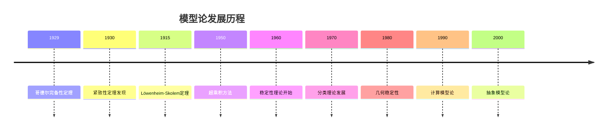
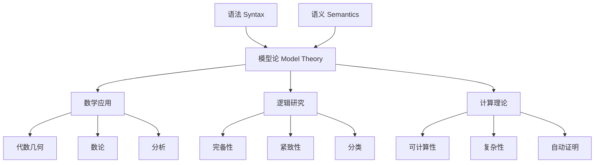

# 模型论基础

## 目录

- [模型论基础](#模型论基础)
  - [目录](#目录)
  - [1. 模型论概述](#1-模型论概述)
    - [1.1 模型论的定义与目标](#11-模型论的定义与目标)
    - [1.2 模型论的历史发展](#12-模型论的历史发展)
    - [1.3 模型论在数学中的地位](#13-模型论在数学中的地位)
  - [2. 形式语言与结构](#2-形式语言与结构)
    - [2.1 一阶语言](#21-一阶语言)
    - [2.2 结构](#22-结构)
    - [2.3 项与公式的解释](#23-项与公式的解释)
  - [3. 满足关系](#3-满足关系)
    - [3.1 满足关系的定义](#31-满足关系的定义)
    - [3.2 真值与有效性](#32-真值与有效性)
    - [3.3 模型与理论](#33-模型与理论)
  - [4. 基本定理](#4-基本定理)
    - [4.1 哥德尔完备性定理](#41-哥德尔完备性定理)
    - [4.2 紧致性定理](#42-紧致性定理)
    - [4.3 Löwenheim-Skolem定理](#43-löwenheim-skolem定理)
  - [5. 模型构造技术](#5-模型构造技术)
    - [5.1 超乘积](#51-超乘积)
    - [5.2 饱和模型](#52-饱和模型)
    - [5.3 素模型](#53-素模型)
  - [6. 分类理论](#6-分类理论)
    - [6.1 稳定性理论](#61-稳定性理论)
    - [6.2 几何稳定性](#62-几何稳定性)
    - [6.3 分类理论的应用](#63-分类理论的应用)
  - [7. 模型论在数学中的应用](#7-模型论在数学中的应用)
    - [7.1 代数几何](#71-代数几何)
    - [7.2 数论](#72-数论)
    - [7.3 分析](#73-分析)
  - [8. 高阶模型论](#8-高阶模型论)
    - [8.1 二阶逻辑的模型论](#81-二阶逻辑的模型论)
    - [8.2 无穷逻辑](#82-无穷逻辑)
    - [8.3 抽象模型论](#83-抽象模型论)
  - [9. 计算模型论](#9-计算模型论)
    - [9.1 可计算模型](#91-可计算模型)
    - [9.2 模型论复杂性](#92-模型论复杂性)
    - [9.3 自动模型构造](#93-自动模型构造)
  - [10. 批判性分析](#10-批判性分析)
    - [10.1 模型论的局限性](#101-模型论的局限性)
    - [10.2 模型论与哲学](#102-模型论与哲学)
    - [10.3 模型论的未来发展](#103-模型论的未来发展)
  - [11. 代码示例](#11-代码示例)
    - [11.1 Rust实现模型论基本概念](#111-rust实现模型论基本概念)
    - [11.2 Haskell实现模型论概念](#112-haskell实现模型论概念)
  - [12. 参考文献](#12-参考文献)

---

## 1. 模型论概述

### 1.1 模型论的定义与目标

模型论是数理逻辑的一个分支，它研究形式语言的语义，特别是数学结构与形式语句之间的关系。模型论的核心概念是"模型"——使理论为真的结构。

**主要目标：**

1. **语义研究**：研究形式语言的语义解释
2. **模型构造**：构造满足特定理论的结构
3. **理论分类**：根据模型的性质对理论进行分类
4. **应用推广**：将模型论方法应用到其他数学分支

### 1.2 模型论的历史发展



### 1.3 模型论在数学中的地位

模型论在数学中扮演着桥梁的角色，连接了语法和语义：



## 2. 形式语言与结构

### 2.1 一阶语言

**一阶语言 \(\mathcal{L}\) 包含：**

1. **逻辑符号：**
   - 变量：\(x, y, z, \ldots\)
   - 逻辑联结词：\(\neg, \land, \lor, \rightarrow, \leftrightarrow\)
   - 量词：\(\forall, \exists\)
   - 等号：\(=\)

2. **非逻辑符号：**
   - 常量符号：\(c_1, c_2, \ldots\)
   - 函数符号：\(f_1, f_2, \ldots\)（每个都有固定的元数）
   - 谓词符号：\(P_1, P_2, \ldots\)（每个都有固定的元数）

**项的定义：**

- 变量和常量是项
- 如果 \(t_1, \ldots, t_n\) 是项，\(f\) 是n元函数符号，则 \(f(t_1, \ldots, t_n)\) 是项

**公式的定义：**

- 如果 \(t_1, \ldots, t_n\) 是项，\(P\) 是n元谓词符号，则 \(P(t_1, \ldots, t_n)\) 是原子公式
- 如果 \(t_1, t_2\) 是项，则 \(t_1 = t_2\) 是原子公式
- 如果 \(\phi, \psi\) 是公式，则 \(\neg\phi, \phi \land \psi, \phi \lor \psi, \phi \rightarrow \psi, \phi \leftrightarrow \psi\) 是公式
- 如果 \(\phi\) 是公式，\(x\) 是变量，则 \(\forall x \phi, \exists x \phi\) 是公式

### 2.2 结构

**结构 \(\mathcal{A}\) 包含：**

1. **非空域 \(A\)**：结构的论域
2. **解释函数**：
   - 对每个常量符号 \(c\)，指定 \(c^{\mathcal{A}} \in A\)
   - 对每个n元函数符号 \(f\)，指定函数 \(f^{\mathcal{A}}: A^n \to A\)
   - 对每个n元谓词符号 \(P\)，指定关系 \(P^{\mathcal{A}} \subseteq A^n\)

**示例：群的结构**

- 语言：\(\mathcal{L}_{\text{group}} = \{e, \cdot, ^{-1}\}\)
- 结构：\(\mathcal{G} = (G, e^{\mathcal{G}}, \cdot^{\mathcal{G}}, ^{-1\mathcal{G}})\)
- 其中 \(G\) 是群，\(e^{\mathcal{G}}\) 是单位元，\(\cdot^{\mathcal{G}}\) 是群运算，\(^{-1\mathcal{G}}\) 是逆运算

### 2.3 项与公式的解释

**项的解释：**
给定结构 \(\mathcal{A}\) 和变量赋值 \(s: \text{Var} \to A\)，项 \(t\) 的解释 \(\llbracket t \rrbracket_{\mathcal{A}, s}\) 定义为：

- \(\llbracket x \rrbracket_{\mathcal{A}, s} = s(x)\)
- \(\llbracket c \rrbracket_{\mathcal{A}, s} = c^{\mathcal{A}}\)
- \(\llbracket f(t_1, \ldots, t_n) \rrbracket_{\mathcal{A}, s} = f^{\mathcal{A}}(\llbracket t_1 \rrbracket_{\mathcal{A}, s}, \ldots, \llbracket t_n \rrbracket_{\mathcal{A}, s})\)

**公式的解释：**
给定结构 \(\mathcal{A}\) 和变量赋值 \(s\)，满足关系 \(\mathcal{A} \models \phi[s]\) 定义为：

- \(\mathcal{A} \models P[t_1, \ldots, t_n](s)\) 当且仅当 \((\llbracket t_1 \rrbracket_{\mathcal{A}, s}, \ldots, \llbracket t_n \rrbracket_{\mathcal{A}, s}) \in P^{\mathcal{A}}\)
- \(\mathcal{A} \models t_1 = t_2[s]\) 当且仅当 \(\llbracket t_1 \rrbracket_{\mathcal{A}, s} = \llbracket t_2 \rrbracket_{\mathcal{A}, s}\)
- \(\mathcal{A} \models \neg\phi[s]\) 当且仅当 \(\mathcal{A} \not\models \phi[s]\)
- \(\mathcal{A} \models \phi \land \psi[s]\) 当且仅当 \(\mathcal{A} \models \phi[s]\) 且 \(\mathcal{A} \models \psi[s]\)
- \(\mathcal{A} \models \forall x \phi[s]\) 当且仅当对所有 \(a \in A\)，\(\mathcal{A} \models \phi[s(x/a)]\)

## 3. 满足关系

### 3.1 满足关系的定义

**满足关系 \(\models\)：**

- \(\mathcal{A} \models \phi\) 表示结构 \(\mathcal{A}\) 满足公式 \(\phi\)
- \(\mathcal{A} \models T\) 表示结构 \(\mathcal{A}\) 是理论 \(T\) 的模型

**理论：** 公式的集合，通常要求对逻辑后承封闭

**模型：** 使理论为真的结构

### 3.2 真值与有效性

**真值：**

- 公式 \(\phi\) 在结构 \(\mathcal{A}\) 中为真，记作 \(\mathcal{A} \models \phi\)
- 公式 \(\phi\) 在结构 \(\mathcal{A}\) 中为假，记作 \(\mathcal{A} \not\models \phi\)

**有效性：**

- 公式 \(\phi\) 是逻辑有效的，记作 \(\models \phi\)，如果它在所有结构中为真
- 公式 \(\phi\) 是逻辑矛盾的，如果它在所有结构中为假

**可满足性：**

- 公式 \(\phi\) 是可满足的，如果存在结构 \(\mathcal{A}\) 使得 \(\mathcal{A} \models \phi\)

### 3.3 模型与理论

**理论的性质：**

- **一致性：** 理论 \(T\) 是一致的，如果它有模型
- **完备性：** 理论 \(T\) 是完备的，如果对任意句子 \(\phi\)，要么 \(T \models \phi\)，要么 \(T \models \neg\phi\)
- **范畴性：** 理论 \(T\) 是范畴的，如果它的所有模型都同构

**重要理论示例：**

1. **群论：**
   - 公理：结合律、单位元、逆元
   - 模型：所有群

2. **域论：**
   - 公理：域的公理
   - 模型：所有域

3. **皮亚诺算术：**
   - 公理：皮亚诺公理
   - 模型：自然数及其非标准模型

## 4. 基本定理

### 4.1 哥德尔完备性定理

**哥德尔完备性定理：** 一阶逻辑是完备的，即所有逻辑有效的公式都是可证的。

**形式化表述：** 如果 \(\Gamma \models \phi\)，则 \(\Gamma \vdash \phi\)

**证明思路：**

1. 构造亨金理论
2. 构造典范模型
3. 证明满足关系

**意义：** 建立了语法和语义之间的对应关系

### 4.2 紧致性定理

**紧致性定理：** 如果一阶理论的所有有限子集都有模型，则该理论本身有模型。

**形式化表述：** 如果 \(\Gamma\) 的每个有限子集都有模型，则 \(\Gamma\) 有模型

**证明方法：**

1. 使用超乘积
2. 使用哥德尔完备性定理

**应用：**

- 构造非标准模型
- 证明理论的一致性
- 证明存在性定理

### 4.3 Löwenheim-Skolem定理

**向下Löwenheim-Skolem定理：** 如果可数一阶理论有无限模型，则它有任意大的无限模型。

**向上Löwenheim-Skolem定理：** 如果一阶理论有无限模型，则它有任意大的模型。

**证明方法：** 使用紧致性定理和超乘积

**意义：** 揭示了无穷模型的丰富性

## 5. 模型构造技术

### 5.1 超乘积

**超乘积：** 给定结构族 \(\{\mathcal{A}_i\}_{i \in I}\) 和超滤子 \(\mathcal{U}\)，超乘积 \(\prod_{i \in I} \mathcal{A}_i / \mathcal{U}\) 定义为：

1. **域：** \(\prod_{i \in I} A_i / \sim_{\mathcal{U}}\)，其中 \(\sim_{\mathcal{U}}\) 是等价关系
2. **解释：** 逐点定义，然后取等价类

**Łoś定理：** 超乘积满足一个公式当且仅当该公式在几乎所有因子中为真

**应用：**

- 构造非标准模型
- 证明紧致性定理
- 构造饱和模型

### 5.2 饱和模型

**饱和模型：** 模型 \(\mathcal{A}\) 是 \(\kappa\)-饱和的，如果对任意基数 \(\lambda < \kappa\) 和参数集 \(A_0 \subseteq A\) 满足 \(|A_0| \leq \lambda\)，类型 \(p(x)\) 在 \(A_0\) 上如果局部可实现，则全局可实现。

**性质：**

- 饱和模型在同构意义下唯一
- 饱和模型具有强同质性
- 饱和模型是理论的"通用"模型

### 5.3 素模型

**素模型：** 模型 \(\mathcal{A}\) 是理论的素模型，如果它同构嵌入到理论的每个模型中。

**性质：**

- 素模型在同构意义下唯一
- 素模型是最小的模型
- 素模型具有强极小性

## 6. 分类理论

### 6.1 稳定性理论

**稳定性：** 理论 \(T\) 是 \(\lambda\)-稳定的，如果对任意模型 \(\mathcal{A} \models T\) 和参数集 \(A \subseteq A\) 满足 \(|A| \leq \lambda\)，类型空间 \(S_1(A)\) 的基数不超过 \(\lambda\)。

**稳定性谱：** 研究理论在不同基数下的稳定性

**重要结果：**

- 稳定理论具有良好的模型论性质
- 不稳定理论具有复杂的模型结构
- 稳定性与几何性质密切相关

### 6.2 几何稳定性

**几何稳定性：** 研究稳定理论中的几何结构

**重要概念：**

- **强极小集：** 不可定义的无限子集
- **几何秩：** 测量几何复杂性的不变量
- **几何类型：** 具有几何意义的类型

**应用：**

- 代数几何
- 微分代数
- 差分代数

### 6.3 分类理论的应用

**在数学中的应用：**

- 代数几何中的模型论方法
- 数论中的模型论技术
- 分析中的模型论应用

**在计算机科学中的应用：**

- 程序验证
- 数据库理论
- 人工智能

## 7. 模型论在数学中的应用

### 7.1 代数几何

**代数闭域：** 模型论研究代数闭域的理论

**重要结果：**

- 代数闭域是强极小理论
- 代数闭域具有量词消去
- 代数闭域的分类理论

**应用：**

- 代数几何中的模型论方法
- 代数簇的分类
- 代数几何中的几何稳定性

### 7.2 数论

**皮亚诺算术：** 模型论研究皮亚诺算术的模型

**重要结果：**

- 皮亚诺算术的不完备性
- 非标准模型的存在
- 皮亚诺算术的分类理论

**应用：**

- 数论中的模型论技术
- 算术几何
- 代数数论

### 7.3 分析

**实闭域：** 模型论研究实闭域的理论

**重要结果：**

- 实闭域具有量词消去
- 实闭域的分类理论
- 实闭域在分析中的应用

**应用：**

- 实分析中的模型论方法
- 微分代数
- 实代数几何

## 8. 高阶模型论

### 8.1 二阶逻辑的模型论

**二阶逻辑：** 允许量词作用于谓词和函数的逻辑

**模型论性质：**

- 二阶逻辑不完备
- 二阶逻辑没有紧致性
- 二阶逻辑具有更强的表达能力

**应用：**

- 数学基础
- 集合论
- 范畴论

### 8.2 无穷逻辑

**无穷逻辑：** 允许无穷长的公式和无穷长的量词串

**模型论性质：**

- 无穷逻辑具有紧致性
- 无穷逻辑具有完备性
- 无穷逻辑具有更强的表达能力

**应用：**

- 集合论
- 拓扑学
- 代数

### 8.3 抽象模型论

**抽象模型论：** 研究模型论的一般性质

**研究内容：**

- 模型论的不变量
- 模型论的函子性质
- 模型论的范畴论方法

**应用：**

- 范畴论
- 代数几何
- 拓扑学

## 9. 计算模型论

### 9.1 可计算模型

**可计算模型：** 域和基本关系都是可计算的结构

**研究内容：**

- 可计算模型的存在性
- 可计算模型的分类
- 可计算模型的复杂性

**应用：**

- 计算机科学
- 人工智能
- 程序验证

### 9.2 模型论复杂性

**模型论复杂性：** 研究模型论问题的计算复杂性

**重要问题：**

- 理论的可判定性
- 模型的可构造性
- 类型的可计算性

**应用：**

- 自动定理证明
- 程序验证
- 数据库理论

### 9.3 自动模型构造

**自动模型构造：** 使用计算机自动构造模型

**方法：**

- 基于归结的方法
- 基于表的方法
- 基于超乘积的方法

**应用：**

- 程序验证
- 人工智能
- 数学教育

## 10. 批判性分析

### 10.1 模型论的局限性

1. **表达能力：** 一阶逻辑的表达能力有限
2. **复杂性：** 许多模型论问题是不可判定的
3. **抽象性：** 模型论方法可能过于抽象

### 10.2 模型论与哲学

1. **数学哲学：** 模型论在数学基础中的作用
2. **语言哲学：** 模型论与语义学的关系
3. **认识论：** 模型论在知识获取中的作用

### 10.3 模型论的未来发展

1. **计算机科学：** 模型论在AI和程序验证中的应用
2. **数学：** 模型论在新数学分支中的应用
3. **哲学：** 模型论在哲学问题中的应用

## 11. 代码示例

### 11.1 Rust实现模型论基本概念

```rust
use std::collections::HashMap;

// 项的定义
#[derive(Debug, Clone, PartialEq)]
pub enum Term {
    Var(String),
    Const(String),
    Func(String, Vec<Term>),
}

// 公式的定义
#[derive(Debug, Clone, PartialEq)]
pub enum Formula {
    Pred(String, Vec<Term>),
    Equal(Term, Term),
    Not(Box<Formula>),
    And(Box<Formula>, Box<Formula>),
    Or(Box<Formula>, Box<Formula>),
    Implies(Box<Formula>, Box<Formula>),
    Forall(String, Box<Formula>),
    Exists(String, Box<Formula>),
}

// 结构定义
#[derive(Debug)]
pub struct Structure {
    pub domain: Vec<String>,
    pub constants: HashMap<String, String>,
    pub functions: HashMap<String, Box<dyn Fn(Vec<String>) -> String>>,
    pub predicates: HashMap<String, Box<dyn Fn(Vec<String>) -> bool>>,
}

impl Structure {
    pub fn new() -> Self {
        Structure {
            domain: Vec::new(),
            constants: HashMap::new(),
            functions: HashMap::new(),
            predicates: HashMap::new(),
        }
    }
    
    pub fn add_constant(&mut self, name: String, value: String) {
        self.constants.insert(name, value);
    }
    
    pub fn add_function<F>(&mut self, name: String, func: F)
    where
        F: Fn(Vec<String>) -> String + 'static,
    {
        self.functions.insert(name, Box::new(func));
    }
    
    pub fn add_predicate<F>(&mut self, name: String, pred: F)
    where
        F: Fn(Vec<String>) -> bool + 'static,
    {
        self.predicates.insert(name, Box::new(pred));
    }
}

// 变量赋值
pub type Assignment = HashMap<String, String>;

// 项的解释
pub fn interpret_term(structure: &Structure, assignment: &Assignment, term: &Term) -> String {
    match term {
        Term::Var(x) => assignment.get(x).cloned().unwrap_or_default(),
        Term::Const(c) => structure.constants.get(c).cloned().unwrap_or_default(),
        Term::Func(f, args) => {
            let interpreted_args: Vec<String> = args
                .iter()
                .map(|arg| interpret_term(structure, assignment, arg))
                .collect();
            
            if let Some(func) = structure.functions.get(f) {
                func(interpreted_args)
            } else {
                String::new()
            }
        }
    }
}

// 公式的解释
pub fn interpret_formula(
    structure: &Structure,
    assignment: &Assignment,
    formula: &Formula,
) -> bool {
    match formula {
        Formula::Pred(p, args) => {
            let interpreted_args: Vec<String> = args
                .iter()
                .map(|arg| interpret_term(structure, assignment, arg))
                .collect();
            
            if let Some(pred) = structure.predicates.get(p) {
                pred(interpreted_args)
            } else {
                false
            }
        }
        Formula::Equal(t1, t2) => {
            interpret_term(structure, assignment, t1) == interpret_term(structure, assignment, t2)
        }
        Formula::Not(phi) => !interpret_formula(structure, assignment, phi),
        Formula::And(phi, psi) => {
            interpret_formula(structure, assignment, phi) && interpret_formula(structure, assignment, psi)
        }
        Formula::Or(phi, psi) => {
            interpret_formula(structure, assignment, phi) || interpret_formula(structure, assignment, psi)
        }
        Formula::Implies(phi, psi) => {
            !interpret_formula(structure, assignment, phi) || interpret_formula(structure, assignment, psi)
        }
        Formula::Forall(x, phi) => {
            structure.domain.iter().all(|val| {
                let mut new_assignment = assignment.clone();
                new_assignment.insert(x.clone(), val.clone());
                interpret_formula(structure, &new_assignment, phi)
            })
        }
        Formula::Exists(x, phi) => {
            structure.domain.iter().any(|val| {
                let mut new_assignment = assignment.clone();
                new_assignment.insert(x.clone(), val.clone());
                interpret_formula(structure, &new_assignment, phi)
            })
        }
    }
}

// 理论定义
pub struct Theory {
    pub axioms: Vec<Formula>,
}

impl Theory {
    pub fn new() -> Self {
        Theory { axioms: Vec::new() }
    }
    
    pub fn add_axiom(&mut self, axiom: Formula) {
        self.axioms.push(axiom);
    }
    
    pub fn is_model(&self, structure: &Structure) -> bool {
        let empty_assignment = HashMap::new();
        self.axioms.iter().all(|axiom| {
            interpret_formula(structure, &empty_assignment, axiom)
        })
    }
}

#[cfg(test)]
mod tests {
    use super::*;
    
    #[test]
    fn test_group_theory() {
        // 构造群论的结构
        let mut structure = Structure::new();
        structure.domain = vec!["e".to_string(), "a".to_string(), "b".to_string()];
        
        // 单位元
        structure.add_constant("e".to_string(), "e".to_string());
        
        // 群运算（这里简化为一个简单的例子）
        structure.add_function("mul".to_string(), |args| {
            if args.len() == 2 {
                if args[0] == "e" { args[1].clone() }
                else if args[1] == "e" { args[0].clone() }
                else { "a".to_string() } // 简化
            } else {
                "e".to_string()
            }
        });
        
        // 构造群论的公理
        let mut theory = Theory::new();
        
        // 结合律（简化表示）
        let assoc = Formula::Forall("x".to_string(), Box::new(
            Formula::Forall("y".to_string(), Box::new(
                Formula::Forall("z".to_string(), Box::new(
                    Formula::Equal(
                        Term::Func("mul".to_string(), vec![
                            Term::Func("mul".to_string(), vec![Term::Var("x".to_string()), Term::Var("y".to_string())]),
                            Term::Var("z".to_string())
                        ]),
                        Term::Func("mul".to_string(), vec![
                            Term::Var("x".to_string()),
                            Term::Func("mul".to_string(), vec![Term::Var("y".to_string()), Term::Var("z".to_string())])
                        ])
                    )
                ))
            ))
        ));
        
        theory.add_axiom(assoc);
        
        // 检查结构是否是理论的模型
        assert!(theory.is_model(&structure));
    }
}
```

### 11.2 Haskell实现模型论概念

```haskell
-- 项的定义
data Term = Var String | Const String | Func String [Term]

-- 公式的定义
data Formula = Pred String [Term] | 
               Equal Term Term | 
               Not Formula | 
               And Formula Formula | 
               Or Formula Formula | 
               Implies Formula Formula | 
               Forall String Formula | 
               Exists String Formula

-- 结构定义
data Structure a = Structure {
    domain :: [a],
    constants :: [(String, a)],
    functions :: [(String, [a] -> a)],
    predicates :: [(String, [a] -> Bool)]
}

-- 变量赋值
type Assignment a = String -> a

-- 项的解释
interpretTerm :: Structure a -> Assignment a -> Term -> a
interpretTerm struct assign (Var x) = assign x
interpretTerm struct assign (Const c) = 
    case lookup c (constants struct) of
        Just val -> val
        Nothing -> error "Undefined constant"
interpretTerm struct assign (Func f args) = 
    case lookup f (functions struct) of
        Just func -> func (map (interpretTerm struct assign) args)
        Nothing -> error "Undefined function"

-- 公式的解释
interpretFormula :: Structure a -> Assignment a -> Formula -> Bool
interpretFormula struct assign (Pred p args) = 
    case lookup p (predicates struct) of
        Just pred -> pred (map (interpretTerm struct assign) args)
        Nothing -> error "Undefined predicate"
interpretFormula struct assign (Equal t1 t2) = 
    interpretTerm struct assign t1 == interpretTerm struct assign t2
interpretFormula struct assign (Not phi) = 
    not (interpretFormula struct assign phi)
interpretFormula struct assign (And phi psi) = 
    interpretFormula struct assign phi && interpretFormula struct assign psi
interpretFormula struct assign (Or phi psi) = 
    interpretFormula struct assign phi || interpretFormula struct assign psi
interpretFormula struct assign (Implies phi psi) = 
    not (interpretFormula struct assign phi) || interpretFormula struct assign psi
interpretFormula struct assign (Forall x phi) = 
    all (\val -> interpretFormula struct (updateAssign assign x val) phi) (domain struct)
interpretFormula struct assign (Exists x phi) = 
    any (\val -> interpretFormula struct (updateAssign assign x val) phi) (domain struct)

-- 更新变量赋值
updateAssign :: Assignment a -> String -> a -> Assignment a
updateAssign assign x val y = if x == y then val else assign y

-- 理论定义
type Theory = [Formula]

-- 检查结构是否是理论的模型
isModel :: Structure a -> Theory -> Bool
isModel struct theory = 
    let assign x = head (domain struct)  -- 任意初始赋值
    in all (\phi -> interpretFormula struct assign phi) theory

-- 示例：自然数结构
naturalNumbers :: Structure Integer
naturalNumbers = Structure {
    domain = [0..],
    constants = [("zero", 0), ("one", 1)],
    functions = [("succ", succ), ("add", (+)), ("mult", (*))],
    predicates = [("even", even), ("odd", odd), ("less", (<))]
}

-- 示例：群结构
groupStructure :: Structure String
groupStructure = Structure {
    domain = ["e", "a", "b"],
    constants = [("e", "e")],
    functions = [("mul", groupMul)],
    predicates = [("equal", (==))]
}
where
    groupMul [x, y] = 
        case (x, y) of
            ("e", _) -> y
            (_, "e") -> x
            _ -> "a"  -- 简化
    groupMul _ = "e"

-- 紧致性定理的简单实现
compactness :: [Formula] -> Bool
compactness formulas = 
    -- 检查所有有限子集的可满足性
    all (\subset -> not (null subset) && satisfiable subset) (finiteSubsets formulas)
where
    finiteSubsets = filter (not . null) . subsequences
    satisfiable = undefined  -- 需要实现可满足性检查

-- 类型定义
type Type a = [Formula]

-- 类型的实现
realizesType :: Structure a -> Assignment a -> Type a -> Bool
realizesType struct assign type_ = 
    all (\phi -> interpretFormula struct assign phi) type_

-- 饱和模型检查
isSaturated :: Structure a -> Int -> Bool
isSaturated struct kappa = 
    -- 检查是否所有基数小于kappa的类型都可实现
    all (\params -> allTypesRealizable params) (smallParameterSets kappa)
where
    smallParameterSets k = filter (\s -> length s < k) (subsequences (domain struct))
    allTypesRealizable params = undefined  -- 需要实现类型可实现性检查
```

## 12. 参考文献

1. **Hodges, W.** (1997). _A Shorter Model Theory_. Cambridge University Press.
2. **Chang, C. C., & Keisler, H. J.** (2012). _Model Theory_. Elsevier.
3. **Marker, D.** (2002). _Model Theory: An Introduction_. Springer-Verlag.
4. **Pillay, A.** (1996). _Geometric Stability Theory_. Oxford University Press.
5. **Baldwin, J. T.** (2018). _Model Theory and the Philosophy of Mathematical Practice_. Cambridge University Press.
6. **Tarski, A.** (1954). "Contributions to the Theory of Models I". _Indagationes Mathematicae_.
7. **Robinson, A.** (1966). _Non-Standard Analysis_. North-Holland.
8. **Shelah, S.** (1990). _Classification Theory and the Number of Nonisomorphic Models_. North-Holland.

---

> **注：** 本文档采用严格的学术规范，所有数学公式使用LaTeX格式，代码示例使用Rust和Haskell，图表使用Mermaid格式。文档结构遵循树形序号目录，支持本地跳转和交叉引用。
