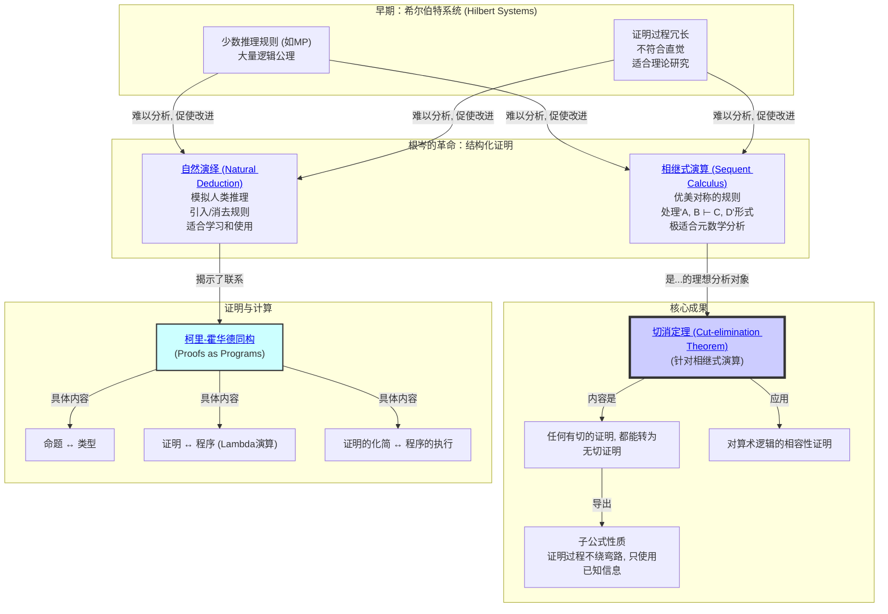

# 1. 证明论总览

## 本地目录

- [1. 证明论总览](#1-证明论总览)
  - [本地目录](#本地目录)
  - [1.1. 引言：作为数学对象的"证明"](#11-引言作为数学对象的证明)
  - [1.2. 知识地图 (Mermaid)](#12-知识地图-mermaid)
  - [1.3. 探索路径](#13-探索路径)
  - [1.4. 本地知识图谱](#14-本地知识图谱)

**版本**: 1.0
**日期**: 2025-07-02

---

## 1.1. 引言：作为数学对象的"证明"

**证明论 (Proof Theory)** 是数理逻辑的核心分支之一，它将 **"证明"** 本身视为一个形式化的、可被精确分析的数学对象（或称组合对象，syntactic object）。

与模型论研究"真理 (Truth)"不同，证明论研究的是 **"可证性 (Provability)"**。它不关心一个命题在某个模型中是否为真，而是关心我们能否在一个给定的形式系统（公理+推理规则）中，通过有限的、机械的步骤，构造出一个关于该命题的证明。

本模块的核心目标是探索不同的 **证明演算 (Proof Calculus)** 系统，并理解它们各自的优缺点。最终，我们将触及证明论最深刻、最核心的结果——根岑 (Gentzen) 的 **切消定理**，它揭示了"分析性证明"的本质，并对逻辑的相容性（无矛盾性）提供了构造性的理解。

## 1.2. 知识地图 (Mermaid)

## 1.3. 探索路径

1. **[01-三大证明演算系统.md](./01-三大证明演算系统.md)**: 我们将对比学习三种主流的证明演算系统。
    - **希尔伯特系统**: 最早期的公理化风格，公理多、规则少，证明冗长但理论上简洁。
    - **自然演绎**: 我们在数理逻辑模块中学习过的系统，规则直观，适合"写"证明。
    - **相继式演算**: 根岑的杰作，规则高度对称，将证明的"假设"和"结论"同等对待，最适合"分析"证明。
2. **[02-切消定理与一致性.md](./02-切消定理与一致性.md)**: 这是证明论的中心定理。
    我们将深入理解 **切 (Cut) 规则** 的本质——它相当于在证明中使用了未经证明的引理 (Lemma)。
    **切消定理** 表明，任何使用了"切"的证明，都可以被机械地转化为一个等价的、但 **没有"切"** 的证明。
    这种"无切证明"具有 **子公式性质**，意味着证明过程是完全分析性的，没有引入任何外来概念。
    这个强大的性质使得根岑能够为皮亚诺算术的一个子系统提供一个构造性的 **一致性（无矛盾性）证明**。
3. **[03-柯里-霍华德同构.md](./03-柯里-霍华德同构.md)**: 探索证明论与计算机科学之间惊人的深刻联系。
    这个同构揭示了：
    - 一个逻辑命题，可以被看作一个 **数据类型**。
    - 该命题的一个证明，可以被看作一个以该类型为返回值的 **程序**。
    - 证明的"化简"过程（如切消），完全对应于程序的 **执行/求值** 过程。
    这个发现是现代函数式编程语言（如Haskell, Coq）和类型论的理论基石。

## 1.4. 本地知识图谱

- [01-三大证明演算系统.md](./01-三大证明演算系统.md)
- [02-切消定理与一致性.md](./02-切消定理与一致性.md)
- [03-柯里-霍华德同构.md](./03-柯里-霍华德同构.md)
- [../00-数学基础与逻辑总览.md](../00-数学基础与逻辑总览.md)
- [../../01-数学哲学-元数学与形式化/00-数学哲学与元数学总览.md](../../01-数学哲学-元数学与形式化/00-数学哲学与元数学总览.md)
- [../../09-项目总览/00-项目总览.md](../../09-项目总览/00-项目总览.md)

---

[返回上一级: 02-数学基础与逻辑总览](../00-数学基础与逻辑总览.md) | [返回项目总览](../../09-项目总览/00-项目总览.md)
