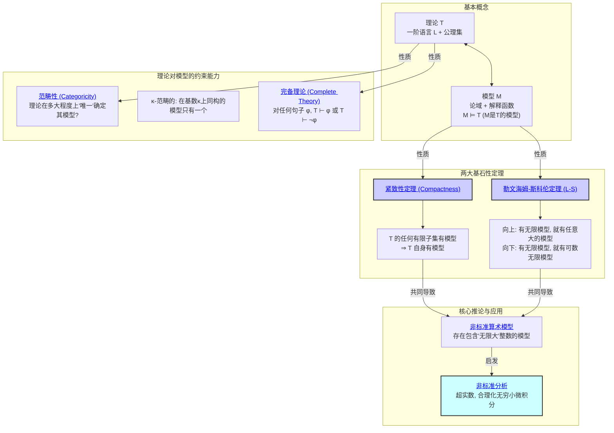

<!-- 本地目录区块 -->
# 目录

- [目录](#目录)
  - [本地知识图谱](#本地知识图谱)
  - [1. 模型论总览](#1-模型论总览)
  - [1.1. 引言：理论与结构的对话](#11-引言理论与结构的对话)
  - [1.2. 知识地图 (Mermaid)](#12-知识地图-mermaid)
  - [1.3. 探索路径](#13-探索路径)
  - [哲学批判与反思](#哲学批判与反思)

<!-- 本地知识图谱区块 -->
## 本地知识图谱

- [02-数学基础与逻辑总览](../00-数学基础与逻辑总览.md)
- [01-集合论总览](../01-集合论/00-集合论总览.md)
- [02-数理逻辑总览](../02-数理逻辑/00-数理逻辑总览.md)
- [03-证明论总览](../03-证明论/00-证明论总览.md)
- [04-模型论总览](./00-模型论总览.md)
- [01-紧致性与勒文海姆-斯科伦定理](./01-紧致性与勒文海姆-斯科伦定理.md)
- [02-非标准模型与无穷小](./02-非标准模型与无穷小.md)
- [03-范畴性与理论的完备性](./03-范畴性与理论的完备性.md)

## 1. 模型论总览

**版本**: 1.0
**日期**: 2025-07-02

---

## 1.1. 引言：理论与结构的对话

**模型论 (Model Theory)** 是数理逻辑的一个主要分支，它扮演着连接 **语法 (Syntax)** 世界和 **语义 (Semantics)** 世界的桥梁。

- **语法世界**: 由一阶逻辑语言和一组公理构成的 **形式理论 (Formal Theory)**，例如群论公理、皮亚诺算术公理等。
- **语义世界**: 满足这些公理的 **具体数学结构 (Mathematical Structures)**，例如一个具体的群 $(\mathbb{Z}, +)$，
    或自然数的标准算术结构 $(\mathbb{N}, +, \cdot, 0, 1)$。
    这些结构被称为该理论的 **模型 (Models)**。

模型论的核心任务，就是研究"理论"和"模型"之间的相互关系。
它试图回答：

- 一个理论能告诉我们关于它的模型的哪些信息？
- 反过来，一个模型的性质又如何影响能够描述它的理论？

本模块将探索模型论的几个奠基性定理，它们揭示了一阶逻辑的强大能力和固有局限性，并催生了像"非标准分析"这样奇妙的数学分支。

## 1.2. 知识地图 (Mermaid)

## 1.3. 探索路径

1. **[01-紧致性与勒文海姆-斯科伦定理.md](./01-紧致性与勒文海姆-斯科伦定理.md)**: 这是模型论的两大基本支柱。
    - **紧致性定理**: 一个威力巨大但反直觉的定理。
    它说，如果一个无限公理集的 **每一个有限子集** 都能找到一个模型，那么这个 **整个无限公理集** 也一定能找到一个模型。
    我们将探讨它如何从哥德尔完备性定理中推导出来。
    - **勒文海姆-斯科伦定理**: 这个定理揭示了一阶逻辑在控制其模型"大小"方面的无能为力。
    它包含"向上"和"向下"两个版本："向上"意味着任何拥有无限模型的理论，必然也拥有任意大的无限模型；
    "向下"则意味着它必然也拥有一个可数无限大小的模型。
2. **[02-非标准模型与无穷小.md](./02-非标准模型与无穷小.md)**: 我们将看到上述两大定理的直接、也是最惊人的推论：**非标准算术模型** 的存在。
    通过向皮亚诺算术公理中加入一个"无限大"新元素的公理，紧致性定理保证了这个新理论有模型。
    这个模型在行为上与普通自然数"初等等价"，但其内部却包含了无穷大和无穷小，这就是**非标准分析**的理论基础，
    它为牛顿和莱布尼兹的无穷小微积分提供了严格的逻辑辩护。
3. **[03-范畴性与理论的完备性.md](./03-范畴性与理论的完备性.md)**: 探讨一个理论"刻画"其模型的能力。
    - **范畴性 (Categoricity)**: 如果一个理论在某个基数 $\kappa$ 上的所有模型都是同构的，我们称它是 $\kappa$-范畴的。
        例如，二阶的皮亚诺算术是 $\aleph_0$-范畴的（它唯一地定义了自然数），但一阶的皮亚诺算术则不是。
    - **完备理论 (Complete Theory)**: 如果一个理论 $T$ 对于其语言中的任何一个句子 $\phi$，都能证明 $\phi$ 或其否定 $\neg\phi$，那么称 $T$ 是完备的。
        我们将看到，$\omega$-范畴的理论一定是完备的。

---

## 哲学批判与反思

- **历史人物与思想年表**：

  | 年代 | 人物 | 主要思想/事件 | 影响 |
  |------|------|---------------|------|
  | 1920s | 洛文海姆、斯科伦 | 勒文海姆-斯科伦定理 | 揭示模型大小的不可控性 |
  | 1930s | 塔斯基 | 形式真理定义 | 语义学革命 |
  | 20世纪 | 罗宾逊 | 非标准模型理论 | 推动非标准分析发展 |
  | 20世纪 | 斯蒂尼茨 | 代数闭域范畴性 | 理论唯一性与完备性研究 |

- **主要争议事件与哲学分歧**：
  - 一阶逻辑能否唯一刻画数学结构？
  - “模型”与“理论”之间的本体论与认识论张力。
  - 语法与语义的分离是否削弱了数学真理的确定性？
  - 非标准模型、不可数模型等的哲学意义。

- **哲学认知与哲科批判性分析**：
  - 模型论揭示了“描述”与“本体”的分离，挑战了数学对象的唯一性观念。
  - 语义学的引入推动了对“真理”“解释”“意义”的哲学反思。
  - 范畴性、完备性等概念反映了人类对“唯一性”“普遍性”的认知追求与局限。
  - 哲学批判性要求我们反思：模型的多样性是否是认知与语言的产物？

- **认知科学视角**：
  - “模型”概念与人类认知中的“表征”“类比”“范畴化”密切相关。
  - 认知科学研究表明，人类理解复杂系统常依赖多重模型与视角，而非唯一刻画。
  - 语义学、语言哲学、心理学等领域对“模型”与“意义”的关系提出新解释。
  - AI与认知科学推动了“多模型推理”“语义网络”等新范式，反映模型论的现实意义。

[历史版本变迁说明与归档索引见主线末尾归档区块]

[返回上一级: 02-数学基础与逻辑总览](../00-数学基础与逻辑总览.md) | [返回项目总览](../../09-项目总览/00-项目总览.md)
