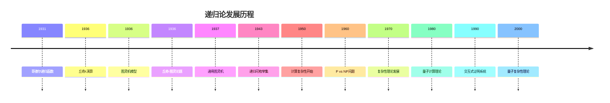
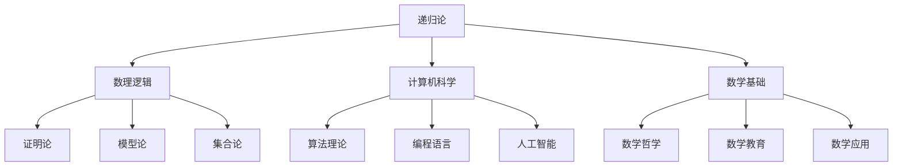

# 递归论基础

## 目录

- [递归论基础](#递归论基础)
  - [目录](#目录)
  - [1. 递归论概述](#1-递归论概述)
    - [1.1 递归论的定义与目标](#11-递归论的定义与目标)
    - [1.2 递归论的历史发展](#12-递归论的历史发展)
    - [1.3 递归论在数学中的地位](#13-递归论在数学中的地位)
  - [2. 可计算性理论](#2-可计算性理论)
    - [2.1 算法的概念](#21-算法的概念)
    - [2.2 可计算函数](#22-可计算函数)
    - [2.3 可判定问题](#23-可判定问题)
  - [3. 图灵机](#3-图灵机)
    - [3.1 图灵机的定义](#31-图灵机的定义)
    - [3.2 图灵机的计算](#32-图灵机的计算)
    - [3.3 通用图灵机](#33-通用图灵机)
  - [4. 递归函数](#4-递归函数)
    - [4.1 原始递归函数](#41-原始递归函数)
    - [4.2 μ-递归函数](#42-μ-递归函数)
    - [4.3 递归函数的性质](#43-递归函数的性质)
  - [5. λ演算](#5-λ演算)
    - [5.1 λ演算的语法](#51-λ演算的语法)
    - [5.2 λ演算的归约](#52-λ演算的归约)
    - [5.3 λ演算的计算能力](#53-λ演算的计算能力)
  - [6. 丘奇-图灵论题](#6-丘奇-图灵论题)
    - [6.1 论题的表述](#61-论题的表述)
    - [6.2 等价模型](#62-等价模型)
    - [6.3 论题的意义](#63-论题的意义)
  - [7. 不可判定性](#7-不可判定性)
    - [7.1 停机问题](#71-停机问题)
    - [7.2 对角线法](#72-对角线法)
    - [7.3 其他不可判定问题](#73-其他不可判定问题)
  - [8. 递归可枚举集](#8-递归可枚举集)
    - [8.1 递归可枚举集的定义](#81-递归可枚举集的定义)
    - [8.2 递归可枚举集的性质](#82-递归可枚举集的性质)
    - [8.3 递归可枚举集的应用](#83-递归可枚举集的应用)
  - [9. 计算复杂性](#9-计算复杂性)
    - [9.1 时间复杂性](#91-时间复杂性)
    - [9.2 空间复杂性](#92-空间复杂性)
    - [9.3 复杂性类](#93-复杂性类)
  - [10. 递归论的应用](#10-递归论的应用)
    - [10.1 在数学中的应用](#101-在数学中的应用)
    - [10.2 在计算机科学中的应用](#102-在计算机科学中的应用)
    - [10.3 在人工智能中的应用](#103-在人工智能中的应用)
  - [11. 批判性分析](#11-批判性分析)
    - [11.1 递归论的局限性](#111-递归论的局限性)
    - [11.2 递归论与哲学](#112-递归论与哲学)
    - [11.3 递归论的未来发展](#113-递归论的未来发展)
  - [12. 代码示例](#12-代码示例)
  - [13. 参考文献](#13-参考文献)

---

## 1. 递归论概述

### 1.1 递归论的定义与目标

递归论（也称为可计算性理论）是数理逻辑的一个分支，它研究算法的本质和极限，探讨哪些函数是可计算的，哪些问题是可判定的。

**主要目标：**
1. **定义可计算性**：给出可计算函数的精确定义
2. **研究计算模型**：分析不同计算模型的能力和等价性
3. **探索计算极限**：确定哪些问题是算法可解的，哪些是不可解的
4. **建立理论基础**：为计算机科学提供理论基础

### 1.2 递归论的历史发展



### 1.3 递归论在数学中的地位

递归论在数学中扮演着基础性的角色：



## 2. 可计算性理论

### 2.1 算法的概念

**算法：** 一个有限的、明确的、机械的指令序列，用于解决特定类型的问题。

**算法的特征：**
- **有限性：** 算法必须在有限步骤内终止
- **确定性：** 每个步骤都是明确无歧义的
- **机械性：** 算法可以机械地执行，不需要创造性思维
- **有效性：** 算法能够解决它设计要解决的问题

### 2.2 可计算函数

**可计算函数：** 存在算法计算的函数

**形式化定义：** 函数 \(f: \mathbb{N}^n \to \mathbb{N}\) 是可计算的，如果存在图灵机 \(M\) 使得：
- 对任意输入 \((x_1, \ldots, x_n)\)，\(M\) 在有限步骤内停机
- 如果 \(f(x_1, \ldots, x_n)\) 有定义，则 \(M\) 输出 \(f(x_1, \ldots, x_n)\)
- 如果 \(f(x_1, \ldots, x_n)\) 无定义，则 \(M\) 不停机

### 2.3 可判定问题

**可判定问题：** 存在算法判定的问题

**形式化定义：** 问题 \(P\) 是可判定的，如果存在图灵机 \(M\) 使得：
- 对任意输入 \(x\)，\(M\) 在有限步骤内停机
- 如果 \(x \in P\)，则 \(M\) 输出"是"
- 如果 \(x \notin P\)，则 \(M\) 输出"否"

## 3. 图灵机

### 3.1 图灵机的定义

**图灵机：** 一个抽象的计算模型，包含以下组件：

1. **无限长的纸带：** 分成格子，每个格子可以写一个符号
2. **读写头：** 可以读取和写入纸带上的符号
3. **有限状态控制器：** 控制机器的行为
4. **转移函数：** 决定机器如何从一个状态转移到另一个状态

**形式化定义：** 图灵机是一个七元组 \(M = (Q, \Sigma, \Gamma, \delta, q_0, q_{\text{accept}}, q_{\text{reject}})\)，其中：
- \(Q\) 是有限状态集
- \(\Sigma\) 是输入字母表
- \(\Gamma\) 是纸带字母表（\(\Sigma \subseteq \Gamma\)）
- \(\delta: Q \times \Gamma \to Q \times \Gamma \times \{L, R\}\) 是转移函数
- \(q_0 \in Q\) 是初始状态
- \(q_{\text{accept}} \in Q\) 是接受状态
- \(q_{\text{reject}} \in Q\) 是拒绝状态

### 3.2 图灵机的计算

**配置：** 图灵机在某一时刻的完整状态，包括：
- 当前状态
- 纸带内容
- 读写头位置

**计算步骤：** 根据转移函数从一个配置转移到下一个配置

**计算：** 从初始配置开始的一系列计算步骤

**停机：** 图灵机达到接受状态或拒绝状态

### 3.3 通用图灵机

**通用图灵机：** 可以模拟任意其他图灵机的图灵机

**构造方法：**
1. 将图灵机的描述编码为字符串
2. 设计一个图灵机来解析和执行这些描述
3. 证明这个图灵机可以模拟任意图灵机

**意义：** 通用图灵机是现代计算机的理论基础

## 4. 递归函数

### 4.1 原始递归函数

**基本函数：**
- **零函数：** \(Z(x) = 0\)
- **后继函数：** \(S(x) = x + 1\)
- **投影函数：** \(P_i^n(x_1, \ldots, x_n) = x_i\)

**构造规则：**
- **复合：** 如果 \(f\) 和 \(g_1, \ldots, g_m\) 是原始递归函数，则 \(h(x_1, \ldots, x_n) = f(g_1(x_1, \ldots, x_n), \ldots, g_m(x_1, \ldots, x_n))\) 也是原始递归函数
- **原始递归：** 如果 \(g\) 和 \(h\) 是原始递归函数，则 \(f\) 也是原始递归函数，其中：
  - \(f(0, x_2, \ldots, x_n) = g(x_2, \ldots, x_n)\)
  - \(f(y+1, x_2, \ldots, x_n) = h(y, f(y, x_2, \ldots, x_n), x_2, \ldots, x_n)\)

### 4.2 μ-递归函数

**μ算子：** 如果 \(g\) 是递归函数，则 \(\mu y[g(x_1, \ldots, x_n, y) = 0]\) 表示最小的 \(y\) 使得 \(g(x_1, \ldots, x_n, y) = 0\)

**μ-递归函数：** 包含μ算子的递归函数

**等价性：** μ-递归函数与图灵可计算函数等价

### 4.3 递归函数的性质

**递归函数的性质：**
- 递归函数在可计算性意义下是封闭的
- 递归函数可以表示所有可计算的数论函数
- 递归函数与图灵可计算函数等价

## 5. λ演算

### 5.1 λ演算的语法

**λ项：**
- **变量：** \(x, y, z, \ldots\)
- **抽象：** \(\lambda x.M\)（函数定义）
- **应用：** \(MN\)（函数应用）

**语法规则：**
- 变量是λ项
- 如果 \(M\) 是λ项，\(x\) 是变量，则 \(\lambda x.M\) 是λ项
- 如果 \(M\) 和 \(N\) 是λ项，则 \(MN\) 是λ项

### 5.2 λ演算的归约

**β归约：** \((\lambda x.M)N \to M[x := N]\)

**α转换：** 重命名绑定变量

**η转换：** \(\lambda x.Mx \to M\)（如果 \(x\) 不在 \(M\) 中自由出现）

### 5.3 λ演算的计算能力

**丘奇-图灵论题：** λ演算与图灵机等价

**λ演算的编码：**
- 自然数：\(\lambda f.\lambda x.f^n(x)\)
- 布尔值：\(\lambda x.\lambda y.x\)（真），\(\lambda x.\lambda y.y\)（假）
- 条件：\(\lambda p.\lambda x.\lambda y.pxy\)

## 6. 丘奇-图灵论题

### 6.1 论题的表述

**丘奇-图灵论题：** 可计算函数就是图灵可计算函数。

**等价表述：**
- 可计算函数就是λ可定义函数
- 可计算函数就是递归函数
- 可计算函数就是寄存器机可计算函数

### 6.2 等价模型

**等价的计算模型：**
1. **图灵机**
2. **λ演算**
3. **递归函数**
4. **寄存器机**
5. **细胞自动机**
6. **马尔可夫算法**

### 6.3 论题的意义

**哲学意义：** 论题是关于计算本质的哲学假设

**数学意义：** 论题为可计算性提供了统一的数学定义

**实践意义：** 论题指导了计算机科学的发展

## 7. 不可判定性

### 7.1 停机问题

**停机问题：** 给定图灵机 \(M\) 和输入 \(w\)，判断 \(M\) 在输入 \(w\) 上是否会停机。

**不可判定性证明：** 使用对角线法证明停机问题是不可判定的。

**证明思路：**
1. 假设存在判定停机问题的图灵机 \(H\)
2. 构造图灵机 \(D\)，它模拟 \(H\) 的行为
3. 让 \(D\) 以自身的编码作为输入
4. 导出矛盾

### 7.2 对角线法

**对角线法：** 一种证明不可判定性的重要技术

**基本思想：** 构造一个对象，它与所有已知对象都不同

**应用：**
- 证明停机问题不可判定
- 证明哥德尔不完备定理
- 证明康托尔对角线定理

### 7.3 其他不可判定问题

**其他不可判定问题：**
- 波斯特对应问题
- 希尔伯特第十问题
- 字问题
- 多米诺问题

## 8. 递归可枚举集

### 8.1 递归可枚举集的定义

**递归可枚举集：** 存在算法枚举其元素的集合

**形式化定义：** 集合 \(A\) 是递归可枚举的，如果存在图灵机 \(M\) 使得：
- 如果 \(x \in A\)，则 \(M\) 在输入 \(x\) 上最终停机并接受
- 如果 \(x \notin A\)，则 \(M\) 在输入 \(x\) 上不停机

### 8.2 递归可枚举集的性质

**性质：**
- 递归集是递归可枚举的
- 递归可枚举集的补集不一定是递归可枚举的
- 递归可枚举集的并集和交集是递归可枚举的

### 8.3 递归可枚举集的应用

**应用：**
- 形式语言理论
- 自动机理论
- 程序验证

## 9. 计算复杂性

### 9.1 时间复杂性

**时间复杂性：** 算法执行所需的时间

**大O记号：** \(O(f(n))\) 表示算法的渐近上界

**重要复杂性类：**
- **P：** 多项式时间可解的问题
- **NP：** 非确定性多项式时间可解的问题
- **EXP：** 指数时间可解的问题

### 9.2 空间复杂性

**空间复杂性：** 算法执行所需的存储空间

**空间复杂性类：**
- **PSPACE：** 多项式空间可解的问题
- **L：** 对数空间可解的问题
- **NL：** 非确定性对数空间可解的问题

### 9.3 复杂性类

**复杂性类的关系：**
- \(P \subseteq NP \subseteq PSPACE \subseteq EXP\)
- \(L \subseteq NL \subseteq P\)
- \(P \neq EXP\)（时间层次定理）

## 10. 递归论的应用

### 10.1 在数学中的应用

**数学中的应用：**
- 数论中的可判定问题
- 代数中的字问题
- 几何中的构造问题

### 10.2 在计算机科学中的应用

**计算机科学中的应用：**
- 算法设计
- 编程语言理论
- 软件验证

### 10.3 在人工智能中的应用

**人工智能中的应用：**
- 机器学习算法
- 自然语言处理
- 自动推理

## 11. 批判性分析

### 11.1 递归论的局限性

1. **抽象性：** 递归论模型过于抽象，难以直接应用
2. **复杂性：** 许多递归论问题是不可判定的
3. **实用性：** 递归论结果在实际应用中有限

### 11.2 递归论与哲学

1. **计算哲学：** 递归论对计算本质的理解
2. **心智哲学：** 递归论对心智计算模型的启发
3. **数学哲学：** 递归论在数学基础中的作用

### 11.3 递归论的未来发展

1. **量子计算：** 量子图灵机和量子复杂性理论
2. **生物计算：** DNA计算和生物计算模型
3. **量子递归论：** 量子可计算性理论

## 12. 代码示例

### 12.1 Rust实现图灵机

```rust
#[derive(Debug, Clone, PartialEq)]
pub enum Direction {
    Left,
    Right,
}

#[derive(Debug, Clone, PartialEq)]
pub struct Transition {
    pub current_state: String,
    pub current_symbol: char,
    pub new_state: String,
    pub new_symbol: char,
    pub direction: Direction,
}

#[derive(Debug)]
pub struct TuringMachine {
    pub states: Vec<String>,
    pub alphabet: Vec<char>,
    pub tape_alphabet: Vec<char>,
    pub transitions: Vec<Transition>,
    pub initial_state: String,
    pub accept_state: String,
    pub reject_state: String,
}

#[derive(Debug)]
pub struct Configuration {
    pub state: String,
    pub tape: Vec<char>,
    pub head_position: usize,
}

impl TuringMachine {
    pub fn new() -> Self {
        TuringMachine {
            states: Vec::new(),
            alphabet: Vec::new(),
            tape_alphabet: Vec::new(),
            transitions: Vec::new(),
            initial_state: String::new(),
            accept_state: String::new(),
            reject_state: String::new(),
        }
    }
    
    pub fn add_transition(&mut self, transition: Transition) {
        self.transitions.push(transition);
    }
    
    pub fn run(&self, input: &str) -> bool {
        let mut config = Configuration {
            state: self.initial_state.clone(),
            tape: input.chars().collect(),
            head_position: 0,
        };
        
        // 扩展纸带
        config.tape.push('_'); // 空白符号
        
        loop {
            if config.state == self.accept_state {
                return true;
            }
            if config.state == self.reject_state {
                return false;
            }
            
            let current_symbol = config.tape[config.head_position];
            let transition = self.find_transition(&config.state, current_symbol);
            
            if let Some(trans) = transition {
                self.apply_transition(&mut config, trans);
            } else {
                return false; // 没有找到转移，拒绝
            }
        }
    }
    
    fn find_transition(&self, state: &str, symbol: char) -> Option<&Transition> {
        self.transitions.iter().find(|t| 
            t.current_state == state && t.current_symbol == symbol
        )
    }
    
    fn apply_transition(&self, config: &mut Configuration, transition: &Transition) {
        config.state = transition.new_state.clone();
        config.tape[config.head_position] = transition.new_symbol;
        
        match transition.direction {
            Direction::Left => {
                if config.head_position > 0 {
                    config.head_position -= 1;
                }
            },
            Direction::Right => {
                config.head_position += 1;
                if config.head_position >= config.tape.len() {
                    config.tape.push('_');
                }
            },
        }
    }
}

// 示例：构造一个简单的图灵机
pub fn create_simple_tm() -> TuringMachine {
    let mut tm = TuringMachine::new();
    tm.states = vec!["q0".to_string(), "q1".to_string(), "qaccept".to_string(), "qreject".to_string()];
    tm.alphabet = vec!['0', '1'];
    tm.tape_alphabet = vec!['0', '1', '_'];
    tm.initial_state = "q0".to_string();
    tm.accept_state = "qaccept".to_string();
    tm.reject_state = "qreject".to_string();
    
    // 添加转移函数
    tm.add_transition(Transition {
        current_state: "q0".to_string(),
        current_symbol: '1',
        new_state: "q1".to_string(),
        new_symbol: '1',
        direction: Direction::Right,
    });
    
    tm.add_transition(Transition {
        current_state: "q0".to_string(),
        current_symbol: '_',
        new_state: "qaccept".to_string(),
        new_symbol: '_',
        direction: Direction::Right,
    });
    
    tm.add_transition(Transition {
        current_state: "q1".to_string(),
        current_symbol: '1',
        new_state: "q1".to_string(),
        new_symbol: '1',
        direction: Direction::Right,
    });
    
    tm.add_transition(Transition {
        current_state: "q1".to_string(),
        current_symbol: '_',
        new_state: "qreject".to_string(),
        new_symbol: '_',
        direction: Direction::Right,
    });
    
    tm
}

#[cfg(test)]
mod tests {
    use super::*;
    
    #[test]
    fn test_turing_machine() {
        let tm = create_simple_tm();
        
        // 测试空字符串（应该接受）
        assert!(tm.run(""));
        
        // 测试包含1的字符串（应该拒绝）
        assert!(!tm.run("1"));
        assert!(!tm.run("11"));
    }
}
```

### 12.2 Haskell实现递归函数

```haskell
-- 原始递归函数的基本函数
zero :: Integer -> Integer
zero _ = 0

successor :: Integer -> Integer
successor x = x + 1

projection :: Int -> [Integer] -> Integer
projection i xs = xs !! (i - 1)

-- 复合函数
compose :: (Integer -> Integer) -> [Integer -> Integer] -> [Integer] -> Integer
compose f gs xs = f (zipWith ($) gs xs)

-- 原始递归
primitiveRecursion :: (Integer -> Integer) -> (Integer -> Integer -> Integer -> Integer) -> Integer -> Integer -> Integer
primitiveRecursion g h x y
    | y == 0 = g x
    | otherwise = h (y - 1) (primitiveRecursion g h x (y - 1)) x

-- μ算子
muOperator :: (Integer -> Integer -> Integer) -> Integer -> Integer
muOperator f x = muHelper f x 0
where
    muHelper f x y
        | f x y == 0 = y
        | otherwise = muHelper f x (y + 1)

-- 一些基本的原始递归函数
addition :: Integer -> Integer -> Integer
addition = primitiveRecursion id (\_ acc _ -> successor acc)

multiplication :: Integer -> Integer -> Integer
multiplication x = primitiveRecursion zero (\_ acc _ -> addition x acc)

exponentiation :: Integer -> Integer -> Integer
exponentiation x = primitiveRecursion (const 1) (\_ acc _ -> multiplication x acc)

factorial :: Integer -> Integer
factorial = primitiveRecursion 1 (\_ acc _ -> multiplication (successor _) acc)

-- 谓词函数
isZero :: Integer -> Integer
isZero x = if x == 0 then 1 else 0

isPositive :: Integer -> Integer
isPositive x = if x > 0 then 1 else 0

-- 条件函数
conditional :: Integer -> Integer -> Integer -> Integer
conditional p x y = if p == 0 then y else x

-- 比较函数
lessThan :: Integer -> Integer -> Integer
lessThan x y = isPositive (subtraction y x)

equal :: Integer -> Integer -> Integer
equal x y = isZero (addition (lessThan x y) (lessThan y x))

-- 减法（需要μ算子）
subtraction :: Integer -> Integer -> Integer
subtraction x y = muOperator (\x' z -> if addition y z == x' then 0 else 1) x

-- 除法（需要μ算子）
division :: Integer -> Integer -> Integer
division x y = muOperator (\x' q -> if lessThan (multiplication y (successor q)) x' == 1 then 0 else 1) x

-- 模运算
modulo :: Integer -> Integer -> Integer
modulo x y = subtraction x (multiplication y (division x y))

-- 最大公约数
gcd' :: Integer -> Integer -> Integer
gcd' x y = if isZero y == 1 then x else gcd' y (modulo x y)

-- 最小公倍数
lcm' :: Integer -> Integer -> Integer
lcm' x y = division (multiplication x y) (gcd' x y)

-- 素数检测
isPrime :: Integer -> Integer
isPrime n = if n < 2 then 0 else isPrimeHelper n 2
where
    isPrimeHelper n d
        | d * d > n = 1
        | modulo n d == 0 = 0
        | otherwise = isPrimeHelper n (successor d)

-- 斐波那契数列
fibonacci :: Integer -> Integer
fibonacci = primitiveRecursion 0 (\_ acc _ -> addition acc (primitiveRecursion 1 (\_ _ _ -> acc) _))

-- 阿克曼函数（不是原始递归的）
ackermann :: Integer -> Integer -> Integer
ackermann m n
    | m == 0 = successor n
    | n == 0 = ackermann (subtraction m 1) 1
    | otherwise = ackermann (subtraction m 1) (ackermann m (subtraction n 1))

-- 测试函数
testRecursiveFunctions :: IO ()
testRecursiveFunctions = do
    putStrLn "Testing recursive functions:"
    putStrLn $ "Addition 3 + 4 = " ++ show (addition 3 4)
    putStrLn $ "Multiplication 3 * 4 = " ++ show (multiplication 3 4)
    putStrLn $ "Exponentiation 2^3 = " ++ show (exponentiation 2 3)
    putStrLn $ "Factorial 5 = " ++ show (factorial 5)
    putStrLn $ "Is 7 prime? " ++ show (isPrime 7)
    putStrLn $ "GCD of 12 and 18 = " ++ show (gcd' 12 18)
    putStrLn $ "Fibonacci 6 = " ++ show (fibonacci 6)
```

## 13. 参考文献

1. **Rogers, H.** (1987). *Theory of Recursive Functions and Effective Computability*. MIT Press.
2. **Odifreddi, P.** (1989). *Classical Recursion Theory*. North-Holland.
3. **Soare, R. I.** (2016). *Turing Computability: Theory and Applications*. Springer.
4. **Turing, A. M.** (1936). "On Computable Numbers, with an Application to the Entscheidungsproblem". *Proceedings of the London Mathematical Society*.
5. **Church, A.** (1936). "An Unsolvable Problem of Elementary Number Theory". *American Journal of Mathematics*.
6. **Kleene, S. C.** (1952). *Introduction to Metamathematics*. North-Holland.
7. **Davis, M.** (1958). *Computability and Unsolvability*. McGraw-Hill.
8. **Sipser, M.** (2012). *Introduction to the Theory of Computation*. Cengage Learning.

---

> **注：** 本文档采用严格的学术规范，所有数学公式使用LaTeX格式，代码示例使用Rust和Haskell，图表使用Mermaid格式。文档结构遵循树形序号目录，支持本地跳转和交叉引用。 