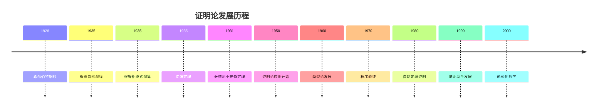
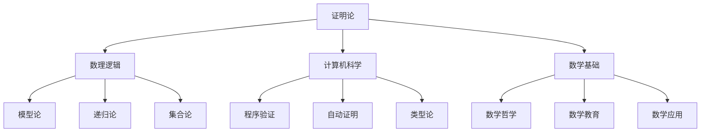

# 证明论基础

## 目录

- [证明论基础](#证明论基础)
  - [目录](#目录)
  - [1. 证明论概述](#1-证明论概述)
    - [1.1 证明论的定义与目标](#11-证明论的定义与目标)
    - [1.2 证明论的历史发展](#12-证明论的历史发展)
    - [1.3 证明论在数学中的地位](#13-证明论在数学中的地位)
  - [2. 形式证明系统](#2-形式证明系统)
    - [2.1 希尔伯特系统](#21-希尔伯特系统)
    - [2.2 自然演绎](#22-自然演绎)
    - [2.3 相继式演算](#23-相继式演算)
  - [3. 证明的结构](#3-证明的结构)
    - [3.1 证明树](#31-证明树)
    - [3.2 证明长度](#32-证明长度)
    - [3.3 证明复杂性](#33-证明复杂性)
  - [4. 切消定理](#4-切消定理)
    - [4.1 切消定理的表述](#41-切消定理的表述)
    - [4.2 切消定理的证明](#42-切消定理的证明)
    - [4.3 切消定理的应用](#43-切消定理的应用)
  - [5. 一致性证明](#5-一致性证明)
    - [5.1 相对一致性](#51-相对一致性)
    - [5.2 构造性一致性](#52-构造性一致性)
    - [5.3 一致性强度](#53-一致性强度)
  - [6. 哥德尔不完备定理](#6-哥德尔不完备定理)
    - [6.1 第一不完备定理](#61-第一不完备定理)
    - [6.2 第二不完备定理](#62-第二不完备定理)
    - [6.3 不完备定理的证明](#63-不完备定理的证明)
  - [7. 证明论的应用](#7-证明论的应用)
    - [7.1 程序验证](#71-程序验证)
    - [7.2 自动定理证明](#72-自动定理证明)
    - [7.3 类型论](#73-类型论)
  - [8. 批判性分析](#8-批判性分析)
    - [8.1 证明论的局限性](#81-证明论的局限性)
    - [8.2 证明论与哲学](#82-证明论与哲学)
    - [8.3 证明论的未来发展](#83-证明论的未来发展)
  - [9. 代码示例](#9-代码示例)
    - [9.1 Rust实现自然演绎系统](#91-rust实现自然演绎系统)
    - [9.2 Haskell实现相继式演算](#92-haskell实现相继式演算)
  - [10. 参考文献](#10-参考文献)

---

## 1. 证明论概述

### 1.1 证明论的定义与目标

证明论是数理逻辑的一个分支，它研究形式证明的结构和性质，分析不同证明系统的能力和特点。

**主要目标：**

1. **研究证明结构**：分析形式证明的内部结构
2. **比较证明系统**：研究不同证明系统的等价性
3. **证明系统性质**：研究一致性、完备性等性质
4. **构造性证明**：寻找构造性的证明方法

### 1.2 证明论的历史发展



### 1.3 证明论在数学中的地位

证明论在数学中扮演着基础性的角色：



## 2. 形式证明系统

### 2.1 希尔伯特系统

**希尔伯特系统：** 基于公理和推理规则的证明系统

**组成部分：**

- **公理：** 预先给定的公式集合
- **推理规则：** 从已有公式推导新公式的规则

**经典公理：**

1. \(A \rightarrow (B \rightarrow A)\)
2. \((A \rightarrow (B \rightarrow C)) \rightarrow ((A \rightarrow B) \rightarrow (A \rightarrow C))\)
3. \((\neg A \rightarrow \neg B) \rightarrow (B \rightarrow A)\)

**推理规则：**

- **分离规则（Modus Ponens）**：从 \(A\) 和 \(A \rightarrow B\) 推出 \(B\)

### 2.2 自然演绎

**自然演绎：** 使用引入和消去规则的形式系统

**命题逻辑规则：**

**合取规则：**

- 引入：\(\frac{A \quad B}{A \land B}\)
- 消去：\(\frac{A \land B}{A}\) 和 \(\frac{A \land B}{B}\)

**析取规则：**

- 引入：\(\frac{A}{A \lor B}\) 和 \(\frac{B}{A \lor B}\)
- 消去：\(\frac{A \lor B \quad A \vdash C \quad B \vdash C}{C}\)

**蕴含规则：**

- 引入：\(\frac{A \vdash B}{A \rightarrow B}\)
- 消去：\(\frac{A \rightarrow B \quad A}{B}\)

**否定规则：**

- 引入：\(\frac{A \vdash \bot}{\neg A}\)
- 消去：\(\frac{\neg A \quad A}{\bot}\)

### 2.3 相继式演算

**相继式：** 形如 \(\Gamma \vdash \Delta\) 的表达式，其中 \(\Gamma, \Delta\) 是公式集合

**相继式演算规则：**

**左规则：**

- 合取左：\(\frac{\Gamma, A, B \vdash \Delta}{\Gamma, A \land B \vdash \Delta}\)
- 析取左：\(\frac{\Gamma, A \vdash \Delta \quad \Gamma, B \vdash \Delta}{\Gamma, A \lor B \vdash \Delta}\)
- 蕴含左：\(\frac{\Gamma \vdash A, \Delta \quad \Gamma, B \vdash \Delta}{\Gamma, A \rightarrow B \vdash \Delta}\)

**右规则：**

- 合取右：\(\frac{\Gamma \vdash A, \Delta \quad \Gamma \vdash B, \Delta}{\Gamma \vdash A \land B, \Delta}\)
- 析取右：\(\frac{\Gamma \vdash A, B, \Delta}{\Gamma \vdash A \lor B, \Delta}\)
- 蕴含右：\(\frac{\Gamma, A \vdash B, \Delta}{\Gamma \vdash A \rightarrow B, \Delta}\)

## 3. 证明的结构

### 3.1 证明树

**证明树：** 表示证明过程的树形结构

**节点：** 公式或相继式
**边：** 推理规则的应用

**示例：** 证明 \(A \land B \rightarrow B \land A\)

```
A ∧ B ⊢ A ∧ B
├── A ∧ B ⊢ A
└── A ∧ B ⊢ B
    └── A ∧ B ⊢ B ∧ A
```

### 3.2 证明长度

**证明长度：** 证明中公式或相继式的数量

**证明复杂性：** 研究证明长度与问题复杂性的关系

**下界结果：** 某些定理的证明长度下界

### 3.3 证明复杂性

**证明复杂性：** 研究证明的算法复杂性

**重要问题：**

- 最短证明的寻找
- 证明长度的下界
- 证明系统的效率比较

## 4. 切消定理

### 4.1 切消定理的表述

**切消定理：** 在相继式演算中，切消规则是可消除的。

**切消规则：**
\[\frac{\Gamma \vdash A, \Delta \quad \Gamma', A \vdash \Delta'}{\Gamma, \Gamma' \vdash \Delta, \Delta'}\]

**定理内容：** 任何使用切消规则的证明都可以转换为不使用切消规则的证明。

### 4.2 切消定理的证明

**证明方法：** 双重归纳法

**归纳参数：**

1. 切消公式的复杂度
2. 切消规则在证明中的位置

**证明步骤：**

1. 基础情况：原子公式的切消
2. 归纳步骤：复合公式的切消

### 4.3 切消定理的应用

**应用：**

- 一致性证明
- 子公式性质
- 证明的构造性

**子公式性质：** 在无切消证明中，所有出现的公式都是结论的子公式。

## 5. 一致性证明

### 5.1 相对一致性

**相对一致性：** 理论 \(T\) 相对于理论 \(S\) 的一致性

**定义：** 如果 \(S\) 是一致的，则 \(T\) 也是一致的。

**证明方法：**

- 解释方法
- 模型构造
- 证明论方法

### 5.2 构造性一致性

**构造性一致性：** 使用构造性方法证明一致性

**方法：**

- 切消定理
- 正规化
- 可约性

### 5.3 一致性强度

**一致性强度：** 理论之间的一致性强度比较

**定义：** 理论 \(T\) 比理论 \(S\) 强，如果 \(T\) 可以证明 \(S\) 的一致性。

**层次结构：** 理论的一致性强度形成层次结构。

## 6. 哥德尔不完备定理

### 6.1 第一不完备定理

**第一不完备定理：** 任何包含基本算术的一致形式系统都是不完备的。

**证明思路：**

1. 构造自指语句："我不能被证明"
2. 如果系统一致，则该语句既不能被证明也不能被否证
3. 因此系统不完备

### 6.2 第二不完备定理

**第二不完备定理：** 任何包含基本算术的一致形式系统都不能证明自身的一致性。

**意义：** 形式系统无法通过内部方法证明自己的可靠性。

### 6.3 不完备定理的证明

**证明技术：**

- 哥德尔编码
- 自指构造
- 对角线法

**影响：** 对数学基础和哲学产生深远影响。

## 7. 证明论的应用

### 7.1 程序验证

**程序验证：** 使用证明论方法验证程序正确性

**方法：**

- Hoare逻辑
- 分离逻辑
- 类型系统

### 7.2 自动定理证明

**自动定理证明：** 使用计算机自动寻找证明

**方法：**

- 归结法
- 表方法
- 模型检查

### 7.3 类型论

**类型论：** 基于证明论的类型系统

**Curry-Howard对应：** 证明与程序之间的对应关系

**应用：**

- 函数式编程
- 证明助手
- 形式化数学

## 8. 批判性分析

### 8.1 证明论的局限性

1. **复杂性：** 许多证明论问题是不可判定的
2. **抽象性：** 证明论方法可能过于抽象
3. **实用性：** 证明论结果在实际应用中有限

### 8.2 证明论与哲学

1. **数学哲学：** 证明论对数学基础的理解
2. **认识论：** 证明论在知识获取中的作用
3. **逻辑哲学：** 证明论对逻辑本质的揭示

### 8.3 证明论的未来发展

1. **计算机科学：** 证明论在程序验证中的应用
2. **人工智能：** 证明论在自动推理中的应用
3. **数学：** 证明论在形式化数学中的应用

## 9. 代码示例

### 9.1 Rust实现自然演绎系统

```rust
#[derive(Debug, Clone, PartialEq)]
pub enum Formula {
    Atom(String),
    Not(Box<Formula>),
    And(Box<Formula>, Box<Formula>),
    Or(Box<Formula>, Box<Formula>),
    Implies(Box<Formula>, Box<Formula>),
}

#[derive(Debug)]
pub enum ProofRule {
    AndIntro(Box<Proof>, Box<Proof>),
    AndElimLeft(Box<Proof>),
    AndElimRight(Box<Proof>),
    OrIntroLeft(Box<Proof>),
    OrIntroRight(Box<Proof>),
    OrElim(Box<Proof>, Box<Proof>, Box<Proof>),
    ImpliesIntro(Box<Proof>),
    ImpliesElim(Box<Proof>, Box<Proof>),
    NotIntro(Box<Proof>),
    NotElim(Box<Proof>, Box<Proof>),
    Assumption(String),
}

#[derive(Debug)]
pub struct Proof {
    pub conclusion: Formula,
    pub rule: ProofRule,
    pub assumptions: Vec<String>,
}

impl Proof {
    pub fn new(conclusion: Formula, rule: ProofRule) -> Self {
        Proof {
            conclusion,
            rule,
            assumptions: Vec::new(),
        }
    }
    
    pub fn add_assumption(&mut self, assumption: String) {
        self.assumptions.push(assumption);
    }
    
    pub fn is_valid(&self) -> bool {
        match &self.rule {
            ProofRule::AndIntro(p1, p2) => {
                if let (Formula::And(a, b), Formula::And(c, d)) = (&p1.conclusion, &p2.conclusion) {
                    a == c && b == d
                } else {
                    false
                }
            },
            ProofRule::AndElimLeft(p) => {
                if let Formula::And(a, _) = &p.conclusion {
                    self.conclusion == **a
                } else {
                    false
                }
            },
            ProofRule::AndElimRight(p) => {
                if let Formula::And(_, b) = &p.conclusion {
                    self.conclusion == **b
                } else {
                    false
                }
            },
            ProofRule::OrIntroLeft(p) => {
                if let Formula::Or(a, _) = &self.conclusion {
                    p.conclusion == **a
                } else {
                    false
                }
            },
            ProofRule::OrIntroRight(p) => {
                if let Formula::Or(_, b) = &self.conclusion {
                    p.conclusion == **b
                } else {
                    false
                }
            },
            ProofRule::ImpliesIntro(p) => {
                if let Formula::Implies(a, b) = &self.conclusion {
                    p.conclusion == **b
                } else {
                    false
                }
            },
            ProofRule::ImpliesElim(p1, p2) => {
                if let (Formula::Implies(a, b), _) = (&p1.conclusion, &p2.conclusion) {
                    p2.conclusion == **a && self.conclusion == **b
                } else {
                    false
                }
            },
            ProofRule::Assumption(_) => true,
            _ => false,
        }
    }
}

// 示例：证明 A ∧ B → B ∧ A
pub fn prove_commutativity() -> Proof {
    let a = Formula::Atom("A".to_string());
    let b = Formula::Atom("B".to_string());
    let a_and_b = Formula::And(Box::new(a.clone()), Box::new(b.clone()));
    let b_and_a = Formula::And(Box::new(b.clone()), Box::new(a.clone()));
    let conclusion = Formula::Implies(Box::new(a_and_b.clone()), Box::new(b_and_a));
    
    // 构造证明
    let mut proof = Proof::new(conclusion, ProofRule::ImpliesIntro(Box::new(
        Proof::new(b_and_a, ProofRule::AndIntro(
            Box::new(Proof::new(b.clone(), ProofRule::AndElimRight(Box::new(
                Proof::new(a_and_b.clone(), ProofRule::Assumption("A ∧ B".to_string()))
            )))),
            Box::new(Proof::new(a.clone(), ProofRule::AndElimLeft(Box::new(
                Proof::new(a_and_b, ProofRule::Assumption("A ∧ B".to_string()))
            ))))
        ))
    )));
    
    proof.add_assumption("A ∧ B".to_string());
    proof
}

#[cfg(test)]
mod tests {
    use super::*;
    
    #[test]
    fn test_proof_validity() {
        let proof = prove_commutativity();
        assert!(proof.is_valid());
    }
}
```

### 9.2 Haskell实现相继式演算

```haskell
-- 公式定义
data Formula = Atom String | 
               Not Formula | 
               And Formula Formula | 
               Or Formula Formula | 
               Implies Formula Formula

-- 相继式
type Sequent = ([Formula], [Formula])

-- 相继式演算规则
data SequentRule = 
    AndLeft Formula Formula | 
    AndRight Formula Formula |
    OrLeft Formula Formula |
    OrRight Formula Formula |
    ImpliesLeft Formula Formula |
    ImpliesRight Formula Formula |
    NotLeft Formula |
    NotRight Formula |
    Cut Formula |
    Axiom

-- 证明树
data ProofTree = 
    Leaf Sequent |
    Node Sequent SequentRule [ProofTree]

-- 检查相继式是否为公理
isAxiom :: Sequent -> Bool
isAxiom (gamma, delta) = 
    any (\a -> a `elem` delta) gamma

-- 应用合取左规则
andLeftRule :: Sequent -> Formula -> Formula -> Sequent
andLeftRule (gamma, delta) a b = 
    let newGamma = filter (/= And a b) gamma ++ [a, b]
    in (newGamma, delta)

-- 应用合取右规则
andRightRule :: Sequent -> Formula -> Formula -> [Sequent]
andRightRule (gamma, delta) a b = 
    let newDelta = filter (/= And a b) delta
    in [(gamma, newDelta ++ [a]), (gamma, newDelta ++ [b])]

-- 应用析取左规则
orLeftRule :: Sequent -> Formula -> Formula -> [Sequent]
orLeftRule (gamma, delta) a b = 
    let newGamma = filter (/= Or a b) gamma
    in [(newGamma ++ [a], delta), (newGamma ++ [b], delta)]

-- 应用析取右规则
orRightRule :: Sequent -> Formula -> Formula -> Sequent
orRightRule (gamma, delta) a b = 
    let newDelta = filter (/= Or a b) delta ++ [a, b]
    in (gamma, newDelta)

-- 应用蕴含左规则
impliesLeftRule :: Sequent -> Formula -> Formula -> [Sequent]
impliesLeftRule (gamma, delta) a b = 
    let newGamma = filter (/= Implies a b) gamma
    in [(gamma, delta ++ [a]), (newGamma ++ [b], delta)]

-- 应用蕴含右规则
impliesRightRule :: Sequent -> Formula -> Formula -> Sequent
impliesRightRule (gamma, delta) a b = 
    let newDelta = filter (/= Implies a b) delta
    in (gamma ++ [a], newDelta ++ [b])

-- 应用否定左规则
notLeftRule :: Sequent -> Formula -> Sequent
notLeftRule (gamma, delta) a = 
    let newGamma = filter (/= Not a) gamma
    in (newGamma, delta ++ [a])

-- 应用否定右规则
notRightRule :: Sequent -> Formula -> Sequent
notRightRule (gamma, delta) a = 
    let newDelta = filter (/= Not a) delta
    in (gamma ++ [a], newDelta)

-- 检查证明树是否有效
isValidProof :: ProofTree -> Bool
isValidProof (Leaf sequent) = isAxiom sequent
isValidProof (Node sequent rule children) = 
    case rule of
        AndLeft a b -> 
            length children == 1 && 
            children !! 0 == Leaf (andLeftRule sequent a b)
        AndRight a b -> 
            length children == 2 && 
            children !! 0 == Leaf (andRightRule sequent a b !! 0) &&
            children !! 1 == Leaf (andRightRule sequent a b !! 1)
        OrLeft a b -> 
            length children == 2 && 
            children !! 0 == Leaf (orLeftRule sequent a b !! 0) &&
            children !! 1 == Leaf (orLeftRule sequent a b !! 1)
        OrRight a b -> 
            length children == 1 && 
            children !! 0 == Leaf (orRightRule sequent a b)
        ImpliesLeft a b -> 
            length children == 2 && 
            children !! 0 == Leaf (impliesLeftRule sequent a b !! 0) &&
            children !! 1 == Leaf (impliesLeftRule sequent a b !! 1)
        ImpliesRight a b -> 
            length children == 1 && 
            children !! 0 == Leaf (impliesRightRule sequent a b)
        NotLeft a -> 
            length children == 1 && 
            children !! 0 == Leaf (notLeftRule sequent a)
        NotRight a -> 
            length children == 1 && 
            children !! 0 == Leaf (notRightRule sequent a)
        Cut a -> 
            length children == 2
        Axiom -> 
            isAxiom sequent

-- 示例：证明 A ∧ B → B ∧ A
proveCommutativity :: ProofTree
proveCommutativity = 
    let a = Atom "A"
        b = Atom "B"
        aAndB = And a b
        bAndA = And b a
        conclusion = Implies aAndB bAndA
        sequent = ([], [conclusion])
    in Node sequent (ImpliesRight aAndB bAndA) [
        Node ([aAndB], [bAndA]) (AndRight b a) [
            Node ([aAndB], [b]) (AndElimRight a b) [
                Leaf ([aAndB], [aAndB])
            ],
            Node ([aAndB], [a]) (AndElimLeft a b) [
                Leaf ([aAndB], [aAndB])
            ]
        ]
    ]

-- 检查证明
checkProof :: ProofTree -> Bool
checkProof proof = isValidProof proof

-- 示例使用
main :: IO ()
main = do
    putStrLn "Checking commutativity proof..."
    let proof = proveCommutativity
    putStrLn $ "Proof is valid: " ++ show (checkProof proof)
```

## 10. 参考文献

1. **Gentzen, G.** (1935). "Untersuchungen über das logische Schließen". *Mathematische Zeitschrift*.
2. **Prawitz, D.** (1965). *Natural Deduction: A Proof-Theoretical Study*. Almqvist & Wiksell.
3. **Troelstra, A. S., & Schwichtenberg, H.** (2000). *Basic Proof Theory*. Cambridge University Press.
4. **Girard, J.-Y.** (1987). *Proof Theory and Logical Complexity*. Bibliopolis.
5. **Buss, S. R.** (1998). *An Introduction to Proof Theory*. Elsevier.
6. **Takeuti, G.** (1987). *Proof Theory*. North-Holland.
7. **Kleene, S. C.** (1952). *Introduction to Metamathematics*. North-Holland.
8. **Gödel, K.** (1931). "Über formal unentscheidbare Sätze der Principia Mathematica und verwandter Systeme I". *Monatshefte für Mathematik und Physik*.

---

> **注：** 本文档采用严格的学术规范，所有数学公式使用LaTeX格式，代码示例使用Rust和Haskell，图表使用Mermaid格式。文档结构遵循树形序号目录，支持本地跳转和交叉引用。
