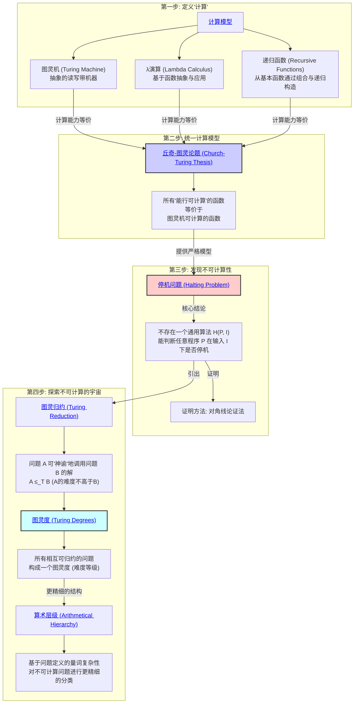

# 1. 递归论（可计算性理论）总览

<!-- 本地目录区块 -->
## 目录

- [1. 递归论（可计算性理论）总览](#1-递归论可计算性理论总览)
  - [目录](#目录)
  - [本地知识图谱](#本地知识图谱)
  - [1.1. 引言：算法的边界](#11-引言算法的边界)
  - [1.2. 知识地图 (Mermaid)](#12-知识地图-mermaid)
  - [1.3. 探索路径](#13-探索路径)
  - [哲学批判与反思](#哲学批判与反思)
  - [国际化对齐补全：递归论基础（对齐 Wikipedia/EoM）](#国际化对齐补全递归论基础对齐-wikipediaeom)
    - [一、可计算性与模型](#一可计算性与模型)
    - [二、归约与度](#二归约与度)
    - [三、不可解问题](#三不可解问题)
    - [四、参考](#四参考)
  - [引文与参考（严格体例）](#引文与参考严格体例)

<!-- 本地知识图谱区块 -->
## 本地知识图谱

- [02-数学基础与逻辑总览](../00-数学基础与逻辑总览.md)
- [01-集合论总览](../01-集合论/00-集合论总览.md)
- [02-数理逻辑总览](../02-数理逻辑/00-数理逻辑总览.md)
- [03-证明论总览](../03-证明论/00-证明论总览.md)
- [04-模型论总览](../04-模型论/00-模型论总览.md)
- [00-递归论总览](./00-递归论总览.md)
- [01-计算模型与丘奇-图灵论题](./01-计算模型与丘奇-图灵论题.md)
- [02-停机问题与不可计算性](./02-停机问题与不可计算性.md)
- [03-图灵度与算术层级](./03-图灵度与算术层级.md)

**版本**: 1.0
**日期**: 2025-07-02

---

## 1.1. 引言：算法的边界

**递归论 (Recursion Theory)**，或更现代的名称 **可计算性理论 (Computability Theory)**，是探索"算法"概念本身的能力与极限的数学分支。
它试图为下面这个直观但模糊的问题提供一个严格的答案：
> 什么是"可计算的"问题？是否存在原则上无法用任何计算机解决的问题？

在20世纪30年代，为了解决希尔伯特提出的"判定问题"(Entscheidungsproblem)，逻辑学家们开始尝试为"算法"或"机械步骤"给出一个精确的数学定义。
这催生了可计算性理论，并从根本上改变了我们对数学、证明和计算的理解。

本模块将带领我们走过这条思想道路：从定义"计算"开始，到发现第一个"不可计算"的问题，再到对整个"不可计算"世界进行分层探索。

## 1.2. 知识地图 (Mermaid)

## 1.3. 探索路径

1. **[01-计算模型与丘奇-图灵论题.md](./01-计算模型与丘奇-图灵论题.md)**:
    - **计算模型**: 我们将重点介绍 **图灵机** 的概念，它虽然简单，但抓住了所有现代计算机的本质。同时简要提及Lambda演算和递归函数，以展示不同思想路径如何汇于一点。
    - **丘奇-图灵论题**: 这是可计算性理论的基石，但它是一个"论题"(Thesis)而非"定理"(Theorem)。它断言我们对"直观可计算"的理解，已经被图灵机这个数学模型完全捕捉了。我们将探讨其哲学意义。

2. **[02-停机问题与不可计算性.md](./02-停机问题与不可计算性.md)**:
    - **停机问题**: 这是可计算性理论的中心成果。我们将通过经典的 **对角线论证法** 来严格证明，为什么不存在一个万能的程序，可以分析任何其他程序并判断它是否会永远运行下去。
    - **不可计算性的意义**: 停机问题的不可解，意味着计算存在着无法逾越的理论极限。

3. **[03-图灵度与算术层级.md](./03-图灵度与算术层级.md)**:
    - **相对计算**: "停机问题"虽然不可解，但如果我们假设有一个能瞬间解决停机问题的"神谕"(Oracle)机器，我们能用它来解决哪些更难的问题？这就是 **图灵归约** 的思想。
    - **图灵度**: 通过图灵归约，我们可以比较不同不可计算问题的"相对难度"，将它们分门别类，形成一个称为"图灵度"的等级结构。
    - **算术层级**: 这是另一种更精细地划分不可计算问题的方法，它根据定义一个问题所需逻辑量词的复杂程度（例如 $\forall\exists$ 还是 $\forall\exists\forall$...）来进行分类。

---

## 哲学批判与反思

- **历史人物与思想年表**：

  | 年代 | 人物 | 主要思想/事件 | 影响 |
   
        $matches[0] -replace '\|[-:]+\|', '| ---- |'
    
  | 1930s | 丘奇、图灵 | λ演算、图灵机、可计算性 | 现代计算理论奠基 |
  | 1936 | 图灵 | 停机问题不可判定 | 计算极限首次确立 |
  | 20世纪 | 波斯特、克莱尼 | 递归函数理论 | 可计算性多元化发展 |

- **主要争议事件与哲学分歧**：
  - “可计算性”是否为客观属性还是模型选择？
  - 停机问题等不可判定性对“算法万能论”的挑战。
  - 递归论与物理世界、认知世界的关系。
  - 计算与证明、真理、认知的边界。

- **哲学认知与哲科批判性分析**：
  - 递归论揭示了“算法”与“真理”的分离，挑战了机械化知识观。
  - 不可计算性、不可判定性等现象反映了人类认知与机器计算的根本差异。
  - 现代AI、复杂系统等领域推动了对“可计算性”边界的再思考。
  - 哲学批判性要求我们反思：可计算性的定义是否受限于认知、技术与社会背景？

- **认知科学视角**：
  - 人类问题解决能力远超经典算法，常依赖直觉、启发、类比等非递归机制。
  - 认知科学、神经科学等揭示大脑处理信息的方式与图灵机模型存在本质差异。
  - “可计算性”在认知科学中常被重新定义为“可实现性”“可理解性”。
  - AI与认知科学的结合推动了“类脑计算”“启发式算法”等新方向，拓展了递归论的现实意义。

[历史版本变迁说明与归档索引见主线末尾归档区块]

[返回上一级: 02-数学基础与逻辑总览](../00-数学基础与逻辑总览.md) | [返回项目总览](../../09-项目总览/00-项目总览.md)

## 国际化对齐补全：递归论基础（对齐 Wikipedia/EoM）

### 一、可计算性与模型

- 图灵机、λ演算、递归函数的等价性（丘奇-图灵论题）
- μ-递归函数：初等函数在μ算子下闭包
- 可判定/半可判定集合

### 二、归约与度

- 多对一归约、图灵归约
- 图灵度与算术层级Σ⁰ₙ/Π⁰ₙ/Δ⁰ₙ
- 递归可枚举（r.e.）集合与完备性

### 三、不可解问题

- 停机问题不可判定
- Post对应问题不可判定
- 戴维斯–普特南–罗宾逊–马季亚谢维奇（DPRM）：希尔伯特第十问题不可解

### 四、参考

- Soare, Recursively Enumerable Sets and Degrees；Rogers, Theory of Recursive Functions
- [Wikipedia: Computability theory](https://en.wikipedia.org/wiki/Computability_theory)
- [EoM: Recursion theory](https://encyclopediaofmath.org/wiki/Recursion_theory)

> 本节遵循《国际化数学内容标准》与《条目结构模板》。

---

## 引文与参考（严格体例）

- Church, A. (1936). An Unsolvable Problem of Elementary Number Theory. AJM, 58(2), 345–363.（λ-演算与不可判定）
- Turing, A. M. (1936). On Computable Numbers, with an Application to the Entscheidungsproblem. PLMS, 42, 230–265.（图灵机与判定问题）
- Post, E. L. (1944). Recursively enumerable sets of positive integers and their decision problems. Bulletin AMS, 50, 284–316.（r.e.集合）
- Kleene, S. C. (1952). Introduction to Metamathematics. North-Holland.（经典教材）
- Soare, R. I. (1987). Recursively Enumerable Sets and Degrees. Springer.（图灵度专著）

> 相关专题：`./01-计算模型与丘奇-图灵论题.md`、`./02-停机问题与不可计算性.md`。
