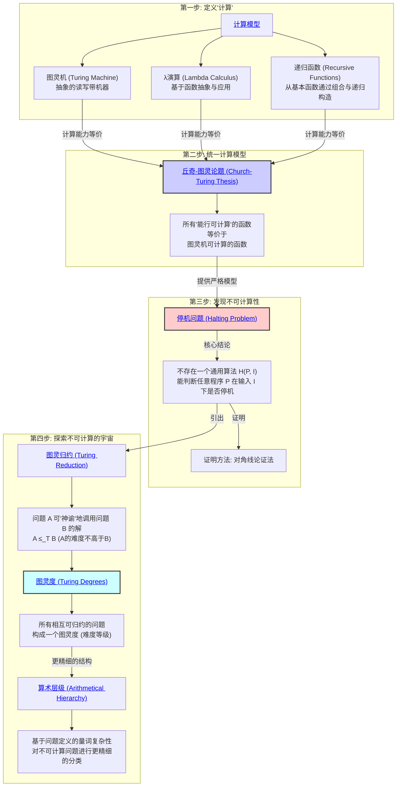

# 1. 递归论（可计算性理论）总览

<!-- 本地目录区块 -->
## 目录

- [1. 递归论（可计算性理论）总览](#1-递归论可计算性理论总览)
  - [目录](#目录)
  - [本地知识图谱](#本地知识图谱)
  - [1.1. 引言：算法的边界](#11-引言算法的边界)
  - [1.2. 知识地图 (Mermaid)](#12-知识地图-mermaid)
  - [1.3. 探索路径](#13-探索路径)

<!-- 本地知识图谱区块 -->
## 本地知识图谱

- [02-数学基础与逻辑总览](../00-数学基础与逻辑总览.md)
- [01-集合论总览](../01-集合论/00-集合论总览.md)
- [02-数理逻辑总览](../02-数理逻辑/00-数理逻辑总览.md)
- [03-证明论总览](../03-证明论/00-证明论总览.md)
- [04-模型论总览](../04-模型论/00-模型论总览.md)
- [00-递归论总览](./00-递归论总览.md)
- [01-计算模型与丘奇-图灵论题](./01-计算模型与丘奇-图灵论题.md)
- [02-停机问题与不可计算性](./02-停机问题与不可计算性.md)
- [03-图灵度与算术层级](./03-图灵度与算术层级.md)

**版本**: 1.0
**日期**: 2025-07-02

---

## 1.1. 引言：算法的边界

**递归论 (Recursion Theory)**，或更现代的名称 **可计算性理论 (Computability Theory)**，是探索"算法"概念本身的能力与极限的数学分支。它试图为下面这个直观但模糊的问题提供一个严格的答案：
> 什么是"可计算的"问题？是否存在原则上无法用任何计算机解决的问题？

在20世纪30年代，为了解决希尔伯特提出的"判定问题"(Entscheidungsproblem)，逻辑学家们开始尝试为"算法"或"机械步骤"给出一个精确的数学定义。这催生了可计算性理论，并从根本上改变了我们对数学、证明和计算的理解。

本模块将带领我们走过这条思想道路：从定义"计算"开始，到发现第一个"不可计算"的问题，再到对整个"不可计算"世界进行分层探索。

## 1.2. 知识地图 (Mermaid)

## 1.3. 探索路径

1. **[01-计算模型与丘奇-图灵论题.md](./01-计算模型与丘奇-图灵论题.md)**:
    - **计算模型**: 我们将重点介绍 **图灵机** 的概念，它虽然简单，但抓住了所有现代计算机的本质。同时简要提及Lambda演算和递归函数，以展示不同思想路径如何汇于一点。
    - **丘奇-图灵论题**: 这是可计算性理论的基石，但它是一个"论题"(Thesis)而非"定理"(Theorem)。它断言我们对"直观可计算"的理解，已经被图灵机这个数学模型完全捕捉了。我们将探讨其哲学意义。

2. **[02-停机问题与不可计算性.md](./02-停机问题与不可计算性.md)**:
    - **停机问题**: 这是可计算性理论的中心成果。我们将通过经典的 **对角线论证法** 来严格证明，为什么不存在一个万能的程序，可以分析任何其他程序并判断它是否会永远运行下去。
    - **不可计算性的意义**: 停机问题的不可解，意味着计算存在着无法逾越的理论极限。

3. **[03-图灵度与算术层级.md](./03-图灵度与算术层级.md)**:
    - **相对计算**: "停机问题"虽然不可解，但如果我们假设有一个能瞬间解决停机问题的"神谕"(Oracle)机器，我们能用它来解决哪些更难的问题？这就是 **图灵归约** 的思想。
    - **图灵度**: 通过图灵归约，我们可以比较不同不可计算问题的"相对难度"，将它们分门别类，形成一个称为"图灵度"的等级结构。
    - **算术层级**: 这是另一种更精细地划分不可计算问题的方法，它根据定义一个问题所需逻辑量词的复杂程度（例如 $\forall\exists$ 还是 $\forall\exists\forall$...）来进行分类。

---
[返回上一级: 02-数学基础与逻辑总览](../00-数学基础与逻辑总览.md) | [返回项目总览](../../09-项目总览/00-项目总览.md)
