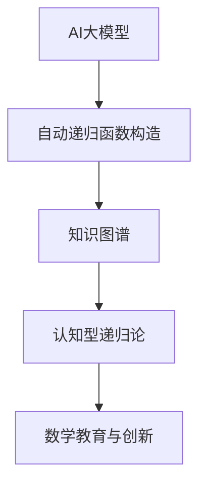
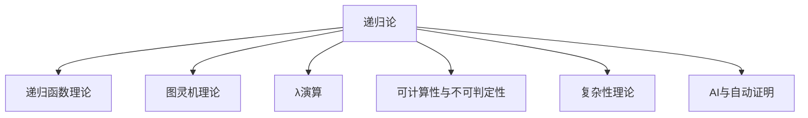

# 递归论基础理论

## 目录

- [递归论基础理论](#递归论基础理论)
  - [目录](#目录)
  - [引言：可计算性的数学基础](#引言可计算性的数学基础)
  - [1. 递归论的历史发展](#1-递归论的历史发展)
    - [1.1 可计算性概念的起源](#11-可计算性概念的起源)
    - [1.2 图灵与丘奇的贡献](#12-图灵与丘奇的贡献)
    - [1.3 递归论的形式化](#13-递归论的形式化)
    - [1.4 现代递归论的发展](#14-现代递归论的发展)
  - [2. 基本概念与定义](#2-基本概念与定义)
    - [2.1 递归函数](#21-递归函数)
    - [2.2 图灵机](#22-图灵机)
    - [2.3 λ演算](#23-λ演算)
    - [2.4 丘奇-图灵论题](#24-丘奇-图灵论题)
  - [3. 递归函数理论](#3-递归函数理论)
    - [3.1 原始递归函数](#31-原始递归函数)
    - [3.2 一般递归函数](#32-一般递归函数)
    - [3.3 部分递归函数](#33-部分递归函数)
    - [3.4 递归可枚举集](#34-递归可枚举集)
  - [4. 图灵机理论](#4-图灵机理论)
    - [4.1 图灵机的基本模型](#41-图灵机的基本模型)
    - [4.2 通用图灵机](#42-通用图灵机)
    - [4.3 停机问题](#43-停机问题)
    - [4.4 图灵归约](#44-图灵归约)
  - [5. 计算复杂性](#5-计算复杂性)
    - [5.1 时间复杂性](#51-时间复杂性)
    - [5.2 空间复杂性](#52-空间复杂性)
    - [5.3 P与NP问题](#53-p与np问题)
    - [5.4 复杂性类](#54-复杂性类)
  - [6. 递归论与逻辑](#6-递归论与逻辑)
    - [6.1 递归论与证明论](#61-递归论与证明论)
    - [6.2 递归论与模型论](#62-递归论与模型论)
    - [6.3 递归论与集合论](#63-递归论与集合论)
    - [6.4 递归论与范畴论](#64-递归论与范畴论)
  - [7. 应用与影响](#7-应用与影响)
    - [7.1 计算机科学](#71-计算机科学)
    - [7.2 人工智能](#72-人工智能)
    - [7.3 数学基础](#73-数学基础)
    - [7.4 哲学反思](#74-哲学反思)
  - [8. 前沿发展](#8-前沿发展)
    - [8.1 量子计算](#81-量子计算)
    - [8.2 超计算](#82-超计算)
    - [8.3 生物计算](#83-生物计算)
    - [8.4 分布式计算](#84-分布式计算)
  - [现代AI与自动化递归论补充](#现代ai与自动化递归论补充)
    - [9.1 AI大模型辅助递归论](#91-ai大模型辅助递归论)
  - [结论：递归论的哲学意义](#结论递归论的哲学意义)
  - [参考文献](#参考文献)
  - [2.5.1.12 多表征内容](#25112-多表征内容)
  - [2.5.1.13 参考文献与资源](#25113-参考文献与资源)

## 引言：可计算性的数学基础

递归论（Recursion Theory）是数理逻辑的重要分支，研究可计算性、算法和计算过程的形式化理论。
它既是数学基础研究的重要组成部分，也是现代计算机科学的理论基础。

递归论的核心问题是：什么是可计算的？如何形式化地定义可计算性？
这些问题不仅具有重要的数学意义，也涉及深刻的哲学问题，如思维的本质、数学真理的性质等。

本文将从历史发展、基本概念、理论体系、应用影响等多个维度，全面介绍递归论的基础理论。

## 1. 递归论的历史发展

### 1.1 可计算性概念的起源

可计算性概念的历史可以追溯到古代数学。

**古代起源**：

- 古希腊的算法概念
- 中国古代的计算方法
- 阿拉伯数学家的算法贡献

**近代发展**：

- 莱布尼茨的通用语言梦想
- 布尔代数的发展
- 希尔伯特的形式化纲领

**关键问题**：
20世纪初，数学家开始关注：是否存在一个机械过程，可以判定任何数学命题的真假？

### 1.2 图灵与丘奇的贡献

1930年代，图灵和丘奇几乎同时提出了可计算性的形式化定义。

**图灵的贡献**：

- 1936年提出图灵机模型
- 定义了可计算函数的概念
- 证明了停机问题的不可解性

**丘奇的贡献**：

- 发展了λ演算
- 提出了丘奇论题
- 建立了递归函数理论

**历史意义**：
他们的工作为可计算性理论奠定了坚实的基础，影响了整个计算机科学的发展。

### 1.3 递归论的形式化

1940年代，递归论开始系统化发展。

**克莱尼的贡献**：

- 发展了递归函数理论
- 建立了递归论的基本框架
- 研究了递归可枚举集

**波斯特的贡献**：

- 提出了波斯特系统
- 研究了计算复杂性
- 发展了递归论的应用

**形式化成果**：

- 建立了递归论的公理化系统
- 发展了递归论的数学工具
- 建立了递归论与其他数学分支的联系

### 1.4 现代递归论的发展

1950年代后，递归论进入现代发展阶段。

**理论发展**：

- 计算复杂性理论的发展
- 递归论与逻辑学的深度融合
- 递归论在计算机科学中的应用

**应用扩展**：

- 人工智能中的应用
- 密码学中的应用
- 生物信息学中的应用

**哲学影响**：
递归论的发展深刻影响了数学哲学和科学哲学，特别是关于思维本质和数学真理的讨论。

## 2. 基本概念与定义

### 2.1 递归函数

递归函数是递归论的核心概念。

**基本定义**：
一个函数f:N^n→N是递归的，如果它可以由基本函数通过有限次应用复合、原始递归和μ算子得到。

**基本函数**：

- 零函数：Z(x)=0
- 后继函数：S(x)=x+1
- 投影函数：P_i^n(x_1,...,x_n)=x_i

**构造规则**：

- 复合：如果g,h是递归函数，则f(x)=g(h(x))也是递归函数
- 原始递归：如果g,h是递归函数，则f(0,y)=g(y), f(x+1,y)=h(x,f(x,y),y)也是递归函数
- μ算子：如果g是递归函数，则f(x)=μy[g(x,y)=0]也是递归函数

**重要性**：
递归函数为可计算性提供了第一个严格的数学定义。

### 2.2 图灵机

图灵机是图灵提出的抽象计算模型。

**基本组成**：

- 无限长的纸带
- 读写头
- 有限状态控制器
- 程序（转移函数）

**工作原理**：

- 读写头在纸带上移动
- 根据当前状态和读到的符号决定下一步动作
- 动作包括：写符号、移动读写头、改变状态

**形式化定义**：
图灵机是一个七元组(Q,Σ,Γ,δ,q_0,q_accept,q_reject)，其中：

- Q是有限状态集
- Σ是输入字母表
- Γ是纸带字母表
- δ是转移函数
- q_0是初始状态
- q_accept是接受状态
- q_reject是拒绝状态

**计算能力**：
图灵机可以计算任何递归函数，这为丘奇-图灵论题提供了重要支持。

### 2.3 λ演算

λ演算是丘奇提出的函数计算模型。

**基本概念**：

- 变量：x,y,z等
- λ抽象：λx.M表示函数
- 应用：(M N)表示函数应用

**归约规则**：

- α转换：重命名绑定变量
- β归约：(λx.M)N → M[x:=N]
- η归约：λx.(M x) → M（如果x不在M中自由出现）

**计算能力**：
λ演算与图灵机具有相同的计算能力，都是通用计算模型。

**现代意义**：
λ演算为函数式编程语言提供了理论基础。

### 2.4 丘奇-图灵论题

丘奇-图灵论题是可计算性理论的核心假设。

**表述**：
一个函数是可计算的，当且仅当它可以被图灵机计算。

**等价形式**：

- 递归函数论题：可计算函数就是递归函数
- λ演算论题：可计算函数就是λ可定义函数
- 马尔可夫算法论题：可计算函数就是马尔可夫算法可计算函数

**哲学意义**：
丘奇-图灵论题不是数学定理，而是一个哲学假设，它断言了可计算性的数学定义与直观概念的一致性。

**证据支持**：

- 所有已知的计算模型都被证明等价
- 没有发现违反论题的计算模型
- 论题在实践中的成功应用

## 3. 递归函数理论

### 3.1 原始递归函数

原始递归函数是递归函数的重要子类。

**定义**：
原始递归函数是由基本函数通过复合和原始递归得到的函数。

**基本函数**：

- 零函数：Z(x)=0
- 后继函数：S(x)=x+1
- 投影函数：P_i^n(x_1,...,x_n)=x_i

**构造规则**：

- 复合：如果g,h是原始递归函数，则f(x)=g(h(x))也是原始递归函数
- 原始递归：如果g,h是原始递归函数，则f(0,y)=g(y), f(x+1,y)=h(x,f(x,y),y)也是原始递归函数

**例子**：

- 加法：add(x,y)可以通过原始递归定义
- 乘法：mult(x,y)可以通过原始递归定义
- 指数：exp(x,y)可以通过原始递归定义

**重要性**：
原始递归函数为理解递归函数提供了重要基础。

### 3.2 一般递归函数

一般递归函数是递归函数的完整定义。

**定义**：
一般递归函数是由基本函数通过复合、原始递归和μ算子得到的函数。

**μ算子**：
如果g(x,y)是递归函数，则f(x)=μy[g(x,y)=0]也是递归函数，其中μy[g(x,y)=0]表示最小的y使得g(x,y)=0。

**例子**：

- 阿克曼函数：A(m,n)是一般递归函数但不是原始递归函数
- 部分函数：某些递归函数可能在某些输入上无定义

**理论意义**：
一般递归函数为可计算性提供了完整的数学刻画。

### 3.3 部分递归函数

部分递归函数允许函数在某些输入上无定义。

**定义**：
部分递归函数是从N^n到N的部分函数，可以通过递归函数构造规则得到。

**特点**：

- 允许在某些输入上无定义
- 更符合实际计算的特点
- 为不可解问题提供了自然框架

**例子**：

- 停机函数：h(e,x)表示第e个图灵机在输入x上是否停机
- 通用函数：U(e,x)表示第e个图灵机在输入x上的输出

**重要性**：
部分递归函数为研究不可解问题提供了重要工具。

### 3.4 递归可枚举集

递归可枚举集是递归论中的重要概念。

**定义**：
集合A是递归可枚举的，如果存在递归函数f使得A={f(0),f(1),f(2),...}。

**等价定义**：

- A是递归可枚举的，当且仅当存在图灵机M使得A=L(M)
- A是递归可枚举的，当且仅当存在递归谓词R使得A={x|∃y R(x,y)}

**性质**：

- 递归集是递归可枚举的
- 递归可枚举集的补集不一定是递归可枚举的
- 递归可枚举集在并集和交集下封闭

**应用**：
递归可枚举集为研究计算复杂性提供了重要工具。

## 4. 图灵机理论

### 4.1 图灵机的基本模型

图灵机是计算理论的核心模型。

**基本组成**：

- 无限长的纸带，分为格子
- 读写头，可以读写纸带上的符号
- 有限状态控制器
- 程序，指定状态转移规则

**工作过程**：

1. 输入写在纸带上
2. 读写头从初始位置开始
3. 根据当前状态和读到的符号执行动作
4. 动作包括：写符号、移动读写头、改变状态
5. 重复步骤3-4直到进入接受或拒绝状态

**形式化定义**：
图灵机M=(Q,Σ,Γ,δ,q_0,q_accept,q_reject)，其中：

- Q：有限状态集
- Σ：输入字母表
- Γ：纸带字母表（包含空白符号）
- δ：Q×Γ→Q×Γ×{L,R}转移函数
- q_0：初始状态
- q_accept：接受状态
- q_reject：拒绝状态

**计算能力**：
图灵机可以计算任何递归函数，是通用计算模型。

### 4.2 通用图灵机

通用图灵机是图灵机理论的重要概念。

**定义**：
通用图灵机U是一个特殊的图灵机，它可以模拟任何其他图灵机的行为。

**工作原理**：

- 输入包含两部分：图灵机M的描述和输入x
- U读取M的描述，构造M的模拟器
- U在输入x上运行M的模拟器
- U输出M在x上的结果

**形式化**：
存在通用图灵机U，使得对于任何图灵机M和输入x，`U(<M>,x)=M(x)`，其中`<M>`是M的编码。

**重要性**：
通用图灵机为计算机的通用性提供了理论基础，是现代计算机设计的核心思想。

**历史意义**：
通用图灵机的概念直接影响了冯·诺依曼的计算机设计。

### 4.3 停机问题

停机问题是递归论中的经典问题。

**问题描述**：
给定图灵机M和输入x，判断M在输入x上是否会停机。

**形式化**：
停机问题是：H={<M,x>|图灵机M在输入x上停机}

**不可解性**：
停机问题是递归可枚举的，但不是递归的。

**证明方法**：
通过对角线方法证明停机问题的不可解性。

**构造证明**：
假设存在图灵机H判定停机问题，构造图灵机D：

- `D(<M>)=如果H(<M,<M>>)`接受则进入无限循环，否则停机
- 考虑`D(<D>)`的情况，得到矛盾

**哲学意义**：
停机问题的不可解性揭示了计算的本质限制，为理解思维和数学提供了重要启示。

### 4.4 图灵归约

图灵归约是研究计算复杂性的重要工具。

**定义**：
集合A图灵归约到集合B（记作A≤_T B），如果存在图灵机M，使得：

- M可以查询B的成员关系
- M计算A的特征函数

**性质**：

- 自反性：A≤_T A
- 传递性：如果A≤_T B且B≤_T C，则A≤_T C
- 如果B是递归的，则A≤_T B当且仅当A是递归的

**应用**：

- 研究不可解问题的相对复杂性
- 建立问题之间的归约关系
- 研究计算资源的层次结构

**例子**：

- 停机问题图灵归约到空集问题
- 空集问题图灵归约到停机问题

## 5. 计算复杂性

### 5.1 时间复杂性

时间复杂性研究算法的时间效率。

**定义**：
图灵机M的时间复杂性函数T_M(n)定义为：M在所有长度为n的输入上的最大步数。

**复杂性类**：

- DTIME(f(n))：被确定图灵机在O(f(n))时间内判定的语言类
- NTIME(f(n))：被非确定图灵机在O(f(n))时间内判定的语言类

**重要复杂性类**：

- P：∪_k DTIME(n^k)，多项式时间可判定的问题
- NP：∪_k NTIME(n^k)，非确定多项式时间可判定的问题
- EXP：∪_k DTIME(2^n^k)，指数时间可判定的问题

**理论意义**：
时间复杂性为理解算法的效率提供了理论基础。

### 5.2 空间复杂性

空间复杂性研究算法的空间效率。

**定义**：
图灵机M的空间复杂性函数S_M(n)定义为：M在所有长度为n的输入上使用的最大格子数。

**复杂性类**：

- DSPACE(f(n))：被确定图灵机在O(f(n))空间内判定的语言类
- NSPACE(f(n))：被非确定图灵机在O(f(n))空间内判定的语言类

**重要复杂性类**：

- L：DSPACE(log n)，对数空间可判定的问题
- NL：NSPACE(log n)，非确定对数空间可判定的问题
- PSPACE：∪_k DSPACE(n^k)，多项式空间可判定的问题

**空间层次定理**：
对于空间可构造函数f(n)≥log n，如果f(n)=o(g(n))，则DSPACE(f(n))⊊DSPACE(g(n))。

### 5.3 P与NP问题

P与NP问题是计算复杂性理论的核心问题。

**P类**：
P是确定图灵机在多项式时间内可判定的问题类。

**NP类**：
NP是非确定图灵机在多项式时间内可判定的问题类。

**等价定义**：
NP也可以定义为：存在多项式时间验证器的问题类。

**P vs NP问题**：
P是否等于NP？这是计算机科学中最重要的未解决问题之一。

**重要性**：

- 如果P=NP，则许多困难问题都有高效算法
- 如果P≠NP，则某些问题本质上是困难的
- 该问题涉及数学、计算机科学、哲学等多个领域

**研究现状**：
目前普遍认为P≠NP，但尚未证明。

### 5.4 复杂性类

复杂性类为研究计算问题提供了分类框架。

**基本复杂性类**：

- P：多项式时间
- NP：非确定多项式时间
- co-NP：NP的补集
- PSPACE：多项式空间
- EXP：指数时间
- NEXP：非确定指数时间

**关系**：

- P⊆NP⊆PSPACE⊆EXP
- P⊆co-NP
- 是否P=NP是开放问题
- 是否NP=co-NP是开放问题

**完全性**：

- NP完全问题：NP中最困难的问题
- PSPACE完全问题：PSPACE中最困难的问题
- 完全问题为理解复杂性类提供了重要工具

**应用**：
复杂性类为算法设计和问题分类提供了理论基础。

## 6. 递归论与逻辑

### 6.1 递归论与证明论

递归论与证明论有深刻的联系。

**哥德尔编码**：
通过哥德尔编码，可以将证明论中的概念编码为自然数。

**递归函数与证明**：

- 递归函数可以表示证明过程
- 证明的复杂性可以用递归函数度量
- 递归论为证明论提供了计算视角

**应用例子**：

- 一致性证明的复杂性
- 证明长度的度量
- 自动定理证明

**理论意义**：
递归论为理解数学证明的本质提供了新视角。

### 6.2 递归论与模型论

递归论与模型论也有重要联系。

**递归模型**：

- 递归模型是论域为递归集的模型
- 递归模型为模型论提供了计算视角
- 递归模型的研究涉及递归论和模型论的交叉

**可计算性理论**：

- 模型的可计算性质
- 理论的可判定性
- 模型的构造方法

**应用领域**：

- 代数模型论
- 算术模型论
- 集合论模型

### 6.3 递归论与集合论

递归论与集合论有密切关系。

**递归序数**：

- 递归序数是递归良序的序数
- 递归序数在集合论中有重要应用
- 递归序数的研究涉及递归论和集合论的交叉

**构造性集合论**：

- 构造性集合论强调构造性方法
- 递归论为构造性集合论提供了工具
- 构造性集合论为递归论提供了应用领域

**应用例子**：

- 递归函数的集合论表示
- 递归序数的构造
- 集合论中的可计算性问题

### 6.4 递归论与范畴论

递归论与范畴论的结合是现代逻辑学的重要发展。

**计算范畴论**：

- 将计算概念引入范畴论
- 研究范畴中的可计算性
- 为递归论提供新的视角

**函子计算**：

- 函子作为计算过程
- 自然变换作为计算变换
- 范畴论为递归论提供抽象框架

**应用领域**：

- 类型论
- 程序语义
- 逻辑程序设计

## 7. 应用与影响

### 7.1 计算机科学

递归论对计算机科学有深远影响。

**理论基础**：

- 为计算机科学提供了理论基础
- 定义了可计算性的概念
- 为算法设计提供了指导

**编程语言**：

- 函数式编程语言基于λ演算
- 图灵机为计算机设计提供了模型
- 递归论影响了编程语言的设计

**软件工程**：

- 程序验证基于递归论
- 编译器设计使用递归论方法
- 软件测试理论受递归论影响

**人工智能**：

- 机器学习算法基于递归论
- 知识表示使用递归论方法
- 自动推理系统应用递归论

### 7.2 人工智能

递归论对人工智能有重要影响。

**计算模型**：

- 神经网络的计算能力
- 机器学习算法的复杂性
- 人工智能系统的可计算性

**知识表示**：

- 逻辑知识表示
- 规则系统
- 专家系统

**学习理论**：

- 可学习性理论
- 归纳推理
- 模式识别

**哲学问题**：

- 思维的可计算性
- 意识的本质
- 人工智能的可能性

### 7.3 数学基础

递归论对数学基础有重要贡献。

**数学哲学**：

- 为数学真理提供了计算视角
- 影响了数学实在论的讨论
- 为数学基础研究提供了工具

**数论应用**：

- 递归函数在数论中的应用
- 可计算数论
- 算法数论

**代数应用**：

- 递归代数
- 可计算代数
- 算法代数

**分析应用**：

- 可计算分析
- 递归分析
- 算法分析

### 7.4 哲学反思

递归论引发了深刻的哲学思考。

**思维本质**：

- 思维是否可计算？
- 意识是否可以用计算模型描述？
- 人类智能与机器智能的关系

**数学真理**：

- 数学真理的可计算性
- 证明的本质
- 数学知识的性质

**科学方法论**：

- 科学理论的可计算性
- 科学发现的算法化
- 科学解释的计算模型

**伦理学问题**：

- 人工智能的伦理问题
- 计算技术的道德影响
- 人机关系的哲学思考

## 8. 前沿发展

### 8.1 量子计算

量子计算是计算理论的新发展。

**量子图灵机**：

- 量子图灵机是经典图灵机的量子推广
- 量子图灵机具有量子叠加和纠缠性质
- 量子图灵机的计算能力研究

**量子复杂性**：

- BQP：量子多项式时间可解的问题
- 量子复杂性类的研究
- 量子与经典复杂性的比较

**理论挑战**：

- 量子丘奇-图灵论题
- 量子计算的物理实现
- 量子算法的设计

**应用前景**：

- 密码学
- 量子模拟
- 量子机器学习

### 8.2 超计算

超计算研究超越图灵机的计算模型。

**超计算模型**：

- 无限时间图灵机
- 相对论计算机
- 量子引力计算机

**理论问题**：

- 超计算的可能性
- 超计算与物理定律的关系
- 超计算的理论基础

**哲学意义**：

- 计算的本质限制
- 思维与计算的关系
- 宇宙的计算能力

**研究现状**：
超计算目前主要是理论概念，尚未有物理实现。

### 8.3 生物计算

生物计算研究生物系统的计算能力。

**DNA计算**：

- DNA分子的计算能力
- DNA算法的设计
- DNA计算的复杂性

**神经网络**：

- 生物神经网络的计算模型
- 神经网络的复杂性
- 生物计算的理论基础

**细胞计算**：

- 细胞的计算能力
- 细胞自动机
- 生物信息处理

**应用前景**：

- 生物医学
- 药物设计
- 生物工程

### 8.4 分布式计算

分布式计算研究多处理器系统的计算能力。

**分布式模型**：

- 分布式图灵机
- 网络计算模型
- 并行计算理论

**复杂性理论**：

- 分布式复杂性
- 通信复杂性
- 同步复杂性

**理论问题**：

- 分布式算法的设计
- 分布式系统的可靠性
- 分布式计算的效率

**应用领域**：

- 云计算
- 区块链
- 物联网

## 现代AI与自动化递归论补充

### 9.1 AI大模型辅助递归论

**AI大模型辅助递归论**：GPT-4、Claude等大模型已能自动生成递归函数、形式化代码，辅助教学与研究。

**知识图谱驱动的递归论自动化**：如OpenAI MathGraph、Wikidata等，支持递归论知识的结构化、自动化推理。

**认知型递归论系统**：结合人类认知过程的AI推理系统，模拟数学家的递归思维与创新。

**Rust代码示例：AI辅助递归论结构体**:

```rust
struct AIAssistedRecursionTheory {
    statement: String,
    recursion_steps: Vec<String>,
    verified: bool,
}

impl AIAssistedRecursionTheory {
    fn new(statement: &str) -> Self {
        AIAssistedRecursionTheory { statement: statement.to_string(), recursion_steps: vec![], verified: false }
    }
    fn add_step(&mut self, step: &str) {
        self.recursion_steps.push(step.to_string());
    }
    fn verify(&mut self) {
        // 假设AI自动验证
        self.verified = true;
    }
}
```

**结构图：AI与递归论自动化**:



## 结论：递归论的哲学意义

递归论不仅是一门数学理论，更是理解思维、计算和数学本质的重要工具。

**核心贡献**：

1. **可计算性的数学定义**：为可计算性提供了严格的数学定义
2. **计算的本质理解**：揭示了计算的本质特征和限制
3. **跨学科影响**：影响了计算机科学、人工智能、哲学等多个领域
4. **方法论贡献**：为科学研究提供了新的方法论

**哲学意义**：

- **思维本质**：递归论为理解思维本质提供了计算视角
- **数学真理**：递归论影响了数学真理的理解
- **科学方法论**：递归论为科学方法论提供了新思路
- **认识论**：递归论对认识论有重要影响

**未来展望**：

- **技术发展**：递归论技术将继续发展
- **应用扩展**：递归论应用将扩展到更多领域
- **理论深化**：递归论理论将更加深化
- **哲学影响**：递归论将继续影响哲学思考

递归论的发展表明，数学不仅是描述世界的工具，也是理解世界本质的重要途径。

## 参考文献

1. Rogers, H. (1987). Theory of recursive functions and effective computability. MIT Press.

2. Soare, R. I. (2016). Turing computability: Theory and applications. Springer.

3. Odifreddi, P. (1989). Classical recursion theory. Elsevier.

4. Sipser, M. (2012). Introduction to the theory of computation. Cengage Learning.

5. Hopcroft, J. E., Motwani, R., & Ullman, J. D. (2006). Introduction to automata theory, languages, and computation. Pearson.

6. Davis, M. (1958). Computability and unsolvability. McGraw-Hill.

7. Kleene, S. C. (1952). Introduction to metamathematics. North-Holland.

8. Turing, A. M. (1936). On computable numbers, with an application to the Entscheidungsproblem. Proceedings of the London Mathematical Society, 42(2), 230-265.

9. Church, A. (1936). An unsolvable problem of elementary number theory. American Journal of Mathematics, 58(2), 345-363.

10. Post, E. L. (1944). Recursively enumerable sets of positive integers and their decision problems. Bulletin of the American Mathematical Society, 50(5), 284-316.

## 2.5.1.12 多表征内容

- **Mermaid 结构图：递归论发展脉络与主要分支**



- **Lean 代码示例：递归函数的定义**

```lean
def factorial : ℕ → ℕ
| 0 := 1
| (n+1) := (n+1) * factorial n
```

- **Haskell 代码示例：图灵机带的极简模拟**

```haskell
type Tape a = ([a], a, [a])
moveLeft (l:ls, c, rs) = (ls, l, c:rs)
moveRight (ls, c, r:rs) = (c:ls, r, rs)
```

- **表格：递归论主要模型与应用对比**

| 分支         | 主要内容         | 代表定理/工具         | 应用领域         |
|--------------|------------------|----------------------|------------------|
| 递归函数理论 | 可计算函数、μ算子| Kleene定理           | 数学基础、AI     |
| 图灵机理论   | 计算模型、停机问题| 图灵不可判定性       | 计算理论         |
| λ演算        | 函数抽象、应用   | Church-Rosser定理    | 编程语言、逻辑   |
| 复杂性理论   | P/NP、空间复杂性 | Cook-Levin定理       | 算法、AI         |
| 自动证明     | 归约、自动化     | Prover9、Lean        | AI、教育         |

- **AI/认知/教育视角**
  - AI系统可自动归约和证明递归函数、停机问题等，推动了自动化推理与程序合成。
  - 认知科学关注递归与可计算性在思维和学习中的作用，教育中强调递归思想的培养。
  - 自动化工具（如Lean、Coq、Prover9）已成为递归论研究与教学的重要平台。

---

## 2.5.1.13 参考文献与资源

- **经典文献**
  1. Kleene, S. C. (1952). Introduction to metamathematics. North-Holland.
  2. Turing, A. M. (1936). On computable numbers, with an application to the Entscheidungsproblem.
  3. Rogers, H. (1987). Theory of recursive functions and effective computability. MIT Press.

- **现代文献与在线资源**
  1. Soare, R. I. (2016). Turing computability: Theory and applications. Springer.
  2. Sipser, M. (2012). Introduction to the theory of computation. Cengage Learning.
  3. [Lean 官方文档](https://leanprover.github.io/)
  4. [Coq 官方文档](https://coq.inria.fr/documentation)
  5. [Prover9 官方文档](https://www.cs.unm.edu/~mccune/prover9/)

- **工具与平台**
  - Lean, Coq, Prover9, Haskell, Rust

---

[返回总览](00-递归论总览.md) | [案例分析](02-案例分析.md) | [相关证明与引用](03-相关证明与引用.md)
