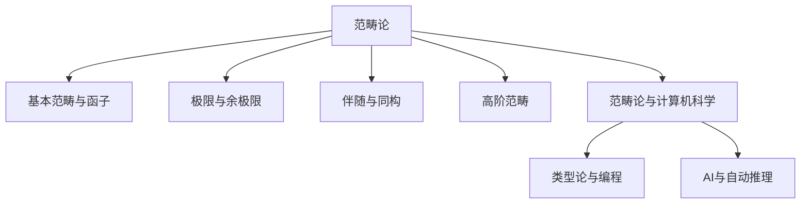

# 范畴论：数学结构的新语言

<!-- 本地目录区块 -->
## 目录

- [范畴论：数学结构的新语言](#范畴论数学结构的新语言)
  - [目录](#目录)
  - [本地知识图谱](#本地知识图谱)
  - [1. 引言：范畴论的诞生与意义](#1-引言范畴论的诞生与意义)
  - [2. 基本概念与定义](#2-基本概念与定义)
    - [2.1 范畴的定义](#21-范畴的定义)
    - [2.2 函子与自然变换](#22-函子与自然变换)
    - [2.3 极限与余极限](#23-极限与余极限)
  - [3. 范畴论的核心概念](#3-范畴论的核心概念)
    - [3.1 伴随函子](#31-伴随函子)
    - [3.2 等价与同构](#32-等价与同构)
    - [3.3 单态射与满态射](#33-单态射与满态射)
  - [4. 重要范畴与例子](#4-重要范畴与例子)
    - [4.1 集合范畴](#41-集合范畴)
    - [4.2 群范畴](#42-群范畴)
    - [4.3 拓扑空间范畴](#43-拓扑空间范畴)
  - [5. 范畴论在数学中的应用](#5-范畴论在数学中的应用)
    - [5.1 代数几何](#51-代数几何)
    - [5.2 同调代数](#52-同调代数)
    - [5.3 代数拓扑](#53-代数拓扑)
  - [6. 高阶范畴论](#6-高阶范畴论)
    - [6.1 2-范畴](#61-2-范畴)
    - [6.2 ∞-范畴](#62--范畴)
  - [7. 范畴论与计算机科学](#7-范畴论与计算机科学)
    - [7.1 类型论](#71-类型论)
    - [7.2 函数式编程](#72-函数式编程)
  - [8. 哲学思考与未来展望](#8-哲学思考与未来展望)
  - [参考文献](#参考文献)
  - [2.7.1 范畴论基础理论](#271-范畴论基础理论)
  - [2.7.1.1 范畴论的定义与意义](#2711-范畴论的定义与意义)
  - [2.7.1.2 基本概念与结构](#2712-基本概念与结构)
  - [2.7.1.3 主要定理与方法](#2713-主要定理与方法)
  - [2.7.1.4 现代发展与AI联系](#2714-现代发展与ai联系)
  - [2.7.1.5 相关主题与本地跳转](#2715-相关主题与本地跳转)
  - [2.7.1.6 参考文献与资源](#2716-参考文献与资源)
  - [2.7.1.7 多表征内容](#2717-多表征内容)
  - [2.7.1.8 参考文献与资源](#2718-参考文献与资源)

<!-- 本地知识图谱区块 -->
## 本地知识图谱

- [02-数学基础与逻辑总览](../00-数学基础与逻辑总览.md)
- [01-集合论总览](../01-集合论/00-集合论总览.md)
- [02-数理逻辑总览](../02-数理逻辑/00-数理逻辑总览.md)
- [03-证明论总览](../03-证明论/00-证明论总览.md)
- [04-模型论总览](../04-模型论/00-模型论总览.md)
- [05-递归论总览](../05-递归论/00-递归论总览.md)
- [07-范畴论基础理论](./01-基础理论.md)

## 1. 引言：范畴论的诞生与意义

范畴论是20世纪数学的重要发展，它提供了一种全新的方式来理解和组织数学结构。
范畴论不仅是一种数学工具，更是一种数学哲学，它强调数学对象之间的关系而非对象本身的性质。

**历史背景**：
范畴论起源于1940年代，由Samuel Eilenberg和Saunders Mac Lane在代数拓扑学的研究中发展起来。
他们发现，许多代数拓扑的概念可以通过范畴论的语言得到统一的理解。

**核心思想**：
范畴论的基本思想是关注数学对象之间的"关系"或"映射"，而不是对象本身的内部结构。
这种观点使得不同数学领域之间的类比和联系变得清晰可见。

**现代意义**：
今天，范畴论已经成为现代数学的重要语言，在代数几何、代数拓扑、同调代数、逻辑学、计算机科学等领域都有广泛应用。

## 2. 基本概念与定义

### 2.1 范畴的定义

**范畴的正式定义**：
一个范畴C由以下数据组成：

1. 一个对象类Ob(C)
2. 对于每对对象A,B∈Ob(C)，一个态射集合Hom(A,B)
3. 对于每个对象A，一个单位态射1_A∈Hom(A,A)
4. 一个复合运算：Hom(B,C)×Hom(A,B)→Hom(A,C)

**公理**：

- 结合律：(h∘g)∘f = h∘(g∘f)
- 单位律：1_B∘f = f = f∘1_A

**例子**：

- **Set**：集合范畴，对象是集合，态射是函数
- **Grp**：群范畴，对象是群，态射是群同态
- **Top**：拓扑空间范畴，对象是拓扑空间，态射是连续映射

### 2.2 函子与自然变换

**函子定义**：
函子是范畴之间的映射，保持范畴的结构。
从范畴C到范畴D的函子F包含：

1. 对象映射：Ob(C)→Ob(D)
2. 态射映射：Hom(A,B)→Hom(F(A),F(B))

**函子公理**：

- F(1_A) = 1_{F(A)}
- F(g∘f) = F(g)∘F(f)

**自然变换**：
自然变换是函子之间的映射。
对于函子F,G:C→D，自然变换η:F→G包含：

- 对于每个对象A∈C，态射η_A:F(A)→G(A)
- 自然性条件：对于f:A→B，有G(f)∘η_A = η_B∘F(f)

### 2.3 极限与余极限

**极限**：
极限是范畴论中的核心概念，统一了数学中的许多构造。

**积**：
对象A和B的积是一个对象P，配备投影态射π₁:P→A和π₂:P→B，
满足对于任意对象X和态射f:X→A，g:X→B，存在唯一的h:X→P使得π₁∘h=f，π₂∘h=g。

**余积（和）**：
余积是积的对偶概念，在Set中就是不相交并集。

**等化子**：
对于态射f,g:A→B，等化子是满足f∘e=g∘e的最大对象E。

## 3. 范畴论的核心概念

### 3.1 伴随函子

**伴随定义**：
函子F:C→D和G:D→C构成伴随对(F,G)，如果存在自然同构：
Hom_D(F(A),B) ≅ Hom_C(A,G(B))

**伴随的重要性**：

- 伴随函子在数学中无处不在
- 提供了理解许多构造的统一框架
- 在代数几何、拓扑学等领域有重要应用

**例子**：

- 自由群函子与遗忘函子
- 张量积与Hom函子
- 几何实现与奇异同调

### 3.2 等价与同构

**范畴等价**：
函子F:C→D是等价，如果存在函子G:D→C和自然同构：
F∘G ≅ 1_D，G∘F ≅ 1_C

**等价vs同构**：

- 同构要求严格相等
- 等价允许自然同构
- 等价更灵活，在数学中更常见

### 3.3 单态射与满态射

**单态射**：
态射f:A→B是单态射，如果对于任意g,h:X→A，f∘g=f∘h蕴含g=h。

**满态射**：
态射f:A→B是满态射，如果对于任意g,h:B→X，g∘f=h∘f蕴含g=h。

**在具体范畴中的意义**：

- 在Set中，单态射就是单射，满态射就是满射
- 在Grp中，单态射是单射同态，满态射是满射同态

## 4. 重要范畴与例子

### 4.1 集合范畴

**Set范畴**：

- 对象：所有集合
- 态射：集合之间的函数
- 积：笛卡尔积
- 余积：不相交并集

**Set的重要性**：

- 是最基本的范畴
- 许多其他范畴可以嵌入Set
- 为理解其他范畴提供直觉

### 4.2 群范畴

**Grp范畴**：

- 对象：所有群
- 态射：群同态
- 积：直积
- 余积：自由积

**群论中的范畴论应用**：

- 群表示论
- 同调代数
- 代数几何

### 4.3 拓扑空间范畴

**Top范畴**：

- 对象：拓扑空间
- 态射：连续映射
- 积：积拓扑
- 余积：不相交并拓扑

**拓扑学中的范畴论**：

- 同伦论
- 纤维丛理论
- 代数拓扑

## 5. 范畴论在数学中的应用

### 5.1 代数几何

**概形理论**：

- 概形是环范畴的对偶
- 函子观点统一了代数几何
- 上同调理论

**层论**：

- 预层和层
- 层的上同调
- 导出函子

### 5.2 同调代数

**导出函子**：

- Ext和Tor函子
- 导出范畴
- 三角范畴

**同调代数的发展**：

- 从具体的同调群到抽象的导出函子
- 范畴论提供了统一的框架

### 5.3 代数拓扑

**同伦论**：

- 同伦范畴
- 稳定同伦论
- 谱理论

**纤维化理论**：

- 纤维化序列
- 谱序列
- 稳定同伦群

## 6. 高阶范畴论

### 6.1 2-范畴

**2-范畴定义**：
2-范畴不仅有对象和态射，还有态射之间的2-态射。

**例子**：

- Cat：小范畴的2-范畴
- 双范畴
- 严格2-群

### 6.2 ∞-范畴

**∞-范畴**：
∞-范畴是高阶范畴论的现代发展，允许任意高阶的态射。

**应用**：

- 代数几何
- 拓扑学
- 数学物理

## 7. 范畴论与计算机科学

### 7.1 类型论

**类型论与范畴论**：

- 类型对应对象
- 项对应态射
- 函数类型对应指数对象

**依值类型论**：

- 更丰富的类型结构
- 与同伦类型论的连接

### 7.2 函数式编程

**函子与单子**：

- 函子在编程中的应用
- 单子理论
- 范畴论语义

## 8. 哲学思考与未来展望

**范畴论的哲学意义**：

- 强调关系而非对象
- 提供统一的数学语言
- 连接不同数学领域

**未来发展方向**：

- 高阶范畴论
- 同伦类型论
- 数学物理中的应用

**范畴论的影响**：

- 改变了数学的思维方式
- 提供了新的研究工具
- 促进了跨学科交流

## 参考文献

1. Mac Lane, S. (1998). Categories for the Working Mathematician. Springer.

2. Awodey, S. (2010). Category Theory. Oxford University Press.

3. Riehl, E. (2017). Category Theory in Context. Dover Publications.

4. Leinster, T. (2014). Basic Category Theory. Cambridge University Press.

5. Eilenberg, S., & Mac Lane, S. (1945). "General Theory of Natural Equivalences." Transactions of the American Mathematical Society, 58, 231-294.

6. Lawvere, F. W., & Schanuel, S. H. (2009). Conceptual Mathematics: A First Introduction to Categories. Cambridge University Press.

7. Barr, M., & Wells, C. (2005). Toposes, Triples and Theories. Reprints in Theory and Applications of Categories.

8. Borceux, F. (1994). Handbook of Categorical Algebra. Cambridge University Press.

9. Adámek, J., Herrlich, H., & Strecker, G. E. (2004). Abstract and Concrete Categories: The Joy of Cats. Dover Publications.

10. Johnstone, P. T. (2002). Sketches of an Elephant: A Topos Theory Compendium. Oxford University Press.

## 2.7.1 范畴论基础理论

[返回总览](../00-数学基础与逻辑总览.md)

## 2.7.1.1 范畴论的定义与意义

// ... existing code ...

## 2.7.1.2 基本概念与结构

// ... existing code ...

## 2.7.1.3 主要定理与方法

// ... existing code ...

## 2.7.1.4 现代发展与AI联系

// ... existing code ...

## 2.7.1.5 相关主题与本地跳转

- 详见 [00-数学基础与逻辑总览.md](../00-数学基础与逻辑总览.md) 2.7 范畴论
- 相关主题：

---

## 2.7.1.6 参考文献与资源

// ... existing code ...

## 2.7.1.7 多表征内容

- **Mermaid 结构图：范畴论发展脉络与主要分支**



- **Lean 代码示例：范畴的定义**

```lean
structure Category :=
  (Obj : Type)
  (Hom : Obj → Obj → Type)
  (id : Π X, Hom X X)
  (comp : Π {X Y Z}, Hom X Y → Hom Y Z → Hom X Z)
  (id_comp' : ∀ {X Y} (f : Hom X Y), comp (id X) f = f)
  (comp_id' : ∀ {X Y} (f : Hom X Y), comp f (id Y) = f)
  (assoc' : ∀ {W X Y Z} (f : Hom W X) (g : Hom X Y) (h : Hom Y Z), comp (comp f g) h = comp f (comp g h))
```

- **Haskell 代码示例：函子的极简实现**

```haskell
class Category cat where
  id :: cat a a
  (.) :: cat b c -> cat a b -> cat a c

data Functor f = Functor { fmap :: (a -> b) -> f a -> f b }
```

- **表格：范畴论主要分支与应用对比**

| 分支         | 主要内容         | 代表定理/工具         | 应用领域         |
|--------------|------------------|----------------------|------------------|
| 基本范畴     | 对象、态射、函子 | Mac Lane范畴定义     | 数学基础、逻辑   |
| 极限理论     | 极限、余极限     | 极限存在定理         | 代数、几何       |
| 伴随与同构   | 伴随函子、等价   | 伴随定理、同构定理   | 结构统一         |
| 高阶范畴     | 2-范畴、∞-范畴   | 2-范畴理论           | 同伦论、拓扑     |
| 计算机科学   | 类型论、编程     | Curry-Howard对应     | 编程语言、AI     |

- **AI/认知/教育视角**
  - AI系统可自动推理范畴结构，推动了类型论、知识图谱与自动化推理的发展。
  - 认知科学关注范畴化思维与结构映射在学习中的作用，教育中强调范畴论统一视角的培养。
  - 自动化工具（如Lean、Coq、Haskell）已成为范畴论研究与教学的重要平台。

---

## 2.7.1.8 参考文献与资源

- **经典文献**
  1. Mac Lane, S. (1998). Categories for the Working Mathematician. Springer.
  2. Eilenberg, S., & Mac Lane, S. (1945). General Theory of Natural Equivalences.
  3. Lawvere, F. W., & Schanuel, S. H. (2009). Conceptual Mathematics: A First Introduction to Categories.

- **现代文献与在线资源**
  1. Awodey, S. (2010). Category Theory. Oxford University Press.
  2. Riehl, E. (2017). Category Theory in Context. Dover Publications.
  3. [Lean 官方文档](https://leanprover.github.io/)
  4. [Coq 官方文档](https://coq.inria.fr/documentation)
  5. [Haskell 官方文档](https://www.haskell.org/documentation/)

- **工具与平台**
  - Lean, Coq, Haskell, Agda

---

[返回总览](../00-数学基础与逻辑总览.md) | [相关主题](#目录)
