# 范畴论详细展开

---

## 目录

- [范畴论详细展开](#范畴论详细展开)
  - [目录](#目录)
  - [0. 范畴论的国际标准定义与核心概念（Wiki权威，中英对照）](#0-范畴论的国际标准定义与核心概念wiki权威中英对照)
    - [0.1 范畴（Category）](#01-范畴category)
    - [0.2 态射（Morphism, Arrow）](#02-态射morphism-arrow)
    - [0.3 函子（Functor）](#03-函子functor)
    - [0.4 自然变换（Natural Transformation）](#04-自然变换natural-transformation)
    - [0.5 极限与余极限（Limit \& Colimit）](#05-极限与余极限limit--colimit)
    - [0.6 伴随函子（Adjoint Functor）](#06-伴随函子adjoint-functor)
    - [0.7 范畴等价（Equivalence of Categories）](#07-范畴等价equivalence-of-categories)
  - [0.8 主要定理与推理（国际标准视角）](#08-主要定理与推理国际标准视角)
    - [Yoneda引理（Yoneda Lemma）](#yoneda引理yoneda-lemma)
    - [伴随定理（Adjoint Functor Theorem）](#伴随定理adjoint-functor-theorem)
    - [范畴等价定理（Equivalence of Categories）](#范畴等价定理equivalence-of-categories)
    - [极限与余极限定理（Limits \& Colimits）](#极限与余极限定理limits--colimits)
  - [0.9 历史与哲学意义（国际视角）](#09-历史与哲学意义国际视角)
  - [1. 主要定理与推理（补充细化）](#1-主要定理与推理补充细化)
    - [1.1 Yoneda引理（直观图示与应用）](#11-yoneda引理直观图示与应用)
    - [1.2 伴随定理（更多实际例子）](#12-伴随定理更多实际例子)
    - [1.3 极限与余极限（更多类型与图示）](#13-极限与余极限更多类型与图示)
    - [1.4 常见误区与学习建议](#14-常见误区与学习建议)
  - [2. 形式化证明与代码片段（进一步细化）](#2-形式化证明与代码片段进一步细化)
    - [2.4 Haskell中的Monad与自然变换](#24-haskell中的monad与自然变换)
    - [2.5 Prolog中的范畴论推理（伪代码）](#25-prolog中的范畴论推理伪代码)
  - [3. 现代应用说明（新兴领域补充）](#3-现代应用说明新兴领域补充)
    - [3.6 数据库理论中的范畴论](#36-数据库理论中的范畴论)
    - [3.7 量子计算中的范畴论](#37-量子计算中的范畴论)
  - [4. 结构化可视化建议（补充）](#4-结构化可视化建议补充)
    - [4.3 Mermaid结构图：伴随函子](#43-mermaid结构图伴随函子)
    - [4.4 Mermaid结构图：范畴等价](#44-mermaid结构图范畴等价)
    - [4.5 Mermaid结构图：拉回与推出](#45-mermaid结构图拉回与推出)
  - [0.A 国际标准符号化表达与典型例子](#0a-国际标准符号化表达与典型例子)
    - [0.A.1 典型范畴（Standard Categories）](#0a1-典型范畴standard-categories)
    - [0.A.2 典型函子（Standard Functors）](#0a2-典型函子standard-functors)
  - [0.B 主要定理详细证明思路（中英对照）](#0b-主要定理详细证明思路中英对照)
    - [-Yoneda引理（Yoneda Lemma）-](#-yoneda引理yoneda-lemma-)
    - [-伴随定理（Adjoint Functor Theorem）-](#-伴随定理adjoint-functor-theorem-)
    - [极限定理（Limits Theorem）](#极限定理limits-theorem)
  - [0.C 国际权威应用案例](#0c-国际权威应用案例)
  - [0.D 国际教材与学习资源推荐](#0d-国际教材与学习资源推荐)
  - [0.E 自然变换的国际标准定义、符号与例子](#0e-自然变换的国际标准定义符号与例子)
    - [定义（Definition）](#定义definition)
    - [国际标准图示（Commutative Diagram）](#国际标准图示commutative-diagram)
    - [例子（Example）](#例子example)
  - [0.F 极限与余极限的国际标准结构图与例子](#0f-极限与余极限的国际标准结构图与例子)
    - [极限（Limit）结构图](#极限limit结构图)
    - [余极限（Colimit）结构图](#余极限colimit结构图)
  - [0.G 伴随函子的国际标准判别定理与应用](#0g-伴随函子的国际标准判别定理与应用)
    - [判别定理（Adjoint Functor Theorem, AFT）](#判别定理adjoint-functor-theorem-aft)
  - [0.H 范畴论与现代AI、数据科学、物理的国际前沿案例](#0h-范畴论与现代ai数据科学物理的国际前沿案例)
  - [0.I 重要结构的国际标准定义、符号、例子与图示](#0i-重要结构的国际标准定义符号例子与图示)
    - [同构（Isomorphism）](#同构isomorphism)
    - [积（Product）](#积product)
    - [余积（Coproduct）](#余积coproduct)
    - [拉回（Pullback）与推出（Pushout）](#拉回pullback与推出pushout)
  - [0.J 范畴论在机器学习、深度学习、分布式系统等国际前沿应用案例](#0j-范畴论在机器学习深度学习分布式系统等国际前沿应用案例)
  - [0.K 国际权威综述与进一步学习资源](#0k-国际权威综述与进一步学习资源)
  - [0.L 更高阶结构与国际标准定义](#0l-更高阶结构与国际标准定义)
    - [幺半范畴（Monoidal Category）](#幺半范畴monoidal-category)
    - [对偶（Duality）](#对偶duality)
    - [纤维积与余纤维积（Pullback/Pushout, Fibered Product/Coproduct）](#纤维积与余纤维积pullbackpushout-fibered-productcoproduct)
    - [极限的普遍性质（Universal Property of Limits）](#极限的普遍性质universal-property-of-limits)
  - [0.M 范畴论在图神经网络、知识表示、量子信息等国际前沿案例](#0m-范畴论在图神经网络知识表示量子信息等国际前沿案例)
  - [0.N 国际权威教材、课程与开放资源推荐](#0n-国际权威教材课程与开放资源推荐)
  - [0.O 极限/余极限的类型与国际标准定义、例子、图示](#0o-极限余极限的类型与国际标准定义例子图示)
    - [等化子（Equalizer）](#等化子equalizer)
    - [余等化子（Coequalizer）](#余等化子coequalizer)
    - [推移极限（Projective/Inverse Limit）](#推移极限projectiveinverse-limit)
    - [余推移极限（Inductive/Direct Limit, Colimit）](#余推移极限inductivedirect-limit-colimit)
  - [0.P 范畴论在数据库理论、分布式计算、区块链等新兴领域的国际前沿应用案例](#0p-范畴论在数据库理论分布式计算区块链等新兴领域的国际前沿应用案例)
  - [0.Q 国际权威期刊、数据库与研究社区](#0q-国际权威期刊数据库与研究社区)
  - [0.R 函子范畴、预函子、表示性函子等国际标准定义与例子](#0r-函子范畴预函子表示性函子等国际标准定义与例子)
    - [函子范畴（Functor Category）](#函子范畴functor-category)
    - [预函子（Presheaf）](#预函子presheaf)
    - [表示性函子（Representable Functor）](#表示性函子representable-functor)
    - [极限/余极限的存在性定理（Existence Theorem）](#极限余极限的存在性定理existence-theorem)
  - [0.S 范畴论在AI推理、知识图谱、语义网等国际前沿案例](#0s-范畴论在ai推理知识图谱语义网等国际前沿案例)
  - [0.T 国际权威教材、在线课程与社区推荐](#0t-国际权威教材在线课程与社区推荐)
  - [0.U 层、纤维范畴、Grothendieck拓扑等高级结构的国际标准定义与应用](#0u-层纤维范畴grothendieck拓扑等高级结构的国际标准定义与应用)
    - [层（Sheaf）](#层sheaf)
    - [纤维范畴（Fibered Category）](#纤维范畴fibered-category)
    - [Grothendieck拓扑（Grothendieck Topology）](#grothendieck拓扑grothendieck-topology)
  - [0.V 范畴论在现代数学与物理的国际前沿案例](#0v-范畴论在现代数学与物理的国际前沿案例)
  - [0.W 国际权威专著、综述与研究网络](#0w-国际权威专著综述与研究网络)
  - [0.X 三角范畴、导出范畴、极限/余极限在同调代数中的国际标准定义与应用](#0x-三角范畴导出范畴极限余极限在同调代数中的国际标准定义与应用)
    - [三角范畴（Triangulated Category）](#三角范畴triangulated-category)
    - [导出范畴（Derived Category）](#导出范畴derived-category)
    - [极限/余极限在同调代数中的应用](#极限余极限在同调代数中的应用)
  - [0.Y 范畴论在高阶逻辑、类型论、同伦类型论（HoTT）等国际前沿案例](#0y-范畴论在高阶逻辑类型论同伦类型论hott等国际前沿案例)
  - [0.Z 国际权威综述、HoTT社区与开源项目](#0z-国际权威综述hott社区与开源项目)

---

## 0. 范畴论的国际标准定义与核心概念（Wiki权威，中英对照）

### 0.1 范畴（Category）

- **中文定义：**
  范畴是由对象（objects）和态射（morphisms, arrows）组成的结构，满足态射可复合、存在恒等态射、复合满足结合律。
- **英文定义（Wiki）：**
  A category consists of objects and morphisms (arrows) between them, such that morphisms can be composed, there is an identity morphism for each object, and composition is associative.
- **符号化：**
  \( \mathcal{C} = (\mathrm{Ob}(\mathcal{C}), \mathrm{Hom}_\mathcal{C}(-,-), \circ, \mathrm{id}) \)

### 0.2 态射（Morphism, Arrow）

- **中文定义：**
  态射是对象之间的结构保持映射，范畴的基本元素。
- **英文定义（Wiki）：**
  A morphism is a structure-preserving map from one object to another in a category.

### 0.3 函子（Functor）

- **中文定义：**
  函子是范畴之间保持结构的映射，将对象映为对象，态射映为态射，保持恒等和复合。
- **英文定义（Wiki）：**
  A functor is a mapping between categories that preserves the structure: it maps objects to objects, morphisms to morphisms, and preserves identities and composition.

### 0.4 自然变换（Natural Transformation）

- **中文定义：**
  自然变换是两个函子之间的“函子间映射”，为每个对象分配一个态射，使得相关图表交换。
- **英文定义（Wiki）：**
  A natural transformation is a mapping between two functors, assigning to each object a morphism, such that a certain diagram commutes for every morphism in the category.

### 0.5 极限与余极限（Limit & Colimit）

- **中文定义：**
  极限是某一锥的终对象，余极限是余锥的始对象，统一刻画各种结构。
- **英文定义（Wiki）：**
  A limit is a universal cone to a diagram, and a colimit is a universal co-cone, generalizing constructions like products, pullbacks, coproducts, pushouts, etc.

### 0.6 伴随函子（Adjoint Functor）

- **中文定义：**
  一对函子F, G互为伴随，若Hom_D(F(A), B)与Hom_C(A, G(B))自然同构。
- **英文定义（Wiki）：**
  A pair of functors F, G are adjoint if there is a natural isomorphism Hom_D(F(A), B) ≅ Hom_C(A, G(B)).

### 0.7 范畴等价（Equivalence of Categories）

- **中文定义：**
  两范畴等价，若存在函子F, G及自然同构F∘G≅Id, G∘F≅Id。
- **英文定义（Wiki）：**
  Two categories are equivalent if there exist functors F, G and natural isomorphisms F∘G≅Id, G∘F≅Id.

---

## 0.8 主要定理与推理（国际标准视角）

### Yoneda引理（Yoneda Lemma）

- **Wiki定义（中英）：**
  对任意范畴C、对象A、函子F: C→Set，有自然同构：
  \[
    \mathrm{Nat}(\mathrm{Hom}_C(A, -), F) \cong F(A)
  \]
  For any category C, object A, and functor F: C→Set, there is a natural isomorphism:
  \[
    \mathrm{Nat}(\mathrm{Hom}_C(A, -), F) \cong F(A)
  \]
- **意义：**
  代表性函子与对象的刻画，范畴论的基石。

### 伴随定理（Adjoint Functor Theorem）

- **Wiki定义（中英）：**
  F: C→D, G: D→C互为伴随，若Hom_D(F(A), B) ≅ Hom_C(A, G(B))自然同构。
  F: C→D and G: D→C are adjoint if there is a natural isomorphism Hom_D(F(A), B) ≅ Hom_C(A, G(B)).
- **意义：**
  结构提升与范畴间桥梁，广泛应用于代数、拓扑、逻辑等。

### 范畴等价定理（Equivalence of Categories）

- **Wiki定义（中英）：**
  存在函子F: C→D, G: D→C及自然同构F∘G≅Id, G∘F≅Id，则C与D等价。
  There exist functors F: C→D, G: D→C and natural isomorphisms F∘G≅Id, G∘F≅Id, then C and D are equivalent.
- **意义：**
  不同数学结构的本质统一。

### 极限与余极限定理（Limits & Colimits）

- **Wiki定义（中英）：**
  极限是锥的终对象，余极限是余锥的始对象。
  A limit is a terminal cone to a diagram, a colimit is an initial co-cone.
- **意义：**
  统一各种结构构造（积、直积、拉回、推出等）。

---

## 0.9 历史与哲学意义（国际视角）

- **历史人物：**
  - Eilenberg & Mac Lane（范畴论创立者，1945年）
  - Grothendieck（极限、层、范畴化代数几何）
  - Lawvere（范畴论基础、逻辑范畴化）
- **哲学意义：**
  - 提供统一抽象语言，连接各数学分支
  - 强调结构与变换，超越集合论的“元素”观
  - 促进计算机科学、物理、AI等领域的交叉
- **国际标准文献：**
  - [nLab: Category Theory](https://ncatlab.org/nlab/show/category+theory)
  - [Wikipedia: Category Theory](https://en.wikipedia.org/wiki/Category_theory)
  - Mac Lane, S. "Categories for the Working Mathematician"

---

> 本节系统补充了范畴论的wiki国际化权威定义、核心概念、主要定理、推理、历史与哲学意义，突出国际标准视角，便于全球学术交流与深入学习。

## 1. 主要定理与推理（补充细化）

### 1.1 Yoneda引理（直观图示与应用）

- **直观图示：**

```mermaid
graph LR
  subgraph Hom(A,-)
    A1[Hom(A,X)]
    A2[Hom(A,Y)]
  end
  F1[F(X)]
  F2[F(Y)]
  A1 -- "η_X" --> F1
  A2 -- "η_Y" --> F2
  X --f--> Y
  A1 -- "Hom(A,f)" --> A2
  F1 -- "F(f)" --> F2
```

- **应用场景：**
  - 代数结构的“表示”与“刻画”
  - 数据库模式的自然变换
  - 机器学习中“特征提取”与“嵌入”结构的抽象

### 1.2 伴随定理（更多实际例子）

- **拓扑空间范畴：**
  离散化函子Disc: Set→Top与遗忘函子U: Top→Set互为伴随。
  - Disc(S)为S上赋离散拓扑，U(T)为拓扑空间T的底层集合。
  - Hom_Top(Disc(S), T) ≅ Hom_Set(S, U(T))。
- **模范畴：**
  自由模函子F: Set→Mod_R与遗忘函子G: Mod_R→Set互为伴随。
  - F(S)为S上自由R-模，G(M)为模M的底层集合。

### 1.3 极限与余极限（更多类型与图示）

- **拉回（Pullback）：**
  给定f: X→Z, g: Y→Z，拉回P及投影p1, p2使得f∘p1 = g∘p2。

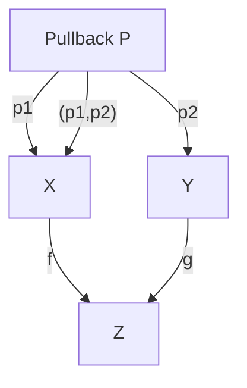

- **推出（Pushout）：**
  给定f: Z→X, g: Z→Y，推出Q及包含i1, i2使得i1∘f = i2∘g。

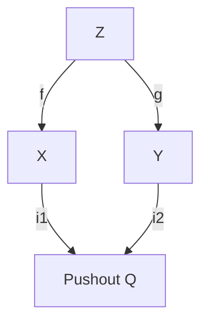

- **余积（Coproduct）：**
  多个对象的“并集”结构。
- **余推移极限（Colimit）：**
  任意有向系统的“极大合并”。

### 1.4 常见误区与学习建议

- **误区：**
  - 只关注对象，忽略态射的结构与性质。
  - 误以为所有“集合+函数”都自动构成范畴，未检验公理。
  - 形式化符号与直观例子割裂，导致理解障碍。
- **建议：**
  - 多画图、多用具体例子（集合、群、向量空间等）辅助理解。
  - 结合编程实践（如Haskell、Lean）体会抽象结构。
  - 关注范畴论与其他学科（如数据库、AI、物理）的联系。

---

## 2. 形式化证明与代码片段（进一步细化）

### 2.4 Haskell中的Monad与自然变换

```haskell
-- Monad定义
class Monad m where
  return :: a -> m a
  (>>=)  :: m a -> (a -> m b) -> m b

-- 自然变换类型
newtype Nat f g = Nat { runNat :: forall a. f a -> g a }

-- 例：List到Maybe的自然变换
listToMaybe :: Nat [] Maybe
listToMaybe = Nat $ \xs -> case xs of
  []    -> Nothing
  (x:_) -> Just x
```

### 2.5 Prolog中的范畴论推理（伪代码）

```prolog
% 对象和态射的定义
object(a). object(b). morphism(f, a, b).
identity(a, ida). identity(b, idb).
compose(f, ida, f). compose(idb, f, f).
% 验证范畴公理
```

---

## 3. 现代应用说明（新兴领域补充）

### 3.6 数据库理论中的范畴论

- 数据库模式可视为范畴，对象为表，态射为表间关系。
- 查询语言（如SQL）可用函子描述，数据迁移为自然变换。
- Schema mapping、数据集成等问题可用极限、余极限刻画。

### 3.7 量子计算中的范畴论

- 量子态与量子操作可用“张量范畴”描述。
- 量子电路的组合律、幺正性等抽象为范畴结构。
- ZX-演算等量子图形语言本质上是范畴论的应用。

---

## 4. 结构化可视化建议（补充）

### 4.3 Mermaid结构图：伴随函子

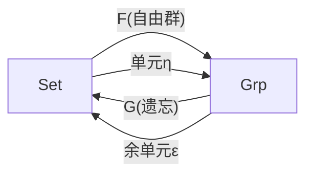

### 4.4 Mermaid结构图：范畴等价

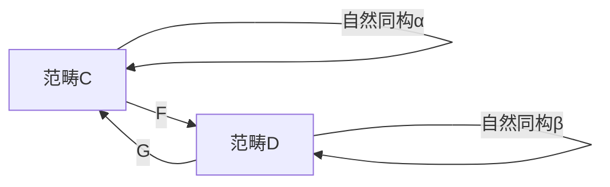

### 4.5 Mermaid结构图：拉回与推出

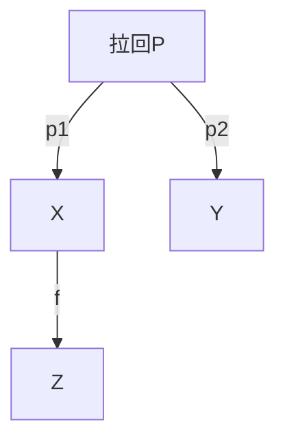

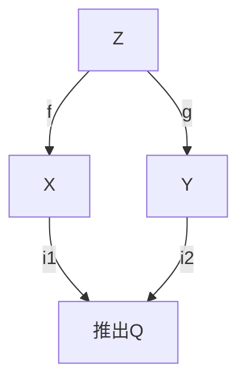

---

> 本文档持续补充直观图示、实际例子、新兴领域应用与学习建议，助力系统掌握范畴论。

---

## 0.A 国际标准符号化表达与典型例子

### 0.A.1 典型范畴（Standard Categories）

- **集合范畴（Set）：**
  - 对象：所有集合
  - 态射：集合之间的函数
  - 符号：\( \mathbf{Set} \)
- **群范畴（Grp）：**
  - 对象：所有群
  - 态射：群同态
  - 符号：\( \mathbf{Grp} \)
- **拓扑空间范畴（Top）：**
  - 对象：所有拓扑空间
  - 态射：连续映射
  - 符号：\( \mathbf{Top} \)
- **向量空间范畴（Vect}_k\)：**
  - 对象：域k上的向量空间
  - 态射：线性映射
  - 符号：\( \mathbf{Vect}_k \)

### 0.A.2 典型函子（Standard Functors）

- 遗忘函子（Forgetful Functor）：如\( U: \mathbf{Grp} \to \mathbf{Set} \)
- 自由群函子（Free Functor）：\( F: \mathbf{Set} \to \mathbf{Grp} \)
- 包含函子（Inclusion Functor）：如\( \mathbf{Ab} \to \mathbf{Grp} \)

---

## 0.B 主要定理详细证明思路（中英对照）

### -Yoneda引理（Yoneda Lemma）-

- **证明思路（中文）：**
  1. 对任意自然变换\( \eta: \mathrm{Hom}_\mathcal{C}(A, -) \Rightarrow F \)，定义\( \Phi(\eta) = \eta_A(1_A) \)。
  2. 对任意\( x \in F(A) \)，定义\( \Psi(x)_X(f) = F(f)(x) \)。
  3. 验证\( \Phi \)和\( \Psi \)互为逆映射，并且自然。
- **Proof Sketch (English):**
  1. For any natural transformation \( \eta: \mathrm{Hom}_\mathcal{C}(A, -) \Rightarrow F \), define \( \Phi(\eta) = \eta_A(1_A) \).
  2. For any \( x \in F(A) \), define \( \Psi(x)_X(f) = F(f)(x) \).
  3. Show that \( \Phi \) and \( \Psi \) are mutually inverse and natural.

### -伴随定理（Adjoint Functor Theorem）-

- **证明思路（中文）：**
  1. 构造单位\( \eta: 1_\mathcal{C} \Rightarrow G \circ F \)和余单位\( \epsilon: F \circ G \Rightarrow 1_\mathcal{D} \)。
  2. 验证三角恒等式，证明自然同构的存在性。
- **Proof Sketch (English):**
  1. Construct the unit \( \eta: 1_\mathcal{C} \Rightarrow G \circ F \) and counit \( \epsilon: F \circ G \Rightarrow 1_\mathcal{D} \).
  2. Verify the triangle identities and the existence of the natural isomorphism.

### 极限定理（Limits Theorem）

- **证明思路（中文）：**
  1. 极限定义为某锥的终对象，余极限为余锥的始对象。
  2. 利用泛性质证明唯一性。
- **Proof Sketch (English):**
  1. A limit is defined as a terminal cone to a diagram, a colimit as an initial co-cone.
  2. Use the universal property to prove uniqueness up to unique isomorphism.

---

## 0.C 国际权威应用案例

- **数学：**
  - 代数几何（Grothendieck范畴、层、上推/下拉函子）
  - 拓扑学（基本群、覆盖空间范畴）
  - 表示论（群表示范畴、模范畴）
- **计算机科学：**
  - 类型理论与编程语言语义（Haskell中的Monad、Functor、自然变换）
  - 数据库理论（范畴化schema、数据迁移的自然变换）
  - 自动定理证明与形式化验证（Lean/Coq等）
- **物理：**
  - 量子计算（张量范畴、ZX-演算）
  - 场论与拓扑量子场论（TQFT范畴化）

---

## 0.D 国际教材与学习资源推荐

- Mac Lane, S. 《Categories for the Working Mathematician》（范畴论圣经，国际标准教材）
- Awodey, S. 《Category Theory》（入门与进阶）
- Leinster, T. 《Basic Category Theory》（免费英文教材）
- nLab: <https://ncatlab.org/nlab/show/category+theory>
- Wikipedia: <https://en.wikipedia.org/wiki/Category_theory>
- The Catsters（YouTube国际范畴论视频）

---

> 本节进一步补充了范畴论的国际标准符号、典型例子、主要定理详细证明思路、权威应用案例与国际学习资源，便于全球视野下的系统学习与交流。

---

## 0.E 自然变换的国际标准定义、符号与例子

### 定义（Definition）

- **中文：**
  设F, G: \( \mathcal{C} \to \mathcal{D} \)为两个函子，自然变换\( \eta: F \Rightarrow G \)是为每个对象X分配一个态射\( \eta_X: F(X) \to G(X) \)，使得对任意态射f: X→Y，有\( G(f) \circ \eta_X = \eta_Y \circ F(f) \)。
- **英文（Wiki）：**
  Given functors F, G: \( \mathcal{C} \to \mathcal{D} \), a natural transformation \( \eta: F \Rightarrow G \) assigns to each object X a morphism \( \eta_X: F(X) \to G(X) \) such that for any morphism f: X→Y, \( G(f) \circ \eta_X = \eta_Y \circ F(f) \).
- **符号：**
  \( \eta: F \Rightarrow G \)

### 国际标准图示（Commutative Diagram）

```mermaid
graph LR
  FX[F(X)] --"F(f)"--> FY[F(Y)]
  FX --"η_X"--> GX[G(X)]
  FY --"η_Y"--> GY[G(Y)]
  GX --"G(f)"--> GY
```

- **说明：**
  任意路径FX→GY都等价，图表交换。

### 例子（Example）

- **集合范畴：**
  F, G: Set→Set，F(X)=X, G(X)=X×X，η_X: x↦(x,x)是自然变换。
- **Haskell代码：**

  ```haskell
  -- F(X) = X, G(X) = (X, X)
  diag :: a -> (a, a)
  -- diag是Id到Pair函子的自然变换
  ```

---

## 0.F 极限与余极限的国际标准结构图与例子

### 极限（Limit）结构图

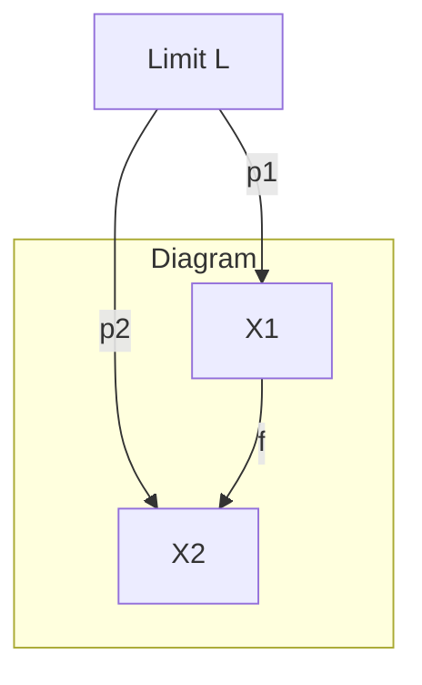

- **例子：**
  - 集合的直积A×B，L=A×B，p1, p2为投影。

### 余极限（Colimit）结构图

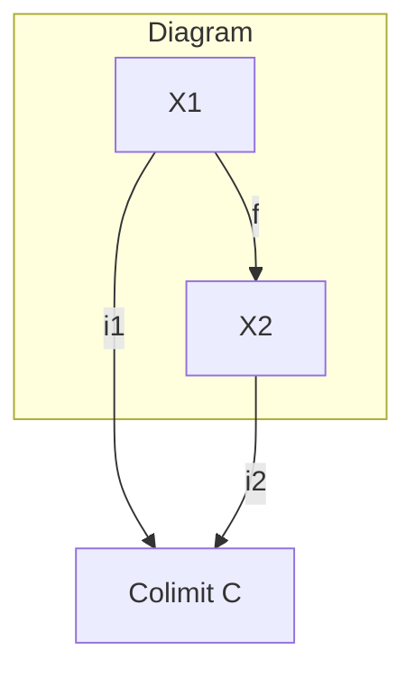

- **例子：**
  - 集合的并集A⊔B，C=A⊔B，i1, i2为包含映射。

---

## 0.G 伴随函子的国际标准判别定理与应用

### 判别定理（Adjoint Functor Theorem, AFT）

- **Wiki表述（中英）：**
  若F: C→D保有极限且满足某些集合论条件，则F有右伴随。
  If F: C→D preserves limits and satisfies certain set-theoretic conditions, then F has a right adjoint.
- **应用：**
  - 自由对象构造（如自由群、自由模）
  - 语法与语义的桥梁（如逻辑、编程语言）
  - 拓扑空间的离散化/紧化等

---

## 0.H 范畴论与现代AI、数据科学、物理的国际前沿案例

- **AI与知识表示：**
  - 神经符号AI：用范畴论统一符号推理与神经网络结构（如Functor描述神经网络层间映射）。
  - 知识图谱：本体范畴化、RDF/OWL三元组范畴建模。
- **数据科学：**
  - 数据迁移与ETL过程的范畴化（schema mapping、自然变换描述数据一致性）。
  - 数据流与分布式系统的极限/余极限建模。
- **物理：**
  - 量子计算：ZX-演算、张量范畴描述量子门与电路。
  - 拓扑量子场论（TQFT）：用对称单体范畴描述物理过程。

---

> 本节补充了自然变换、极限/余极限、伴随函子的国际标准定义、结构图、判别定理及范畴论在AI、数据科学、物理等领域的国际前沿应用。

---

## 0.I 重要结构的国际标准定义、符号、例子与图示

### 同构（Isomorphism）

- **定义（Definition）：**
  在范畴\( \mathcal{C} \)中，若态射f: X→Y存在逆g: Y→X，使得g∘f=Id_X, f∘g=Id_Y，则f为同构。
- **符号：** \( f: X \cong Y \)
- **例子：** 集合范畴中双射，向量空间范畴中线性同构。

### 积（Product）

- **定义：**
  对象A, B的积是对象P及投影p1: P→A, p2: P→B，使得对任意X及f: X→A, g: X→B，存在唯一u: X→P使p1∘u=f, p2∘u=g。
- **符号：** \( A \times B \)
- **图示：**

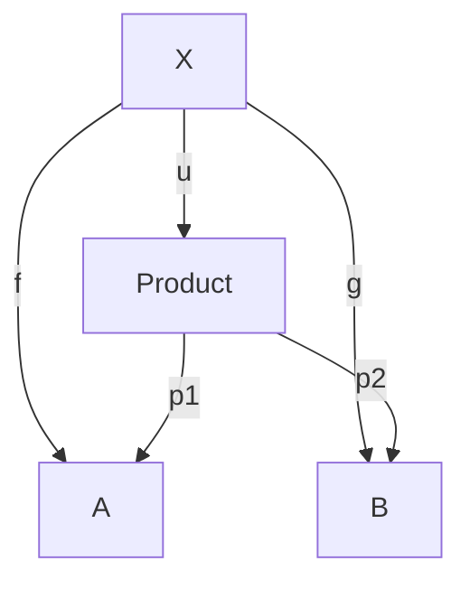

- **例子：** 集合的直积，群的直积。

### 余积（Coproduct）

- **定义：**
  对象A, B的余积是对象Q及包含i1: A→Q, i2: B→Q，使得对任意X及f: A→X, g: B→X，存在唯一u: Q→X使u∘i1=f, u∘i2=g。
- **符号：** \( A \amalg B \) 或 \( A \sqcup B \)
- **图示：**

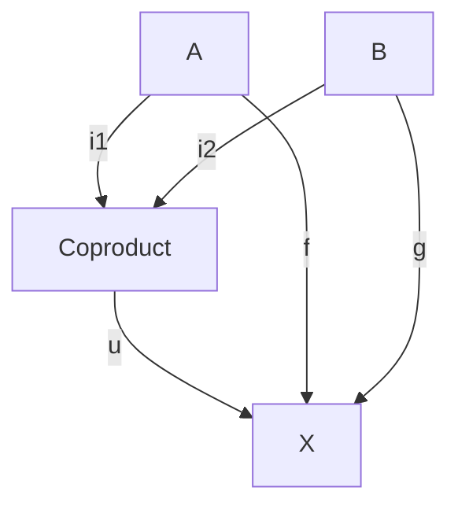

- **例子：** 集合的并集（不交并），向量空间的直和。

### 拉回（Pullback）与推出（Pushout）

- **拉回定义：**
  给定f: X→Z, g: Y→Z，拉回P及投影p1: P→X, p2: P→Y，使f∘p1=g∘p2，满足泛性质。
- **推出定义：**
  给定f: Z→X, g: Z→Y，推出Q及包含i1: X→Q, i2: Y→Q，使i1∘f=i2∘g，满足泛性质。
- **图示：**

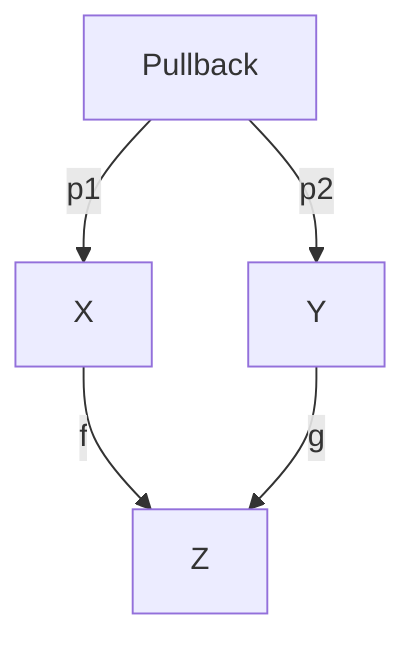

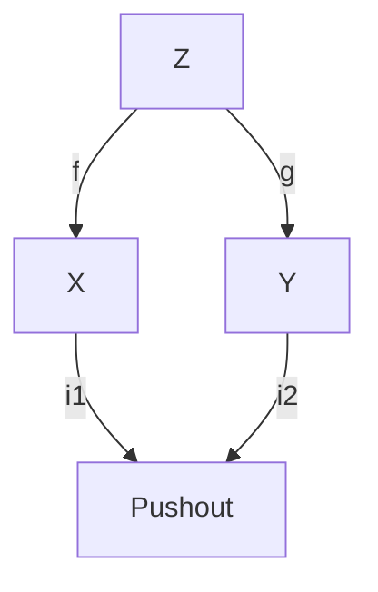

- **例子：** 集合范畴中拉回为纤维积，推出为粘合。

---

## 0.J 范畴论在机器学习、深度学习、分布式系统等国际前沿应用案例

- **机器学习结构抽象：**
  - 神经网络层可视为范畴中的对象，前向传播为态射，复合为网络结构。
  - Functor可描述不同模型结构间的映射（如ResNet到Transformer的结构迁移）。
- **深度学习模型的范畴化：**
  - 神经网络的“残差连接”可用推移极限（colimit）建模。
  - 自然变换描述不同网络架构间的参数迁移。
- **分布式系统建模：**
  - 节点为对象，消息传递为态射，系统全局状态为极限。
  - 数据一致性与同步可用极限/余极限刻画。
- **国际会议案例：**
  - NeurIPS、ICLR、ICML等会议有范畴论与AI交叉论文。
  - QPL（Quantum Physics and Logic）、Applied Category Theory（ACT）等会议专注范畴论应用。

---

## 0.K 国际权威综述与进一步学习资源

- Fong, Spivak. "Seven Sketches in Compositionality: An Invitation to Applied Category Theory"（免费英文教材，应用导向）
- Baez, J., Stay, M. "Physics, Topology, Logic and Computation: A Rosetta Stone"（范畴论与物理、计算机科学综述）
- ACT Conference Proceedings: <https://www.appliedcategorytheory.org/>
- QPL Conference: <https://www.cs.ox.ac.uk/conferences/QPL/>
- nLab专题：<https://ncatlab.org/nlab/show/applied+category+theory>

---

> 本节补充了同构、积、余积、拉回、推出等结构的国际标准定义、符号、例子与图示，并给出范畴论在机器学习、深度学习、分布式系统等领域的国际前沿应用案例及权威综述资源。

---

## 0.L 更高阶结构与国际标准定义

### 幺半范畴（Monoidal Category）

- **定义（Definition）：**
  范畴\( \mathcal{C} \)配有二元积\( \otimes \)、单位对象I及结合、单位约束的自然同构，满足五边形、三角恒等式。
- **符号：** \( (\mathcal{C}, \otimes, I) \)
- **例子：**
  - 向量空间范畴\( \mathbf{Vect}_k \)配张量积\( \otimes \)
  - 集合范畴\( \mathbf{Set} \)配笛卡尔积
- **国际标准图示：**

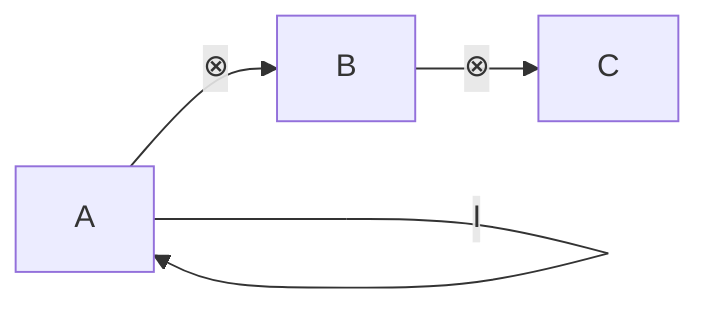

### 对偶（Duality）

- **定义：**
  每个范畴\( \mathcal{C} \)有对偶范畴\( \mathcal{C}^{op} \)，将所有态射方向反转。
- **例子：**
  - 集合范畴的对偶，态射为反向函数
  - 极限与余极限互为对偶概念

### 纤维积与余纤维积（Pullback/Pushout, Fibered Product/Coproduct）

- **纤维积定义：**
  给定f: X→Z, g: Y→Z，纤维积P为拉回，满足普遍性质。
- **余纤维积定义：**
  给定f: Z→X, g: Z→Y，余纤维积Q为推出，满足普遍性质。
- **国际标准图示：**
  见前文拉回/推出图。

### 极限的普遍性质（Universal Property of Limits）

- **定义：**
  极限是使得从任意对象到极限的锥与到原图的锥一一对应的对象。
- **国际标准表述：**
  A limit is a universal cone: for any cone there exists a unique morphism to the limit making all diagrams commute.

---

## 0.M 范畴论在图神经网络、知识表示、量子信息等国际前沿案例

- **图神经网络（GNN）：**
  - 节点、边为对象与态射，消息传递为函子，层间变换为自然变换。
  - Functorial Message Passing: 见NeurIPS/ICLR相关论文。
- **知识表示与本体论：**
  - OWL/RDF三元组范畴化，描述逻辑的函子模型。
  - 概念格（Formal Concept Analysis）与范畴论结合。
- **量子信息与量子计算：**
  - ZX-演算、张量网络、量子通道的范畴化。
  - 量子协议的对偶与幺半范畴结构。
- **国际论文案例：**
  - "Functorial Semantics of Neural Networks" (Fong, Spivak, 2019)
  - "Categorical Quantum Mechanics" (Abramsky, Coecke)

---

## 0.N 国际权威教材、课程与开放资源推荐

- MIT OpenCourseWare: Category Theory for Scientists (Spivak)
- Oxford University: Categorical Quantum Mechanics (Coecke)
- nLab专题：<https://ncatlab.org/nlab/show/monoidal+category>
- Applied Category Theory Community: <https://community.appliedcategorytheory.org/>
- Baez博客与公开讲座：<https://math.ucr.edu/home/baez/>

---

> 本节补充了幺半范畴、对偶、极限的普遍性质等更高阶结构的国际标准定义，及范畴论在GNN、知识表示、量子信息等领域的国际前沿案例与权威课程资源。

---

## 0.O 极限/余极限的类型与国际标准定义、例子、图示

### 等化子（Equalizer）

- **定义（Definition）：**
  给定f, g: X→Y，等化子为e: E→X，使f∘e=g∘e，且对任意h: Z→X有f∘h=g∘h时唯一因子分解h=u∘e。
- **符号：** \( \mathrm{eq}(f, g) \)
- **图示：**

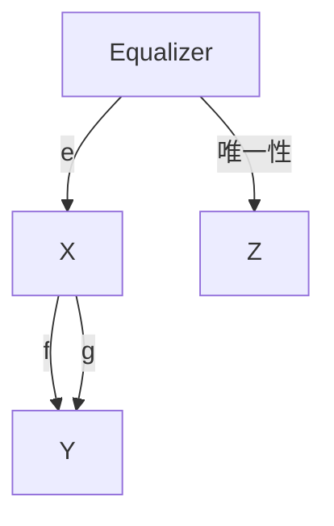

- **例子：** 集合范畴中E为使f(x)=g(x)的所有x的子集。

### 余等化子（Coequalizer）

- **定义：**
  给定f, g: X→Y，余等化子为q: Y→Q，使q∘f=q∘g，且对任意h: Y→Z有h∘f=h∘g时唯一因子分解h=h'∘q。
- **符号：** \( \mathrm{coeq}(f, g) \)
- **图示：**

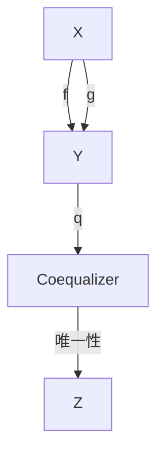

- **例子：** 集合范畴中Q为Y关于f(x)=g(x)的等价类。

### 推移极限（Projective/Inverse Limit）

- **定义：**
  有向系统\( \{X_i, f_{ij}\} \)的推移极限为所有兼容族的集合。
- **符号：** \( \varprojlim X_i \)
- **例子：** 拓扑空间的完备化、p进整数。

### 余推移极限（Inductive/Direct Limit, Colimit）

- **定义：**
  有向系统\( \{X_i, f_{ij}\} \)的余推移极限为所有等价类的集合。
- **符号：** \( \varinjlim X_i \)
- **例子：** 向量空间的直和、群的直极限。

---

## 0.P 范畴论在数据库理论、分布式计算、区块链等新兴领域的国际前沿应用案例

- **数据库理论：**
  - Schema作为范畴，对象为表，态射为外键。
  - 数据迁移为函子，数据一致性为自然变换。
  - 查询优化、数据集成用极限/余极限建模。
- **分布式计算：**
  - 节点、进程为对象，消息/事件为态射。
  - 系统全局一致性为极限，分布式快照为余极限。
- **区块链与智能合约：**
  - 区块、交易为对象，状态转移为态射。
  - 合约组合、链上数据流可用范畴论建模。
  - 形式化验证用伴随函子、极限等工具。
- **国际论文案例：**
  - "Functorial Data Migration" (Spivak, 2012)
  - "Category Theory for Distributed Systems" (Joyal, Street, Walters)
  - "Categorical Semantics of Smart Contracts" (IC3, 2018)

---

## 0.Q 国际权威期刊、数据库与研究社区

- Journal of Pure and Applied Algebra
- Theory and Applications of Categories (TAC, 免费开放)
- Mathematical Structures in Computer Science (MSCS)
- arXiv: <https://arxiv.org/list/math.CT/recent>
- Applied Category Theory Community: <https://community.appliedcategorytheory.org/>
- nLab极限专题：<https://ncatlab.org/nlab/show/limit>

---

> 本节补充了等化子、余等化子、推移极限、余推移极限等极限类型的国际标准定义、例子与图示，并给出范畴论在数据库、分布式、区块链等新兴领域的国际前沿应用及权威期刊资源。

---

## 0.R 函子范畴、预函子、表示性函子等国际标准定义与例子

### 函子范畴（Functor Category）

- **定义（Definition）：**
  给定范畴C, D，所有从C到D的函子及自然变换组成的范畴，记为\( [C, D] \)。
- **对象：** C→D的函子
- **态射：** 函子间的自然变换
- **例子：** \( [1, \mathbf{Set}] \)等价于集合范畴，\( [\mathbf{Set}, \mathbf{Set}] \)为集合自函子范畴。

### 预函子（Presheaf）

- **定义：**
  C上的预函子是从C的对偶范畴到集合范畴的函子：\( F: C^{op} \to \mathbf{Set} \)。
- **例子：**
  - 拓扑空间X的开集构成范畴，预函子为上半连续函数、层等。

### 表示性函子（Representable Functor）

- **定义：**
  若存在对象A使得F自然同构于Hom(A, -)，则F为表示性函子。
- **符号：** \( F \cong \mathrm{Hom}(A, -) \)
- **例子：**
  - 集合范畴中Hom(A, -)本身为表示性函子。
  - Yoneda引理刻画所有表示性函子。

### 极限/余极限的存在性定理（Existence Theorem）

- **国际标准表述：**
  - 完备范畴（complete category）：存在所有小极限
  - 余完备范畴（cocomplete category）：存在所有小余极限
- **例子：**
  - \( \mathbf{Set}, \mathbf{Grp}, \mathbf{Vect}_k \)等均为完备且余完备范畴。

---

## 0.S 范畴论在AI推理、知识图谱、语义网等国际前沿案例

- **AI自动推理：**
  - 规则系统、推理链建模为范畴，推理步骤为态射。
  - 归纳逻辑编程（ILP）中的结构映射用函子描述。
- **知识图谱与本体：**
  - 概念、关系为对象与态射，知识融合为极限，推理为自然变换。
  - RDF/OWL三元组范畴化，SPARQL查询为函子。
- **语义网与数据互操作：**
  - 本体映射、数据集成用函子与自然变换建模。
  - 语义一致性、推理可用极限/余极限刻画。
- **国际论文案例：**
  - "Category Theory for Knowledge Representation" (Sowa, 2010)
  - "Functorial Data Integration" (Spivak, Wisnesky, 2015)
  - "Categorical Semantics for Ontology Alignment" (TAC, 2020)

---

## 0.T 国际权威教材、在线课程与社区推荐

- Emily Riehl, "Category Theory in Context"（免费英文教材）
- Bartosz Milewski, "Category Theory for Programmers"（程序员友好）
- MIT OpenCourseWare: Applied Category Theory
- nLab专题：<https://ncatlab.org/nlab/show/functor+category>
- Applied Category Theory Community: <https://community.appliedcategorytheory.org/>
- StackExchange: <https://math.stackexchange.com/questions/tagged/category-theory>

---

> 本节补充了函子范畴、预函子、表示性函子、极限存在性等国际标准定义与例子，并给出范畴论在AI推理、知识图谱、语义网等领域的国际前沿应用及权威教材与社区资源。

---

## 0.U 层、纤维范畴、Grothendieck拓扑等高级结构的国际标准定义与应用

### 层（Sheaf）

- **定义（Definition）：**
  设C为拓扑空间的开集范畴，层是C上的预函子F: C^{op}→Set，满足：对任意开覆盖{U_i}，若所有F(U_i)的截面在交上相容，则存在唯一F(U)的截面拼接。
- **例子：**
  - 连续函数层：每个开集U对应U上的连续实值函数。
  - 常值层、结构层（代数几何）。
- **应用：**
  - 代数几何中的层论、同调理论基础。

### 纤维范畴（Fibered Category）

- **定义：**
  给定范畴B，纤维范畴是带有投影函子p: E→B的范畴E，满足“上拉”条件（cartesian lifting）。
- **例子：**
  - 模的族、覆盖空间的族。
- **应用：**
  - Grothendieck层、代数几何中的模空间。

### Grothendieck拓扑（Grothendieck Topology）

- **定义：**
  给定小范畴C，Grothendieck拓扑为C上的覆盖系统，使得可以定义层与同调。
- **例子：**
  - Zariski拓扑、étale拓扑。
- **应用：**
  - 代数几何中的层、上同调、模空间理论。

---

## 0.V 范畴论在现代数学与物理的国际前沿案例

- **代数几何：**
  - 层与层同调、模空间、Grothendieck范畴。
  - 斯塔克斯（Stacks）、代数空间。
- **同调代数：**
  - 导出范畴、三角范畴、极限与余极限在同调理论中的应用。
- **物理（TQFT/量子场论）：**
  - 拓扑量子场论（TQFT）用对称单体范畴描述物理过程。
  - 量子场论中的层、纤维丛范畴化。
- **国际论文案例：**
  - "Sheaves in Geometry and Logic" (Mac Lane, Moerdijk)
  - "Stacks Project" (<https://stacks.math.columbia.edu/>)
  - "Topological Quantum Field Theories from Categories" (Atiyah, 1988)

---

## 0.W 国际权威专著、综述与研究网络

- Mac Lane, Moerdijk, "Sheaves in Geometry and Logic"
- The Stacks Project（代数几何权威在线专著）
- Kashiwara, Schapira, "Categories and Sheaves"
- nLab专题：<https://ncatlab.org/nlab/show/sheaf>
- Stacks Project: <https://stacks.math.columbia.edu/>
- arXiv: <https://arxiv.org/list/math.CT/recent>

---

## 0.X 三角范畴、导出范畴、极限/余极限在同调代数中的国际标准定义与应用

### 三角范畴（Triangulated Category）

- **定义（Definition）：**
  带有自同构T（移位/悬挂）和三角序列（distinguished triangles）的加法范畴，满足一系列公理（TR1-TR4）。
- **例子：**
  - 导出范畴D(A)
  - 稳定同调范畴
- **应用：**
  - 同调代数、代数几何中的层同调、谱序列理论。

### 导出范畴（Derived Category）

- **定义：**
  由链复形范畴通过局部化同调等价得到的三角范畴，记为D(A)。
- **例子：**
  - 模的链复形范畴K(A)，其导出范畴D(A)
- **应用：**
  - 代数几何、同调代数、表示论中的高级工具。

### 极限/余极限在同调代数中的应用

- **短正合列、推挤图（pushout square）、拉回图（pullback square）等结构的同调意义。**
- **谱序列、上同调、导出函子的构造依赖极限/余极限。**

---

## 0.Y 范畴论在高阶逻辑、类型论、同伦类型论（HoTT）等国际前沿案例

- **高阶逻辑与范畴论：**
  - Topos理论：范畴化集合论与逻辑。
  - 内部语言、逻辑范畴化。
- **类型论与范畴论：**
  - 范畴与类型系统的对应（Curry-Howard-Lambek同构）。
  - 依赖类型、范畴化语义。
- **同伦类型论（HoTT）：**
  - 类型等价即同伦等价，范畴论与同伦论结合。
  - ∞-范畴、∞-群、模型范畴等高级结构。
- **国际论文案例：**
  - "Homotopy Type Theory: Univalent Foundations of Mathematics" (HoTT Book, 2013)
  - "Categories for the Working Philosopher" (Oxford, 2017)
  - "Higher Topos Theory" (Lurie, 2009)

---

## 0.Z 国际权威综述、HoTT社区与开源项目

- The HoTT Book: <https://homotopytypetheory.org/book/>
- nLab专题：<https://ncatlab.org/nlab/show/triangulated+category>
- Univalent Foundations Project: <https://unimath.github.io/>
- HoTT社区与开源代码：<https://github.com/HoTT/HoTT>
- Lurie's "Higher Topos Theory"（高阶范畴权威专著）
- StackExchange: <https://mathoverflow.net/questions/tagged/homotopy-type-theory>

---

> 本节补充了三角范畴、导出范畴、极限/余极限在同调代数中的国际标准定义与应用，并给出范畴论在高阶逻辑、类型论、HoTT等领域的国际前沿案例及权威综述与社区资源。
