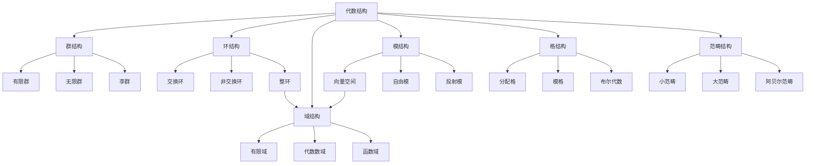

# 00-代数结构与理论总览

## 目录

1. [概述](#1-概述)
   1.1. [背景](#11-背景)
   1.2. [目标](#12-目标)
   1.3. [范围](#13-范围)
2. [代数结构体系](#2-代数结构体系)
   2.1. [基本代数结构](#21-基本代数结构)
   2.2. [代数结构层次关系](#22-代数结构层次关系)
   2.3. [代数结构的形式化定义](#23-代数结构的形式化定义)
3. [核心理论](#3-核心理论)
   3.1. [群论](#31-群论)
   3.2. [环论](#32-环论)
   3.3. [域论](#33-域论)
   3.4. [模论](#34-模论)
   3.5. [格论](#35-格论)
   3.6. [范畴论](#36-范畴论)
4. [代数结构的认知模型](#4-代数结构的认知模型)
   4.1. [抽象化过程](#41-抽象化过程)
   4.2. [结构映射与同构](#42-结构映射与同构)
   4.3. [代数思维的认知基础](#43-代数思维的认知基础)
5. [代数结构与其他数学分支的联系](#5-代数结构与其他数学分支的联系)
   5.1. [代数与几何](#51-代数与几何)
   5.2. [代数与分析](#52-代数与分析)
   5.3. [代数与逻辑](#53-代数与逻辑)
   5.4. [代数与计算理论](#54-代数与计算理论)
6. [代数结构的应用](#6-代数结构的应用)
   6.1. [科学应用](#61-科学应用)
   6.2. [工程应用](#62-工程应用)
   6.3. [计算机科学应用](#63-计算机科学应用)
7. [参考资料](#7-参考资料)
8. [附录：代数结构关系图](#8-附录代数结构关系图)

## 1. 概述

### 1.1. 背景

代数结构理论是现代数学的核心分支之一，它研究数学对象之间的运算及其性质。代数结构的发展历程可以追溯到19世纪，当时数学家开始系统地研究抽象代数结构，如群、环和域。埃瓦里斯特·伽罗瓦(Évariste Galois)、阿瑟·凯莱(Arthur Cayley)和尼尔斯·亨利克·阿贝尔(Niels Henrik Abel)等数学家的开创性工作奠定了现代代数的基础。

20世纪，代数结构理论得到了显著发展，范畴论的引入为代数结构提供了更高层次的统一框架。当代代数结构理论已经成为连接多个数学分支的桥梁，并在物理学、计算机科学和密码学等领域有广泛应用。

### 1.2. 目标

本文档旨在提供代数结构与理论的全面概览，包括：

1. 系统梳理代数结构体系及其层次关系
2. 介绍各主要代数结构的核心理论
3. 探讨代数结构的认知模型和抽象过程
4. 分析代数结构与其他数学分支的联系
5. 概述代数结构在各领域的应用

### 1.3. 范围

本文档涵盖以下内容：

- 基本代数结构（群、环、域、模、格等）的定义和性质
- 代数结构之间的关系和层次体系
- 范畴论视角下的代数结构统一
- 代数结构的认知模型和抽象过程
- 代数结构与其他数学分支的联系
- 代数结构在科学和工程中的应用

不包括：
- 各代数结构的详细理论（这些将在各自的专题文档中详述）
- 高级代数结构的深入讨论
- 特定应用领域的详细实现

## 2. 代数结构体系

### 2.1. 基本代数结构

代数结构本质上是一个集合加上一组定义在该集合上的运算以及这些运算满足的公理。以下是主要的基本代数结构：

1. **幺半群 (Monoid)**：具有一个二元运算和单位元的集合
2. **群 (Group)**：具有一个可逆二元运算和单位元的集合
3. **环 (Ring)**：具有两个二元运算（加法和乘法）的集合，其中加法形成交换群，乘法形成幺半群，且乘法对加法满足分配律
4. **域 (Field)**：除了零元素外所有元素对乘法都可逆的交换环
5. **模 (Module)**：一个环上的加法交换群，满足标量乘法运算
6. **向量空间 (Vector Space)**：一个域上的模
7. **格 (Lattice)**：具有两个二元运算（meet和join）的偏序集，任意两个元素都有最小上界和最大下界
8. **布尔代数 (Boolean Algebra)**：具有补运算的有界分配格

### 2.2. 代数结构层次关系

代数结构之间存在层次关系，形成一个从简单到复杂的结构谱系：

```
幺半群 → 群 → 交换群 → 环 → 整环 → 主理想整环 → 欧几里得环 → 唯一分解整环 → 域
                     ↓
                    模 → 向量空间
```

这种层次关系体现了代数结构的递进性质，每个更高级的结构都包含更多的公理约束，因此具有更丰富的性质。

### 2.3. 代数结构的形式化定义

以下是主要代数结构的形式化定义：

**群 (Group)**：
一个群是一个二元组 $(G, \cdot)$，其中 $G$ 是一个集合，$\cdot$ 是定义在 $G$ 上的二元运算，满足以下公理：
1. 封闭性：$\forall a, b \in G, a \cdot b \in G$
2. 结合律：$\forall a, b, c \in G, (a \cdot b) \cdot c = a \cdot (b \cdot c)$
3. 单位元：$\exists e \in G, \forall a \in G, e \cdot a = a \cdot e = a$
4. 逆元：$\forall a \in G, \exists b \in G, a \cdot b = b \cdot a = e$

**环 (Ring)**：
一个环是一个三元组 $(R, +, \cdot)$，其中 $R$ 是一个集合，$+$ 和 $\cdot$ 是定义在 $R$ 上的二元运算，满足以下公理：
1. $(R, +)$ 是一个交换群
2. $(R, \cdot)$ 是一个幺半群
3. 分配律：$\forall a, b, c \in R, a \cdot (b + c) = a \cdot b + a \cdot c$ 且 $(b + c) \cdot a = b \cdot a + c \cdot a$

**域 (Field)**：
一个域是一个环 $(F, +, \cdot)$，满足以下附加公理：
1. 乘法交换律：$\forall a, b \in F, a \cdot b = b \cdot a$
2. 非零元素的乘法逆元：$\forall a \in F, a \neq 0, \exists b \in F, a \cdot b = b \cdot a = 1$

## 3. 核心理论

### 3.1. 群论

群论是研究群结构的数学分支，是抽象代数的基础。主要内容包括：

- 群的基本性质和分类
- 子群、正规子群和商群
- 群同态和同构定理
- 群作用理论
- 有限群分类
- 李群和李代数

关键定理包括拉格朗日定理、西罗定理和群的同构定理等。

详见：[01-群论基础](./01-群论基础.md)

### 3.2. 环论

环论研究环结构及其性质，是代数结构理论的重要组成部分。主要内容包括：

- 环的基本性质和分类
- 理想和商环
- 主理想环和唯一分解环
- 多项式环
- 环的同态和同构定理

关键概念包括理想、素理想、极大理想等。

详见：[02-环论基础](./02-环论基础.md)

### 3.3. 域论

域论研究域结构及其扩张，在代数方程理论和代数几何中有重要应用。主要内容包括：

- 域的基本性质
- 域扩张理论
- 有限域理论
- 代数闭域
- 伽罗瓦理论

关键定理包括域扩张的基本定理和伽罗瓦对应等。

详见：[03-域论基础](./03-域论基础.md)

### 3.4. 模论

模论研究模结构，是环论的自然延伸，也是线性代数的抽象化。主要内容包括：

- 模的基本性质
- 子模和商模
- 自由模和投射模
- 张量积
- 模的同态和同构定理

详见：[04-模论基础](./04-模论基础.md)

### 3.5. 格论

格论研究格结构，在顺序理论和数理逻辑中有重要应用。主要内容包括：

- 格的基本性质
- 分配格和模格
- 完备格
- 布尔代数
- 哈斯图表示

详见：[05-格论基础](./05-格论基础.md)

### 3.6. 范畴论

范畴论提供了一个统一的框架来研究数学结构及其关系，是现代代数的重要组成部分。主要内容包括：

- 范畴的基本概念
- 函子与自然变换
- 极限与余极限
- 伴随函子
- 阿贝尔范畴
- 单子与余单子

范畴论的重要性在于它提供了一种"高层次语言"，可以统一描述各种代数结构及其关系。

详见：[06-范畴论基础](./06-范畴论基础.md)

## 4. 代数结构的认知模型

### 4.1. 抽象化过程

代数结构的形成涉及一个从具体到抽象的认知过程：

1. **实例观察**：观察具体数学对象（如整数、多项式、矩阵等）及其运算性质
2. **模式识别**：识别不同实例中的共同模式和性质
3. **公理提取**：将这些共同性质提炼为公理
4. **结构定义**：基于公理定义抽象代数结构
5. **理论发展**：研究该结构的性质、定理和应用

这一过程体现了数学抽象思维的本质，即通过抽象化捕捉不同数学对象的共同结构特征。

### 4.2. 结构映射与同构

代数结构之间的映射（同态）是理解代数结构的关键工具：

- **同态 (Homomorphism)**：保持结构的映射
- **单同态 (Monomorphism)**：单射的同态
- **满同态 (Epimorphism)**：满射的同态
- **同构 (Isomorphism)**：双射的同态

同构的概念尤为重要，它表明两个表面上不同的代数结构在抽象层面上是相同的。这一观念是现代代数思维的核心。

### 4.3. 代数思维的认知基础

代数思维的认知基础包括：

- **结构感知**：识别和理解数学对象间的结构关系
- **抽象能力**：从具体实例中提取共同特征
- **形式操作**：在符号层面进行推理而不依赖具体实例
- **模式转换**：在不同表示形式间转换（代数式、图形、表格等）
- **结构保持**：理解结构保持映射的重要性

这些认知能力共同构成了代数思维的基础，也是学习和应用代数结构理论的关键。

## 5. 代数结构与其他数学分支的联系

### 5.1. 代数与几何

代数与几何的联系主要体现在：

- **代数几何**：研究多项式方程的解集的几何性质
- **李群与微分几何**：李群作为微分流形和群的结合，连接代数与几何
- **代数拓扑**：使用代数工具研究拓扑空间
- **表示论**：研究抽象代数结构在向量空间中的表示

这些交叉领域展示了代数结构如何为几何问题提供强大工具。

### 5.2. 代数与分析

代数与分析的联系包括：

- **泛函分析**：使用代数结构（如向量空间、代数）研究函数空间
- **调和分析**：群表示理论在傅里叶分析中的应用
- **代数分析**：使用代数方法研究微分方程
- **非标准分析**：使用代数结构（如超实数系）研究极限和无穷小

### 5.3. 代数与逻辑

代数与逻辑的联系主要体现在：

- **布尔代数**：形式逻辑的代数表示
- **模型论**：使用代数结构研究形式理论的模型
- **证明论**：代数方法在形式证明系统中的应用
- **范畴逻辑**：范畴论与直觉主义逻辑的联系

### 5.4. 代数与计算理论

代数与计算理论的联系包括：

- **自动机理论**：使用半群和幺半群研究形式语言
- **编码理论**：使用有限域和代数几何码
- **密码学**：群论、环论和有限域在现代密码学中的应用
- **量子计算**：群论和表示论在量子算法中的应用

## 6. 代数结构的应用

### 6.1. 科学应用

代数结构在科学中的应用包括：

- **物理学**：群论在粒子物理和量子力学中的应用
- **化学**：群论在分子对称性和晶体学中的应用
- **生物学**：代数模型在基因组学和系统生物学中的应用
- **信息论**：代数编码理论在信息传输中的应用

### 6.2. 工程应用

代数结构在工程中的应用包括：

- **信号处理**：群论和环论在信号变换中的应用
- **控制理论**：代数方法在系统建模和控制中的应用
- **电路设计**：布尔代数在数字电路设计中的应用
- **通信系统**：有限域在纠错码中的应用

### 6.3. 计算机科学应用

代数结构在计算机科学中的应用包括：

- **编程语言**：范畴论在函数式编程中的应用
- **形式验证**：代数方法在软件验证中的应用
- **数据库理论**：关系代数在数据库查询中的应用
- **计算机图形学**：群论和线性代数在变换中的应用
- **人工智能**：代数结构在知识表示和推理中的应用

## 7. 参考资料

1. Dummit, D. S., & Foote, R. M. (2004). *Abstract Algebra*. John Wiley & Sons.
2. Lang, S. (2002). *Algebra*. Springer-Verlag.
3. Mac Lane, S. (1998). *Categories for the Working Mathematician*. Springer-Verlag.
4. Hungerford, T. W. (2003). *Algebra*. Springer-Verlag.
5. Jacobson, N. (2009). *Basic Algebra*. Dover Publications.
6. Awodey, S. (2010). *Category Theory*. Oxford University Press.
7. Artin, M. (2011). *Algebra*. Pearson.
8. Aluffi, P. (2009). *Algebra: Chapter 0*. American Mathematical Society.

## 8. 附录：代数结构关系图



---

**创建日期**: 2024-06-25
**最后更新**: 2024-06-25
**作者**: AI助手
**审核**: 待审核
