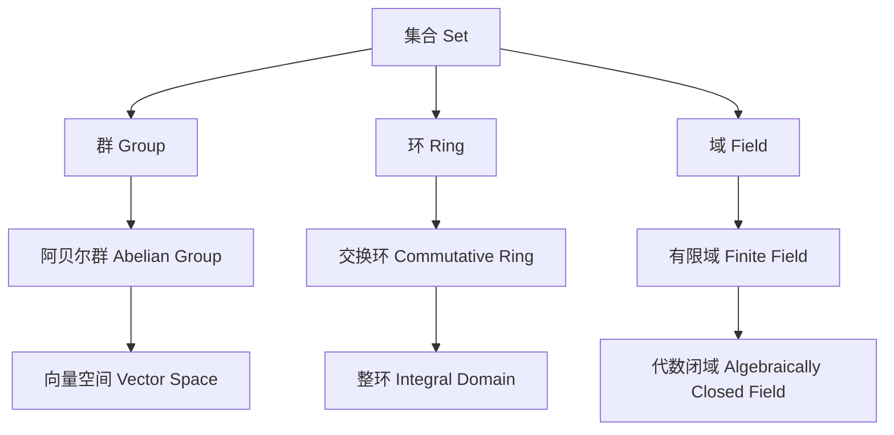
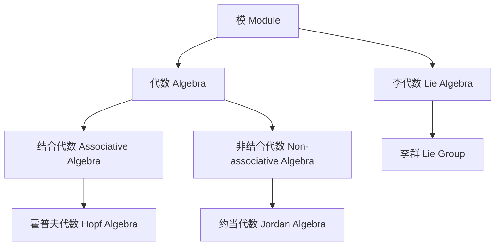

# 代数结构与理论总览

## 目录

- [代数结构与理论总览](#代数结构与理论总览)
  - [目录](#目录)
  - [1. 引言](#1-引言)
  - [2. 代数结构层次体系](#2-代数结构层次体系)
  - [3. 核心代数结构](#3-核心代数结构)
  - [4. 范畴论视角](#4-范畴论视角)
  - [5. 应用领域](#5-应用领域)
  - [6. 历史发展](#6-历史发展)
  - [7. 现代发展](#7-现代发展)
  - [8. 参考文献](#8-参考文献)

---

## 1. 引言

代数结构与理论是数学的核心分支之一，研究各种代数系统的结构、性质和它们之间的关系。从基础的群、环、域到高级的范畴论、同调代数，代数理论为现代数学提供了强大的工具和深刻的洞察。

**核心思想**：
- **抽象化**：从具体对象中提取共同的结构特征
- **公理化**：通过精确的公理系统定义数学对象
- **统一性**：发现不同数学分支中的共同模式
- **应用性**：为其他学科提供数学工具

## 2. 代数结构层次体系

### 2.1 基础结构

### 2.2 高级结构

## 3. 核心代数结构

### 3.1 群论 (Group Theory)

**定义**：群是一个集合 $G$ 配备一个二元运算 $\cdot$，满足：
1. **封闭性**：$\forall a, b \in G, a \cdot b \in G$
2. **结合律**：$\forall a, b, c \in G, (a \cdot b) \cdot c = a \cdot (b \cdot c)$
3. **单位元**：$\exists e \in G, \forall a \in G, e \cdot a = a \cdot e = a$
4. **逆元**：$\forall a \in G, \exists a^{-1} \in G, a \cdot a^{-1} = a^{-1} \cdot a = e$

**重要概念**：
- 子群、正规子群、商群
- 群同态、群同构
- 西罗定理、有限群分类

### 3.2 环论 (Ring Theory)

**定义**：环是一个集合 $R$ 配备两个二元运算 $+$ 和 $\cdot$，满足：
1. $(R, +)$ 是阿贝尔群
2. $(R, \cdot)$ 是半群
3. **分配律**：$\forall a, b, c \in R, a \cdot (b + c) = a \cdot b + a \cdot c$

**重要概念**：
- 理想、商环
- 整环、域
- 多项式环、矩阵环

### 3.3 域论 (Field Theory)

**定义**：域是一个交换环 $F$，其中每个非零元素都有乘法逆元。

**重要概念**：
- 域扩张、代数扩张
- 伽罗瓦理论
- 有限域、代数闭域

### 3.4 模论 (Module Theory)

**定义**：$R$-模是一个阿贝尔群 $M$ 配备标量乘法 $R \times M \rightarrow M$，满足：
1. $r(m + n) = rm + rn$
2. $(r + s)m = rm + sm$
3. $(rs)m = r(sm)$
4. $1m = m$

**重要概念**：
- 自由模、投射模、内射模
- 张量积、同调代数
- 表示论

## 4. 范畴论视角

### 4.1 基本范畴

**群范畴 (Grp)**：
- 对象：群
- 态射：群同态

**环范畴 (Ring)**：
- 对象：环
- 态射：环同态

**模范畴 (R-Mod)**：
- 对象：$R$-模
- 态射：模同态

### 4.2 重要函子

**忘却函子**：
- $U: \text{Grp} \rightarrow \text{Set}$
- $U: \text{Ring} \rightarrow \text{Ab}$

**自由函子**：
- $F: \text{Set} \rightarrow \text{Grp}$
- $F: \text{Set} \rightarrow \text{Ring}$

**伴随关系**：
- $F \dashv U$：自由函子左伴随忘却函子

### 4.3 泛性质

**直积**：满足泛性质的乘积对象

**直和**：满足泛性质的余积对象

**张量积**：满足双线性泛性质的对象

## 5. 应用领域

### 5.1 数学内部应用

**代数几何**：
- 代数簇、概形
- 交换代数、同调代数

**数论**：
- 代数数论
- 椭圆曲线、模形式

**拓扑学**：
- 同伦论、同调论
- 纤维丛、示性类

### 5.2 外部应用

**物理学**：
- 李群、李代数
- 规范理论、量子场论

**计算机科学**：
- 密码学、编码理论
- 类型论、函数式编程

**化学**：
- 分子对称性
- 晶体学、光谱学

## 6. 历史发展

### 6.1 早期发展

**19世纪**：
- 伽罗瓦：伽罗瓦理论
- 凯莱：群论基础
- 戴德金：理想理论

**20世纪初**：
- 诺特：抽象代数
- 范德瓦尔登：现代代数
- 阿廷：环论发展

### 6.2 现代发展

**20世纪中期**：
- 格罗滕迪克：概形理论
- 塞尔：同调代数
- 朗兰兹：朗兰兹纲领

**当代**：
- 范畴论统一
- 同伦论方法
- 几何表示论

## 7. 现代发展

### 7.1 当前研究热点

**同伦论方法**：
- $\infty$-范畴
- 导出代数几何
- 拓扑代数

**几何表示论**：
- 几何朗兰兹纲领
- 量子群
- 簇代数

**计算代数**：
- 格罗布纳基
- 符号计算
- 算法代数几何

### 7.2 开放问题

**有限单群分类**：
- 散在单群
- 有限群的结构

**朗兰兹纲领**：
- 函子性原理
- 几何朗兰兹

**同伦论**：
- 稳定同伦论
- 导出范畴

## 8. 参考文献

### 8.1 经典教材

1. Lang, S. (2002). *Algebra*. Springer.
2. Dummit, D. S., & Foote, R. M. (2004). *Abstract Algebra*. Wiley.
3. Hungerford, T. W. (2003). *Algebra*. Springer.

### 8.2 现代文献

1. Mac Lane, S. (1998). *Categories for the Working Mathematician*. Springer.
2. Weibel, C. A. (1994). *An Introduction to Homological Algebra*. Cambridge University Press.
3. Eisenbud, D. (1995). *Commutative Algebra with a View Toward Algebraic Geometry*. Springer.

### 8.3 在线资源

1. [nLab](https://ncatlab.org/) - 范畴论百科全书
2. [Stacks Project](https://stacks.math.columbia.edu/) - 代数几何
3. [MathOverflow](https://mathoverflow.net/) - 数学问答

---

**创建时间**: 2024-12-19
**最后更新**: 2024-12-19
**文档状态**: 初版完成
**下一步**: 开始创建具体的代数结构文档
