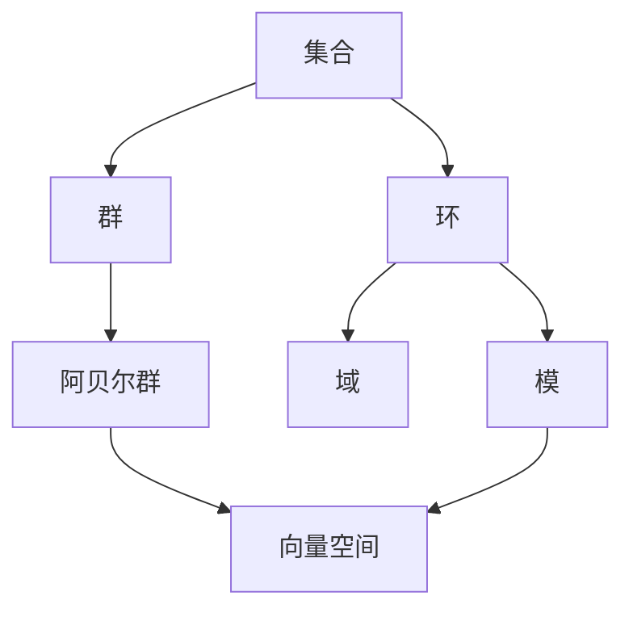

# 代数结构与理论总览

## 目录

- [代数结构与理论总览](#代数结构与理论总览)
  - [目录](#目录)
  - [1. 概述](#1-概述)
    - [1.1 代数学的历史发展](#11-代数学的历史发展)
    - [1.2 代数结构的基本思想](#12-代数结构的基本思想)
    - [1.3 现代代数学的特点](#13-现代代数学的特点)
  - [2. 核心代数结构](#2-核心代数结构)
    - [2.1 群论基础](#21-群论基础)
    - [2.2 环论基础](#22-环论基础)
    - [2.3 域论基础](#23-域论基础)
    - [2.4 模论基础](#24-模论基础)
    - [2.5 格论基础](#25-格论基础)
    - [2.6 范畴论基础](#26-范畴论基础)
  - [3. 代数结构间的关系](#3-代数结构间的关系)
    - [3.1 忘却函子与自由函子](#31-忘却函子与自由函子)
    - [3.2 伴随关系](#32-伴随关系)
    - [3.3 代数结构的层次性](#33-代数结构的层次性)
  - [4. 代数理论的应用](#4-代数理论的应用)
    - [4.1 在数学内部的应用](#41-在数学内部的应用)
    - [4.2 在计算机科学中的应用](#42-在计算机科学中的应用)
    - [4.3 在物理学中的应用](#43-在物理学中的应用)
  - [5. 现代发展方向](#5-现代发展方向)
    - [5.1 同调代数](#51-同调代数)
    - [5.2 表示论](#52-表示论)
    - [5.3 代数几何](#53-代数几何)
  - [6. 参考文献](#6-参考文献)

---

## 1. 概述

### 1.1 代数学的历史发展

代数学作为数学的一个核心分支，经历了从具体计算到抽象结构的漫长发展过程：

- **古典时期**：主要关注方程求解和数值计算
- **文艺复兴时期**：符号代数的引入，使代数成为独立的数学分支
- **19世纪**：群论、环论等抽象代数结构的出现
- **20世纪**：范畴论的发展，为代数学提供了统一的语言和工具
- **现代**：代数几何、表示论、同调代数等高级理论的发展

### 1.2 代数结构的基本思想

代数结构的核心思想是**抽象化**和**公理化**：

1. **抽象化**：从具体的数学对象中提取共同的结构特征
2. **公理化**：用精确的公理系统定义抽象结构
3. **结构研究**：研究结构本身的性质，而不依赖于具体实现

### 1.3 现代代数学的特点

现代代数学具有以下特点：

- **高度抽象**：关注结构而非具体对象
- **统一性**：范畴论提供了统一的语言
- **应用广泛**：在数学内外都有重要应用
- **理论深刻**：与拓扑、几何、数论等分支深度交叉

## 2. 核心代数结构

### 2.1 [群论基础](./01-群论基础.md)

群是最基本的代数结构之一，研究具有一个二元运算的集合：

- **基本概念**：群的定义、子群、正规子群
- **同态理论**：群同态、同构、核与像
- **群作用**：群在集合上的作用
- **有限群论**：西罗定理、有限单群分类

### 2.2 [环论基础](./02-环论基础.md)

环是具有两个二元运算的代数结构：

- **基本概念**：环的定义、子环、理想
- **环同态**：环同态、同构、核与像
- **商环理论**：理想与商环的对应关系
- **特殊环类**：整环、域、主理想环

### 2.3 [域论基础](./03-域论基础.md)

域是具有除法运算的环，是代数学的重要研究对象：

- **基本概念**：域的定义、子域、扩域
- **域扩张理论**：代数扩张、超越扩张
- **伽罗瓦理论**：伽罗瓦群、伽罗瓦对应
- **有限域**：有限域的结构与应用

### 2.4 [模论基础](./04-模论基础.md)

模是环上的"向量空间"，是代数学的核心概念：

- **基本概念**：模的定义、子模、商模
- **自由模**：自由模、基、维数
- **投射模与内射模**：同调代数的基础
- **张量积**：模的张量积运算

### 2.5 [格论基础](./05-格论基础.md)

格是具有两个二元运算的偏序集：

- **基本概念**：格的定义、子格、理想
- **分配格**：分配格的性质
- **布尔代数**：布尔代数的结构与应用
- **完全格**：完全格与不动点定理

### 2.6 [范畴论基础](./06-范畴论基础.md)

范畴论是现代代数学的统一语言：

- **基本概念**：范畴、对象、态射
- **函子**：协变函子、逆变函子
- **自然变换**：函子间的自然变换
- **极限与余极限**：范畴论的核心概念

## 3. 代数结构间的关系

### 3.1 忘却函子与自由函子

忘却函子将复杂的代数结构"忘却"为更简单的结构：

```haskell
-- 忘却函子的例子
forgetGroup :: Group a -> Set a
forgetRing :: Ring a -> AbelianGroup a
forgetModule :: Module R a -> AbelianGroup a
```

自由函子构造自由代数结构：

```haskell
-- 自由函子的例子
freeGroup :: Set a -> Group (FreeGroup a)
freeRing :: Set a -> Ring (FreeRing a)
freeModule :: Set a -> Module R (FreeModule R a)
```

### 3.2 伴随关系

忘却函子与自由函子通常构成伴随对：

```haskell
-- 伴随关系的例子
class (Functor F, Functor G) => Adjunction F G where
    unit :: a -> G (F a)
    counit :: F (G a) -> a
```

### 3.3 代数结构的层次性

代数结构形成自然的层次：



## 4. 代数理论的应用

### 4.1 在数学内部的应用

- **代数几何**：代数簇的研究
- **数论**：代数数论、椭圆曲线
- **拓扑学**：同伦论、同调论
- **表示论**：群表示、李代数表示

### 4.2 在计算机科学中的应用

- **密码学**：椭圆曲线密码、格密码
- **编码理论**：纠错码、代数编码
- **类型论**：范畴论在编程语言中的应用
- **数据库理论**：关系代数、查询优化

### 4.3 在物理学中的应用

- **量子力学**：群论在对称性研究中的应用
- **粒子物理**：李群、李代数
- **凝聚态物理**：晶体学群、拓扑绝缘体

## 5. 现代发展方向

### 5.1 同调代数

同调代数是研究代数结构"不变量"的理论：

- **链复形**：代数对象的链复形
- **同调群**：代数不变量
- **导出函子**：Ext、Tor函子
- **谱序列**：计算同调的工具

### 5.2 表示论

表示论研究代数结构在向量空间上的作用：

- **群表示**：有限群、李群的表示
- **李代数表示**：半单李代数的表示
- **量子群**：量子群的表示理论

### 5.3 代数几何

代数几何研究代数方程定义的几何对象：

- **代数簇**：仿射簇、射影簇
- **概形**：现代代数几何的语言
- **上同调**：代数几何的拓扑工具

## 6. 参考文献

### 6.1 经典教材

1. **Hungerford, T. W.** (1974). *Algebra*. Springer-Verlag.
2. **Lang, S.** (2002). *Algebra*. Springer-Verlag.
3. **Dummit, D. S., & Foote, R. M.** (2004). *Abstract Algebra*. Wiley.

### 6.2 范畴论教材

1. **Mac Lane, S.** (1998). *Categories for the Working Mathematician*. Springer-Verlag.
2. **Awodey, S.** (2010). *Category Theory*. Oxford University Press.

### 6.3 现代发展

1. **Eisenbud, D.** (1995). *Commutative Algebra with a View Toward Algebraic Geometry*. Springer-Verlag.
2. **Hartshorne, R.** (1977). *Algebraic Geometry*. Springer-Verlag.

---

**创建时间**: 2024-12-19  
**最后更新**: 2024-12-19  
**状态**: 完成  
**下一步**: 创建各个基础理论文档
