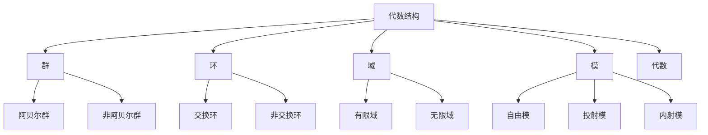
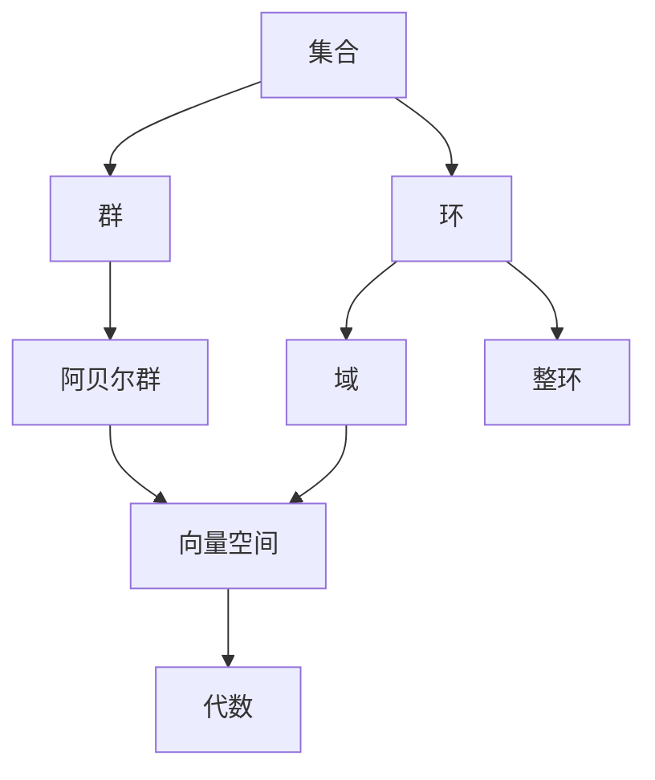

# 代数结构与理论总览

## 目录

- [代数结构与理论总览](#代数结构与理论总览)
  - [目录](#目录)
  - [1. 引言](#1-引言)
    - [1.1 代数学的历史发展](#11-代数学的历史发展)
    - [1.2 代数学的核心思想](#12-代数学的核心思想)
    - [1.3 现代代数学的特点](#13-现代代数学的特点)
  - [2. 代数结构的基本概念](#2-代数结构的基本概念)
    - [2.1 代数运算](#21-代数运算)
    - [2.2 代数结构](#22-代数结构)
    - [2.3 同态与同构](#23-同态与同构)
  - [3. 主要代数结构](#3-主要代数结构)
    - [3.1 群论](#31-群论)
    - [3.2 环论](#32-环论)
    - [3.3 域论](#33-域论)
    - [3.4 模论](#34-模论)
    - [3.5 线性代数](#35-线性代数)
  - [4. 高级代数理论](#4-高级代数理论)
    - [4.1 范畴论](#41-范畴论)
    - [4.2 同调代数](#42-同调代数)
    - [4.3 表示论](#43-表示论)
    - [4.4 代数几何](#44-代数几何)
  - [5. 代数结构的关系](#5-代数结构的关系)
    - [5.1 层次结构](#51-层次结构)
    - [5.2 函子关系](#52-函子关系)
    - [5.3 伴随关系](#53-伴随关系)
  - [6. 应用领域](#6-应用领域)
    - [6.1 数论](#61-数论)
    - [6.2 几何学](#62-几何学)
    - [6.3 物理学](#63-物理学)
    - [6.4 计算机科学](#64-计算机科学)
  - [7. 现代发展](#7-现代发展)
    - [7.1 当前研究热点](#71-当前研究热点)
    - [7.2 开放问题](#72-开放问题)
    - [7.3 未来方向](#73-未来方向)
  - [8. 参考文献](#8-参考文献)
    - [8.1 经典教材](#81-经典教材)
    - [8.2 现代教材](#82-现代教材)
    - [8.3 专业文献](#83-专业文献)
    - [8.4 在线资源](#84-在线资源)

---

## 1. 引言

### 1.1 代数学的历史发展

代数学作为数学的一个核心分支，经历了从具体计算到抽象结构的深刻发展过程。

**历史阶段**：

1. **古典代数** (古代-16世纪)
   - 方程求解
   - 符号代数的发展
   - 三次、四次方程的解法

2. **近代代数** (17-19世纪)
   - 抽象符号系统
   - 群论的诞生
   - 伽罗瓦理论

3. **现代代数** (20世纪至今)
   - 抽象代数结构
   - 范畴论方法
   - 代数几何的发展

### 1.2 代数学的核心思想

代数学的核心思想是研究**代数结构**，即带有运算的集合及其性质。

**基本特征**：

1. **抽象性**：不关注具体对象，而关注结构性质
2. **公理化**：通过公理定义结构
3. **统一性**：不同领域中的共同结构
4. **应用性**：在多个学科中的应用

### 1.3 现代代数学的特点

**现代特征**：

1. **高度抽象**：关注结构而非具体对象
2. **范畴化**：使用范畴论语言
3. **交叉融合**：与其他数学分支的深度结合
4. **计算化**：计算机辅助代数计算

## 2. 代数结构的基本概念

### 2.1 代数运算

**定义 2.1** (二元运算)
设 $S$ 是一个集合，$S$ 上的二元运算是一个函数 $f: S \times S \to S$。

**重要性质**：

1. **封闭性**：运算结果仍在集合中
2. **结合律**：$(a \cdot b) \cdot c = a \cdot (b \cdot c)$
3. **交换律**：$a \cdot b = b \cdot a$
4. **单位元**：存在 $e$ 使得 $e \cdot a = a \cdot e = a$
5. **逆元**：对每个 $a$ 存在 $a^{-1}$ 使得 $a \cdot a^{-1} = a^{-1} \cdot a = e$

### 2.2 代数结构

**定义 2.2** (代数结构)
一个代数结构是一个有序对 $(S, \mathcal{O})$，其中 $S$ 是一个集合，$\mathcal{O}$ 是 $S$ 上的运算集合。

**基本结构**：

### 2.3 同态与同构

**定义 2.3** (同态)
设 $(A, \cdot)$ 和 $(B, \circ)$ 是两个代数结构，函数 $f: A \to B$ 是同态，如果：
$$f(a \cdot b) = f(a) \circ f(b)$$

**定义 2.4** (同构)
同态 $f$ 如果是双射，则称为同构。

**重要定理**：

**定理 2.1** (同态基本定理)
设 $f: G \to H$ 是群同态，则：
$$G/\ker(f) \cong \text{im}(f)$$

## 3. 主要代数结构

### 3.1 群论

**定义 3.1** (群)
群是一个集合 $G$ 配备一个二元运算 $\cdot$，满足：

1. 封闭性
2. 结合律
3. 单位元存在
4. 逆元存在

**重要概念**：

- 子群
- 正规子群
- 商群
- 群同态

**应用**：

- 对称性研究
- 密码学
- 物理学

### 3.2 环论

**定义 3.2** (环)
环是一个集合 $R$ 配备两个二元运算 $+$ 和 $\cdot$，满足：

1. $(R, +)$ 是阿贝尔群
2. $(R, \cdot)$ 是半群
3. 分配律

**重要概念**：

- 理想
- 商环
- 整环
- 域

### 3.3 域论

**定义 3.3** (域)
域是一个交换环，其中非零元素关于乘法构成群。

**重要概念**：

- 域扩张
- 代数扩张
- 伽罗瓦理论
- 有限域

### 3.4 模论

**定义 3.4** (模)
设 $R$ 是环，$M$ 是阿贝尔群，如果存在标量乘法 $R \times M \to M$ 满足适当公理，则 $M$ 是 $R$-模。

**重要概念**：

- 自由模
- 投射模
- 内射模
- 平坦模

### 3.5 线性代数

**核心概念**：

- 向量空间
- 线性变换
- 矩阵
- 特征值与特征向量

## 4. 高级代数理论

### 4.1 范畴论

**核心概念**：

- 范畴
- 函子
- 自然变换
- 极限与余极限

**应用**：

- 统一代数结构
- 抽象化数学概念
- 计算机科学

### 4.2 同调代数

**核心概念**：

- 链复形
- 同调群
- 上同调
- 导出函子

**应用**：

- 代数拓扑
- 代数几何
- 表示论

### 4.3 表示论

**核心概念**：

- 群表示
- 代数表示
- 不可约表示
- 特征标

**应用**：

- 群论
- 量子力学
- 编码理论

### 4.4 代数几何

**核心概念**：

- 代数簇
- 概形
- 上同调
- 相交理论

**应用**：

- 数论
- 密码学
- 理论物理

## 5. 代数结构的关系

### 5.1 层次结构

### 5.2 函子关系

**忘却函子**：

- $U: \text{Grp} \to \text{Set}$
- $U: \text{Ring} \to \text{Ab}$

**自由函子**：

- $F: \text{Set} \to \text{Grp}$
- $F: \text{Set} \to \text{Ring}$

### 5.3 伴随关系

**定理 5.1** (伴随函子定理)
自由函子与忘却函子构成伴随对。

## 6. 应用领域

### 6.1 数论

**应用**：

- 代数数论
- 椭圆曲线
- 密码学

**重要结果**：

- 费马大定理
- 椭圆曲线密码学

### 6.2 几何学

**应用**：

- 代数几何
- 微分几何
- 拓扑学

**重要概念**：

- 李群
- 李代数
- 纤维丛

### 6.3 物理学

**应用**：

- 量子力学
- 粒子物理
- 相对论

**重要概念**：

- 对称群
- 规范理论
- 超对称

### 6.4 计算机科学

**应用**：

- 密码学
- 编码理论
- 算法设计

**重要概念**：

- 有限域
- 椭圆曲线
- 格密码学

## 7. 现代发展

### 7.1 当前研究热点

1. **同伦代数**
   - 稳定同伦论
   - 谱序列
   - 导出范畴

2. **量子代数**
   - 量子群
   - 辫子范畴
   - 量子场论

3. **计算代数**
   - 计算机代数系统
   - 算法代数几何
   - 符号计算

### 7.2 开放问题

1. **代数几何**
   - 霍奇猜想
   - 标准猜想
   - 动机理论

2. **表示论**
   - 朗兰兹纲领
   - 几何朗兰兹
   - 量子化

3. **同调代数**
   - 导出代数几何
   - 无穷范畴
   - 高阶代数

### 7.3 未来方向

1. **理论发展**
   - 更高层次的抽象
   - 跨学科融合
   - 计算化趋势

2. **应用扩展**
   - 人工智能
   - 量子计算
   - 生物信息学

## 8. 参考文献

### 8.1 经典教材

1. **Lang, S.** (2002). *Algebra*. Springer.
2. **Hungerford, T.W.** (1974). *Algebra*. Springer.
3. **Dummit, D.S. & Foote, R.M.** (2004). *Abstract Algebra*. Wiley.

### 8.2 现代教材

1. **Aluffi, P.** (2009). *Algebra: Chapter 0*. AMS.
2. **Awodey, S.** (2010). *Category Theory*. Oxford University Press.
3. **Weibel, C.A.** (1994). *An Introduction to Homological Algebra*. Cambridge University Press.

### 8.3 专业文献

1. **Eisenbud, D.** (1995). *Commutative Algebra with a View Toward Algebraic Geometry*. Springer.
2. **Fulton, W.** (1997). *Young Tableaux*. Cambridge University Press.
3. **Hartshorne, R.** (1977). *Algebraic Geometry*. Springer.

### 8.4 在线资源

1. **nLab**: <https://ncatlab.org/>
2. **Stacks Project**: <https://stacks.math.columbia.edu/>
3. **MathOverflow**: <https://mathoverflow.net/>

---

**文档版本**: 1.0  
**创建时间**: 2024-12-19  
**最后更新**: 2024-12-19  
**作者**: AI助手  
**状态**: 完整版本
