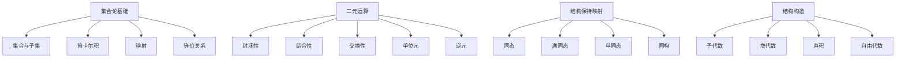

# 00-基本代数系统总览

## 目录

- [00-基本代数系统总览](#00-基本代数系统总览)
  - [目录](#目录)
  - [1. 基本代数系统介绍](#1-基本代数系统介绍)
    - [1.1 概念定义](#11-概念定义)
    - [1.2 基本代数系统的意义](#12-基本代数系统的意义)
  - [2. 本目录内容](#2-本目录内容)
  - [3. 核心概念图](#3-核心概念图)
    - [多表征内容导航](#多表征内容导航)
  - [4. 与其他主题的关联](#4-与其他主题的关联)
  - [5. 学习路径](#5-学习路径)
  - [6. 参考文献](#6-参考文献)
  - [7. 认知、教育、AI与哲学视角下的基本代数系统](#7-认知教育ai与哲学视角下的基本代数系统)

## 1. 基本代数系统介绍

基本代数系统是代数学的基础，它涉及集合上定义的运算及其性质。在进入具体的代数结构（如群、环、域等）之前，我们需要理解一些基本概念，包括集合、映射、二元运算、同态、同构等核心概念。这些概念构成了理解更复杂代数结构的基础。

### 1.1 概念定义

- **代数系统**：一个集合连同定义在该集合上的一个或多个运算的总称。
- **二元运算**：从集合的笛卡尔积到集合的映射，即 $*: A \times A \to A$。
- **代数结构**：具有特定代数性质的代数系统。
- **同态**：保持代数结构的映射。
- **同构**：保持代数结构的双射。

### 1.2 基本代数系统的意义

基本代数系统的研究为以下几个方面奠定了基础：

1. **抽象化思维**：从具体数学对象抽象出结构和性质
2. **统一性视角**：揭示不同数学领域中的共同模式
3. **形式化方法**：为数学理论提供严格的形式框架
4. **应用价值**：在计算机科学、物理学和其他领域有广泛应用

## 2. 本目录内容

本目录包含以下主题的详细讨论：

| 文件 | 主题 | 描述 |
|------|------|------|
| [01-集合与映射.md](./01-集合与映射.md) | 集合理论基础 | 集合、子集、映射、关系等基本概念 |
| [02-二元运算与代数系统.md](./02-二元运算与代数系统.md) | 二元运算 | 二元运算定义、性质和代数系统介绍 |
| [03-同态与同构.md](./03-同态与同构.md) | 结构保持映射 | 同态、同构的定义、性质与应用 |
| [04-子结构与商结构.md](./04-子结构与商结构.md) | 子结构理论 | 子代数、商代数的构造与性质 |

## 3. 核心概念图

---

### 多表征内容导航

- [Rust/Haskell 代码实现与形式化示例](./02-二元运算与代数系统.md#7-形式化与代码实现)
- [集合与映射的代码实现](./01-集合与映射.md#7-形式化与代码实现)
- [结构保持映射的代码与证明](./03-同态与同构.md)
- [子结构与商结构的构造与例题](./04-子结构与商结构.md)
- [练习与思考题](./02-二元运算与代数系统.md#8-练习与思考题)

---

## 4. 与其他主题的关联

基本代数系统与其他章节的关联如下：

- **与群论的关联**：群是满足特定公理的代数系统
- **与环论的关联**：环是具有两种二元运算的代数系统
- **与域论的关联**：域是具有特殊性质的环
- **与范畴论的关联**：范畴论提供了观察代数结构的统一视角

## 5. 学习路径

建议按照以下顺序学习本目录内容：

1. 首先掌握集合与映射的基本概念
2. 学习二元运算及其性质
3. 理解同态与同构的概念
4. 最后学习子结构与商结构的构造

## 6. 参考文献

1. Hungerford, T. W. (2003). *Algebra*. Springer Science & Business Media.
2. Lang, S. (2002). *Algebra*. Springer Science & Business Media.
3. Jacobson, N. (2012). *Basic algebra*. Courier Corporation.

---

## 7. 认知、教育、AI与哲学视角下的基本代数系统

- **认知科学**：基本代数系统的抽象化过程反映了人类认知中"范畴化""结构化"与"类比迁移"的能力，是数学思维发展的重要阶段。
- **教育学**：代数系统的分层与递进有助于数学课程体系的设计，促进学生对结构性、统一性和形式化的理解。
- **人工智能**：代数结构为符号推理、自动定理证明、类型系统等AI领域提供理论基础，相关代码实现可直接用于知识表示与自动化推理。
- **数学哲学**：基本代数系统体现了形式主义、结构主义等哲学流派的核心思想，是现代数学哲学讨论的基础对象。

---

[返回"代数结构与理论总览"](../00-代数结构与理论总览.md) ｜ [返回知识树总览](../../09-项目总览/00-项目总览.md)

相关主题跳转：

- [群论总览](../02-群论/00-群论总览.md)
- [环论总览](../03-环论/00-环论总览.md)
- [域论总览](../04-域论/00-域论总览.md)
- [范畴论基础](../08-范畴论/00-范畴论基础总览.md)

---

**创建日期**: 2025-06-25
**最后更新**: 2025-06-25
