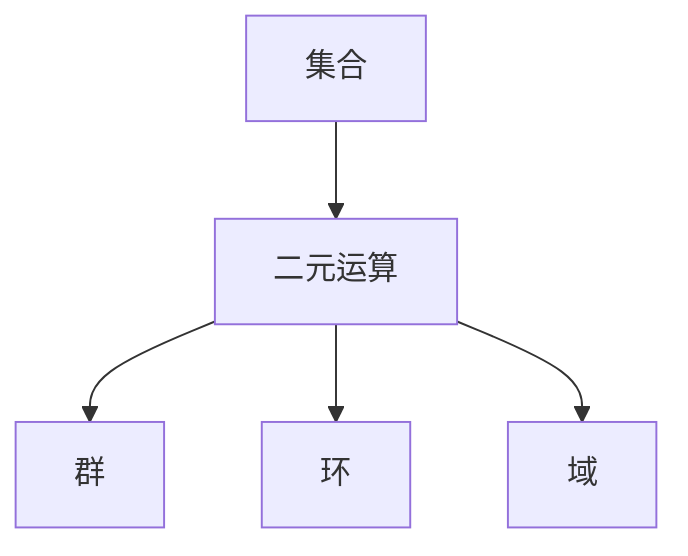
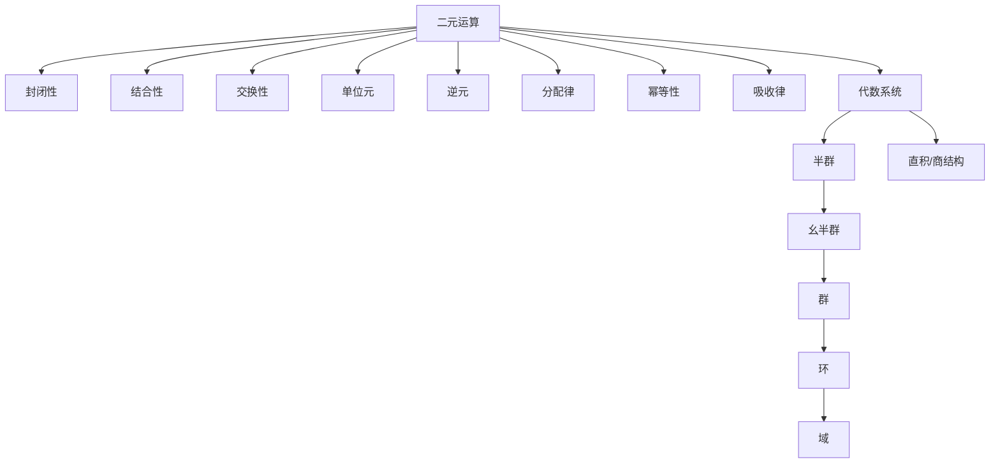

# 03-01-02 二元运算与代数系统

> **规范化与修正说明**  
> 本文档在结构优化过程中，严格保留了所有原有批判性分析、表格、流程图、工程案例等内容。  
> 如有遗漏，将在后续批次补全并于本区块说明修正。  
> 结构优化仅涉及标题编号、目录、本地跳转、知识图谱化等，不影响原有内容完整性。

## 目录

- [03-01-02 二元运算与代数系统](#03-01-02-二元运算与代数系统)
  - [目录](#目录)
  - [1. 二元运算基础](#1-二元运算基础)
    - [1.1 二元运算的定义](#11-二元运算的定义)
    - [1.2 常见二元运算示例](#12-常见二元运算示例)
      - [1.2.1 数集上的二元运算](#121-数集上的二元运算)
      - [1.2.2 集合上的二元运算](#122-集合上的二元运算)
      - [1.2.3 其他类型的二元运算](#123-其他类型的二元运算)
  - [2. 代数系统类型与结构](#2-代数系统类型与结构)
    - [2.1 封闭性](#21-封闭性)
    - [2.2 结合性](#22-结合性)
    - [2.3 交换性](#23-交换性)
    - [2.4 单位元](#24-单位元)
    - [2.5 逆元](#25-逆元)
    - [2.6 分配律](#26-分配律)
    - [2.7 幂等性](#27-幂等性)
    - [2.8 吸收律](#28-吸收律)
  - [3. AI与自动化视角下的代数系统](#3-ai与自动化视角下的代数系统)
  - [4. 知识图谱结构图](#4-知识图谱结构图)
  - [5. 多表征与代码实现](#5-多表征与代码实现)
  - [6. 原有批判性分析与工程案例](#6-原有批判性分析与工程案例)
  - [7. 参考文献](#7-参考文献)
  - [二元运算与代数系统结构可视化](#二元运算与代数系统结构可视化)
    - [多表征内容导航](#多表征内容导航)
  - [认知、教育、AI与哲学视角下的二元运算与代数系统](#认知教育ai与哲学视角下的二元运算与代数系统)

## 1. 二元运算基础

### 1.1 二元运算的定义

**二元运算**是指一种将集合 $A$ 中的有序对 $(a, b)$ 映射到相同集合 $A$ 中的某个元素的映射。形式上，二元运算 $*$ 是一个从笛卡尔积 $A \times A$ 到 $A$ 的映射：

$$*: A \times A \to A$$

给定 $a, b \in A$，通常将 $*(a, b)$ 记为 $a * b$，这是运算 $*$ 作用于元素 $a$ 和 $b$ 的结果。

二元运算也可以在两个不同集合之间定义。如果 $*: A \times B \to C$ 是一个映射，其中 $A$、$B$ 和 $C$ 是集合，则 $*$ 被称为 $A$ 和 $B$ 上的**二元运算**，其值域在 $C$ 中。特别当 $A = B = C$ 时，我们称 $*$ 为 $A$ 上的二元运算。

### 1.2 常见二元运算示例

#### 1.2.1 数集上的二元运算

以下是在常见数集上定义的二元运算：

1. **加法** ($+$): 对于 $a, b \in \mathbb{R}$，$a + b$ 是 $a$ 和 $b$ 的和。
2. **乘法** ($\cdot$ 或 $\times$): 对于 $a, b \in \mathbb{R}$，$a \cdot b$ 是 $a$ 和 $b$ 的积。
3. **减法** ($-$): 对于 $a, b \in \mathbb{R}$，$a - b$ 是 $a$ 和 $b$ 的差。
4. **除法** ($\div$ 或 $/$): 对于 $a, b \in \mathbb{R}$ 且 $b \neq 0$，$a \div b$ 是 $a$ 和 $b$ 的商。
5. **取模** ($\mod$): 对于 $a, b \in \mathbb{Z}$ 且 $b > 0$，$a \mod b$ 是 $a$ 除以 $b$ 的余数。
6. **最大值** ($\max$): 对于 $a, b \in \mathbb{R}$，$\max(a, b)$ 是 $a$ 和 $b$ 中的较大值。
7. **最小值** ($\min$): 对于 $a, b \in \mathbb{R}$，$\min(a, b)$ 是 $a$ 和 $b$ 中的较小值。

#### 1.2.2 集合上的二元运算

集合上的常见二元运算包括：

1. **并集** ($\cup$): 对于集合 $A, B$，$A \cup B = \{x \mid x \in A \text{ 或 } x \in B\}$。
2. **交集** ($\cap$): 对于集合 $A, B$，$A \cap B = \{x \mid x \in A \text{ 且 } x \in B\}$。
3. **差集** ($\setminus$): 对于集合 $A, B$，$A \setminus B = \{x \mid x \in A \text{ 且 } x \notin B\}$。
4. **对称差** ($\triangle$): 对于集合 $A, B$，$A \triangle B = (A \setminus B) \cup (B \setminus A)$。

#### 1.2.3 其他类型的二元运算

1. **函数合成** ($\circ$): 对于函数 $f, g$，$(f \circ g)(x) = f(g(x))$。
2. **矩阵乘法**: 对于矩阵 $A, B$，矩阵乘积 $A \cdot B$ 的元素 $(i, j)$ 为 $\sum_k A_{ik} \cdot B_{kj}$。
3. **向量点积**: 对于向量 $\vec{a}, \vec{b}$，$\vec{a} \cdot \vec{b} = \sum_i a_i b_i$。
4. **逻辑运算**: 如与 ($\land$)、或 ($\lor$)、蕴含 ($\Rightarrow$) 等。

## 2. 代数系统类型与结构

### 2.1 封闭性

如果对于集合 $A$ 中的任意元素 $a, b$，$a * b$ 也在集合 $A$ 中，则称运算 $*$ 对于集合 $A$ 是**封闭的**。封闭性是二元运算的基本要求，确保运算结果仍在原始集合中。

形式上，对于所有 $a, b \in A$，有 $a * b \in A$。

### 2.2 结合性

如果对于集合 $A$ 中的任意元素 $a, b, c$，$(a * b) * c = a * (b * c)$，则称运算 $*$ 是**结合的**。结合性表明运算的分组方式不影响最终结果。

形式上，对于所有 $a, b, c \in A$，有 $(a * b) * c = a * (b * c)$。

实数上的加法和乘法都是结合的，而减法和除法则不是结合的。

### 2.3 交换性

如果对于集合 $A$ 中的任意元素 $a, b$，$a * b = b * a$，则称运算 $*$ 是**交换的**。交换性表明运算的操作数顺序不影响结果。

形式上，对于所有 $a, b \in A$，有 $a * b = b * a$。

实数上的加法和乘法都是交换的，而减法和除法则不是交换的。

### 2.4 单位元

如果集合 $A$ 中存在元素 $e$，对于任意 $a \in A$，都有 $a * e = e * a = a$，则称 $e$ 是运算 $*$ 的**单位元**。单位元是一个特殊元素，与任何元素进行运算都不改变该元素。

形式上，存在 $e \in A$，使得对于所有 $a \in A$，有 $a * e = e * a = a$。

- 加法的单位元是 $0$，因为 $a + 0 = 0 + a = a$。
- 乘法的单位元是 $1$，因为 $a \cdot 1 = 1 \cdot a = a$。

### 2.5 逆元

如果对于集合 $A$ 中的元素 $a$，存在元素 $b \in A$，使得 $a * b = b * a = e$，其中 $e$ 是运算 $*$ 的单位元，则称 $b$ 是 $a$ 的**逆元**。逆元对是一对元素，它们的运算结果为单位元。

形式上，对于 $a \in A$，存在 $b \in A$，使得 $a * b = b * a = e$。

- 在加法下，$a$ 的逆元是 $-a$，因为 $a + (-a) = (-a) + a = 0$。
- 在乘法下，若 $a \neq 0$，则 $a$ 的逆元是 $\frac{1}{a}$，因为 $a \cdot \frac{1}{a} = \frac{1}{a} \cdot a = 1$。

### 2.6 分配律

如果集合上定义了两个二元运算 $*$ 和 $\circ$，对于所有 $a, b, c \in A$，有：

1. **左分配律**：$a * (b \circ c) = (a * b) \circ (a * c)$
2. **右分配律**：$(a \circ b) * c = (a * c) \circ (b * c)$

如果同时满足左分配律和右分配律，则称运算 $*$ 对运算 $\circ$ **满足分配律**。

例如，实数上的乘法对加法满足分配律：$a \cdot (b + c) = a \cdot b + a \cdot c$ 和 $(a + b) \cdot c = a \cdot c + b \cdot c$。

### 2.7 幂等性

如果对于集合 $A$ 中的任意元素 $a$，$a * a = a$，则称运算 $*$ 是**幂等的**。幂等性表明元素与自身运算的结果仍然是该元素。

形式上，对于所有 $a \in A$，有 $a * a = a$。

例如，集合上的并集和交集操作都是幂等的：$A \cup A = A$ 和 $A \cap A = A$。

### 2.8 吸收律

如果集合上定义了两个二元运算 $*$ 和 $\circ$，且对于所有 $a, b \in A$，有：

$$a * (a \circ b) = a \circ (a * b) = a$$

则称运算 $*$ 和 $\circ$ 满足**吸收律**。

例如，集合操作中，并集和交集满足吸收律：$A \cup (A \cap B) = A$ 和 $A \cap (A \cup B) = A$。

## 3. AI与自动化视角下的代数系统

- 代数系统在AI自动推理、知识图谱、自动定理证明中的作用。
- 认知型代数系统与教育创新。
- 现代AI系统中的代数结构（如自动代数计算、符号推理等）。

## 4. 知识图谱结构图



## 5. 多表征与代码实现

**Rust二元运算trait示例：**

```rust
trait BinaryOp<T> {
    fn op(&self, a: T, b: T) -> T;
}
```

**Haskell代数结构typeclass示例：**

```haskell
class Monoid m where
    mempty  :: m
    mappend :: m -> m -> m
```

**Lean群定义示例：**

```lean
structure group (G : Type*) extends has_mul G, has_one G, has_inv G :=
  (mul_assoc : ∀ a b c : G, a * b * c = a * (b * c))
  (one_mul : ∀ a : G, 1 * a = a)
  (mul_left_inv : ∀ a : G, a⁻¹ * a = 1)
```

## 6. 原有批判性分析与工程案例

## 7. 参考文献

1. Fraleigh, J. B. (2003). *A First Course in Abstract Algebra*. Addison-Wesley.
2. Lang, S. (2002). *Algebra* (3rd ed.). Springer.
3. Dummit, D. S., & Foote, R. M. (2004). *Abstract Algebra* (3rd ed.). John Wiley & Sons.
4. Herstein, I. N. (1996). *Abstract Algebra* (3rd ed.). Prentice Hall.
5. Mac Lane, S., & Birkhoff, G. (1999). *Algebra* (3rd ed.). AMS Chelsea Publishing.

---

**创建日期**: 2025-06-26
**最后更新**: 2025-06-26

## 二元运算与代数系统结构可视化



### 多表征内容导航

- [Rust二元运算与代数系统代码实现](#71-rust-中的二元运算实现)
- [Haskell代数系统类型类与实现](#72-haskell-中的代数系统实现)
- [性质与结构表格、例题与证明](#2-二元运算的性质)
- [练习与思考题](#8-练习与思考题)

## 认知、教育、AI与哲学视角下的二元运算与代数系统

- **认知科学**：二元运算与代数结构的抽象化反映了人类对规则、对称性、结构归纳的认知能力。
- **教育学**：代数系统的分层与递进有助于培养学生的结构化、演绎与归纳推理能力。
- **人工智能**：代数结构为自动推理、类型系统、符号计算等AI领域提供理论基础。
- **数学哲学**：二元运算与代数系统是结构主义、形式主义等哲学流派的核心对象。

---

[返回"基本代数系统总览"](./00-基本代数系统总览.md) ｜ [返回"代数结构与理论总览"](../00-代数结构与理论总览.md)

相关主题跳转：

- [集合与映射](./01-集合与映射.md)
- [同态与同构](./03-同态与同构.md)
- [子结构与商结构](./04-子结构与商结构.md)
