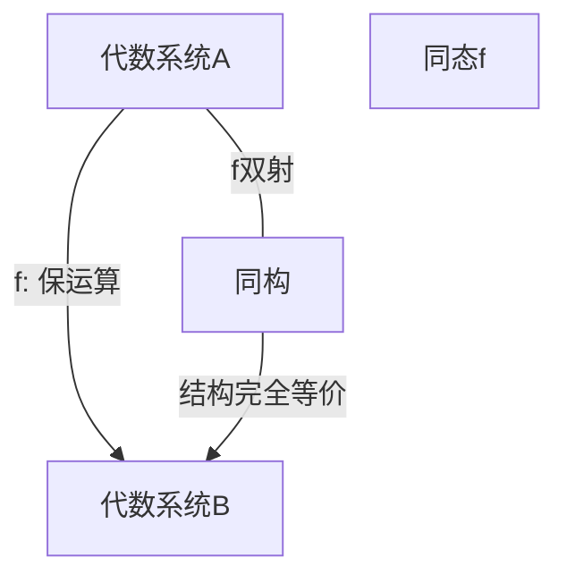

# 03-同态与同构

## 目录

- [03-同态与同构](#03-同态与同构)
  - [目录](#目录)
  - [1. 基本定义](#1-基本定义)
    - [1.1 同态](#11-同态)
    - [1.2 同构](#12-同构)
  - [2. 性质与定理](#2-性质与定理)
  - [3. 结构可视化](#3-结构可视化)
  - [4. 代码实现示例](#4-代码实现示例)
    - [4.1 Rust](#41-rust)
    - [4.2 Haskell](#42-haskell)
  - [5. 例题与证明](#5-例题与证明)
  - [6. 认知、教育、AI与哲学视角](#6-认知教育ai与哲学视角)
  - [7. 参考文献](#7-参考文献)
  - [8. 跳转与导航](#8-跳转与导航)

---

## 1. 基本定义

### 1.1 同态

**同态**是保持代数结构运算的映射。设 $(A, *)$ 和 $(B, \circ)$ 是两个代数系统，$f: A \to B$ 是同态，当且仅当：
$$
\forall a_1, a_2 \in A,\quad f(a_1 * a_2) = f(a_1) \circ f(a_2)
$$

### 1.2 同构

**同构**是双射的同态。即 $f: A \to B$ 是同构，当且仅当 $f$ 是同态且双射。此时 $A$ 与 $B$ 在代数结构上"完全等价"。

---

## 2. 性质与定理

- 同态的核与像：群同态的核是正规子群，环同态的核是理想。
- 同构的传递性与对称性。
- 基本同构定理（群、环、模等）。
- 保结构性：同态保持单位元、逆元、结合性等。

---

## 3. 结构可视化



---

## 4. 代码实现示例

### 4.1 Rust

```rust
// 群同态示例
trait Group {
    fn op(&self, other: &Self) -> Self;
    fn identity() -> Self;
    fn inverse(&self) -> Self;
}

fn is_homomorphism<G: Group, H: Group, F>(f: F, a: &G, b: &G) -> bool
where F: Fn(&G) -> H {
    f(&a.op(b)) == f(a).op(&f(b))
}
```

### 4.2 Haskell

```haskell
class Group a where
    op :: a -> a -> a
    identity :: a
    inverse :: a -> a

type Hom a b = a -> b
isHom :: (Group a, Group b, Eq b) => Hom a b -> a -> a -> Bool
isHom f x y = f (op x y) == op (f x) (f y)
```

---

## 5. 例题与证明

1. 证明：整数加法到模n加法的自然映射是群同态。
2. 证明：有限群的同构关系是等价关系。
3. 例：构造两个非同构的四阶群。

---

## 6. 认知、教育、AI与哲学视角

- **认知科学**：同态/同构反映了人类对"结构相似性""类比迁移"的认知能力。
- **教育学**：同构思想有助于学生理解"本质等价"与"模型迁移"。
- **人工智能**：同构检测、结构匹配广泛用于知识图谱、自动推理、类型系统等。
- **数学哲学**：同构是结构主义哲学的核心，强调"结构而非对象本身"的本体论。

---

## 7. 参考文献

1. Dummit, D. S., & Foote, R. M. (2004). *Abstract Algebra*.
2. Lang, S. (2002). *Algebra*.
3. Mac Lane, S., & Birkhoff, G. (1999). *Algebra*.

---

## 8. 跳转与导航

[返回"基本代数系统总览"](./00-基本代数系统总览.md) ｜ [返回"代数结构与理论总览"](../00-代数结构与理论总览.md)

相关主题跳转：

- [集合与映射](./01-集合与映射.md)
- [二元运算与代数系统](./02-二元运算与代数系统.md)
- [子结构与商结构](./04-子结构与商结构.md)
