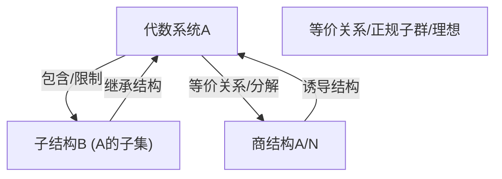

# 04-子结构与商结构

## 目录

- [04-子结构与商结构](#04-子结构与商结构)
  - [目录](#目录)
  - [1. 基本定义](#1-基本定义)
    - [1.1 子结构](#11-子结构)
    - [1.2 商结构](#12-商结构)
  - [2. 性质与定理](#2-性质与定理)
  - [3. 结构可视化](#3-结构可视化)
  - [4. 代码实现示例](#4-代码实现示例)
    - [4.1 Rust](#41-rust)
    - [4.2 Haskell](#42-haskell)
  - [5. 例题与证明](#5-例题与证明)
  - [6. 认知、教育、AI与哲学视角](#6-认知教育ai与哲学视角)
  - [7. 参考文献](#7-参考文献)
  - [8. 跳转与导航](#8-跳转与导航)

---

## 1. 基本定义

### 1.1 子结构

**子结构**是指在代数系统 $(A, *)$ 的子集 $B \subseteq A$ 上，运算 $*$ 的限制仍使 $(B, *)$ 成为同类型的代数系统。

- 群的子结构：子群
- 环的子结构：子环
- 域的子结构：子域
- 模的子结构：子模

### 1.2 商结构

**商结构**是指通过等价关系（如正规子群、理想等）将代数系统"折叠"为等价类集合，并在其上诱导出新的代数结构。

- 群的商结构：商群 $G/N$
- 环的商结构：商环 $R/I$
- 模的商结构：商模 $M/N$

---

## 2. 性质与定理

- 子结构的封闭性与继承性
- 商结构的良定义性（运算在等价类上良定义）
- 第一同构定理（群、环、模等）
- 子结构与商结构的层次关系

---

## 3. 结构可视化



---

## 4. 代码实现示例

### 4.1 Rust

```rust
// 群的子群判定
fn is_subgroup<G: Group>(h: &Vec<G>, g_op: fn(&G, &G) -> G, id: &G, inv: fn(&G) -> G) -> bool {
    // 检查单位元、封闭性、逆元
    h.contains(id)
        && h.iter().all(|a| h.iter().all(|b| h.contains(&g_op(a, b))))
        && h.iter().all(|a| h.contains(&inv(a)))
}
```

### 4.2 Haskell

```haskell
isSubgroup :: (Eq a, Group a) => [a] -> Bool
isSubgroup h = identity `elem` h
    && all (\a -> all (\b -> op a b `elem` h) h) h
    && all (\a -> inverse a `elem` h) h
```

---

## 5. 例题与证明

1. 证明：整数加法群的 $n\mathbb{Z}$ 是其子群。
2. 证明：$\mathbb{Z}/n\mathbb{Z}$ 是商群。
3. 例：构造一个非平凡的环的理想与商环。

---

## 6. 认知、教育、AI与哲学视角

- **认知科学**：子结构/商结构反映了人类对"部分-整体""归约-抽象"的认知能力。
- **教育学**：子结构与商结构的层次性有助于学生理解结构递进与分解。
- **人工智能**：商结构思想用于知识压缩、等价类归约、范畴化等AI任务。
- **数学哲学**：子结构/商结构体现了结构主义的"层次性"与"同构归约"思想。

---

## 7. 参考文献

1. Dummit, D. S., & Foote, R. M. (2004). *Abstract Algebra*.
2. Lang, S. (2002). *Algebra*.
3. Mac Lane, S., & Birkhoff, G. (1999). *Algebra*.

---

## 8. 跳转与导航

[返回"基本代数系统总览"](./00-基本代数系统总览.md) ｜ [返回"代数结构与理论总览"](../00-代数结构与理论总览.md)

相关主题跳转：

- [集合与映射](./01-集合与映射.md)
- [二元运算与代数系统](./02-二元运算与代数系统.md)
- [同态与同构](./03-同态与同构.md)
