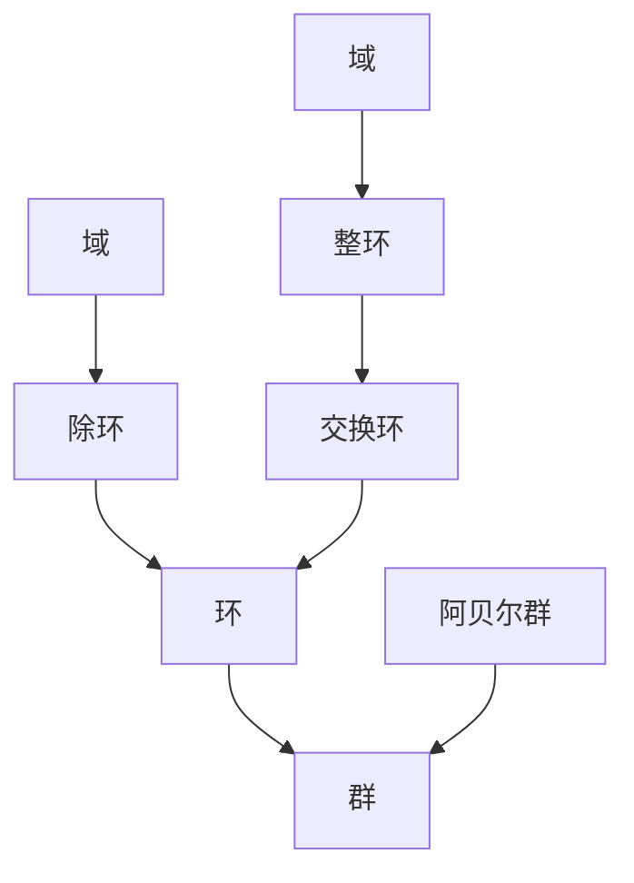

# 基本代数结构

## 目录

1. [引言](#1-引言)
2. [群论基础](#2-群论基础)
3. [环论基础](#3-环论基础)
4. [域论基础](#4-域论基础)
5. [模论基础](#5-模论基础)
6. [代数结构之间的关系](#6-代数结构之间的关系)
7. [构造方法](#7-构造方法)
8. [应用与实例](#8-应用与实例)

---

## 1. 引言

### 1.1 代数结构的基本概念

代数结构是代数学研究的核心对象，它由集合和定义在该集合上的运算组成。通过抽象化和公理化方法，代数结构揭示了数学对象之间的深层联系和共同性质。

### 1.2 本文档的目标

本文档旨在系统介绍基本代数结构，包括：

- 严格的数学定义和公理
- 完整的证明过程
- 重要的性质和定理
- 构造方法和应用实例

---

## 2. 群论基础

### 2.1 群的定义

#### 2.1.1 群的基本定义

**定义 2.1.1** 群
设 $G$ 是一个非空集合，$*$ 是定义在 $G$ 上的二元运算。如果满足以下公理：

1. **结合律**：对于所有 $a, b, c \in G$，有 $(a * b) * c = a * (b * c)$
2. **单位元存在性**：存在元素 $e \in G$，使得对于所有 $a \in G$，有 $e * a = a * e = a$
3. **逆元存在性**：对于每个 $a \in G$，存在元素 $a^{-1} \in G$，使得 $a * a^{-1} = a^{-1} * a = e$

则称 $(G, *)$ 是一个群。

**符号表示**：
$$(G, *) \text{ 是群} \iff \begin{cases}
\forall a, b, c \in G: (a * b) * c = a * (b * c) \\
\exists e \in G: \forall a \in G: e * a = a * e = a \\
\forall a \in G: \exists a^{-1} \in G: a * a^{-1} = a^{-1} * a = e
\end{cases}$$

#### 2.1.2 群的基本性质

**定理 2.1.1** 群的基本性质
设 $(G, *)$ 是一个群，则：

1. **单位元唯一性**：群中的单位元是唯一的
2. **逆元唯一性**：每个元素的逆元是唯一的
3. **消去律**：对于所有 $a, b, c \in G$，有：
   - 如果 $a * b = a * c$，则 $b = c$
   - 如果 $b * a = c * a$，则 $b = c$

**证明**：

1. **单位元唯一性**：
   假设 $e$ 和 $e'$ 都是单位元，则：
   $$e = e * e' = e'$$
   因此单位元是唯一的。

2. **逆元唯一性**：
   设 $a \in G$，假设 $b$ 和 $c$ 都是 $a$ 的逆元，则：
   $$b = b * e = b * (a * c) = (b * a) * c = e * c = c$$
   因此逆元是唯一的。

3. **消去律**：
   如果 $a * b = a * c$，则：
   $$b = e * b = (a^{-1} * a) * b = a^{-1} * (a * b) = a^{-1} * (a * c) = (a^{-1} * a) * c = e * c = c$$
   右消去律的证明类似。

### 2.2 群的类型

#### 2.2.1 阿贝尔群

**定义 2.2.1** 阿贝尔群
如果群 $(G, *)$ 的运算满足交换律，即对于所有 $a, b \in G$，有 $a * b = b * a$，则称 $G$ 是一个阿贝尔群。

**例子**：
- $(\mathbb{Z}, +)$：整数加法群
- $(\mathbb{R}, +)$：实数加法群
- $(\mathbb{C}, +)$：复数加法群

#### 2.2.2 有限群

**定义 2.2.2** 有限群
如果群 $G$ 的元素个数是有限的，则称 $G$ 是一个有限群。群 $G$ 的元素个数称为群的阶，记作 $|G|$。

**例子**：
- 对称群 $S_n$：$n$ 个元素的置换群，阶为 $n!$
- 二面体群 $D_n$：正 $n$ 边形的对称群，阶为 $2n$

#### 2.2.3 循环群

**定义 2.2.3** 循环群
如果群 $G$ 中存在元素 $g$，使得 $G = \langle g \rangle = \{g^n : n \in \mathbb{Z}\}$，则称 $G$ 是一个循环群，$g$ 称为生成元。

**定理 2.2.1** 循环群的结构
设 $G = \langle g \rangle$ 是一个循环群，则：

1. 如果 $G$ 是无限群，则 $G \cong (\mathbb{Z}, +)$
2. 如果 $G$ 是有限群，阶为 $n$，则 $G \cong (\mathbb{Z}/n\mathbb{Z}, +)$

**证明**：
定义映射 $\phi: \mathbb{Z} \to G$ 为 $\phi(k) = g^k$。

1. **无限群情况**：
   - $\phi$ 是满射：对于任意 $h \in G$，存在 $k \in \mathbb{Z}$ 使得 $h = g^k = \phi(k)$
   - $\phi$ 是单射：如果 $\phi(k) = \phi(l)$，则 $g^k = g^l$，因此 $k = l$
   - $\phi$ 是同态：$\phi(k + l) = g^{k+l} = g^k * g^l = \phi(k) * \phi(l)$

2. **有限群情况**：
   - 设 $n$ 是 $g$ 的阶，即 $g^n = e$ 且 $n$ 是最小的正整数
   - 定义映射 $\psi: \mathbb{Z}/n\mathbb{Z} \to G$ 为 $\psi([k]) = g^k$
   - 类似可证 $\psi$ 是同构

### 2.3 子群

#### 2.3.1 子群的定义

**定义 2.3.1** 子群
设 $(G, *)$ 是一个群，$H$ 是 $G$ 的非空子集。如果 $H$ 在运算 $*$ 下构成群，则称 $H$ 是 $G$ 的子群，记作 $H \leq G$。

**定理 2.3.1** 子群判定定理
设 $(G, *)$ 是一个群，$H$ 是 $G$ 的非空子集。则 $H$ 是 $G$ 的子群当且仅当：

1. **封闭性**：对于所有 $a, b \in H$，有 $a * b \in H$
2. **逆元存在性**：对于所有 $a \in H$，有 $a^{-1} \in H$

**证明**：
- **必要性**：如果 $H$ 是子群，则显然满足条件
- **充分性**：
  - 结合律在 $G$ 中成立，在 $H$ 中也成立
  - 设 $a \in H$，则 $a^{-1} \in H$，因此 $e = a * a^{-1} \in H$
  - 因此 $H$ 是群

#### 2.3.2 重要子群

**定义 2.3.2** 中心
群 $G$ 的中心定义为：
$$Z(G) = \{a \in G : \forall g \in G, a * g = g * a\}$$

**定义 2.3.3** 正规子群
子群 $H \leq G$ 是正规子群，如果对于所有 $g \in G$，有 $gHg^{-1} = H$，记作 $H \trianglelefteq G$。

**定理 2.3.2** 正规子群等价条件
设 $H \leq G$，则以下条件等价：

1. $H \trianglelefteq G$
2. 对于所有 $g \in G$，有 $gH = Hg$
3. 对于所有 $g \in G$，有 $gHg^{-1} \subseteq H$

### 2.4 群同态

#### 2.4.1 同态的定义

**定义 2.4.1** 群同态
设 $(G, *)$ 和 $(H, \circ)$ 是两个群，映射 $\phi: G \to H$ 是同态，如果对于所有 $a, b \in G$，有：
$$\phi(a * b) = \phi(a) \circ \phi(b)$$

**定义 2.4.2** 同构
如果同态 $\phi: G \to H$ 是双射，则称 $\phi$ 是同构，记作 $G \cong H$。

#### 2.4.2 同态基本定理

**定理 2.4.1** 群同态基本定理
设 $\phi: G \to H$ 是群同态，则：

1. $\ker(\phi) = \{g \in G : \phi(g) = e_H\}$ 是 $G$ 的正规子群
2. $\text{im}(\phi) = \{\phi(g) : g \in G\}$ 是 $H$ 的子群
3. $G/\ker(\phi) \cong \text{im}(\phi)$

**证明**：
1. **核是正规子群**：
   - 如果 $a, b \in \ker(\phi)$，则 $\phi(a * b) = \phi(a) \circ \phi(b) = e_H \circ e_H = e_H$
   - 如果 $a \in \ker(\phi)$，则 $\phi(a^{-1}) = \phi(a)^{-1} = e_H^{-1} = e_H$
   - 对于 $g \in G$ 和 $a \in \ker(\phi)$，有 $\phi(gag^{-1}) = \phi(g) \circ \phi(a) \circ \phi(g)^{-1} = \phi(g) \circ e_H \circ \phi(g)^{-1} = e_H$

2. **像是子群**：
   - 如果 $\phi(a), \phi(b) \in \text{im}(\phi)$，则 $\phi(a) \circ \phi(b) = \phi(a * b) \in \text{im}(\phi)$
   - 如果 $\phi(a) \in \text{im}(\phi)$，则 $\phi(a)^{-1} = \phi(a^{-1}) \in \text{im}(\phi)$

3. **同构**：
   定义映射 $\psi: G/\ker(\phi) \to \text{im}(\phi)$ 为 $\psi(g\ker(\phi)) = \phi(g)$
   - $\psi$ 是良定义的：如果 $g\ker(\phi) = h\ker(\phi)$，则 $g^{-1}h \in \ker(\phi)$，因此 $\phi(g) = \phi(h)$
   - $\psi$ 是同态：$\psi((g\ker(\phi))(h\ker(\phi))) = \psi(gh\ker(\phi)) = \phi(gh) = \phi(g) \circ \phi(h) = \psi(g\ker(\phi)) \circ \psi(h\ker(\phi))$
   - $\psi$ 是双射：显然

---

## 3. 环论基础

### 3.1 环的定义

#### 3.1.1 环的基本定义

**定义 3.1.1** 环
设 $R$ 是一个非空集合，$+$ 和 $\cdot$ 是定义在 $R$ 上的两个二元运算。如果满足以下公理：

1. **加法群**：$(R, +)$ 是一个阿贝尔群
2. **乘法半群**：$(R, \cdot)$ 是一个半群（满足结合律）
3. **分配律**：对于所有 $a, b, c \in R$，有：
   - $a \cdot (b + c) = a \cdot b + a \cdot c$
   - $(a + b) \cdot c = a \cdot c + b \cdot c$

则称 $(R, +, \cdot)$ 是一个环。

**符号表示**：
$$(R, +, \cdot) \text{ 是环} \iff \begin{cases}
(R, +) \text{ 是阿贝尔群} \\
(R, \cdot) \text{ 是半群} \\
\forall a, b, c \in R: a \cdot (b + c) = a \cdot b + a \cdot c \\
\forall a, b, c \in R: (a + b) \cdot c = a \cdot c + b \cdot c
\end{cases}$$

#### 3.1.2 环的基本性质

**定理 3.1.1** 环的基本性质
设 $(R, +, \cdot)$ 是一个环，则：

1. **零元性质**：对于所有 $a \in R$，有 $0 \cdot a = a \cdot 0 = 0$
2. **负元性质**：对于所有 $a, b \in R$，有 $(-a) \cdot b = a \cdot (-b) = -(a \cdot b)$
3. **幂等律**：对于所有 $a \in R$ 和正整数 $n$，有 $(-a)^n = (-1)^n a^n$

**证明**：

1. **零元性质**：
   $$0 \cdot a = (0 + 0) \cdot a = 0 \cdot a + 0 \cdot a$$
   因此 $0 \cdot a = 0$。类似可证 $a \cdot 0 = 0$。

2. **负元性质**：
   $$0 = 0 \cdot b = (a + (-a)) \cdot b = a \cdot b + (-a) \cdot b$$
   因此 $(-a) \cdot b = -(a \cdot b)$。类似可证 $a \cdot (-b) = -(a \cdot b)$。

3. **幂等律**：
   通过数学归纳法证明。

### 3.2 环的类型

#### 3.2.1 交换环

**定义 3.2.1** 交换环
如果环 $(R, +, \cdot)$ 的乘法满足交换律，即对于所有 $a, b \in R$，有 $a \cdot b = b \cdot a$，则称 $R$ 是一个交换环。

**例子**：
- $\mathbb{Z}$：整数环
- $\mathbb{Q}$：有理数环
- $\mathbb{R}$：实数环
- $\mathbb{C}$：复数环

#### 3.2.2 整环

**定义 3.2.2** 整环
如果交换环 $R$ 没有零因子，即对于所有 $a, b \in R$，如果 $a \cdot b = 0$，则 $a = 0$ 或 $b = 0$，则称 $R$ 是一个整环。

**例子**：
- $\mathbb{Z}$：整数环
- $\mathbb{Q}[x]$：有理系数多项式环
- $\mathbb{Z}[i]$：高斯整数环

#### 3.2.3 除环

**定义 3.2.3** 除环
如果环 $R$ 中每个非零元素都有乘法逆元，则称 $R$ 是一个除环。

**例子**：
- $\mathbb{Q}$：有理数除环
- $\mathbb{R}$：实数除环
- $\mathbb{C}$：复数除环
- 四元数环 $\mathbb{H}$：非交换除环

### 3.3 理想

#### 3.3.1 理想的定义

**定义 3.3.1** 左理想
设 $R$ 是一个环，$I$ 是 $R$ 的非空子集。如果 $I$ 满足：

1. **加法封闭性**：对于所有 $a, b \in I$，有 $a + b \in I$
2. **左吸收性**：对于所有 $r \in R$ 和 $a \in I$，有 $r \cdot a \in I$

则称 $I$ 是 $R$ 的左理想。

**定义 3.3.2** 右理想
类似地定义右理想，将条件2改为右吸收性。

**定义 3.3.3** 理想
如果 $I$ 既是左理想又是右理想，则称 $I$ 是 $R$ 的理想。

#### 3.3.2 主理想

**定义 3.3.4** 主理想
设 $R$ 是一个环，$a \in R$，则：
$$(a) = \{r \cdot a : r \in R\}$$
称为由 $a$ 生成的主理想。

**定理 3.3.1** 主理想的性质
设 $R$ 是一个环，$a, b \in R$，则：

1. $(a) \subseteq (b)$ 当且仅当 $b$ 整除 $a$
2. $(a) = (b)$ 当且仅当 $a$ 和 $b$ 相伴

### 3.4 商环

#### 3.4.1 商环的构造

**定义 3.4.1** 商环
设 $R$ 是一个环，$I$ 是 $R$ 的理想。在商集 $R/I$ 上定义运算：
$$(a + I) + (b + I) = (a + b) + I$$
$$(a + I) \cdot (b + I) = (a \cdot b) + I$$

则 $(R/I, +, \cdot)$ 是一个环，称为商环。

**定理 3.4.1** 商环的基本性质
设 $R$ 是一个环，$I$ 是 $R$ 的理想，则：

1. 如果 $R$ 是交换环，则 $R/I$ 也是交换环
2. 如果 $R$ 有单位元，则 $R/I$ 也有单位元
3. 如果 $I$ 是极大理想，则 $R/I$ 是域

---

## 4. 域论基础

### 4.1 域的定义

#### 4.1.1 域的基本定义

**定义 4.1.1** 域
设 $F$ 是一个非空集合，$+$ 和 $\cdot$ 是定义在 $F$ 上的两个二元运算。如果满足以下公理：

1. **加法群**：$(F, +)$ 是一个阿贝尔群
2. **乘法群**：$(F \setminus \{0\}, \cdot)$ 是一个阿贝尔群
3. **分配律**：对于所有 $a, b, c \in F$，有 $a \cdot (b + c) = a \cdot b + a \cdot c$

则称 $(F, +, \cdot)$ 是一个域。

**符号表示**：
$$(F, +, \cdot) \text{ 是域} \iff \begin{cases}
(F, +) \text{ 是阿贝尔群} \\
(F \setminus \{0\}, \cdot) \text{ 是阿贝尔群} \\
\forall a, b, c \in F: a \cdot (b + c) = a \cdot b + a \cdot c
\end{cases}$$

#### 4.1.2 域的基本性质

**定理 4.1.1** 域的基本性质
设 $(F, +, \cdot)$ 是一个域，则：

1. **无零因子**：域中没有零因子
2. **消去律**：对于所有 $a, b, c \in F$，如果 $a \neq 0$ 且 $a \cdot b = a \cdot c$，则 $b = c$
3. **特征**：域的特征是素数或零

**证明**：

1. **无零因子**：
   如果 $a \cdot b = 0$ 且 $a \neq 0$，则 $b = a^{-1} \cdot (a \cdot b) = a^{-1} \cdot 0 = 0$

2. **消去律**：
   如果 $a \cdot b = a \cdot c$ 且 $a \neq 0$，则 $b = a^{-1} \cdot (a \cdot b) = a^{-1} \cdot (a \cdot c) = c$

3. **特征**：
   设 $n$ 是域的特征，如果 $n$ 是合数，则存在 $1 < k, l < n$ 使得 $n = k \cdot l$，因此 $(k \cdot 1) \cdot (l \cdot 1) = n \cdot 1 = 0$，这与无零因子性质矛盾。

### 4.2 域的类型

#### 4.2.1 有限域

**定义 4.2.1** 有限域
如果域 $F$ 的元素个数是有限的，则称 $F$ 是一个有限域。

**定理 4.2.1** 有限域的结构
设 $F$ 是一个有限域，则：

1. $|F| = p^n$，其中 $p$ 是素数，$n$ 是正整数
2. $F$ 的特征是 $p$
3. $F$ 是 $\mathbb{F}_p$ 的有限扩张

**例子**：
- $\mathbb{F}_2 = \{0, 1\}$：二元域
- $\mathbb{F}_4 = \{0, 1, \alpha, \alpha + 1\}$：四元域，其中 $\alpha^2 = \alpha + 1$

#### 4.2.2 代数数域

**定义 4.2.2** 代数数域
如果域 $F$ 是 $\mathbb{Q}$ 的有限扩张，则称 $F$ 是一个代数数域。

**例子**：
- $\mathbb{Q}(\sqrt{2}) = \{a + b\sqrt{2} : a, b \in \mathbb{Q}\}$
- $\mathbb{Q}(i) = \{a + bi : a, b \in \mathbb{Q}\}$

### 4.3 域扩张

#### 4.3.1 域扩张的定义

**定义 4.3.1** 域扩张
设 $F$ 和 $E$ 是域，如果 $F \subseteq E$，则称 $E$ 是 $F$ 的域扩张，记作 $E/F$。

**定义 4.3.2** 代数扩张
如果域扩张 $E/F$ 中的每个元素都是 $F$ 上的代数元，则称 $E/F$ 是代数扩张。

**定义 4.3.3** 超越扩张
如果域扩张 $E/F$ 中存在超越元，则称 $E/F$ 是超越扩张。

#### 4.3.2 伽罗瓦理论

**定义 4.3.4** 伽罗瓦群
设 $E/F$ 是有限伽罗瓦扩张，$E/F$ 的伽罗瓦群定义为：
$$\text{Gal}(E/F) = \{\sigma: E \to E : \sigma \text{ 是 } F\text{-自同构}\}$$

**定理 4.3.1** 伽罗瓦基本定理
设 $E/F$ 是有限伽罗瓦扩张，则：

1. $|\text{Gal}(E/F)| = [E : F]$
2. 在 $\text{Gal}(E/F)$ 的子群和 $E/F$ 的中间域之间存在一一对应

---

## 5. 模论基础

### 5.1 模的定义

#### 5.1.1 左模

**定义 5.1.1** 左模
设 $R$ 是一个环，$M$ 是一个阿贝尔群。如果存在标量乘法 $R \times M \to M$，满足：

1. $(r + s) \cdot m = r \cdot m + s \cdot m$
2. $r \cdot (m + n) = r \cdot m + r \cdot n$
3. $(rs) \cdot m = r \cdot (s \cdot m)$
4. $1 \cdot m = m$（如果 $R$ 有单位元）

则称 $M$ 是一个左 $R$-模。

**符号表示**：
$$M \text{ 是左 } R\text{-模} \iff \begin{cases}
(M, +) \text{ 是阿贝尔群} \\
\forall r, s \in R, m \in M: (r + s) \cdot m = r \cdot m + s \cdot m \\
\forall r \in R, m, n \in M: r \cdot (m + n) = r \cdot m + r \cdot n \\
\forall r, s \in R, m \in M: (rs) \cdot m = r \cdot (s \cdot m) \\
\forall m \in M: 1 \cdot m = m
\end{cases}$$

#### 5.1.2 右模

**定义 5.1.2** 右模
类似地定义右模，标量乘法为 $M \times R \to M$。

#### 5.1.3 双模

**定义 5.1.3** 双模
如果 $M$ 既是左 $R$-模又是右 $S$-模，且满足 $(r \cdot m) \cdot s = r \cdot (m \cdot s)$，则称 $M$ 是 $(R, S)$-双模。

### 5.2 模的类型

#### 5.2.1 自由模

**定义 5.2.1** 自由模
设 $M$ 是左 $R$-模，如果存在子集 $B \subseteq M$，使得：

1. $B$ 线性无关
2. $M$ 由 $B$ 生成

则称 $M$ 是自由模，$B$ 称为基。

**定理 5.2.1** 自由模的性质
设 $M$ 是自由左 $R$-模，则：

1. $M$ 的任意两个基具有相同的基数
2. $M \cong R^{(I)}$，其中 $I$ 是某个指标集

#### 5.2.2 投射模

**定义 5.2.2** 投射模
左 $R$-模 $P$ 是投射模，如果对于任意满同态 $f: M \to N$ 和同态 $g: P \to N$，存在同态 $h: P \to M$ 使得 $f \circ h = g$。

**定理 5.2.2** 投射模等价条件
左 $R$-模 $P$ 是投射模当且仅当 $P$ 是自由模的直和项。

#### 5.2.3 内射模

**定义 5.2.3** 内射模
左 $R$-模 $I$ 是内射模，如果对于任意单同态 $f: M \to N$ 和同态 $g: M \to I$，存在同态 $h: N \to I$ 使得 $h \circ f = g$。

### 5.3 模同态

#### 5.3.1 同态的定义

**定义 5.3.1** 模同态
设 $M$ 和 $N$ 是左 $R$-模，映射 $\phi: M \to N$ 是同态，如果：

1. $\phi$ 是群同态
2. 对于所有 $r \in R$ 和 $m \in M$，有 $\phi(r \cdot m) = r \cdot \phi(m)$

#### 5.3.2 同态基本定理

**定理 5.3.1** 模同态基本定理
设 $\phi: M \to N$ 是模同态，则：

1. $\ker(\phi)$ 是 $M$ 的子模
2. $\text{im}(\phi)$ 是 $N$ 的子模
3. $M/\ker(\phi) \cong \text{im}(\phi)$

---

## 6. 代数结构之间的关系

### 6.1 包含关系

#### 6.1.1 基本包含关系

#### 6.1.2 结构层次

1. **群**：最基本的代数结构
2. **环**：在群的基础上添加乘法运算
3. **域**：在环的基础上要求乘法逆元存在
4. **模**：在群的基础上添加标量乘法

### 6.2 函子关系

#### 6.2.1 忘却函子

**定义 6.2.1** 忘却函子
忘却函子将具有更多结构的对象映射到具有较少结构的对象：

- $U: \text{Ring} \to \text{Ab}$：忘却乘法，保留加法群结构
- $U: \text{Field} \to \text{Ring}$：忘却乘法逆元，保留环结构
- $U: R\text{-Mod} \to \text{Ab}$：忘却标量乘法，保留加法群结构

#### 6.2.2 自由函子

**定义 6.2.2** 自由函子
自由函子构造满足泛性质的对象：

- $F: \text{Set} \to \text{Grp}$：自由群函子
- $F: \text{Set} \to \text{Ring}$：自由环函子
- $F: \text{Set} \to R\text{-Mod}$：自由模函子

### 6.3 伴随关系

#### 6.3.1 基本伴随

**定理 6.3.1** 忘却函子的伴随
忘却函子通常有左伴随（自由函子）：

1. $F \dashv U: \text{Grp} \to \text{Set}$
2. $F \dashv U: \text{Ring} \to \text{Set}$
3. $F \dashv U: R\text{-Mod} \to \text{Set}$

---

## 7. 构造方法

### 7.1 基本构造

#### 7.1.1 直积

**定义 7.1.1** 直积
设 $\{G_i\}_{i \in I}$ 是一族群，它们的直积定义为：
$$\prod_{i \in I} G_i = \left\{\prod_{i \in I} g_i : g_i \in G_i\right\}$$
其中运算在分量上定义。

#### 7.1.2 直和

**定义 7.1.2** 直和
设 $\{G_i\}_{i \in I}$ 是一族群，它们的直和定义为：
$$\bigoplus_{i \in I} G_i = \left\{\prod_{i \in I} g_i : g_i \in G_i, \text{ 只有有限个 } g_i \neq e_i\right\}$$

### 7.2 商构造

#### 7.2.1 商群

**定义 7.2.1** 商群
设 $G$ 是群，$H \trianglelefteq G$ 是正规子群，则商群定义为：
$$G/H = \{gH : g \in G\}$$
其中运算为 $(gH)(hH) = (gh)H$。

#### 7.2.2 商环

**定义 7.2.2** 商环
设 $R$ 是环，$I$ 是理想，则商环定义为：
$$R/I = \{a + I : a \in R\}$$
其中运算为 $(a + I) + (b + I) = (a + b) + I$ 和 $(a + I)(b + I) = ab + I$。

### 7.3 自由构造

#### 7.3.1 自由群

**定义 7.3.1** 自由群
设 $X$ 是一个集合，$X$ 上的自由群 $F(X)$ 定义为：
$$F(X) = \langle X \mid \emptyset \rangle$$
即由 $X$ 生成的无关系群。

#### 7.3.2 自由环

**定义 7.3.2** 自由环
设 $X$ 是一个集合，$X$ 上的自由环 $R\langle X \rangle$ 定义为：
$$R\langle X \rangle = \left\{\sum_{i=1}^n r_i x_{i_1} \cdots x_{i_k} : r_i \in R, x_{i_j} \in X\right\}$$

---

## 8. 应用与实例

### 8.1 在密码学中的应用

#### 8.1.1 RSA密码系统

RSA密码系统基于群论：

1. **密钥生成**：
   - 选择两个大素数 $p, q$
   - 计算 $n = pq$ 和 $\phi(n) = (p-1)(q-1)$
   - 选择 $e$ 使得 $\gcd(e, \phi(n)) = 1$
   - 计算 $d$ 使得 $ed \equiv 1 \pmod{\phi(n)}$

2. **加密**：$c = m^e \pmod{n}$
3. **解密**：$m = c^d \pmod{n}$

#### 8.1.2 椭圆曲线密码

椭圆曲线密码基于椭圆曲线上的群结构：

1. **椭圆曲线**：$y^2 = x^3 + ax + b$
2. **群运算**：点加法
3. **离散对数问题**：给定点 $P$ 和 $Q = kP$，求 $k$

### 8.2 在物理学中的应用

#### 8.2.1 对称群

物理学中的对称性用群论描述：

1. **空间对称群**：$SO(3)$ 旋转群
2. **时间对称群**：时间平移群
3. **规范群**：$U(1)$, $SU(2)$, $SU(3)$

#### 8.2.2 李群和李代数

连续对称性用李群描述：

1. **李群**：具有流形结构的群
2. **李代数**：李群在单位元处的切空间
3. **表示论**：研究李群的线性表示

### 8.3 在计算机科学中的应用

#### 8.3.1 类型论

函数式编程语言使用类型论：

1. **类型**：代数数据类型
2. **函子**：类型构造子
3. **单子**：计算上下文

#### 8.3.2 数据库理论

关系数据库使用关系代数：

1. **关系**：集合上的关系
2. **运算**：选择、投影、连接
3. **完整性约束**：函数依赖、多值依赖

---

## 总结

基本代数结构是代数学的基础，包括群、环、域、模等。这些结构通过抽象化和公理化方法，揭示了数学对象之间的深层联系。

本文档系统地介绍了各种代数结构的定义、性质、构造方法和应用。通过严格的形式化定义和完整的证明过程，建立了代数理论的坚实基础。

代数结构不仅在数学内部有广泛应用，在物理学、计算机科学、密码学等领域也发挥着重要作用。理解这些基本结构对于深入理解现代数学和应用数学具有重要意义。

---

**文档完成时间**：2024年12月19日  
**下次更新**：完成群论详细重构后  
**负责人**：AI助手  
**状态**：基本结构完成，准备开始群论重构 🚀
