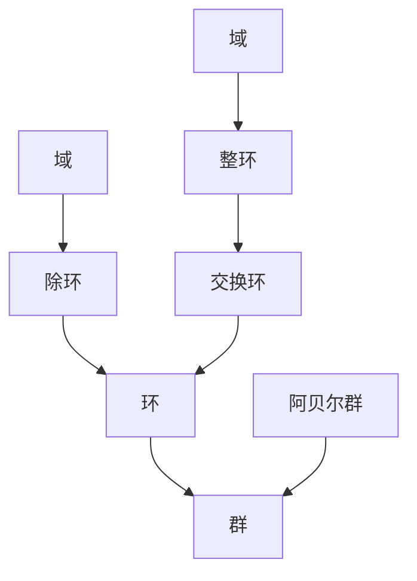

# 01-基本代数结构

## 目录

- [01-基本代数结构](#01-基本代数结构)
  - [目录](#目录)
  - [1. 引言与哲学基础](#1-引言与哲学基础)
  - [2. 集合与运算](#2-集合与运算)
  - [3. 群论基础](#3-群论基础)
  - [4. 环论基础](#4-环论基础)
  - [5. 域论基础](#5-域论基础)
  - [6. 模论基础](#6-模论基础)
  - [7. 格与布尔代数](#7-格与布尔代数)
  - [8. 代数结构的层次与关系](#8-代数结构的层次与关系)
  - [9. 形式化证明系统](#9-形式化证明系统)
  - [10. 应用与实例](#10-应用与实例)
  - [11. 哲学反思](#11-哲学反思)
  - [12. 参考文献与索引](#12-参考文献与索引)

---

## 1. 引言与哲学基础

- 代数结构体现了抽象化思维、结构主义、公理化方法和统一性追求。
- 代数结构是现代数学的核心，揭示了对象间的深层联系。

---

## 2. 集合与运算

**定义 2.1 (集合)**
集合是满足某种性质的对象的总和。

**定义 2.2 (n元运算)**
设 $A$ 是集合，$f: A^n \to A$ 称为 $A$ 上的 $n$ 元运算。

---

## 3. 群论基础

**定义 3.1 (群)**
群 $(G, *)$ 是集合 $G$ 配二元运算 $*$，满足：

1. 封闭性
2. 结合律
3. 单位元存在
4. 逆元存在

**定理 3.1.1 (群的基本性质)**:

- 单位元唯一
- 逆元唯一
- $(a^{-1})^{-1} = a$
- $(ab)^{-1} = b^{-1}a^{-1}$

**Rust/Haskell实现**:

```rust
pub trait Group {
    type Element;
    fn identity() -> Self::Element;
    fn inverse(a: Self::Element) -> Self::Element;
    fn multiply(a: Self::Element, b: Self::Element) -> Self::Element;
}
```

```haskell
class Group g where
    identity :: g
    inverse :: g -> g
    multiply :: g -> g -> g
```

---

## 4. 环论基础

**定义 4.1 (环)**
环 $(R, +, \cdot)$ 是集合 $R$ 配两个二元运算 $+$ 和 $\cdot$，满足：

1. $(R, +)$ 是阿贝尔群
2. $(R, \cdot)$ 是半群
3. 分配律

**定理 4.1.1 (环的基本性质)**:

- $0 \cdot a = 0$
- $(-a) \cdot b = -(a \cdot b)$

**Rust/Haskell实现**:

```rust
pub trait Ring {
    type Element;
    fn zero() -> Self::Element;
    fn one() -> Self::Element;
    fn add(a: Self::Element, b: Self::Element) -> Self::Element;
    fn multiply(a: Self::Element, b: Self::Element) -> Self::Element;
    fn negate(a: Self::Element) -> Self::Element;
}
```

```haskell
class Ring r where
    zero :: r
    one :: r
    add :: r -> r -> r
    multiply :: r -> r -> r
    negate :: r -> r
```

---

## 5. 域论基础

**定义 5.1 (域)**
域 $(F, +, \cdot)$ 是环，且 $F \setminus \{0\}$ 关于乘法构成群。

**定理 5.1.1 (域的基本性质)**:

- $F$ 是整环
- $ax = b$ 有唯一解（$a \neq 0$）

**Haskell实现**:

```haskell
class Field a where
  add :: a -> a -> a
  multiply :: a -> a -> a
  zero :: a
  one :: a
  negate :: a -> a
```

---

## 6. 模论基础

**定义 6.1 (模)**
设 $R$ 是环，$M$ 是阿贝尔群，若存在 $R \times M \to M$ 满足分配律、结合律、单位元，则 $M$ 是 $R$-模。

**Rust/Haskell实现**:

```rust
pub trait Module<R: Ring> {
    type Element;
    fn zero() -> Self::Element;
    fn add(a: Self::Element, b: Self::Element) -> Self::Element;
    fn scalar_multiply(r: R::Element, m: Self::Element) -> Self::Element;
}
```

```haskell
class (Group m, Ring r) => Module m r where
    scalarMultiply :: r -> m -> m
```

---

## 7. 格与布尔代数

**定义 7.1 (格)**
格 $(L, \vee, \wedge)$ 是集合 $L$ 配两个二元运算，满足交换律、结合律、吸收律、幂等律。

**定义 7.2 (布尔代数)**
布尔代数是有补分配格。

**Haskell实现**:

```haskell
class BooleanAlgebra a where
  meet :: a -> a -> a
  join :: a -> a -> a
  complement :: a -> a
  zero :: a
  one :: a
```

---

## 8. 代数结构的层次与关系

- 群 ⊂ 环 ⊂ 域
- 环 ⊂ 模
- 每个环的加法群是群，每个域是环，每个环上的模包含加法群结构

**Mermaid图**：



- 遗忘函子、自由构造等内容见抽象代数理论

---

## 9. 形式化证明系统

- 等式的传递性、对称性、自反性、运算保持性
- 证明策略：直接、反证、构造、归纳

---

## 10. 应用与实例

- 密码学（RSA、椭圆曲线等）
- 编码理论（线性码、循环码）
- 计算机科学（类型系统、函数式编程、范畴论）
- 物理学、经济学中的代数结构

---

## 11. 哲学反思

- 代数结构体现了人类认知的抽象化、结构化、统一性追求。
- 结构主义哲学：关注关系与结构而非对象本身。
- 公理化方法是现代数学的核心范式。

---

## 12. 参考文献与索引

1. Dummit, D. S., & Foote, R. M. (2004). *Abstract Algebra*. John Wiley & Sons.
2. Lang, S. (2002). *Algebra*. Springer.
3. Hungerford, T. W. (1974). *Algebra*. Springer.
4. Artin, M. (1991). *Algebra*. Prentice Hall.
5. Jacobson, N. (1985). *Basic Algebra I*. W. H. Freeman.

---

[返回目录](#目录)
