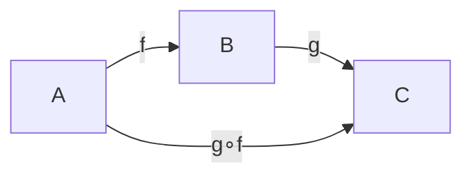

# 范畴论基础

## 目录

- [范畴论基础](#范畴论基础)
  - [目录](#目录)
  - [1. 引言](#1-引言)
    - [1.1 范畴论的历史背景](#11-范畴论的历史背景)
    - [1.2 范畴论的核心思想](#12-范畴论的核心思想)
    - [1.3 范畴论的重要性](#13-范畴论的重要性)
  - [2. 基本概念](#2-基本概念)
    - [2.1 范畴 (Category)](#21-范畴-category)
      - [2.1.1 定义](#211-定义)
      - [2.1.2 符号表示](#212-符号表示)
      - [2.1.3 图形表示](#213-图形表示)
    - [2.2 函子 (Functor)](#22-函子-functor)
      - [2.2.1 定义](#221-定义)
      - [2.2.2 协变与逆变函子](#222-协变与逆变函子)
    - [2.3 自然变换 (Natural Transformation)](#23-自然变换-natural-transformation)
      - [2.3.1 定义](#231-定义)
  - [3. 核心结构](#3-核心结构)
    - [3.1 极限与余极限](#31-极限与余极限)
      - [3.1.1 极限](#311-极限)
      - [3.1.2 余极限](#312-余极限)
    - [3.2 伴随函子](#32-伴随函子)
      - [3.2.1 定义](#321-定义)
    - [3.3 泛性质](#33-泛性质)
      - [3.3.1 定义](#331-定义)
  - [4. 重要性质](#4-重要性质)
    - [4.1 范畴的等价](#41-范畴的等价)
      - [4.1.1 定义](#411-定义)
    - [4.2 可表函子](#42-可表函子)
      - [4.2.1 定义](#421-定义)
  - [5. 应用与实例](#5-应用与实例)
    - [5.1 集合范畴](#51-集合范畴)
    - [5.2 群范畴](#52-群范畴)
    - [5.3 环范畴](#53-环范畴)
    - [5.4 模范畴](#54-模范畴)
  - [6. 形式化证明](#6-形式化证明)
    - [6.1 基本定理](#61-基本定理)
    - [6.2 伴随函子的性质](#62-伴随函子的性质)
  - [7. 程序实现](#7-程序实现)
    - [7.1 Rust实现](#71-rust实现)
    - [7.2 Haskell实现](#72-haskell实现)
  - [8. 参考文献](#8-参考文献)
    - [8.1 经典教材](#81-经典教材)
    - [8.2 研究论文](#82-研究论文)
    - [8.3 在线资源](#83-在线资源)

---

## 1. 引言

### 1.1 范畴论的历史背景

范畴论由 Samuel Eilenberg 和 Saunders Mac Lane 在20世纪40年代创立，最初是为了给代数拓扑中的"自然性"概念提供严格的数学基础。它迅速发展成为一种描述数学结构和它们之间关系的普适语言。

### 1.2 范畴论的核心思想

范畴论的核心思想是：**重要的不是对象本身，而是对象之间的关系（态射）以及这些关系的组合方式。** 它提供了一个高层次的视角，使得我们能够发现不同数学分支中深藏的相似结构和统一模式。

### 1.3 范畴论的重要性

- **统一性**：为不同数学分支提供统一的语言
- **抽象性**：提供最高层次的抽象框架
- **应用性**：在计算机科学、物理学等领域有重要应用

## 2. 基本概念

### 2.1 范畴 (Category)

#### 2.1.1 定义

**定义 2.1.1** (范畴)
一个**范畴** $\mathcal{C}$ 由以下数据组成：

1. **对象类** $\text{Ob}(\mathcal{C})$：一个类，其元素称为**对象**
2. **态射类** $\text{Mor}(\mathcal{C})$：对于每对对象 $A, B \in \text{Ob}(\mathcal{C})$，存在一个集合 $\text{Hom}_{\mathcal{C}}(A, B)$，其元素称为从 $A$ 到 $B$ 的**态射**
3. **复合运算**：对于对象 $A, B, C$ 和态射 $f: A \to B$, $g: B \to C$，存在复合态射 $g \circ f: A \to C$
4. **单位态射**：对于每个对象 $A$，存在单位态射 $1_A: A \to A$

这些数据必须满足以下公理：

**结合律**：对于态射 $f: A \to B$, $g: B \to C$, $h: C \to D$，
$$(h \circ g) \circ f = h \circ (g \circ f)$$

**单位律**：对于态射 $f: A \to B$，
$$1_B \circ f = f = f \circ 1_A$$

#### 2.1.2 符号表示

- 对象：$A, B, C, \ldots$
- 态射：$f: A \to B$, $g: B \to C$
- 复合：$g \circ f: A \to C$
- 单位态射：$1_A: A \to A$

#### 2.1.3 图形表示



### 2.2 函子 (Functor)

#### 2.2.1 定义

**定义 2.2.1** (函子)
设 $\mathcal{C}$ 和 $\mathcal{D}$ 为范畴。一个**函子** $F: \mathcal{C} \to \mathcal{D}$ 由以下数据组成：

1. **对象映射**：$F: \text{Ob}(\mathcal{C}) \to \text{Ob}(\mathcal{D})$
2. **态射映射**：对于每对对象 $A, B \in \mathcal{C}$，存在映射
   $$F: \text{Hom}_{\mathcal{C}}(A, B) \to \text{Hom}_{\mathcal{D}}(F(A), F(B))$$

这些映射必须满足：

**保持复合**：对于态射 $f: A \to B$, $g: B \to C$，
$$F(g \circ f) = F(g) \circ F(f)$$

**保持单位**：对于对象 $A$，
$$F(1_A) = 1_{F(A)}$$

#### 2.2.2 协变与逆变函子

**定义 2.2.2** (协变函子)
上述定义的函子称为**协变函子**。

**定义 2.2.3** (逆变函子)
一个**逆变函子** $F: \mathcal{C} \to \mathcal{D}$ 满足：
$$F: \text{Hom}_{\mathcal{C}}(A, B) \to \text{Hom}_{\mathcal{D}}(F(B), F(A))$$

### 2.3 自然变换 (Natural Transformation)

#### 2.3.1 定义

**定义 2.3.1** (自然变换)
设 $F, G: \mathcal{C} \to \mathcal{D}$ 为函子。一个**自然变换** $\eta: F \Rightarrow G$ 是一族态射 $\{\eta_A: F(A) \to G(A)\}_{A \in \mathcal{C}}$，使得对于任意态射 $f: A \to B$，下图交换：

```mermaid
graph LR
    F(A) -->|η_A| G(A)
    F(A) -->|F(f)| F(B)
    F(B) -->|η_B| G(B)
    G(A) -->|G(f)| G(B)
```

即：$\eta_B \circ F(f) = G(f) \circ \eta_A$

## 3. 核心结构

### 3.1 极限与余极限

#### 3.1.1 极限

**定义 3.1.1** (极限)
设 $F: \mathcal{J} \to \mathcal{C}$ 为函子。$F$ 的**极限**是一个对象 $L \in \mathcal{C}$ 和一族态射 $\{\pi_j: L \to F(j)\}_{j \in \mathcal{J}}$，满足：

1. 对于 $\mathcal{J}$ 中的任意态射 $f: j \to k$，有 $F(f) \circ \pi_j = \pi_k$
2. 对于任意对象 $X$ 和态射族 $\{x_j: X \to F(j)\}_{j \in \mathcal{J}}$，存在唯一态射 $u: X \to L$ 使得 $\pi_j \circ u = x_j$ 对所有 $j$ 成立

#### 3.1.2 余极限

**定义 3.1.2** (余极限)
设 $F: \mathcal{J} \to \mathcal{C}$ 为函子。$F$ 的**余极限**是一个对象 $C \in \mathcal{C}$ 和一族态射 $\{\iota_j: F(j) \to C\}_{j \in \mathcal{J}}$，满足：

1. 对于 $\mathcal{J}$ 中的任意态射 $f: j \to k$，有 $\iota_k \circ F(f) = \iota_j$
2. 对于任意对象 $X$ 和态射族 $\{x_j: F(j) \to X\}_{j \in \mathcal{J}}$，存在唯一态射 $u: C \to X$ 使得 $u \circ \iota_j = x_j$ 对所有 $j$ 成立

### 3.2 伴随函子

#### 3.2.1 定义

**定义 3.2.1** (伴随函子)
设 $F: \mathcal{C} \to \mathcal{D}$ 和 $G: \mathcal{D} \to \mathcal{C}$ 为函子。称 $F$ 是 $G$ 的**左伴随**，$G$ 是 $F$ 的**右伴随**，如果存在自然同构：
$$\text{Hom}_{\mathcal{D}}(F(A), B) \cong \text{Hom}_{\mathcal{C}}(A, G(B))$$

记作 $F \dashv G$。

### 3.3 泛性质

#### 3.3.1 定义

**定义 3.3.1** (泛性质)
一个**泛性质**是描述某个对象或态射的"最优"或"最通用"特征的性质。

## 4. 重要性质

### 4.1 范畴的等价

#### 4.1.1 定义

**定义 4.1.1** (范畴等价)
两个范畴 $\mathcal{C}$ 和 $\mathcal{D}$ 称为**等价**，如果存在函子 $F: \mathcal{C} \to \mathcal{D}$ 和 $G: \mathcal{D} \to \mathcal{C}$，以及自然同构 $\eta: 1_{\mathcal{C}} \Rightarrow G \circ F$ 和 $\epsilon: F \circ G \Rightarrow 1_{\mathcal{D}}$。

### 4.2 可表函子

#### 4.2.1 定义

**定义 4.2.1** (可表函子)
设 $\mathcal{C}$ 为局部小范畴。函子 $F: \mathcal{C}^{\text{op}} \to \text{Set}$ 称为**可表**，如果存在对象 $A \in \mathcal{C}$ 和自然同构：
$$F \cong \text{Hom}_{\mathcal{C}}(-, A)$$

## 5. 应用与实例

### 5.1 集合范畴

**例 5.1.1** (集合范畴)
集合范畴 $\text{Set}$ 的对象是所有集合，态射是集合间的函数。

### 5.2 群范畴

**例 5.1.2** (群范畴)
群范畴 $\text{Grp}$ 的对象是所有群，态射是群同态。

### 5.3 环范畴

**例 5.1.3** (环范畴)
环范畴 $\text{Ring}$ 的对象是所有环，态射是环同态。

### 5.4 模范畴

**例 5.1.4** (模范畴)
设 $R$ 为环。左 $R$-模范畴 $R\text{-Mod}$ 的对象是所有左 $R$-模，态射是 $R$-模同态。

## 6. 形式化证明

### 6.1 基本定理

**定理 6.1.1** (Yoneda引理)
设 $\mathcal{C}$ 为局部小范畴，$A \in \mathcal{C}$，$F: \mathcal{C}^{\text{op}} \to \text{Set}$ 为函子。则存在双射：
$$\text{Nat}(\text{Hom}_{\mathcal{C}}(-, A), F) \cong F(A)$$

**证明**：
定义映射 $\Phi: \text{Nat}(\text{Hom}_{\mathcal{C}}(-, A), F) \to F(A)$ 为：
$$\Phi(\eta) = \eta_A(1_A)$$

定义映射 $\Psi: F(A) \to \text{Nat}(\text{Hom}_{\mathcal{C}}(-, A), F)$ 为：
对于 $x \in F(A)$ 和 $f: B \to A$，$\Psi(x)_B(f) = F(f)(x)$

可以验证 $\Phi$ 和 $\Psi$ 互为逆映射。

### 6.2 伴随函子的性质

**定理 6.2.1** (伴随函子的唯一性)
如果 $F \dashv G$ 和 $F \dashv G'$，则 $G \cong G'$。

**证明**：
由伴随的定义，我们有：
$$\text{Hom}_{\mathcal{C}}(A, G(B)) \cong \text{Hom}_{\mathcal{D}}(F(A), B) \cong \text{Hom}_{\mathcal{C}}(A, G'(B))$$

由Yoneda引理，$G(B) \cong G'(B)$ 对所有 $B$ 成立，因此 $G \cong G'$。

## 7. 程序实现

### 7.1 Rust实现

```rust
// 范畴的基本结构
trait Category {
    type Object;
    type Morphism<A: Object, B: Object>;
    
    fn id<A: Object>() -> Morphism<A, A>;
    fn compose<A: Object, B: Object, C: Object>(
        f: Morphism<A, B>,
        g: Morphism<B, C>
    ) -> Morphism<A, C>;
}

// 函子
trait Functor<C1: Category, C2: Category> {
    fn map_object<A: C1::Object>(a: A) -> C2::Object;
    fn map_morphism<A: C1::Object, B: C1::Object>(
        f: C1::Morphism<A, B>
    ) -> C2::Morphism<map_object(A), map_object(B)>;
}

// 自然变换
trait NaturalTransformation<C1: Category, C2: Category, F: Functor<C1, C2>, G: Functor<C1, C2>> {
    fn component<A: C1::Object>() -> C2::Morphism<F::map_object(A), G::map_object(A)>;
}
```

### 7.2 Haskell实现

```haskell
-- 范畴类
class Category cat where
    id :: cat a a
    (.) :: cat b c -> cat a b -> cat a c

-- 函子
class Functor f where
    fmap :: (a -> b) -> f a -> f b

-- 自然变换
type NaturalTransformation f g = forall a. f a -> g a

-- 伴随函子
class (Functor f, Functor g) => Adjunction f g where
    unit :: a -> g (f a)
    counit :: f (g a) -> a
    leftAdjunct :: (f a -> b) -> (a -> g b)
    rightAdjunct :: (a -> g b) -> (f a -> b)

-- 实例：Maybe和(,)e的伴随
instance Adjunction ((,) e) ((->) e) where
    unit a = \e -> (e, a)
    counit (e, f) = f e
    leftAdjunct f a = \e -> f (e, a)
    rightAdjunct g (e, a) = g a e
```

## 8. 参考文献

### 8.1 经典教材

1. Mac Lane, S. (1998). *Categories for the Working Mathematician*. Springer.
2. Awodey, S. (2010). *Category Theory*. Oxford University Press.
3. Leinster, T. (2014). *Basic Category Theory*. Cambridge University Press.

### 8.2 研究论文

1. Eilenberg, S., & Mac Lane, S. (1945). General theory of natural equivalences. *Transactions of the American Mathematical Society*, 58(2), 231-294.
2. Kan, D. M. (1958). Adjoint functors. *Transactions of the American Mathematical Society*, 87(2), 294-329.

### 8.3 在线资源

1. [nLab](https://ncatlab.org/) - 范畴论百科全书
2. [Category Theory in Context](https://math.jhu.edu/~eriehl/context/) - Emily Riehl的在线教材

---

**相关链接**：

- [抽象代数理论](02-抽象代数理论.md)
- [代数认知结构](03-代数认知结构.md)
- [代数形式化系统](04-代数形式化系统.md)
- [代数与软件编程的关联](05-代数与软件编程的关联.md)
