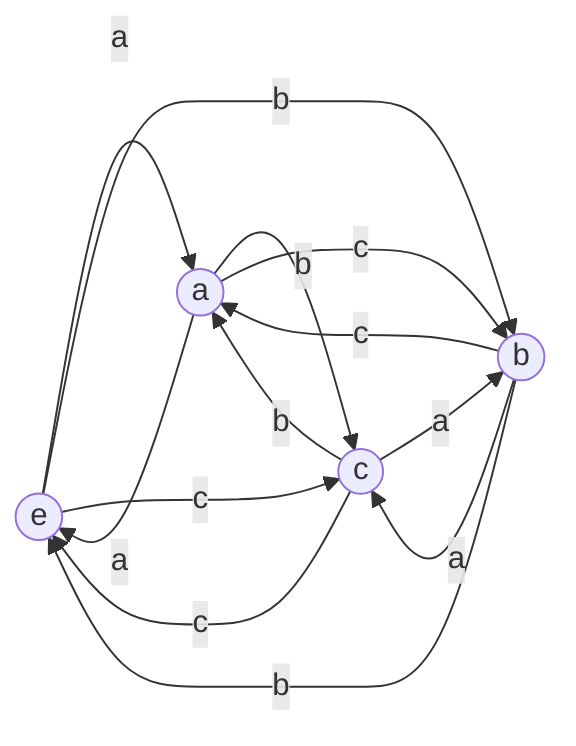

# 群论总览

## 目录

1. [概述](#1-概述)
   1.1. [背景](#11-背景)
   1.2. [目标](#12-目标)
   1.3. [范围](#13-范围)
2. [基本概念](#2-基本概念)
   2.1. [定义](#21-定义)
   2.2. [公理](#22-公理)
   2.3. [基本性质](#23-基本性质)
3. [理论发展](#3-理论发展)
   3.1. [历史背景](#31-历史背景)
   3.2. [主要贡献者](#32-主要贡献者)
   3.3. [关键突破](#33-关键突破)
4. [核心内容](#4-核心内容)
   4.1. [主要定理](#41-主要定理)
   4.2. [证明方法](#42-证明方法)
   4.3. [应用案例](#43-应用案例)
5. [形式化表示](#5-形式化表示)
   5.1. [数学符号](#51-数学符号)
   5.2. [形式化证明](#52-形式化证明)
   5.3. [代码实现](#53-代码实现)
6. [多表征方式](#6-多表征方式)
   6.1. [图形表示](#61-图形表示)
   6.2. [表格数据](#62-表格数据)
   6.3. [算法描述](#63-算法描述)
7. [关联与延伸](#7-关联与延伸)
   7.1. [相关概念](#71-相关概念)
   7.2. [跨学科联系](#72-跨学科联系)
   7.3. [开放问题](#73-开放问题)
8. [参考资料](#8-参考资料)
   8.1. [学术文献](#81-学术文献)
   8.2. [教材资源](#82-教材资源)
   8.3. [在线资源](#83-在线资源)

## 1. 概述

### 1.1. 背景

群论是代数学中研究群结构的分支，作为现代抽象代数的基石，群论在数学、物理学、化学和计算机科学等多个领域都有广泛应用。群结构最初源于对置换和几何变换的研究，后发展成为研究对称性的强大数学工具。

### 1.2. 目标

本文档旨在提供群论的系统性概述，包括基本概念、主要定理、应用领域以及与其他数学分支的联系。通过本文档，读者可以建立对群论的整体认识，并为深入学习各个子主题奠定基础。

### 1.3. 范围

本文档涵盖群论的基础知识和核心内容，包括群的定义、子群、陪集、正规子群、商群、群同态、群作用等概念，以及有限群、李群等特殊类型的群。同时，也会简要介绍群论在物理学、密码学等领域的应用。

## 2. 基本概念

### 2.1. 定义

**定义 2.1.1** (群)
一个群是一个集合 $G$ 和一个二元运算 $\cdot: G \times G \to G$，满足以下公理：
1. 封闭性：对于任意 $a, b \in G$，有 $a \cdot b \in G$
2. 结合律：对于任意 $a, b, c \in G$，有 $(a \cdot b) \cdot c = a \cdot (b \cdot c)$
3. 单位元：存在元素 $e \in G$，使得对于任意 $a \in G$，有 $e \cdot a = a \cdot e = a$
4. 逆元：对于任意 $a \in G$，存在 $a^{-1} \in G$，使得 $a \cdot a^{-1} = a^{-1} \cdot a = e$

**定义 2.1.2** (阿贝尔群)
如果群 $(G, \cdot)$ 还满足交换律，即对于任意 $a, b \in G$，有 $a \cdot b = b \cdot a$，则称 $G$ 为阿贝尔群（交换群）。

### 2.2. 公理

**公理 2.2.1** (群公理)
群的公理可以形式化表示为：
1. $\forall a, b \in G, a \cdot b \in G$ (封闭性)
2. $\forall a, b, c \in G, (a \cdot b) \cdot c = a \cdot (b \cdot c)$ (结合律)
3. $\exists e \in G, \forall a \in G, e \cdot a = a \cdot e = a$ (单位元)
4. $\forall a \in G, \exists a^{-1} \in G, a \cdot a^{-1} = a^{-1} \cdot a = e$ (逆元)

**公理 2.2.2** (阿贝尔群附加公理)
阿贝尔群还满足：
5. $\forall a, b \in G, a \cdot b = b \cdot a$ (交换律)

### 2.3. 基本性质

群具有以下基本性质：

1. **单位元唯一性**：群中的单位元是唯一的。
2. **逆元唯一性**：群中每个元素的逆元是唯一的。
3. **消去律**：如果 $a \cdot b = a \cdot c$ 或 $b \cdot a = c \cdot a$，则 $b = c$。
4. **方程可解性**：对于任意 $a, b \in G$，方程 $a \cdot x = b$ 和 $y \cdot a = b$ 在 $G$ 中有唯一解。

## 3. 理论发展

### 3.1. 历史背景

群论的发展历程可以追溯到19世纪初：

1. **早期发展** (1800-1830)：
   - 高斯在研究模运算时引入了群的概念
   - 柯西开始研究置换群

2. **伽罗瓦理论** (1830)：
   - 伽罗瓦使用群来研究多项式方程的可解性
   - 证明了五次及以上方程没有根式解

3. **系统化发展** (1850-1900)：
   - 凯莱和西尔维斯特系统研究置换群
   - 克莱因在几何学中应用群论

4. **现代群论** (20世纪)：
   - 有限群分类
   - 李群理论的发展
   - 表示论的建立

### 3.2. 主要贡献者

群论的发展得益于许多数学家的贡献：

- **埃瓦里斯特·伽罗瓦** (1811-1832)：创立了群论的基础，使用群来研究方程的可解性
- **阿瑟·凯莱** (1821-1895)：系统研究了群的抽象定义，提出了凯莱表示定理
- **费利克斯·克莱因** (1849-1925)：在几何学中应用群论，提出了埃尔兰根纲领
- **索菲·诺特** (1882-1935)：发展了抽象代数，对群论有重要贡献
- **埃米·诺特** (1882-1935)：对群表示理论有重大贡献
- **约翰·汤普森** (1932-2020)：在有限群分类中做出重要贡献

### 3.3. 关键突破

群论发展中的关键突破包括：

1. **伽罗瓦理论**：使用群来解决方程可解性问题
2. **凯莱表示定理**：每个群都同构于某个置换群的子群
3. **西罗定理**：关于有限p-群的基本结构
4. **有限单群分类**：对所有有限单群的完整分类
5. **李群理论**：连续变换群的理论，连接代数与微分几何

## 4. 核心内容

### 4.1. 主要定理

**定理 4.1.1** (拉格朗日定理)
设 $G$ 是有限群，$H$ 是 $G$ 的子群，则 $H$ 的阶整除 $G$ 的阶，即 $|H|$ 整除 $|G|$。

**证明**:
考虑 $G$ 关于 $H$ 的左陪集分解：$G = \bigcup_{i=1}^{n} g_i H$，其中 $n = [G:H]$ 是 $H$ 在 $G$ 中的指数。

由于不同的左陪集互不相交，且每个左陪集的元素个数等于 $|H|$，因此：
$|G| = n \cdot |H| = [G:H] \cdot |H|$

这表明 $|H|$ 整除 $|G|$。

**定理 4.1.2** (群同态基本定理)
设 $\varphi: G \to G'$ 是群同态，则 $G/\ker(\varphi) \cong \operatorname{Im}(\varphi)$。

**证明**:
定义映射 $\psi: G/\ker(\varphi) \to \operatorname{Im}(\varphi)$，使得 $\psi(g\ker(\varphi)) = \varphi(g)$。

首先验证 $\psi$ 定义良好：若 $g\ker(\varphi) = g'\ker(\varphi)$，则 $g^{-1}g' \in \ker(\varphi)$，即 $\varphi(g^{-1}g') = e'$，因此 $\varphi(g)^{-1}\varphi(g') = e'$，所以 $\varphi(g) = \varphi(g')$。

接下来验证 $\psi$ 是同构：
- 单射：若 $\psi(g\ker(\varphi)) = \psi(g'\ker(\varphi))$，则 $\varphi(g) = \varphi(g')$，因此 $g^{-1}g' \in \ker(\varphi)$，所以 $g\ker(\varphi) = g'\ker(\varphi)$。
- 满射：对任意 $\varphi(g) \in \operatorname{Im}(\varphi)$，有 $\psi(g\ker(\varphi)) = \varphi(g)$。
- 同态：$\psi((g\ker(\varphi))(g'\ker(\varphi))) = \psi(gg'\ker(\varphi)) = \varphi(gg') = \varphi(g)\varphi(g') = \psi(g\ker(\varphi))\psi(g'\ker(\varphi))$。

因此，$G/\ker(\varphi) \cong \operatorname{Im}(\varphi)$。

### 4.2. 证明方法

群论中常用的证明方法包括：

1. **构造法**：通过构造具体的映射或元素来证明定理
2. **同构法**：证明两个群结构相同
3. **计数法**：利用群的大小和子群的性质进行计数
4. **陪集分解**：将群分解为子群的陪集
5. **归纳法**：对群的阶或其他参数进行归纳
6. **反证法**：假设结论不成立，推导矛盾

### 4.3. 应用案例

群论在多个领域有广泛应用：

1. **物理学**：
   - 粒子物理中的对称性分析
   - 晶体结构的研究
   - 量子力学中的表示理论

2. **密码学**：
   - 公钥密码系统（如椭圆曲线密码学）
   - 离散对数问题
   - 群签名方案

3. **计算机科学**：
   - 编码理论
   - 图论中的对称性分析
   - 组合优化问题

4. **化学**：
   - 分子对称性分析
   - 光谱学中的群表示应用

## 5. 形式化表示

### 5.1. 数学符号

群论中的常用数学符号：

- $(G, \cdot)$ 或简写为 $G$：表示一个群
- $e$ 或 $1$：表示群的单位元
- $a^{-1}$：表示元素 $a$ 的逆元
- $|G|$：表示群 $G$ 的阶（元素个数）
- $|a|$ 或 $\operatorname{ord}(a)$：表示元素 $a$ 的阶
- $H \leq G$：表示 $H$ 是 $G$ 的子群
- $H \triangleleft G$：表示 $H$ 是 $G$ 的正规子群
- $G/H$：表示 $G$ 关于正规子群 $H$ 的商群
- $[G:H]$：表示子群 $H$ 在 $G$ 中的指数
- $\operatorname{Aut}(G)$：表示 $G$ 的自同构群
- $Z(G)$：表示 $G$ 的中心
- $G \cong H$：表示群 $G$ 和 $H$ 同构

### 5.2. 形式化证明

```lean
-- Lean中的群定义
class group (G : Type) extends has_mul G, has_one G, has_inv G :=
(mul_assoc : ∀ a b c : G, a * b * c = a * (b * c))
(one_mul : ∀ a : G, 1 * a = a)
(mul_one : ∀ a : G, a * 1 = a)
(mul_left_inv : ∀ a : G, a⁻¹ * a = 1)

-- 拉格朗日定理的形式化证明（简化版）
theorem lagrange {G : Type} [fintype G] [group G] {H : subgroup G} :
  card H ∣ card G :=
begin
  -- 构造左陪集
  let S := left_cosets H,
  -- 证明所有左陪集大小相同
  have h1 : ∀ s ∈ S, card s = card H,
  { intros s hs,
    -- 使用左陪集与H之间的双射
    -- 详细证明略
  },
  -- G是所有左陪集的不相交并
  have h2 : card G = card S * card H,
  { -- 详细证明略
  },
  -- 由h2可知card H整除card G
  exact dvd.intro (card S) h2,
end
```

### 5.3. 代码实现

```rust
// Rust中的有限循环群实现
struct CyclicGroup {
    order: usize,
    operation: fn(usize, usize, usize) -> usize,
}

impl CyclicGroup {
    // 创建模n加法群
    fn new_additive(n: usize) -> Self {
        CyclicGroup {
            order: n,
            operation: |a, b, n| (a + b) % n,
        }
    }
    
    // 创建模n乘法群（n为素数）
    fn new_multiplicative(n: usize) -> Self {
        CyclicGroup {
            order: n - 1,
            operation: |a, b, n| (a * b) % n,
        }
    }
    
    // 计算群中元素a和b的运算结果
    fn operate(&self, a: usize, b: usize) -> usize {
        (self.operation)(a, b, self.order)
    }
    
    // 计算元素a的逆元
    fn inverse(&self, a: usize) -> usize {
        // 对于加法群
        if self.operation == |a, b, n| (a + b) % n {
            (self.order - a) % self.order
        } else {
            // 对于乘法群，使用扩展欧几里得算法
            // 简化实现，实际应使用扩展欧几里得算法
            for i in 1..self.order {
                if self.operate(a, i) == 1 {
                    return i;
                }
            }
            panic!("No inverse exists");
        }
    }
}
```

或者用Haskell实现：

```haskell
-- Haskell中的抽象群定义
data Group a = Group
  { elements :: [a]
  , operation :: a -> a -> a
  , identity :: a
  , inverse :: a -> a
  }

-- 验证是否满足群公理
isGroup :: (Eq a) => Group a -> Bool
isGroup g = 
  let elems = elements g
      op = operation g
      e = identity g
      inv = inverse g
  in
    -- 封闭性
    all (\(a, b) -> elem (op a b) elems) [(a, b) | a <- elems, b <- elems] &&
    -- 结合律
    all (\(a, b, c) -> op (op a b) c == op a (op b c)) 
        [(a, b, c) | a <- elems, b <- elems, c <- elems] &&
    -- 单位元
    all (\a -> op e a == a && op a e == a) elems &&
    -- 逆元
    all (\a -> op (inv a) a == e && op a (inv a) == e) elems

-- 创建整数模n加法群
createZnGroup :: Int -> Group Int
createZnGroup n = Group
  { elements = [0..n-1]
  , operation = \a b -> (a + b) `mod` n
  , identity = 0
  , inverse = \a -> (n - a) `mod` n
  }
```

## 6. 多表征方式

### 6.1. 图形表示

群可以通过多种图形方式表示：

```mermaid
graph TD
    A[群G] --> B[子群H1]
    A --> C[子群H2]
    A --> D[子群H3]
    B --> E[子群K]
    C --> E
    B --> F[平凡子群{e}]
    C --> F
    D --> F
    E --> F
```

凯莱图是表示群的另一种方式，以下是Klein四元群的凯莱图：



### 6.2. 表格数据

**表6.2.1**: 常见小阶群的结构

| 阶 | 群结构 | 是否阿贝尔 | 应用 |
|----|--------|------------|------|
| 1 | 平凡群 | 是 | 基本结构 |
| 2 | $\mathbb{Z}_2$ | 是 | 二元对称 |
| 3 | $\mathbb{Z}_3$ | 是 | 三次方程 |
| 4 | $\mathbb{Z}_4$ 或 Klein四元群 | 是 | 四元数，平面对称 |
| 5 | $\mathbb{Z}_5$ | 是 | 五次方程 |
| 6 | $\mathbb{Z}_6$ 或 $S_3$ | $\mathbb{Z}_6$是，$S_3$否 | 三角形对称 |
| 8 | 5种不同结构 | 4种是，1种否 | 四元数群 |

**表6.2.2**: $S_3$群的凯莱表

| $\cdot$ | $e$ | $(12)$ | $(13)$ | $(23)$ | $(123)$ | $(132)$ |
|---------|-----|--------|--------|--------|---------|---------|
| $e$     | $e$ | $(12)$ | $(13)$ | $(23)$ | $(123)$ | $(132)$ |
| $(12)$  | $(12)$ | $e$ | $(132)$ | $(123)$ | $(23)$ | $(13)$ |
| $(13)$  | $(13)$ | $(123)$ | $e$ | $(132)$ | $(12)$ | $(23)$ |
| $(23)$  | $(23)$ | $(132)$ | $(123)$ | $e$ | $(13)$ | $(12)$ |
| $(123)$ | $(123)$ | $(13)$ | $(23)$ | $(12)$ | $(132)$ | $e$ |
| $(132)$ | $(132)$ | $(23)$ | $(12)$ | $(13)$ | $e$ | $(123)$ |

### 6.3. 算法描述

**算法**: 计算元素阶

**输入**: 群元素 $g$，群运算 $\cdot$
**输出**: 元素 $g$ 的阶

**步骤**:
1. 初始化 $x = g$，计数器 $n = 1$
2. 当 $x \neq e$ 时：
   a. 计算 $x = x \cdot g$
   b. 增加计数器 $n = n + 1$
3. 返回 $n$

**复杂度分析**:
- 时间复杂度: $O(|g|)$，其中 $|g|$ 是元素 $g$ 的阶
- 空间复杂度: $O(1)$

**算法**: 测试子群性质

**输入**: 集合 $H \subseteq G$，群运算 $\cdot$
**输出**: $H$ 是否为 $G$ 的子群

**步骤**:
1. 检查 $H$ 是否非空
2. 检查单位元 $e$ 是否在 $H$ 中
3. 对于每对元素 $a, b \in H$：
   a. 检查 $a \cdot b \in H$（封闭性）
   b. 检查 $a^{-1} \in H$（逆元存在性）
4. 如果所有检查都通过，返回"是"；否则返回"否"

**复杂度分析**:
- 时间复杂度: $O(|H|^2)$，其中 $|H|$ 是集合 $H$ 的大小
- 空间复杂度: $O(1)$

## 7. 关联与延伸

### 7.1. 相关概念

- [环论](../02-环论/00-环论总览.md): 群论的扩展，增加了第二个运算
- [域论](../03-域论/00-域论总览.md): 研究特殊类型的环
- [线性代数](../05-线性代数/00-线性代数总览.md): 向量空间是特殊的阿贝尔群
- [表示论](../07-范畴论/05-范畴论应用.md#表示论): 研究群在向量空间上的作用
- [伽罗瓦理论](../03-域论/03-伽罗瓦理论.md): 将群论应用于代数方程求解

### 7.2. 跨学科联系

群论在多个学科领域有重要应用：

1. **物理学**：
   - 粒子物理中的规范群（如U(1)、SU(2)、SU(3)）
   - 晶体学中的空间群
   - 相对论中的洛伦兹群和庞加莱群

2. **化学**：
   - 分子对称性分析
   - 光谱学中的点群应用
   - 化学键理论

3. **计算机科学**：
   - 密码学中的离散对数问题
   - 编码理论中的纠错码
   - 量子计算中的量子门

4. **艺术与设计**：
   - 对称图案设计
   - 埃舍尔作品中的对称性
   - 建筑设计中的对称结构

### 7.3. 开放问题

群论中仍存在许多开放问题和研究方向：

1. **有限群理论**：
   - 有限单群的更简单分类方法
   - 特定类型群的结构研究

2. **无限群理论**：
   - 几何群论中的决定性问题
   - 随机漫步和增长率问题

3. **计算群论**：
   - 高效的群计算算法
   - 大规模群的表示和操作

4. **量子群**：
   - 量子群的表示理论
   - 量子拓扑学中的应用

## 8. 参考资料

### 8.1. 学术文献

1. Sylow, L. (1872). "Théorèmes sur les groupes de substitutions". *Mathematische Annalen*, 5(1), 584-594.
2. Burnside, W. (1897). "Theory of Groups of Finite Order". *Cambridge University Press*.
3. Feit, W. & Thompson, J. G. (1963). "Solvability of groups of odd order". *Pacific Journal of Mathematics*, 13(3), 775-1029.

### 8.2. 教材资源

1. Dummit, D. S. & Foote, R. M. (2004). *Abstract Algebra*. Wiley.
2. Rotman, J. J. (1995). *An Introduction to the Theory of Groups*. Springer.
3. Artin, M. (1991). *Algebra*. Prentice Hall.
4. Lang, S. (2002). *Algebra*. Springer.

### 8.3. 在线资源

1. Group Theory. [https://mathworld.wolfram.com/GroupTheory.html](https://mathworld.wolfram.com/GroupTheory.html)
2. Abstract Algebra: Group Theory. [http://abstract.ups.edu/aata/](http://abstract.ups.edu/aata/)
3. Group Theory (Stanford Encyclopedia of Philosophy). [https://plato.stanford.edu/entries/group-theory/](https://plato.stanford.edu/entries/group-theory/)

---

**创建日期**: 2024-06-25
**最后更新**: 2024-06-25
**文档版本**: v1.0 