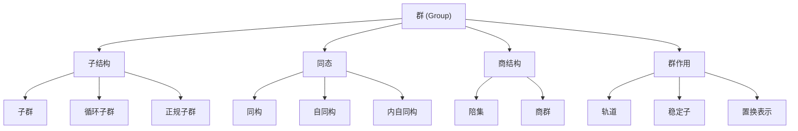

# 群的基本概念

## 1. 概述

### 1.1 基本定义

群(Group)是抽象代数中最基本的代数结构之一，它是由一个集合和一个定义在该集合上的二元运算组成的代数系统，满足特定的公理。形式化地，群是一个二元组 $(G, \cdot)$，其中 $G$ 是一个非空集合，$\cdot$ 是定义在 $G$ 上的一个二元运算，满足以下公理：

1. 结合律：对于任意 $a, b, c \in G$，$(a \cdot b) \cdot c = a \cdot (b \cdot c)$
2. 单位元：存在 $e \in G$，对于任意 $a \in G$，$e \cdot a = a \cdot e = a$
3. 逆元：对于任意 $a \in G$，存在 $a^{-1} \in G$，使得 $a \cdot a^{-1} = a^{-1} \cdot a = e$

如果群还满足交换律（即对于任意 $a, b \in G$，$a \cdot b = b \cdot a$），则称该群为交换群或阿贝尔群。

### 1.2 历史背景

群论的历史可追溯到18世纪末和19世纪初：

- 拉格朗日(Joseph-Louis Lagrange, 1736-1813)对多项式方程根的置换进行了研究，为群论奠定了早期基础。
- 阿贝尔(Niels Henrik Abel, 1802-1829)证明了五次及五次以上方程不存在根式解，引入了可解群的概念。
- 伽罗瓦(Évariste Galois, 1811-1832)将群用于研究多项式方程的可解性，奠定了群论的基础。
- 凯莱(Arthur Cayley, 1821-1895)给出了群的抽象定义，使群论从具体的置换研究发展为抽象的结构研究。
- 克莱因(Felix Klein, 1849-1925)通过"埃尔兰根计划"将群应用于几何学，揭示了几何变换与群之间的密切联系。

群论的发展体现了数学从具体到抽象、从计算到结构的转变，是现代抽象代数的奠基石。

### 1.3 主题在数学中的地位

群论在数学中具有核心地位，原因如下：

1. **基础性**：群是最基本的代数结构之一，其他复杂的代数结构（如环、域等）都可以看作是在群的基础上增加了额外结构。

2. **统一性**：群理论为研究对称性提供了统一的语言，使不同领域的对称性问题可以在同一框架下讨论。

3. **普遍性**：群结构在数学各分支中广泛存在，包括几何学、拓扑学、数论、表示论等。

4. **连接性**：群论连接了数学的不同分支，例如伽罗瓦理论连接了群论与代数方程，李群连接了群论与微分几何。

5. **应用广泛性**：群论在物理学（如量子力学、晶体学）、化学（分子对称性）、密码学和计算机科学等领域有重要应用。

## 2. 理论基础

### 2.1 公理与定义

**定义 2.1.1** (群)
群 $(G, \cdot)$ 是由一个非空集合 $G$ 和定义在 $G$ 上的一个二元运算 $\cdot: G \times G \rightarrow G$ 组成的代数系统，满足以下公理：

1. 结合律：$\forall a, b, c \in G, (a \cdot b) \cdot c = a \cdot (b \cdot c)$
2. 单位元：$\exists e \in G, \forall a \in G, e \cdot a = a \cdot e = a$
3. 逆元：$\forall a \in G, \exists a^{-1} \in G, a \cdot a^{-1} = a^{-1} \cdot a = e$

**定义 2.1.2** (阿贝尔群/交换群)
如果群 $(G, \cdot)$ 还满足：
4. 交换律：$\forall a, b \in G, a \cdot b = b \cdot a$
则称 $(G, \cdot)$ 为阿贝尔群或交换群。

**定义 2.1.3** (有限群与无限群)
如果群 $G$ 的元素个数是有限的，则称 $G$ 为有限群，其元素个数称为群的阶，记为 $|G|$。否则称 $G$ 为无限群。

**公理 2.1.4** (群公理的等价形式)
群 $(G, \cdot)$ 也可以等价地定义为满足以下性质的代数系统：

1. 封闭性：$\forall a, b \in G, a \cdot b \in G$
2. 结合律：$\forall a, b, c \in G, (a \cdot b) \cdot c = a \cdot (b \cdot c)$
3. 单位元：$\exists e \in G, \forall a \in G, e \cdot a = a \cdot e = a$
4. 逆元：$\forall a \in G, \exists a^{-1} \in G, a \cdot a^{-1} = a^{-1} \cdot a = e$

其中第1条封闭性是二元运算的定义所要求的，通常在群的定义中省略。

### 2.2 基本性质

**定理 2.2.1** (群的唯一单位元)
群 $G$ 的单位元是唯一的。

**证明**:
假设 $e$ 和 $e'$ 都是 $G$ 的单位元。那么：
$e = e \cdot e'$ (因为 $e'$ 是单位元)
$e \cdot e' = e'$ (因为 $e$ 是单位元)
因此 $e = e'$，即单位元是唯一的。

**定理 2.2.2** (逆元的唯一性)
群 $G$ 中每个元素的逆元是唯一的。

**证明**:
假设 $b$ 和 $c$ 都是 $a$ 的逆元，则：
$b = b \cdot e = b \cdot (a \cdot c) = (b \cdot a) \cdot c = e \cdot c = c$
因此 $b = c$，即逆元是唯一的。

**推论 2.2.3** (消去律)
在群 $G$ 中，对于任意 $a, b, c \in G$：

1. 如果 $a \cdot b = a \cdot c$，则 $b = c$ (左消去律)
2. 如果 $b \cdot a = c \cdot a$，则 $b = c$ (右消去律)

**证明**:
对于左消去律，若 $a \cdot b = a \cdot c$，则：
$a^{-1} \cdot (a \cdot b) = a^{-1} \cdot (a \cdot c)$
$(a^{-1} \cdot a) \cdot b = (a^{-1} \cdot a) \cdot c$ (结合律)
$e \cdot b = e \cdot c$ (逆元定义)
$b = c$ (单位元定义)

右消去律的证明类似。

### 2.3 关键结构

群的核心相关结构包括：

1. **子群 (Subgroup)**：
   群 $G$ 的非空子集 $H$，如果在 $G$ 的运算下，$H$ 本身构成一个群，则称 $H$ 为 $G$ 的子群。

2. **循环子群 (Cyclic Subgroup)**：
   由群 $G$ 中单个元素 $a$ 生成的子群，记为 $\langle a \rangle = \{a^n | n \in \mathbb{Z}\}$。

3. **陪集 (Coset)**：
   对于群 $G$ 的子群 $H$ 和元素 $g \in G$，左陪集定义为 $gH = \{gh | h \in H\}$，右陪集定义为 $Hg = \{hg | h \in H\}$。

4. **正规子群 (Normal Subgroup)**：
   群 $G$ 的子群 $N$，如果对于任意 $g \in G$，都有 $gNg^{-1} = N$，则称 $N$ 为 $G$ 的正规子群。等价地，$N$ 是正规子群，当且仅当对于任意 $g \in G$，左陪集 $gN$ 等于右陪集 $Ng$。

5. **商群 (Quotient Group)**：
   如果 $N$ 是 $G$ 的正规子群，则 $G$ 的所有左陪集（等价地，右陪集）构成一个群，称为商群，记为 $G/N$。

6. **群同态 (Group Homomorphism)**：
   从群 $(G, \cdot)$ 到群 $(H, *)$ 的映射 $f: G \rightarrow H$，满足 $f(a \cdot b) = f(a) * f(b)$，对于任意 $a, b \in G$。

## 3. 理论发展

### 3.1 主要分支

群论的主要研究分支包括：

1. **有限群理论**：
   - 研究有限群的结构和分类
   - 包括西罗定理、西罗子群、p-群等内容
   - 有限单群的分类是20世纪数学的重大成就

2. **表示论**：
   - 研究群通过线性变换作用于向量空间的方式
   - 将抽象的群结构转化为具体的矩阵研究
   - 在物理学和化学中有广泛应用

3. **几何群论**：
   - 研究群作为几何对象的性质
   - 包括李群、离散群、双曲群等
   - 与微分几何、拓扑学密切相关

4. **代数数论中的群**：
   - 研究伽罗瓦群、类群、幂剩余群等
   - 与数论问题密切相关

5. **计算群论**：
   - 发展高效算法计算群的结构和性质
   - 在密码学和编码理论中有应用

### 3.2 关键定理

**定理 3.2.1** (拉格朗日定理)
有限群 $G$ 的任意子群 $H$ 的阶都是 $G$ 的阶的因子，即 $|H|$ 整除 $|G|$。

**证明概要**:
通过证明 $G$ 可以被 $H$ 的左陪集划分，且每个陪集的元素个数等于 $|H|$，得到 $|G| = [G:H] \cdot |H|$，其中 $[G:H]$ 是 $H$ 在 $G$ 中的指数（即陪集数量）。

**定理 3.2.2** (西罗定理)
如果 $p$ 是素数，$G$ 是有限群，且 $p^n$ 整除 $|G|$，则 $G$ 含有一个阶为 $p^n$ 的子群。特别地，$G$ 含有一个阶为 $p$ 的子群。

**证明概要**:
通过归纳法和构造性证明，证明存在阶为所需幂次的子群。

**定理 3.2.3** (群同态基本定理)
设 $f: G \rightarrow H$ 是群同态，则：

1. $f$ 的核 $\ker(f) = \{g \in G | f(g) = e_H\}$ 是 $G$ 的正规子群
2. $G/\ker(f)$ 同构于 $f$ 的像 $\text{Im}(f)$

**定理 3.2.4** (凯莱定理)
任何有限群都同构于某个置换群。更确切地说，阶为 $n$ 的群 $G$ 同构于对称群 $S_n$ 的一个子群。

### 3.3 开放问题

群论中的一些重要开放问题包括：

1. **有限单群的进一步理解**：
   - 寻找更简单的有限单群分类证明
   - 深入研究散在单群的性质和结构

2. **p-群的结构问题**：
   - 对于固定的素数 $p$ 和度数 $n$，阶为 $p^n$ 的群有多少种同构类？
   - 这些同构类的分布规律是什么？

3. **群的增长问题**：
   - 对于无限群，其元素数量如何随"半径"增加而增长？
   - 中间增长群的精确刻画

4. **计算复杂性问题**：
   - 群同构问题的计算复杂性
   - 有效算法求解群论中的标准问题

## 4. 应用与例子

### 4.1 典型例子

**例 4.1.1** (整数加法群)
整数集合 $\mathbb{Z}$ 在通常加法运算下构成一个群：

- 结合律：$(a + b) + c = a + (b + c)$ 对所有整数成立
- 单位元：0 是加法的单位元，$a + 0 = 0 + a = a$
- 逆元：每个整数 $a$ 的逆元是 $-a$，因为 $a + (-a) = (-a) + a = 0$
- 交换律：$a + b = b + a$ 对所有整数成立

因此 $(\mathbb{Z}, +)$ 是一个无限阿贝尔群。

**例 4.1.2** (对称群 $S_3$)
考虑三个元素 $\{1, 2, 3\}$ 的所有可能排列：

- 恒等置换：$e = (1)(2)(3)$
- 2-循环：$a = (12)(3), b = (13)(2), c = (23)(1)$
- 3-循环：$d = (123), f = (132)$

这些置换在复合运算下构成一个阶为6的群，称为对称群 $S_3$。

**解决方案**:
可以通过构造 $S_3$ 的凯莱表（下面是部分示例）来验证其满足群的所有公理：

|$\cdot$|$e$|$a$|$b$|$c$|$d$|$f$|
|-------|---|---|---|---|---|---|
|$e$    |$e$|$a$|$b$|$c$|$d$|$f$|
|$a$    |$a$|$e$|$f$|$d$|$c$|$b$|
|$b$    |$b$|$d$|$e$|$f$|$a$|$c$|
|...    |...|...|...|...|...|...|

$S_3$ 是最小的非阿贝尔群，因为例如 $a \cdot d = c$ 而 $d \cdot a = b$，所以不满足交换律。

### 4.2 应用领域

群论在众多领域有重要应用：

1. **物理学中的应用**：
   - 对称群和群表示在量子力学中的应用
   - 晶体学中的空间群
   - 粒子物理学中的规范群

2. **化学中的应用**：
   - 分子对称性分析
   - 振动光谱的群论解释
   - 分子轨道理论中的对称适应线性组合

3. **密码学中的应用**：
   - 椭圆曲线密码系统
   - 离散对数问题
   - 格密码学

4. **编码理论**：
   - 群码的设计与分析
   - 循环码与有限域理论

5. **计算机科学**：
   - 群在图论中的应用（如图同构检测）
   - 组合算法中的群论技术
   - 计算复杂性理论

## 5. 多维表示

### 5.1 图形表示



### 5.2 代码实现

#### 5.2.1 Rust实现

```rust
// 使用Rust实现有限循环群
struct CyclicGroup {
    order: usize,
}

impl CyclicGroup {
    fn new(order: usize) -> Self {
        CyclicGroup { order }
    }
    
    fn operation(&self, a: usize, b: usize) -> usize {
        (a + b) % self.order
    }
    
    fn inverse(&self, element: usize) -> usize {
        (self.order - element) % self.order
    }
    
    fn identity(&self) -> usize {
        0
    }
    
    // 生成元素的所有幂
    fn powers_of(&self, element: usize) -> Vec<usize> {
        let mut result = Vec::new();
        let mut current = 0; // 单位元
        
        for _ in 0..self.order {
            result.push(current);
            current = self.operation(current, element);
        }
        
        result
    }
    
    fn is_generator(&self, element: usize) -> bool {
        let powers = self.powers_of(element);
        let mut unique_elements = std::collections::HashSet::new();
        
        for power in powers {
            unique_elements.insert(power);
        }
        
        unique_elements.len() == self.order
    }
}

fn main() {
    let c6 = CyclicGroup::new(6);
    println!("Z6中的生成元:");
    for i in 0..6 {
        if c6.is_generator(i) {
            println!("{}", i);
        }
    }
}
```

#### 5.2.2 Haskell实现

```haskell
-- 使用Haskell实现有限循环群
module CyclicGroup where

-- 定义循环群数据类型
data CyclicGroup = CyclicGroup { order :: Int }

-- 群运算 (加法模n)
operation :: CyclicGroup -> Int -> Int -> Int
operation g a b = (a + b) `mod` (order g)

-- 逆元
inverse :: CyclicGroup -> Int -> Int
inverse g element = (order g - element) `mod` (order g)

-- 单位元
identity :: CyclicGroup -> Int
identity _ = 0

-- 生成元素的所有幂
powersOf :: CyclicGroup -> Int -> [Int]
powersOf g element = take (order g) $ iterate (\x -> operation g x element) 0

-- 检查是否为生成元
isGenerator :: CyclicGroup -> Int -> Bool
isGenerator g element = length (unique $ powersOf g element) == order g
  where unique = foldr (\x acc -> if x `elem` acc then acc else x:acc) []

-- 查找所有生成元
allGenerators :: CyclicGroup -> [Int]
allGenerators g = filter (isGenerator g) [0 .. (order g - 1)]

-- 示例用法
main :: IO ()
main = do
  let c6 = CyclicGroup 6
  putStrLn $ "Z6中的生成元: " ++ show (allGenerators c6)
```

### 5.3 形式化证明

```lean
-- 使用Lean定理证明助手形式化证明群的基本性质

import algebra.group.basic

variables {G : Type*} [group G]

-- 证明群中元素的逆元是唯一的
theorem inverse_unique (a : G) {b c : G} (hb : a * b = 1) (hc : a * c = 1) : b = c :=
begin
  calc b = b * 1 : by rw mul_one
     ... = b * (a * c) : by rw hc
     ... = (b * a) * c : by rw mul_assoc
     ... = 1 * c : by rw ←hb
     ... = c : by rw one_mul
end

-- 证明消去律
theorem left_cancel {a b c : G} (h : a * b = a * c) : b = c :=
begin
  calc b = 1 * b : by rw one_mul
     ... = (a⁻¹ * a) * b : by rw inv_mul_self
     ... = a⁻¹ * (a * b) : by rw mul_assoc
     ... = a⁻¹ * (a * c) : by rw h
     ... = (a⁻¹ * a) * c : by rw mul_assoc
     ... = 1 * c : by rw inv_mul_self
     ... = c : by rw one_mul
end
```

## 6. 哲学与批判性分析

### 6.1 认识论分析

群论的发展对数学认识论产生了深远影响：

- **抽象思维的力量**：群概念的抽象性使我们能够从具体的数学对象中提取出核心的结构特征，展示了抽象思维在数学中的强大作用。

- **同构的认识论意义**：同构概念表明，表面上不同的数学结构可能在本质上是相同的，这挑战了我们对"相同"和"不同"的直觉理解。

- **对称性作为认知工具**：群论将对称性形式化，提供了一种理解复杂系统的方法，这种方法反映了人类思维寻找规律和简化复杂性的倾向。

### 6.2 本体论思考

群论引发的本体论问题包括：

- **数学结构的存在方式**：群是发现的还是发明的？它们是否存在于某种柏拉图式的理念世界中，还是纯粹的人类思维构造？

- **对称性的普遍性**：对称性在自然界中的普遍存在是否暗示了某种更深层次的数学与物理世界的联系？

- **抽象与具体的关系**：抽象的群概念与其具体实例（如置换群、矩阵群）之间的关系如何理解？

### 6.3 不同学派的观点

- **形式主义视角**：
  群是一个形式系统，由符号和规则组成，其价值在于内部的一致性和形式化推理的可能性。
  代表人物：希尔伯特(David Hilbert)

- **结构主义视角**：
  群是一种抽象结构或模式，其本质在于元素之间的关系网络，而非元素本身。
  代表人物：布尔巴基学派(Nicolas Bourbaki)

- **柏拉图主义视角**：
  群作为数学对象客观存在于理念世界中，数学家是在发现而非发明这些结构。
  代表人物：哥德尔(Kurt Gödel)

- **自然主义视角**：
  群概念的发展源于对自然现象的抽象，其价值在于解释和预测自然规律。
  代表人物：韦尔(Hermann Weyl)

## 7. 关联概念

### 7.1 前置概念

- [集合论基础](../../02-数学基础与逻辑/02-集合论/01-集合论基础.md)
- [二元运算](../../02-数学基础与逻辑/02-集合论/03-关系与函数.md)
- [同态与同构](../../02-数学基础与逻辑/04-范畴论基础/02-同态与函子.md)

### 7.2 相关概念

- [环论基础](../02-环论/01-环的基本概念.md)
- [线性代数中的群](../05-线性代数/03-线性变换群.md)
- [伽罗瓦理论](../03-域论/03-伽罗瓦理论.md)

### 7.3 衍生概念

- [李群与李代数](../../05-几何与拓扑/03-微分几何/04-李群与李代数.md)
- [表示论](../07-表示论/01-群表示基础.md)
- [群在密码学中的应用](../../08-跨学科应用与联系/03-数学与信息科学/02-密码学基础.md)

## 8. 参考文献

1. Dummit, D. S., & Foote, R. M. (2004). Abstract Algebra (3rd ed.). Wiley.
2. Rotman, J. J. (1995). An Introduction to the Theory of Groups (4th ed.). Springer.
3. Armstrong, M. A. (1988). Groups and Symmetry. Springer.
4. Fraleigh, J. B. (2003). A First Course in Abstract Algebra (7th ed.). Addison Wesley.
5. Wussing, H. (2007). The Genesis of the Abstract Group Concept: A Contribution to the History of the Origin of Abstract Group Theory. Dover Publications.

---

**创建日期**: 2024-12-21  
**最后更新**: 2024-12-21  
**版本**: 1.0  
**贡献者**: AI助手
