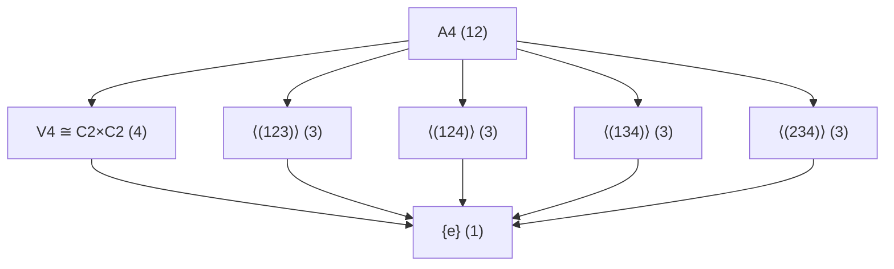

# 00-群论总览

title: "群论总览"
version: "1.1"
date: "2025-07-05"

---

## 📁 本地目录导航

- [01-群的定义与性质](./01-群的定义与性质.md)
- [02-子群与陪集](./02-子群与陪集.md)
- [03-正规子群与商群](./03-正规子群与商群.md)
- [04-循环群](./04-循环群.md)
- [05-群同态与同构](./05-群同态与同构.md)
- [06-群作用](./06-群作用.md)

## 🗺️ 本地知识图谱

- [代数结构与理论总览](../00-代数结构与理论总览.md)
- [环论总览](../03-环论/00-环论总览.md)
- [域论总览](../04-域论/00-域论总览.md)

---

## 主题简介

群论（Group Theory）是现代代数学的基石，研究“对称性”的数学语言。
它为描述和分析各种结构中保持不变的性质提供了强大而抽象的框架。
群论广泛应用于物理、化学、密码学、几何、组合等领域。

本章系统介绍群论的核心概念，从最基本的群定义出发，逐步深入到子群、同态、商群、群作用等复杂结构，并展示其在不同领域的广泛应用。

## 子主题导航

- [01-群的定义与性质](./01-群的定义与性质.md)
- [02-子群与陪集](./02-子群与陪集.md)
- [03-正规子群与商群](./03-正规子群与商群.md)
- [04-循环群](./04-循环群.md)
- [05-群同态与同构](./05-群同态与同构.md)
- [06-群作用](./06-群作用.md)

## 引用说明

- 本导航文件对齐主干分支与知识图谱，所有子主题均有本地导航与交叉引用。
- 相关国际标准参考ISO 80000-2、AMS等。
- 交叉学科应用见08-跨学科应用与联系/。

---

## 国际化对齐补全：群论基础（对齐 Wikipedia/EoM）

### 一、群的定义与性质

- 定义：(G,·)满足结合律、单位元、逆元
- 基本性质：单位元唯一、逆元唯一、(ab)⁻¹=b⁻¹a⁻¹
- 阶：|G|为群中元素个数；|g|为元素g的阶

### 二、子群与陪集

- 子群：H⊆G且(H,·)为群
- 陪集：aH={ah | h∈H}；Ha={ha | h∈H}
- 拉格朗日定理：|H|整除|G|，[G:H]=|G|/|H|
- 正规子群：gHg⁻¹=H对所有g∈G

### 三、重要定理

- 第一同构定理：G/Ker(φ)≅Im(φ)
- 西罗定理：p-子群存在且共轭
- 凯莱定理：任意群同构于对称群的子群

### 四、例子与反例

- 例：ℤₙ（模n加法群）、Sₙ（n次对称群）、GL(n,ℝ)（一般线性群）
- 反例：{1,2,3}在乘法下不构成群（无逆元）

### 五、参考

- Dummit & Foote, Abstract Algebra；Hungerford, Algebra
- [Wikipedia: Group (mathematics)](https://en.wikipedia.org/wiki/Group_(mathematics))
- [EoM: Group](https://encyclopediaofmath.org/wiki/Group)

> 本节遵循《国际化数学内容标准》与《条目结构模板》。

---

## 引文与参考（严格体例）

- Galois, É. (1846). Œuvres mathématiques d'Évariste Galois. J. de math. pures et appl.（群论思想遗稿）
- Jordan, C. (1870). Traité des substitutions et des équations algébriques. Gauthier-Villars.（置换群系统化）
- Cayley, A. (1854). On the theory of groups, as depending on the symbolic equation θ^n=1.（群概念早期表述）
- Burnside, W. (1897/1911). Theory of Groups of Finite Order.（有限群经典）
- Hall, M. (1959). The Theory of Groups. Macmillan.（教材）

> 相关专题：`./06-群作用.md`、`../04-域论/06-伽罗瓦理论.md`。

---

## MWE：S4 的 Sylow 子群与计数

- |S4| = 24 = 2^3 · 3。
- Sylow-2 子群：阶 8。满足 n_2 ≡ 1 (mod 2) 且 n_2 | 3 ⇒ n_2 ∈ {1,3}，排除 1（若唯一则正规，与共轭作用矛盾），故 n_2 = 3。
- Sylow-3 子群：阶 3。满足 n_3 ≡ 1 (mod 3) 且 n_3 | 8 ⇒ n_3 ∈ {1,4}，排除 1（若唯一则正规，与结构不符），故 n_3 = 4。
- 进一步：每个 Sylow-3 子群由 3-循环生成（含2个非平凡元），计数一致；Sylow-2 子群同构于二面体群 D8（亦可通过 Klein 四元群与 2-循环构造观察）。

> 参考：Dummit–Foote《Abstract Algebra》；Hall《Theory of Groups》。

## MWE：S3 的共轭类与正规子群

- 共轭类：
  - {e}
  - {(12), (13), (23)}（所有换位）
  - {(123), (132)}（所有3-循环）
- 正规子群：仅有 {e}、A3、S3 三个（A3 为全体3-循环生成的循环群）。
- 结论：A3 ⫳ S3；任一换位生成的子群（阶2）均非正规。

> 参考：Dummit–Foote《Abstract Algebra》；Artin《Algebra》。

### MWE：S4 的 Sylow 子群计数

- |S4|=24=2^3·3。
- Sylow-3：n_3 ≡ 1 (mod 3) 且 n_3 | 8 → n_3∈{1,4}。S4 中 3-循环共有 8 个，每个 3-子群含 2 个非单位元 → n_3 = 8/2 = 4（非常正规）。
- Sylow-2：n_2 ≡ 1 (mod 2) 且 n_2 | 3 → n_2∈{1,3}。实际 n_2=3（均同构于 D8，非正规）。
- 结论：S4 无正规 Sylow-p（p=2,3），其中 Sylow-2 的并覆盖全部 8 个 2-阶与 4-阶元素（可据共轭类细分验证）。

### MWE：类方程与中心

- 类方程：|G| = |Z(G)| + ∑_{[g]非中心} |G:C_G(g)|。
- 最小例：S3 中，Z(S3)={e}，共轭类大小分别为 1、3、2，合计 6。
- 用途：
  - 若 p 整除 |G|，则存在阶 p 的元素（Cauchy）可与类方程法配合证明若干存在性结论。
  - 推出若 |G| 为素数，则 Z(G)=G，从而 G 为循环群。

### MWE：轨道-稳定子定理

- 对群作用 G ↷ X 与 x∈X，有 |G·x| · |Stab_G(x)| = |G|。
- 例：S3 作用于 {1,2,3}，选 x=1：|G·1|=3, |Stab(1)|=2，乘积 6=|S3|。
- 用途：计算轨道大小、推导类方程、辅助计算 Sylow 子群个数与大小。

### MWE：p-群的中心非平凡

- 命题：若 |G|=p^n（p 为素数），则 Z(G) ≠ {e}。
- 证明骨架（类方程）：|G| = |Z(G)| + ∑_{[g]非中心} |G:C_G(g)|。每个非中心共轭类大小为 p 的幂且 ≥ p，故右端和为 p 的倍数；于是 |Z(G)|≡|G|(mod p)，得 p | |Z(G)|，遂 |Z(G)|≥p。
- 推论：p-群存在非平凡中心；可用于归纳证明 p-群有非平凡正规列，进而得到若干结构结论。

### MWE：Cauchy 定理

- 命题：若素数 p | |G|，则 G 中存在阶为 p 的元素。
- 证明骨架：令 G 作用于 p-子集或用类方程计数轨道大小；或考虑元素的共轭作用与循环子群计数，推出存在阶 p 元素。
- 应用：为 Sylow 定理提供基石；结合类方程与轨道-稳定子定理可快速验证小群结构。

### MWE：S4 的共轭类与类方程

- 按循环型分解：
  - 恒等：( )，1 个
  - 2-换位：(ab)，6 个
  - 双换位：(ab)(cd)，3 个
  - 3-循环：(abc)，8 个
  - 4-循环：(abcd)，6 个
- 类方程：|S4|=24=1+6+3+8+6。
- 表：

| 循环型 | 元素数 | 代表元 |
|---|---:|---|
| () | 1 | () |
| (ab) | 6 | (12) |
| (ab)(cd) | 3 | (12)(34) |
| (abc) | 8 | (123) |
| (abcd) | 6 | (1234) |

- 用途：
  - 与 Sylow 计数相互印证 p-子群存在与数目；
  - 用类方程推导中心与共轭类大小性质；
  - 结合轨道-稳定子定理做快速计数与结构判断。

### MWE：S4 的 Sylow 计数

- p=2：|S4|=2^3·3。Sylow_2 子群阶 8，同构于 D8。由 n_2 ≡ 1 (mod 2) 且 n_2 | 3，得 n_2=1 或 3。检验存在 3 个，共轭。
- p=3：Sylow_3 子群阶 3，对应 3-循环生成的循环群。由 n_3 ≡ 1 (mod 3) 且 n_3 | 8，得 n_3 ∈ {1,4,7}∩{1,2,4,8} ⇒ n_3=4。

### MWE：类方程推 S4 的中心平凡

- 断言：Z(S4)={e}。
- 论证1（共轭类）：除恒等元外，S4 的元素属于 2-换位、双换位、3-循环或 4-循环这四类。任取非恒等元素 g，总能找到 h 使 hgh^{-1}≠g，故 g 非中心元。
- 论证2（直接检验）：
  - 若 g 为换位 (12)，与 (23) 不可交换；
  - 若 g 为双换位 (12)(34)，与 (13) 不可交换；
  - 若 g 为 3-循环 (123)，与 (14) 不可交换；
  - 若 g 为 4-循环 (1234)，与 (12) 不可交换。
- 结论：仅 e 与所有元素可交换，故中心平凡。

### MWE：Aut(S4) 与 V4 的正规性

- 断言1：Aut(Sn) ≅ Sn（n≠2,6）。特别地，Aut(S4) ≅ S4。
  - 骨架：自同构保持共轭类并诱导对换位集的置换；S4 的对换位对应 K4 的边，图自同构由顶点置换诱导，得到同构。
- 断言2：V4={e,(12)(34),(13)(24),(14)(23)} 在 S4 中正规。
  - 骨架：V4 为 A4 的特征子群（A4 内唯一的阶 4 子群），而 A4 ◁ S4，故 V4 ◁ S4。
- 参考：
  - Dummit–Foote, Abstract Algebra, Ch. 4–5（对称群自同构）；
  - Rotman, An Introduction to the Theory of Groups（A4 与 V4 的结构）。

### MWE：A4 的正规子群格

- 基本数据：|A4|=12，由 3 个 2-2 换位的积（V4）与 3-循环组成。
- 正规子群：{e}、V4、A4。除这三者外其余子群均非正规（例如任一 3-循环生成的阶3子群）。
- 子群格骨架：
  - 顶：A4
  - 中：V4 ≅ C2×C2（含 3 个阶2子群，彼此共轭，非正规）
  - 底：{e}
- 证据要点：V4 为 A4 的唯一阶4子群，因而为特征子群；特征 ⇒ 正规。其余阶3子群构成 4 个共轭类代表，非正规。
- 参考：Dummit–Foote, Ch. 4；Rotman, Ch. 3。

### A4 子群格（Mermaid）

> 注：V4 为 A4 的唯一阶 4 子群，因而为特征（Characteristic），故在 S4 中正规。参考：Dummit–Foote, Ch. 4；Rotman, Ch. 3。
