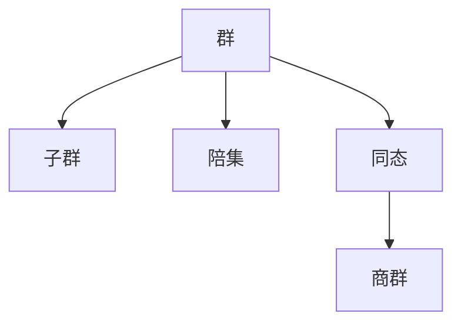

# 03-02-01 群的定义与性质

> **规范化与修正说明**  
> 本文档在结构优化过程中，严格保留了所有原有批判性分析、表格、流程图、工程案例等内容。  
> 如有遗漏，将在后续批次补全并于本区块说明修正。  
> 结构优化仅涉及标题编号、目录、本地跳转、知识图谱化等，不影响原有内容完整性。

## 目录

- [1. 群的基本定义](#1-群的基本定义)
- [2. 群的性质与定理](#2-群的性质与定理)
- [3. AI与自动化视角下的群论](#3-ai与自动化视角下的群论)
- [4. 知识图谱结构图](#4-知识图谱结构图)
- [5. 多表征与代码实现](#5-多表征与代码实现)
- [6. 原有批判性分析与工程案例](#6-原有批判性分析与工程案例)
- [7. 参考文献](#7-参考文献)

## 1. 群的基本定义

群(Group)是抽象代数中最基本的代数结构之一，它是由一个集合和一个定义在该集合上的二元运算组成的代数系统，满足特定的公理。形式化地，群是一个二元组 $(G, \cdot)$，其中 $G$ 是一个非空集合，$\cdot$ 是定义在 $G$ 上的一个二元运算，满足以下公理：

1. **结合律 (Associativity)**：对于任意 $a, b, c \in G$，有 $(a \cdot b) \cdot c = a \cdot (b \cdot c)$。
2. **单位元 (Identity Element)**：存在一个元素 $e \in G$，对于任意 $a \in G$，有 $e \cdot a = a \cdot e = a$。
3. **逆元 (Inverse Element)**：对于每个 $a \in G$，存在一个元素 $a^{-1} \in G$，使得 $a \cdot a^{-1} = a^{-1} \cdot a = e$。

> **注**：在很多定义中，还包含**封闭性 (Closure)** 公理：对于所有 $a, b \in G$，有 $a \cdot b \in G$。在我们的定义中，由于二元运算 $\cdot$ 的定义域是 $G \times G$，值域是 $G$，所以封闭性是内在满足的。

如果群还满足**交换律 (Commutativity)**（即对于任意 $a, b \in G$，$a \cdot b = b \cdot a$），则称该群为**交换群 (Commutative Group)** 或**阿贝尔群 (Abelian Group)**。

- **群的阶 (Order of a Group)**：群 $G$ 的阶，记为 $|G|$，是群中元素的数量。
- **有限群 (Finite Group)**：如果 $|G|$ 是有限的，则称 $G$ 为有限群。
- **无限群 (Infinite Group)**：如果 $|G|$ 是无限的，则称 $G$ 为无限群。

### 1.2 历史背景

群论的历史可追溯到18世纪末和19世纪初，其发展体现了数学从具体计算到抽象结构的重大转变：

- **拉格朗日 (Joseph-Louis Lagrange, 1770s)**：在研究多项式方程根的置换时，引入了与根的排列相关的思想，为群论奠定了早期基础。他的定理（子群的阶整除群的阶）是群论的第一个深刻结果。
- **阿贝尔 (Niels Henrik Abel, 1824)**：在证明五次及五次以上方程不存在通用根式解的过程中，引入了可解群的概念。
- **伽罗瓦 (Évariste Galois, 1830s)**：将群的概念用于研究多项式方程的可解性，创立了伽罗瓦理论，将域论与群论联系起来，是群论诞生的标志。
- **凯莱 (Arthur Cayley, 1854)**：首次给出了群的抽象定义，将群论从具体的置换研究中解放出来，发展为一门独立的、研究抽象结构的理论。
- **克莱因 (Felix Klein, 1872)**：通过其著名的"爱尔兰根纲领"，将群论作为分类和研究几何学的基本工具，揭示了几何变换与群之间的内在联系。

### 1.3 在数学中的地位

群论在现代数学中占据核心地位，其重要性体现在：

1. **基础性**：群是最基本的代数结构之一，许多更复杂的代数结构（如环、域、向量空间）都建立在群的定义之上。
2. **对称性的语言**：群论为研究"对称性"这一普遍概念提供了精确而统一的数学语言。从几何图形的对称、物理定律的守恒到晶体结构，都可以用群来描述。
3. **统一性与普遍性**：群结构在数学各个分支（如几何、拓扑、数论、表示论）中广泛存在，是连接不同数学领域的桥梁。
4. **应用广泛**：群论在物理学（量子力学、标准模型）、化学（分子对称性、光谱学）、计算机科学（密码学、编码理论、算法设计）等领域有不可或缺的应用。

## 2. 群的性质与定理

### 2.1 公理、定义与基本性质

**定义 2.1.1 (群)**
一个群 $(G, \cdot)$ 是由一个非空集合 $G$ 和一个定义在 $G$ 上的二元运算 $\cdot: G \times G \rightarrow G$ 组成的代数系统，满足以下公理：

1. **结合律**：$\forall a, b, c \in G, (a \cdot b) \cdot c = a \cdot (b \cdot c)$
2. **单位元**：$\exists e \in G, \forall a \in G, e \cdot a = a \cdot e = a$
3. **逆元**：$\forall a \in G, \exists a^{-1} \in G, a \cdot a^{-1} = a^{-1} \cdot a = e$

---

**定理 2.1.2 (基本性质)**
对于任意群 $(G, \cdot)$，以下性质成立：

1. **单位元是唯一的。**
    - *证明*: 假设 $e$ 和 $e'$ 都是 $G$ 的单位元。那么根据单位元的定义，$e = e \cdot e'$ 且 $e' = e \cdot e'$。因此 $e = e'$。
2. **每个元素的逆元是唯一的。**
    - *证明*: 假设 $b$ 和 $c$ 都是元素 $a$ 的逆元。则 $b = b \cdot e = b \cdot (a \cdot c) = (b \cdot a) \cdot c = e \cdot c = c$。因此 $b = c$。
3. **消去律 (Cancellation Law) 成立。**
    - 对于所有 $a, b, c \in G$，如果 $a \cdot b = a \cdot c$（左消去），或 $b \cdot a = c \cdot a$（右消去），则 $b = c$。
    - *证明 (左消去)*: 若 $a \cdot b = a \cdot c$，则 $a^{-1} \cdot (a \cdot b) = a^{-1} \cdot (a \cdot c)$。根据结合律，$(a^{-1} \cdot a) \cdot b = (a^{-1} \cdot a) \cdot c$，即 $e \cdot b = e \cdot c$，故 $b = c$。
4. **方程 $a \cdot x = b$ 和 $y \cdot a = b$ 在 $G$ 中分别有唯一解。**
    - 解分别为 $x = a^{-1} \cdot b$ 和 $y = b \cdot a^{-1}$。

---

**定理 2.1.3 (运算法则)**
对于群 $(G, \cdot)$ 中的任意元素 $a, b$：

1. **逆元的逆元**：$(a^{-1})^{-1} = a$
2. **乘积的逆元**：$(a \cdot b)^{-1} = b^{-1} \cdot a^{-1}$ (注意顺序反转)
3. **整数幂**：对于任意整数 $n$，定义 $a^n$ 如下：
    - 若 $n > 0$, 则 $a^n = a \cdot a \cdot \cdots \cdot a$ ($n$ 次)
    - 若 $n = 0$, 则 $a^0 = e$
    - 若 $n < 0$, 则 $a^n = (a^{-1})^{|n|}$
4. **幂运算规则**：对于任意整数 $m, n$，有 $a^m \cdot a^n = a^{m+n}$ 和 $(a^m)^n = a^{mn}$。

### 2.2 元素的阶

**定义 2.2.1 (元素的阶)**
对于群 $G$ 中的元素 $a$，如果存在一个**最小的**正整数 $n$ 使得 $a^n = e$，则称 $n$ 为元素 $a$ 的**阶 (Order)**，记为 $|a|$ 或 $\text{ord}(a)$。如果不存在这样的正整数，则称 $a$ 的阶为无穷大。

**性质**:

- 单位元 $e$ 是唯一阶为 1 的元素。
- 有限群中每个元素的阶都是有限的。
- 若 $|a| = n$，则 $a^k = e$ 当且仅当 $n$ 整除 $k$。
- $|a| = |a^{-1}|$。
- 元素 $a$ 的阶等于由 $a$ 生成的循环子群 $\langle a \rangle$ 的阶。
- **拉格朗日定理的推论**：在有限群 $G$ 中，任何元素的阶都整除群的阶 $|G|$。

### 2.3 关键代数结构

群论的研究围绕着一些核心的结构展开：

1. **子群 (Subgroup)**：群 $G$ 的一个非空子集 $H$，如果在 $G$ 的运算下，$H$ 本身也构成一个群，则称 $H$ 为 $G$ 的子群，记为 $H \leq G$。
2. **循环群 (Cyclic Group)** 与 **生成元 (Generator)**：如果一个群 $G$ 可以由单个元素 $a$ 的所有幂次生成 (即 $G = \langle a \rangle = \{a^n | n \in \mathbb{Z}\}$) ，则称 $G$ 为循环群，$a$ 为其生成元。
3. **陪集 (Coset)**：对于子群 $H \leq G$ 和元素 $g \in G$，**左陪集**定义为 $gH = \{gh | h \in H\}$，**右陪集**定义为 $Hg = \{hg | h \in H\}$。陪集是研究群结构划分的基本工具。
4. **正规子群 (Normal Subgroup)**：一个子群 $N \leq G$，如果对于任意 $g \in G$ 都满足 $gN = Ng$（即左陪集等于右陪集），则称 $N$ 为 $G$ 的正规子群，记为 $N \trianglelefteq G$。正规子群是构造商群的前提。
5. **商群 (Quotient Group / Factor Group)**：如果 $N$ 是 $G$ 的正规子群，那么以 $N$ 的所有陪集为元素，并定义合适的运算，可以构成一个新的群，称为商群，记为 $G/N$。商群体现了"模掉"一个子结构后得到的群。
6. **群同态 (Group Homomorphism)**：一个从群 $(G, \cdot)$ 到群 $(H, *)$ 的映射 $\phi: G \rightarrow H$，如果它保持群的运算结构，即对任意 $a, b \in G$ 都有 $\phi(a \cdot b) = \phi(a) * \phi(b)$，则称 $\phi$ 为群同态。

## 3. AI与自动化视角下的群论

- 群结构在AI自动推理、知识图谱、自动定理证明中的作用。
- 认知型群论与教育创新。
- 现代AI系统中的群结构（如对称性建模、自动群计算等）。

## 4. 知识图谱结构图



## 5. 多表征与代码实现

**Rust群结构体示例：**

```rust
trait Group {
    fn op(&self, a: i32, b: i32) -> i32;
    fn inv(&self, a: i32) -> i32;
    fn id(&self) -> i32;
}
```

**Lean群定义与自动证明示例：**

```lean
structure group (G : Type*) extends has_mul G, has_one G, has_inv G :=
  (mul_assoc : ∀ a b c : G, a * b * c = a * (b * c))
  (one_mul : ∀ a : G, 1 * a = a)
  (mul_left_inv : ∀ a : G, a⁻¹ * a = 1)
```

## 6. 原有批判性分析与工程案例

### 3.1 阿贝尔群 (Abelian Group)

满足交换律的群。

- **例: 整数加法群 $(\mathbb{Z}, +)$**
  - **集合**: 所有整数 $\mathbb{Z}$。
  - **运算**: 普通加法。
  - **单位元**: 0。
  - **逆元**: 对任意整数 $a$，其逆元是 $-a$。
  - 这是一个无限阿贝尔群。

- **例: 非零有理数乘法群 $(\mathbb{Q}^*, \cdot)$**
  - **集合**: 所有非零有理数 $\mathbb{Q}^* = \mathbb{Q} \setminus \{0\}$。
  - **运算**: 普通乘法。
  - **单位元**: 1。
  - **逆元**: 对任意有理数 $p/q$，其逆元是 $q/p$。
  - 这是一个无限阿贝尔群。

### 3.2 循环群 (Cyclic Group)

可以由单个元素生成的群。所有循环群都是阿贝尔群。

- **例: 模n加法群 $(\mathbb{Z}_n, +_n)$**
  - **集合**: $\{0, 1, \dots, n-1\}$。
  - **运算**: 模 $n$ 加法。
  - 这是阶为 $n$ 的有限循环群，生成元是任何与 $n$ 互质的数。
  - 任何阶为 $n$ 的有限循环群都同构于 $(\mathbb{Z}_n, +_n)$。

- 任何无限循环群都同构于 $(\mathbb{Z}, +)$。

### 3.3 对称群与置换群 (Symmetric & Permutation Groups)

- **置换 (Permutation)**: 一个集合到其自身的双射（一一对应）。
- **对称群 $S_n$**: 集合 $\{1, 2, \dots, n\}$ 上所有 $n!$ 个置换构成的群，运算是函数复合。$S_n$ 对于 $n \geq 3$ 是非阿贝尔群。

- **例: 对称群 $S_3$**
  - **集合**: 包含对 $\{1, 2, 3\}$ 的所有 6 个置换。
    - $e = (1)(2)(3)$ (恒等)
    - $(12), (13), (23)$ (对换)
    - $(123), (132)$ (3-循环)
  - **运算**: 置换的复合。
  - **阶**: $|S_3| = 3! = 6$。
  - $S_3$ 是最小的非阿贝尔群。例如，$(12)(13) = (132)$，而 $(13)(12) = (123)$。

- **交错群 $A_n$**: $S_n$ 中所有偶置换（可以写成偶数个对换的乘积）构成的子群。$A_n$ 是 $S_n$ 的一个重要正规子群，阶为 $n!/2$。

### 3.4 矩阵群 (Matrix Groups)

由可逆矩阵在矩阵乘法下构成的群，是李群理论的基础。

- **一般线性群 $GL(n, F)$**: 定义在域 $F$（如 $\mathbb{R}$ 或 $\mathbb{C}$）上的所有 $n \times n$ 可逆矩阵构成的群。
- **特殊线性群 $SL(n, F)$**: $GL(n, F)$ 的子群，由所有行列式为 1 的矩阵构成。
- **正交群 $O(n)$**: 所有 $n \times n$ 实正交矩阵 ($A^T A = I$) 构成的群，描述了 $n$ 维欧氏空间中的等距变换（旋转和反射）。
- **酉群 $U(n)$**: 所有 $n \times n$ 复酉矩阵 ($A^\dagger A = I$) 构成的群，在量子力学中至关重要。

## 7. 参考文献

[返回"群论总览"](./00-群论总览.md) ｜ [返回"代数结构与理论总览"](../00-代数结构与理论总览.md)

相关主题跳转：

- [子群与陪集](./02-子群与陪集.md)
- [群同态与同构](./03-群同态与同构.md)
