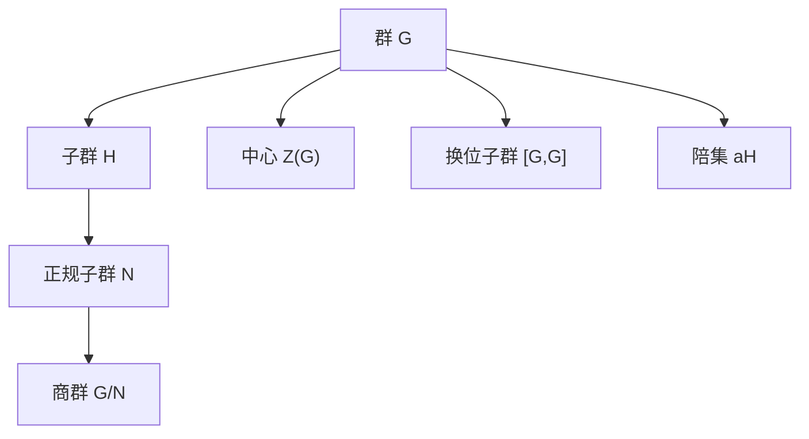

# 02-子群与陪集

## 1. 子群的概念

### 1.1 子群的定义

**子群**是群结构中的一个重要概念。给定一个群 $(G, \circ)$，如果 $H$ 是 $G$ 的一个非空子集，并且 $(H, \circ)$ 自身也构成一个群（使用与 $G$ 相同的运算），则称 $H$ 为 $G$ 的**子群**，记为 $H \leq G$。

形式上，对于群 $G$ 和其非空子集 $H$，$H$ 是 $G$ 的子群，当且仅当满足：

1. **封闭性**: 对于所有 $a, b \in H$，有 $a \circ b \in H$。
2. **单位元**: $G$ 的单位元 $e \in H$。
3. **逆元**: 对于所有 $a \in H$，有 $a^{-1} \in H$。

### 1.2 子群判定定理

实际上，可以简化子群的判定条件：

**定理 1.1** (子群判定定理): 对于群 $G$ 的非空子集 $H$，$H$ 是 $G$ 的子群当且仅当对于所有 $a, b \in H$，有 $a \circ b^{-1} \in H$。

**证明**:

- "$\Rightarrow$": 若 $H$ 是子群，则对于 $a, b \in H$，有 $b^{-1} \in H$（逆元封闭）且 $a \circ b^{-1} \in H$（封闭性）。
- "$\Leftarrow$": 若条件满足，则：
  - 由于 $H$ 非空，存在 $a \in H$。取 $b = a$，则 $a \circ a^{-1} = e \in H$，所以单位元在 $H$ 中。
  - 对于任意 $a \in H$，取 $b = e$，则 $a \circ e^{-1} = a \circ e = a \in H$，所以 $H$ 对运算封闭。
  - 对于任意 $a \in H$，取 $b = e$，则 $e \circ a^{-1} = a^{-1} \in H$，所以逆元在 $H$ 中。

因此 $H$ 满足子群的所有条件。

### 1.3 子群的例子

1. **平凡子群**: 对于任何群 $G$，单位元 $\{e\}$ 构成 $G$ 的子群，称为**平凡子群**。
2. **群本身**: $G$ 是其自身的子群。
3. **循环子群**: 对于 $g \in G$，由 $g$ 生成的集合 $\langle g \rangle = \{g^n | n \in \mathbb{Z}\}$ 是 $G$ 的子群。
4. **中心**: 群 $G$ 的**中心** $Z(G) = \{z \in G | zg = gz \text{ for all } g \in G\}$ 是 $G$ 的子群。
5. **不变子集**: 若 $S \subseteq G$，则 $S$ 在 $G$ 中的**中心化子** $C_G(S) = \{g \in G | gs = sg \text{ for all } s \in S\}$ 是 $G$ 的子群。

### 1.4 有限群的子群阶性质

对于有限群，其子群有一个重要性质：

**定理 1.2**: 对于有限群 $G$，若 $H$ 是 $G$ 的子群，则 $|H|$ 整除 $|G|$。

这是拉格朗日定理的一个直接推论，我们将在第3节中详细讨论。

## 2. 特殊的子群类型

### 2.1 循环子群

给定群 $G$ 中的一个元素 $a$，所有 $a$ 的整数幂的集合 $\langle a \rangle = \{a^n | n \in \mathbb{Z}\}$ 构成 $G$ 的一个子群，称为由 $a$ **生成**的**循环子群**。

元素 $a$ 的**阶** $|a|$ 等于循环子群 $\langle a \rangle$ 的大小。

### 2.2 正规子群

一个子群 $N \leq G$ 称为**正规子群**（或**不变子群**），如果对于所有 $g \in G$ 和 $n \in N$，有 $gng^{-1} \in N$，记为 $N \unlhd G$。

等价地，$N$ 是正规子群，当且仅当对于所有 $g \in G$，有 $gN = Ng$。

正规子群的重要性在于它可以用来构造商群，我们将在后续讨论。

### 2.3 中心和换位子群

- **中心** $Z(G) = \{z \in G | zg = gz \text{ for all } g \in G\}$ 是由所有与群中每个元素都交换的元素组成。
- **换位子群** $[G,G] = \{aba^{-1}b^{-1} | a,b \in G\}$ 是由所有换位子（形如 $aba^{-1}b^{-1}$ 的元素）生成的子群。

中心和换位子群都是 $G$ 的正规子群。

## 3. 陪集与拉格朗日定理

### 3.1 左陪集与右陪集

设 $H$ 是群 $G$ 的子群，对于 $a \in G$，定义：

- **左陪集**: $aH = \{ah | h \in H\}$
- **右陪集**: $Ha = \{ha | h \in H\}$

#### 3.1.1 陪集的性质

1. 对于 $a, b \in G$，$aH = bH$ 当且仅当 $a^{-1}b \in H$，或等价地，$b \in aH$。
2. 同一子群的不同左（或右）陪集要么相等，要么不相交。
3. 每个左（或右）陪集与 $H$ 有相同的基数。
4. $G$ 可以分解为 $H$ 的左陪集的不交并：$G = \bigcup_{i} a_i H$，其中 $a_i$ 是陪集代表元。

这种分解称为 $G$ 关于子群 $H$ 的**陪集分解**。

### 3.2 拉格朗日定理

**拉格朗日定理**是群论中最基本的定理之一：

**定理 3.1** (拉格朗日定理): 如果 $G$ 是有限群，$H$ 是 $G$ 的子群，则 $|H|$ 整除 $|G|$，且
$$|G| = |H| \cdot [G:H]$$
其中 $[G:H]$ 是子群 $H$ 在 $G$ 中的**指数**，即 $G$ 关于 $H$ 的不同左（或右）陪集的数量。

**证明**:

1. 证明所有左陪集 $aH$ 与 $H$ 有相同的元素个数。
2. 证明不同的陪集互不相交。
3. 所有陪集的并是 $G$。
4. 因此，$|G| = |H| \cdot$ (陪集数量) = $|H| \cdot [G:H]$。

### 3.3 拉格朗日定理的推论

1. **推论 3.1**: 在有限群中，任何元素的阶整除群的阶。
2. **推论 3.2**: 若 $p$ 是素数，则阶为 $p$ 的群必是循环群。
3. **推论 3.3**: 若 $|G| = p$（$p$ 为素数），则 $G$ 是循环群，且 $G$ 的每个非单位元都是生成元。

## 4. 群的直积

### 4.1 直积的定义

给定两个群 $(G_1, \circ_1)$ 和 $(G_2, \circ_2)$，它们的**直积** $G_1 \times G_2$ 是集合 $\{(g_1, g_2) | g_1 \in G_1, g_2 \in G_2\}$ 配备运算 $(g_1, g_2) \circ (h_1, h_2) = (g_1 \circ_1 h_1, g_2 \circ_2 h_2)$。

### 4.2 直积的性质

1. 若 $G_1$ 和 $G_2$ 都是群，则 $G_1 \times G_2$ 也是群。
2. $|G_1 \times G_2| = |G_1| \cdot |G_2|$。
3. 若 $G_1$ 和 $G_2$ 是阿贝尔群，则 $G_1 \times G_2$ 也是阿贝尔群。
4. $G_1$ 和 $G_2$ 可以视为 $G_1 \times G_2$ 的子群，分别通过映射 $g_1 \mapsto (g_1, e_2)$ 和 $g_2 \mapsto (e_1, g_2)$。

## 5. 实际应用示例

### 5.1 晶体学中的子群

在晶体学中，空间群是描述晶体结构对称性的数学结构。这些空间群可以分解为点群（保持一点不变的对称操作）和平移群的组合。这是子群理论的直接应用。

### 5.2 密码学中的子群

在现代密码学中，离散对数问题的难度建立在循环子群的特性上。例如：

- RSA加密使用大整数乘法形成的群。
- 椭圆曲线密码依赖于椭圆曲线群中的循环子群。

### 5.3 分子对称性

分子的对称性可用群论描述，其中各种子群表示不同类型的对称性操作（旋转、反射等）。同一分子的不同对称操作形成子群，而陪集可用于分析对称破缺。

## 6. 代码实现

### 6.1 Python中实现子群与陪集

```python
class Group:
    def __init__(self, elements, operation, identity):
        """初始化一个群
        
        Args:
            elements: 群中的元素列表
            operation: 二元运算（函数）
            identity: 单位元
        """
        self.elements = elements
        self.operation = operation
        self.identity = identity
        
    def is_subgroup(self, subset):
        """检查subset是否是群的子群"""
        if not subset or self.identity not in subset:
            return False
        
        # 检查封闭性和逆元存在性
        for a in subset:
            a_inv = next((x for x in self.elements if self.operation(a, x) == self.identity), None)
            if a_inv is None or a_inv not in subset:
                return False
                
            for b in subset:
                if self.operation(a, b) not in subset:
                    return False
                    
        return True
    
    def left_cosets(self, subgroup):
        """计算子群的所有左陪集"""
        if not self.is_subgroup(subgroup):
            raise ValueError("输入不是子群")
        
        cosets = []
        covered = set()
        
        for g in self.elements:
            if g in covered:
                continue
                
            # 创建左陪集 gH
            coset = [self.operation(g, h) for h in subgroup]
            cosets.append(coset)
            covered.update(coset)
            
        return cosets

# 使用示例：计算Z6中的子群和陪集
def mod_add(a, b, mod=6):
    """模加法，即Z6中的群运算"""
    return (a + b) % mod

# 创建Z6群
Z6 = Group(list(range(6)), lambda a, b: mod_add(a, b), 0)

# Z6的子群
H1 = [0]          # 平凡子群
H2 = [0, 3]       # <3>
H3 = [0, 2, 4]    # <2>
H4 = list(range(6)) # Z6本身

# 检查并打印陪集
print("Z6的子群与陪集:")
for i, H in enumerate([H1, H2, H3, H4], 1):
    print(f"H{i} = {H} 是子群: {Z6.is_subgroup(H)}")
    if Z6.is_subgroup(H):
        cosets = Z6.left_cosets(H)
        print(f"  左陪集: {cosets}")
        print(f"  指数[G:H] = {len(cosets)}")
        print(f"  |G| = |H| × [G:H]: {len(Z6.elements)} = {len(H)} × {len(cosets)}")
```

### 6.2 Rust中实现循环子群

```rust
use std::collections::HashSet;
use std::hash::Hash;

// 抽象二元运算特征
trait GroupOperation<T> {
    fn operate(&self, a: &T, b: &T) -> T;
    fn inverse(&self, a: &T) -> T;
    fn identity(&self) -> T;
}

// 有限群
struct FiniteGroup<T>
where
    T: Clone + Eq + Hash,
{
    elements: HashSet<T>,
    operation: Box<dyn GroupOperation<T>>,
}

impl<T> FiniteGroup<T>
where
    T: Clone + Eq + Hash,
{
    fn new(elements: HashSet<T>, operation: Box<dyn GroupOperation<T>>) -> Self {
        FiniteGroup {
            elements,
            operation,
        }
    }
    
    // 计算循环子群 <g>
    fn cyclic_subgroup(&self, g: &T) -> HashSet<T> {
        let mut subgroup = HashSet::new();
        let identity = self.operation.identity();
        subgroup.insert(identity.clone());
        
        let mut power = g.clone();
        while !subgroup.contains(&power) {
            subgroup.insert(power.clone());
            power = self.operation.operate(&power, g);
        }
        
        subgroup
    }
    
    // 检查是否为子群
    fn is_subgroup(&self, subset: &HashSet<T>) -> bool {
        if subset.is_empty() {
            return false;
        }
        
        // 检查单位元
        if !subset.contains(&self.operation.identity()) {
            return false;
        }
        
        // 检查封闭性和逆元
        for a in subset {
            let a_inv = self.operation.inverse(a);
            if !subset.contains(&a_inv) {
                return false;
            }
            
            for b in subset {
                let product = self.operation.operate(a, b);
                if !subset.contains(&product) {
                    return false;
                }
            }
        }
        
        true
    }
}

// Z6群的加法操作实现
struct ModularAddition {
    modulus: u32,
}

impl GroupOperation<u32> for ModularAddition {
    fn operate(&self, a: &u32, b: &u32) -> u32 {
        (a + b) % self.modulus
    }
    
    fn inverse(&self, a: &u32) -> u32 {
        if *a == 0 {
            0
        } else {
            self.modulus - *a
        }
    }
    
    fn identity(&self) -> u32 {
        0
    }
}

fn main() {
    // 创建Z6群
    let elements: HashSet<u32> = (0..6).collect();
    let operation = Box::new(ModularAddition { modulus: 6 });
    let z6 = FiniteGroup::new(elements, operation);
    
    // 计算并打印各元素的循环子群
    for i in 0..6 {
        let subgroup = z6.cyclic_subgroup(&i);
        println!("<{}> = {:?}", i, subgroup);
        println!("阶: {}", subgroup.len());
        println!("是子群: {}", z6.is_subgroup(&subgroup));
        println!();
    }
}
```

## 7. 练习题

1. 证明：群 $G$ 的子群的交集仍然是子群，但并集一般不是子群。

2. 如果 $H$ 和 $K$ 都是群 $G$ 的子群，什么条件下 $HK = \{hk | h \in H, k \in K\}$ 也是子群？

3. 证明：$H$ 是群 $G$ 的正规子群当且仅当对于任意 $g \in G$，有 $gHg^{-1} = H$。

4. 求出群 $S_3$（3元对称群）的所有子群，并验证拉格朗日定理。

5. 证明：若 $p$ 是素数，$G$ 是阶为 $p$ 的群，则 $G$ 是循环群。

6. 证明：有限群中任意两个相同阶的循环子群同构。

7. 设 $G$ 是有限群，$H$ 和 $K$ 是 $G$ 的子群。证明：$|HK| = \frac{|H| \cdot |K|}{|H \cap K|}$。

## 8. 参考文献

1. Dummit, D. S., & Foote, R. M. (2004). *Abstract Algebra* (3rd ed.). John Wiley & Sons.
2. Lang, S. (2002). *Algebra* (3rd ed.). Springer.
3. Artin, M. (1991). *Algebra*. Prentice Hall.
4. Rotman, J. J. (1994). *An Introduction to the Theory of Groups* (4th ed.). Springer.
5. Gallian, J. A. (2012). *Contemporary Abstract Algebra* (8th ed.). Cengage Learning.

---

**创建日期**: 2025-06-27
**最后更新**: 2025-06-27

## 子群与陪集结构可视化



### 多表征内容导航

- [Python子群与陪集代码实现](#6-代码实现)
- [子群判定、陪集分解与定理证明](#1-子群的概念)
- [结构表格与例题](#3-陪集与拉格朗日定理)
- [练习与思考题见各分支详细文件]

## 认知、教育、AI与哲学视角下的子群与陪集

- **认知科学**：子群与陪集体现了人类对"部分-整体""分解-归约""等价类"认知能力。
- **教育学**：子群与陪集的分层与分解思想有助于学生理解结构递进、归纳与分类。
- **人工智能**：陪集分解、等价类划分思想广泛用于知识压缩、范畴化、自动推理等AI任务。
- **数学哲学**：子群与陪集是结构主义、分层哲学等流派的典范，体现了"结构分解与归约"的现代数学观。

---

[返回"群论总览"](./00-群论总览.md) ｜ [返回"代数结构与理论总览"](../00-代数结构与理论总览.md)

相关主题跳转：

- [群的定义与性质](./01-群的定义与性质.md)
- [群同态与同构](./03-群同态与同构.md)
