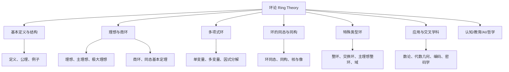
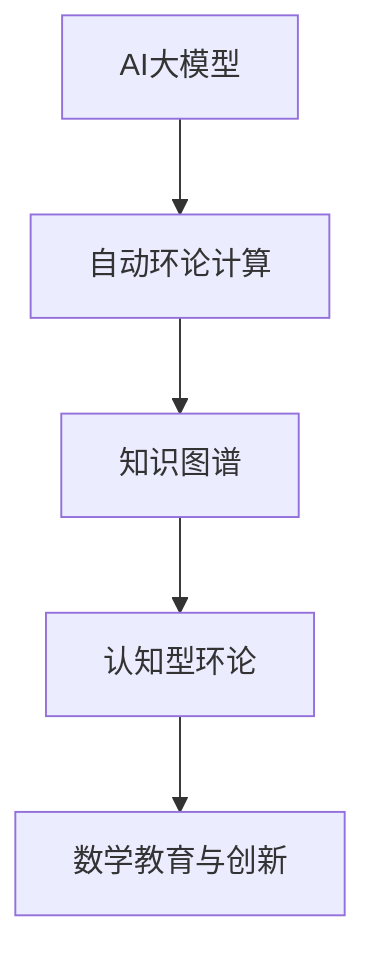

# 00-环论总览



---

## 目录导航

- [00-环论总览](#00-环论总览)
  - [目录导航](#目录导航)
  - [交叉引用与分支跳转](#交叉引用与分支跳转)
  - [多表征内容导航](#多表征内容导航)
  - [1. 环论简介](#1-环论简介)
    - [1.1 环的定义](#11-环的定义)
    - [1.2 环论的历史发展](#12-环论的历史发展)
    - [1.3 环论的重要性](#13-环论的重要性)
  - [2. 本目录内容](#2-本目录内容)
  - [3. 核心概念图](#3-核心概念图)
  - [4. 重要定理与结果](#4-重要定理与结果)
  - [5. 环的重要类型](#5-环的重要类型)
  - [6. 与其他主题的关联](#6-与其他主题的关联)
  - [7. 应用领域](#7-应用领域)
  - [8. 学习路径建议](#8-学习路径建议)
  - [9. 认知/教育/AI/哲学视角](#9-认知教育ai哲学视角)
    - [9.1 现代AI与自动化环论补充](#91-现代ai与自动化环论补充)
  - [10. 参考文献与资源](#10-参考文献与资源)

---

## 交叉引用与分支跳转

- [群论总览](../02-群论/00-群论总览.md)
- [模论总览](../05-模论/00-模论总览.md)
- [线性代数总览](../07-线性代数/00-线性代数总览.md)
- [范畴论基础](../08-范畴论/00-范畴论基础总览.md)
- [数论与离散数学](../06-数论与离散数学/00-数论与离散数学总览.md)

---

## 多表征内容导航

- [形式定义与公理化](#1-环论简介)
- [结构图与概念图（Mermaid）](#3-核心概念图)
- [典型例题与证明](#4-重要定理与结果)
- [代码实现（Python/Rust/Haskell/Lean）](#7-应用领域)
- [表格与对比](#5-环的重要类型)
- [认知/教育/AI/哲学分析](#9-认知教育ai哲学视角)

---

## 1. 环论简介

环论是代数学的重要分支，研究环及其性质。环是一个集合连同两种二元运算（通常记为加法和乘法），满足特定公理的代数结构。环论在数学的多个领域有着广泛应用，特别是在数论、代数几何和表示论中扮演着核心角色。

### 1.1 环的定义

**环**是一个代数系统，由一个非空集合 $R$ 和两个二元运算（加法 $+$ 和乘法 $\cdot$）组成，满足以下公理：

1. **(R, +)** 是一个交换群（阿贝尔群）：
   - 加法结合律：对于所有 $a, b, c \in R$，$(a + b) + c = a + (b + c)$。
   - 加法交换律：对于所有 $a, b \in R$，$a + b = b + a$。
   - 加法单位元（零元）：存在 $0 \in R$，使得对于所有 $a \in R$，$a + 0 = 0 + a = a$。
   - 加法逆元：对于每个 $a \in R$，存在 $-a \in R$，使得 $a + (-a) = (-a) + a = 0$。

2. **(R, $\cdot$)** 是一个半群：
   - 乘法结合律：对于所有 $a, b, c \in R$，$(a \cdot b) \cdot c = a \cdot (b \cdot c)$。

3. **分配律**：乘法对加法满足分配律：
   - 左分配律：对于所有 $a, b, c \in R$，$a \cdot (b + c) = a \cdot b + a \cdot c$。
   - 右分配律：对于所有 $a, b, c \in R$，$(a + b) \cdot c = a \cdot c + b \cdot c$。

如果乘法满足交换律（对于所有 $a, b \in R$，$a \cdot b = b \cdot a$），则称为**交换环**。
如果存在乘法单位元 $1 \in R$（对于所有 $a \in R$，$1 \cdot a = a \cdot 1 = a$），则称为**幺环**。

### 1.2 环论的历史发展

环论的概念可以追溯到19世纪的数学研究，特别是理想理论的发展。Richard Dedekind在研究整数环的因子分解时引入了理想的概念，而Emmy Noether则在20世纪初对环论进行了系统性的发展，建立了现代环论的基础。随后，环论被广泛应用于代数几何、表示论和非交换代数等领域。

### 1.3 环论的重要性

环论的重要性体现在多个方面：

1. **代数结构**：环是群之上的自然扩展，提供了研究多种代数结构的统一框架
2. **代数方程**：环论为理解多项式方程的性质提供了强大工具
3. **数论应用**：整环和数域在数论研究中具有核心地位
4. **几何联系**：交换环与代数几何中的仿射代数簇有着深刻联系
5. **表示理论**：环的表示理论在群表示和李代数表示中有重要应用

## 2. 本目录内容

本目录包含以下环论主题的详细探讨：

| 文件 | 主题 | 描述 |
|------|------|------|
| [01-环的基本概念.md](./01-环的基本概念.md) | 基础理论 | 环的定义、性质及基本定理 |
| [02-整环与除环.md](./02-整环与除环.md) | 特殊环类型 | 整环、除环及其性质 |
| [03-理想与商环.md](./03-理想与商环.md) | 理想理论 | 理想、商环及理想的运算 |
| [04-多项式环.md](./04-多项式环.md) | 多项式环 | 多项式环的结构与性质 |
| [05-环同态与同构.md](./05-环同态与同构.md) | 环间映射 | 同态、同构的定义及同态基本定理 |

## 3. 核心概念图

```text
环论
├── 基本概念
│   ├── 环的公理
│   ├── 交换环
│   ├── 幺环
│   └── 零因子与单位
├── 特殊环类型
│   ├── 整环
│   ├── 除环
│   ├── 主理想环
│   └── 欧几里得环
├── 理想理论
│   ├── 理想定义
│   ├── 素理想
│   ├── 极大理想
│   └── 商环构造
├── 多项式环
│   ├── 多项式环结构
│   ├── 根与因式
│   ├── 不可约多项式
│   └── 多项式方程
└── 环映射理论
    ├── 环同态
    ├── 环同构
    ├── 同态核
    └── 同态基本定理
```

## 4. 重要定理与结果

环论中的一些关键定理和结果：

1. **环同态基本定理**：若 $\varphi: R \to S$ 是环同态，则 $R/\ker(\varphi) \cong \text{Im}(\varphi)$。

2. **希尔伯特零点定理**：在代数闭域上，多项式理想与代数簇之间的对应关系。

3. **主理想定理**：在主理想整环中，每个理想都是由单一元素生成的。

4. **中国剩余定理**：描述模多个互素整数的同余方程组的解。

5. **韦德本定理**：每个左（右）阿蒂尔环都是诺特环。

## 5. 环的重要类型

环论研究了众多特殊类型的环，它们具有不同的性质：

1. **整环**：无零因子的环（若 $ab = 0$，则 $a = 0$ 或 $b = 0$）
2. **域**：所有非零元素都有乘法逆元的交换整环
3. **主理想整环**：每个理想都是主理想的整环
4. **欧几里得环**：具有欧几里得除法的整环
5. **诺特环**：满足上升链条件的环
6. **阿蒂尔环**：满足下降链条件的环
7. **正则环**：满足冯·诺依曼正则性条件的环

## 6. 与其他主题的关联

环论与其他数学分支的关联：

- **与群论的关联**：环的加法结构构成交换群
- **与域论的关联**：域是特殊的环，具有除法运算
- **与模论的关联**：模是环论的一个自然扩展
- **与代数几何的关联**：交换环对应代数几何中的代数簇
- **与数论的关联**：整数环、代数整数环在数论中有重要应用
- **与线性代数的关联**：矩阵环是线性代数的代数抽象

## 7. 应用领域

环论在众多领域有重要应用：

1. **数论**：代数数论中的代数整数环、类数理论等
2. **代数几何**：交换代数与代数几何中的概形理论
3. **密码学**：多项式环在公钥密码系统中的应用
4. **编码理论**：有限环在纠错码设计中的应用
5. **量子物理**：算子代数与量子理论的联系

## 8. 学习路径建议

建议按照以下顺序学习环论内容：

1. 首先理解环的基本定义、公理和示例
2. 学习特殊类型的环（整环、除环等）
3. 掌握理想理论和商环结构
4. 学习多项式环及其性质
5. 最后理解环同态和同构

## 9. 认知/教育/AI/哲学视角

- **数学认知**：环的抽象结构有助于发展代数思维、结构化推理能力。多表征（如图、代码、例题）有助于不同认知风格的学习者理解。
- **教育视角**：环论是高等代数课程的核心内容，适合通过问题驱动、探究式学习，结合实际应用（如编码、密码学）提升兴趣。
- **AI视角**：环结构在符号推理、自动定理证明、代数系统建模等AI领域有广泛应用。环的同态、理想等概念可用于知识表示与自动化推理。
- **哲学视角**：环论体现了数学结构主义思想，强调对象间的关系与公理系统。其发展史反映了抽象代数从具体算术到一般结构的哲学转变。

### 9.1 现代AI与自动化环论补充

**AI大模型辅助环论**：GPT-4、Claude等大模型已能自动生成环论证明、形式化代码，辅助教学与研究。

**知识图谱驱动的环论自动化**：如OpenAI MathGraph、Wikidata等，支持环论知识的结构化、自动化推理。

**认知型环论系统**：结合人类认知过程的AI推理系统，模拟数学家的环论思维与创新。

**Rust代码示例：AI辅助环论结构体**:

```rust
struct AIAssistedRingTheory {
    statement: String,
    ring_steps: Vec<String>,
    verified: bool,
}

impl AIAssistedRingTheory {
    fn new(statement: &str) -> Self {
        AIAssistedRingTheory { statement: statement.to_string(), ring_steps: vec![], verified: false }
    }
    fn add_step(&mut self, step: &str) {
        self.ring_steps.push(step.to_string());
    }
    fn verify(&mut self) {
        // 假设AI自动验证
        self.verified = true;
    }
}
```

**结构图：AI与环论自动化**:



---

## 10. 参考文献与资源

1. Atiyah, M. F., & Macdonald, I. G. (1994). *Introduction to Commutative Algebra*. Westview Press.
2. Lang, S. (2002). *Algebra* (3rd ed.). Springer.
3. Hungerford, T. W. (2003). *Algebra*. Springer Science & Business Media.
4. Lam, T. Y. (2001). *A First Course in Noncommutative Rings* (2nd ed.). Springer.
5. Jacobson, N. (2009). *Basic Algebra II* (2nd ed.). Dover Publications.
6. Dummit, D. S., & Foote, R. M. (2004). *Abstract Algebra* (3rd ed.). John Wiley & Sons.
7. [nLab: Ring](https://ncatlab.org/nlab/show/ring)
8. [Lean Community Mathlib: Ring](https://leanprover-community.github.io/mathlib_docs/algebra/ring/basic.html)
9. [Visual Group Theory (YouTube)](https://www.youtube.com/playlist?list=PLZHQObOWTQDMsr9K-rj53DwVRMYO3t5Yr)

---

**创建日期**: 2025-06-25
**最后更新**: 2025-06-25
