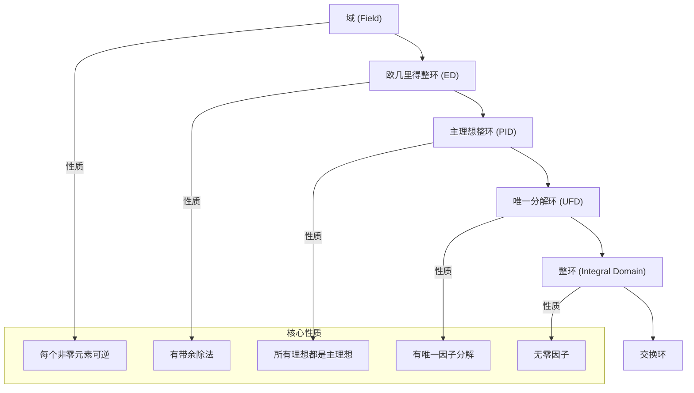

# 4. 特殊的环与域

**版本**: 1.0
**日期**: 2025-07-02

---

## 4.1. 核心思想

一般的环结构非常广泛，可以包含一些与我们日常经验相悖的行为（比如两个非零的东西乘起来等于零）。为了进行更深入的代数研究，特别是推广算术基本定理（唯一素因子分解），数学家们识别出了一系列性质不断增强、行为越来越"良好"的交换环。

这个谱系从最基本的 **整环 (Integral Domain)** 开始，它仅仅是消除了零因子；经过 **唯一分解环 (UFD)** 和 **主理想整环 (PID)**，最终达到最完美的结构——**域 (Field)**，在域中，所有非零元素都有乘法逆元。

## 4.2. 整环 (Integral Domain)

**定义 4.2.1 (整环)**

一个 **有单位元的交换环** $R$ 如果 **没有零因子**，则称其为 **整环**。
换句话说，对于任意 $a, b \in R$，如果 $ab=0$，那么必然有 $a=0$ 或 $b=0$。

* **动机**: 这个性质被称为"消去律"，它使得我们可以像在初等代数中一样进行约分。
* **示例**:
  * $\mathbb{Z}$ 是一个整环。
  * 任何域（如 $\mathbb{Q}, \mathbb{R}, \mathbb{C}$）都是整环。
  * $\mathbb{Z}_6$ 不是整环，因为 $2 \cdot 3 = 0$。
* **定理**: 有限整环必然是一个域。

## 4.3. 唯一分解环 (Unique Factorization Domain, UFD)

**定义 4.3.1 (UFD)**

一个整环 $R$ 被称为 **唯一分解环**，如果它满足算术基本定理的推广：

1. $R$ 中每个非零、非可逆元都可以被分解为一系列 **不可约元 (Irreducible Element)** 的乘积。
2. 这种分解在不考虑顺序和可逆元乘子的情况下是 **唯一** 的。

* **不可约元**: 类似于素数，一个元素 $p$ 不可约，是指它不能被分解为两个非可逆元的乘积。
* **示例**:
  * $\mathbb{Z}$ 是UFD（算术基本定理）。
  * 域 $F$ 上的多项式环 $F[x]$ 是UFD。
  * $\mathbb{Z}[\sqrt{-5}]$ 不是UFD，因为存在两种不同的分解方式：$6 = 2 \cdot 3 = (1+\sqrt{-5})(1-\sqrt{-5})$。

## 4.4. 主理想整环 (Principal Ideal Domain, PID)

**定义 4.4.1 (PID)**

一个整环 $R$ 如果其 **所有** 理想都是 **主理想**（即都可以由单个元素生成），则称其为 **主理想整环**。

* **动机**: PID的理想结构极其简单，使得研究它们变得容易。
* **示例**:
  * $\mathbb{Z}$ 是PID。
  * 域 $F$ 上的多项式环 $F[x]$ 是PID。
  * $\mathbb{Z}[x]$ 不是PID，例如理想 $(2, x)$ 就不能由单个多项式生成。

## 4.5. 域 (Field)

**定义 4.5.1 (域)**

一个 **域** 是一个有单位元的交换环 $F$，其中 **每一个非零元素都是可逆元**。
即，$(F\setminus\{0\}, \cdot)$ 构成一个阿贝尔群。

* **动机**: 域是进行算术运算（加、减、乘、除）最完美的舞台。
* **示例**:
  * 有理数域 $\mathbb{Q}$，实数域 $\mathbb{R}$，复数域 $\mathbb{C}$。
  * 有限域 $\mathbb{Z}_p$ (当p是素数时)。

## 4.6. 环的谱系关系

这些特殊环形成了一个严格的蕴含关系链：

**域 (Field) $\implies$ 欧几里得整环 (ED) $\implies$ 主理想整环 (PID) $\implies$ 唯一分解环 (UFD) $\implies$ 整环 (Integral Domain)**

* **欧几里得整环**: 是一种定义了"带余除法"的整环，例如 $\mathbb{Z}$ 和 $F[x]$。它是证明一个环是PID的有力工具。

---
[前往上一节: 03-环同态与同构.md](./03-环同态与同构.md) | [前往下一节: 05-多项式环.md](./05-多项式环.md) | [返回总览](./00-环论总览.md)
