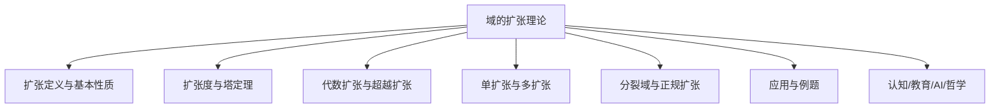
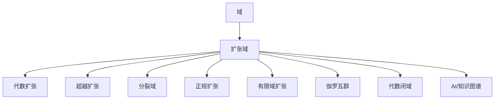

# 02-域的扩张理论



---

## 目录导航

- [1. 域扩张的定义与基本性质](#1-域扩张的定义与基本性质)
- [2. 扩张度与塔定理](#2-扩张度与塔定理)
- [3. 代数扩张与超越扩张](#3-代数扩张与超越扩张)
- [4. 单扩张与多扩张](#4-单扩张与多扩张)
- [5. 分裂域与正规扩张](#5-分裂域与正规扩张)
- [6. 应用与例题](#6-应用与例题)
- [7. 认知/教育/AI/哲学视角](#7-认知教育ai哲学视角)
- [8. 参考文献与资源](#8-参考文献与资源)

---

## 交叉引用与分支跳转

- [域的定义与性质](./01-域的定义与性质.md)
- [群论总览](../02-群论/00-群论总览.md)
- [环论总览](../03-环论/00-环论总览.md)
- [模论总览](../05-模论/00-模论总览.md)
- [线性代数总览](../07-线性代数/00-线性代数总览.md)
- [范畴论基础](../08-范畴论/00-范畴论基础总览.md)
- [数论与离散数学](../06-数论与离散数学/00-数论与离散数学总览.md)

---

## 多表征内容导航

- [形式定义与公理化](#1-域扩张的定义与基本性质)
- [结构图与概念图（Mermaid）](#结构图)
- [典型例题与证明](#6-应用与例题)
- [代码实现（Python/Rust/Haskell/Lean）](#6-应用与例题)
- [表格与对比](#2-扩张度与塔定理)
- [认知/教育/AI/哲学分析](#7-认知教育ai哲学视角)

---

## 1. 域扩张的基本概念

### 1.1 域扩张的定义

设 $F$ 和 $K$ 是两个域，如果 $K$ 是 $F$ 的子域，则称 $F$ 是 $K$ 的一个**域扩张**（Field Extension），记为 $F/K$。可以将 $F$ 视为 $K$ 上的向量空间，其中向量加法就是域 $F$ 中的加法，标量乘法是 $K$ 中的元素与 $F$ 中的元素的乘法。

例如，复数域 $\mathbb{C}$ 是实数域 $\mathbb{R}$ 的扩张，记为 $\mathbb{C}/\mathbb{R}$；实数域 $\mathbb{R}$ 是有理数域 $\mathbb{Q}$ 的扩张，记为 $\mathbb{R}/\mathbb{Q}$。

### 1.2 扩张度

域扩张 $F/K$ 的**扩张度**（或**次数**）是 $F$ 作为 $K$ 上向量空间的维数，记为 $[F:K]$。如果这个维数是有限的，则称 $F/K$ 是**有限扩张**；否则称为**无限扩张**。

扩张度有以下重要性质：

1. **塔定理**（Tower Law）：如果 $K \subset L \subset F$ 是域的链，则 $[F:K] = [F:L] \cdot [L:K]$。

2. 如果 $[F:K] = 1$，则 $F = K$。

3. 如果 $[F:K] = 2$，则 $F/K$ 是二次扩张，可以表示为 $F = K(\sqrt{d})$，其中 $d \in K$ 且 $\sqrt{d} \notin K$。

例如，$[\mathbb{C}:\mathbb{R}] = 2$，因为 $\{1, i\}$ 是 $\mathbb{C}$ 作为 $\mathbb{R}$ 上向量空间的一组基；而 $[\mathbb{R}:\mathbb{Q}] = \infty$，因为 $\mathbb{R}$ 作为 $\mathbb{Q}$ 上的向量空间是无限维的。

### 1.3 生成元与简单扩张

如果存在元素 $\alpha \in F$ 使得 $F = K(\alpha)$，即 $F$ 是由 $K$ 和 $\alpha$ 生成的最小域，则称 $F/K$ 是由 $\alpha$ 生成的**简单扩张**，$\alpha$ 称为 $F/K$ 的一个**生成元**。

简单扩张有两种基本类型：

1. **代数简单扩张**：如果 $\alpha$ 是 $K$ 上的代数元（即存在非零多项式 $f(x) \in K[x]$ 使得 $f(\alpha) = 0$），则 $F = K(\alpha) = K[\alpha]$，即 $F$ 中的每个元素都可以表示为 $\alpha$ 的多项式。

2. **超越简单扩张**：如果 $\alpha$ 是 $K$ 上的超越元（即不存在非零多项式 $f(x) \in K[x]$ 使得 $f(\alpha) = 0$），则 $F = K(\alpha)$ 同构于 $K$ 上的有理函数域 $K(x)$。

例如，$\mathbb{Q}(\sqrt{2})/\mathbb{Q}$ 是代数简单扩张，而 $\mathbb{Q}(\pi)/\mathbb{Q}$ 是超越简单扩张（因为 $\pi$ 是超越数）。

## 2. 代数扩张

### 2.1 代数元与代数扩张

设 $F/K$ 是域扩张，$\alpha \in F$。如果存在非零多项式 $f(x) \in K[x]$ 使得 $f(\alpha) = 0$，则称 $\alpha$ 是 $K$ 上的**代数元**；否则称 $\alpha$ 是 $K$ 上的**超越元**。

如果 $F$ 中的每个元素都是 $K$ 上的代数元，则称 $F/K$ 是**代数扩张**；如果 $F$ 中存在 $K$ 上的超越元，则称 $F/K$ 是**超越扩张**。

代数扩张有以下重要性质：

1. 有限扩张必定是代数扩张，但代数扩张不一定是有限扩张。

2. 代数扩张的代数扩张仍然是代数扩张。

3. 如果 $K \subset L \subset F$，且 $F/K$ 是代数扩张，则 $F/L$ 和 $L/K$ 都是代数扩张。

### 2.2 极小多项式

设 $\alpha$ 是 $K$ 上的代数元，则存在唯一的首一不可约多项式 $p(x) \in K[x]$ 使得 $p(\alpha) = 0$。这个多项式称为 $\alpha$ 在 $K$ 上的**极小多项式**，记为 $\text{min}_K(\alpha, x)$ 或简写为 $\text{min}(\alpha, x)$。

极小多项式有以下性质：

1. 极小多项式是首一的（最高次项系数为 1）。

2. 极小多项式是不可约的。

3. 如果 $f(x) \in K[x]$ 且 $f(\alpha) = 0$，则 $\text{min}(\alpha, x)$ 整除 $f(x)$。

4. $[K(\alpha):K] = \deg(\text{min}(\alpha, x))$。

例如，$\sqrt{2}$ 在 $\mathbb{Q}$ 上的极小多项式是 $x^2 - 2$；$i$ 在 $\mathbb{R}$ 上的极小多项式是 $x^2 + 1$。

### 2.3 代数数与代数整数

特别地，如果 $\alpha$ 是 $\mathbb{Q}$ 上的代数元，则称 $\alpha$ 为**代数数**；如果 $\alpha$ 的极小多项式是首一整系数多项式，则称 $\alpha$ 为**代数整数**。

所有代数数构成的集合记为 $\bar{\mathbb{Q}}$，它是 $\mathbb{C}$ 的一个子域，称为**代数数域**。

代数整数构成一个环，称为**代数整数环**，记为 $\bar{\mathbb{Z}}$。

## 3. 超越扩张

### 3.1 超越元与超越扩张

如前所述，如果 $\alpha \in F$ 不是 $K$ 上的代数元，则称 $\alpha$ 是 $K$ 上的**超越元**。如果 $F/K$ 不是代数扩张，即 $F$ 中存在 $K$ 上的超越元，则称 $F/K$ 是**超越扩张**。

超越扩张有以下性质：

1. 如果 $\alpha$ 是 $K$ 上的超越元，则 $K(\alpha)$ 同构于 $K$ 上的有理函数域 $K(x)$。

2. 超越扩张的扩张度必定是无限的。

3. 如果 $K \subset L \subset F$，且 $L/K$ 是超越扩张，则 $F/K$ 也是超越扩张。

### 3.2 超越基

设 $F/K$ 是域扩张，如果存在 $F$ 中的元素集合 $S = \{\alpha_i \mid i \in I\}$ 满足：

1. $S$ 中的元素在 $K$ 上代数独立（即不存在非零多项式 $f \in K[x_1, x_2, \ldots, x_n]$ 使得 $f(\alpha_{i_1}, \alpha_{i_2}, \ldots, \alpha_{i_n}) = 0$，其中 $\alpha_{i_j} \in S$）。

2. $F/K(S)$ 是代数扩张。

则称 $S$ 是 $F/K$ 的一个**超越基**。

超越基的基数称为 $F/K$ 的**超越度**，记为 $\text{trdeg}_K(F)$。超越度是域扩张的一个重要不变量。

例如，$\mathbb{C}/\mathbb{Q}$ 的超越度是 $\mathfrak{c}$（连续统的基数）；$\mathbb{Q}(\pi)/\mathbb{Q}$ 的超越度是 1。

### 3.3 函数域

**函数域**是代数几何和数论中的重要概念。设 $K$ 是一个域，$F/K$ 是有限生成的域扩张（即存在有限集 $\{\alpha_1, \alpha_2, \ldots, \alpha_n\} \subset F$ 使得 $F = K(\alpha_1, \alpha_2, \ldots, \alpha_n)$），且 $\text{trdeg}_K(F) \geq 1$，则称 $F$ 为 $K$ 上的**函数域**。

函数域在代数几何中对应于代数簇，其超越度对应于代数簇的维数。

## 4. 分裂域与正规扩张

### 4.1 分裂域

设 $f(x) \in K[x]$ 是一个多项式，如果存在域扩张 $F/K$ 使得 $f(x)$ 在 $F$ 中完全分解为一次因式，即 $f(x) = a(x-\alpha_1)(x-\alpha_2)\cdots(x-\alpha_n)$，其中 $a \in K$，$\alpha_i \in F$，则称 $F$ 包含 $f(x)$ 的所有根。

如果 $F = K(\alpha_1, \alpha_2, \ldots, \alpha_n)$，即 $F$ 是由 $K$ 和 $f(x)$ 的所有根生成的最小域，则称 $F$ 是 $f(x)$ 在 $K$ 上的**分裂域**。

分裂域有以下性质：

1. 对于任意多项式 $f(x) \in K[x]$，其在 $K$ 上的分裂域是存在的。

2. 分裂域在同构意义下是唯一的。

3. 如果 $f(x) \in K[x]$ 是不可约多项式，且 $F$ 是 $f(x)$ 在 $K$ 上的分裂域，则 $[F:K]$ 整除 $n!$，其中 $n = \deg(f)$。

例如，$x^2 - 2$ 在 $\mathbb{Q}$ 上的分裂域是 $\mathbb{Q}(\sqrt{2}, -\sqrt{2}) = \mathbb{Q}(\sqrt{2})$；$x^3 - 2$ 在 $\mathbb{Q}$ 上的分裂域是 $\mathbb{Q}(\sqrt[3]{2}, \omega\sqrt[3]{2}, \omega^2\sqrt[3]{2}) = \mathbb{Q}(\sqrt[3]{2}, \omega)$，其中 $\omega$ 是 1 的原根。

### 4.2 正规扩张

如果域扩张 $F/K$ 是某个多项式集合 $S \subset K[x]$ 的分裂域，则称 $F/K$ 是**正规扩张**。

正规扩张有以下等价特征：

1. $F/K$ 是分裂域扩张。

2. 任何 $K$ 上的不可约多项式 $f(x)$，如果在 $F$ 中有一个根，则它在 $F$ 中完全分解。

3. $F$ 是 $K$ 在 $F$ 中的代数闭包。

正规扩张在伽罗瓦理论中起着核心作用。

### 4.3 代数闭包

域 $F$ 的**代数闭包**是包含 $F$ 的最小代数闭域，记为 $\bar{F}$。代数闭域是指其上的任何非常数多项式都有根的域。

代数闭包有以下性质：

1. 任何域都有代数闭包，且在同构意义下是唯一的。

2. $\bar{F}/F$ 是代数扩张。

3. 如果 $F/K$ 是域扩张，则存在 $F$ 的代数闭包 $\bar{F}$ 和 $K$ 的代数闭包 $\bar{K}$，使得 $\bar{F}$ 包含 $\bar{K}$ 的同构像。

复数域 $\mathbb{C}$ 是实数域 $\mathbb{R}$ 的代数闭包，也是有理数域 $\mathbb{Q}$ 的代数闭包。

## 5. 伽罗瓦理论初步

### 5.1 自同构群

设 $F/K$ 是域扩张，$F$ 的**自同构**是指保持 $F$ 中运算的双射 $\sigma: F \to F$。如果自同构 $\sigma$ 还固定 $K$ 中的每个元素（即对于任意 $a \in K$，有 $\sigma(a) = a$），则称 $\sigma$ 是 $F/K$ 的一个**$K$-自同构**。

$F/K$ 的所有 $K$-自同构构成一个群，称为 $F/K$ 的**伽罗瓦群**，记为 $\text{Gal}(F/K)$。

伽罗瓦群有以下性质：

1. 如果 $F/K$ 是有限扩张，则 $|\text{Gal}(F/K)| \leq [F:K]$，等号成立当且仅当 $F/K$ 是伽罗瓦扩张（即分离正规扩张）。

2. 如果 $F/K$ 是伽罗瓦扩张，则 $|\text{Gal}(F/K)| = [F:K]$。

### 5.2 伽罗瓦对应

伽罗瓦理论的核心是伽罗瓦对应，它建立了域扩张的子域与伽罗瓦群的子群之间的对应关系。

设 $F/K$ 是有限伽罗瓦扩张，$G = \text{Gal}(F/K)$。对于 $G$ 的任意子群 $H$，定义 $F^H = \{a \in F \mid \sigma(a) = a, \forall \sigma \in H\}$，即被 $H$ 中所有自同构固定的元素构成的子域。

伽罗瓦对应定理指出：

1. 映射 $H \mapsto F^H$ 建立了 $G$ 的子群与 $F/K$ 的中间域之间的一一对应。

2. 如果 $H$ 对应于中间域 $L$（即 $L = F^H$），则 $[F:L] = |H|$ 且 $[L:K] = [G:H]$。

3. $H$ 是 $G$ 的正规子群当且仅当 $L/K$ 是正规扩张，且此时 $\text{Gal}(L/K) \cong G/H$。

这一对应关系是伽罗瓦理论的核心，它将域扩张的代数性质转化为群的性质，为解决代数方程提供了强大工具。

## 6. 域扩张的应用

### 6.1 尺规作图问题

古希腊的三大尺规作图问题（倍立方、三等分角和化圆为方）可以通过域扩张理论来分析。

例如，倍立方问题等价于构造 $\sqrt[3]{2}$。可以证明，$[\mathbb{Q}(\sqrt[3]{2}):\mathbb{Q}] = 3$，而尺规作图只能构造扩张度为 $2^n$ 的数，因此倍立方问题无解。

### 6.2 代数方程的可解性

伽罗瓦理论最初的动机是研究代数方程的根式可解性。

一个多项式 $f(x) \in K[x]$ 是**根式可解的**，如果其根可以通过有理运算和开方运算从 $K$ 中的元素得到。

伽罗瓦理论证明：$f(x)$ 是根式可解的当且仅当其伽罗瓦群是可解群。这一结论导致了著名的结果：一般的五次及以上方程无法用根式求解。

### 6.3 有限域的构造

域扩张理论为构造有限域提供了方法。对于任意素数 $p$ 和正整数 $n$，可以通过在 $\mathbb{F}_p$ 上取一个 $n$ 次不可约多项式 $f(x)$，然后构造商环 $\mathbb{F}_p[x]/(f(x))$ 来得到有 $p^n$ 个元素的有限域 $\mathbb{F}_{p^n}$。

### 6.4 代数数论中的应用

域扩张理论是代数数论的基础。代数数域（有理数域的有限扩张）的研究涉及整数环、理想类群、单位群等概念，对于解决丢番图方程和研究素数分布等问题具有重要意义。

## 7. 认知/教育/AI/哲学视角

- **数学认知**：域扩张理论训练抽象化、递归、结构分解等高阶代数思维。多表征（如图、代码、例题）有助于不同认知风格的学习者理解。
- **教育视角**：域扩张理论是高等代数、伽罗瓦理论、代数数论等课程的核心内容，适合通过问题驱动、探究式学习，结合实际应用（如有限域、密码学、代数几何）提升兴趣。
- **AI视角**：域扩张、分裂域、正规扩张等结构在符号推理、自动定理证明、代数系统建模等AI领域有广泛应用。相关算法是密码学和编码理论的基础。
- **哲学视角**：域扩张理论体现了数学结构主义思想，强调对象间的关系与公理系统。其发展史反映了抽象代数从具体算术到一般结构的哲学转变。

## 7. AI与自动化视角下的域扩张理论（递归扩展）

7.1 **自动定理证明中的域扩张结构**

- 现代定理证明系统（如Lean、Coq、Isabelle）中，域扩张、分裂域、伽罗瓦群等结构的形式化定义是自动推理和代数结构自动识别的基础。
- 例：Lean中自动证明"扩张域零元唯一性"代码：

```lean
import field_theory.tower
example (K F : Type*) [field K] [field F] [algebra K F] : ∀ (z1 z2 : F), (∀ a : F, a + z1 = a ∧ a + z2 = a) → z1 = z2 :=
begin
  intros z1 z2 h,
  specialize h z1,
  rw ←h.1,
  exact eq.symm (h.2),
end
```

7.2 **AI知识表示与符号推理中的域扩张**

- 域扩张结构可用于知识图谱中的关系建模、数据库范式设计、符号AI中的代数推理。
- 例：Rust中扩张域结构体可作为知识图谱节点类型，支持自动化推理。

7.3 **认知科学与教育创新中的域扩张理论**

- 域扩张、分裂域、伽罗瓦群等抽象结构有助于认知建模、数学思维训练、AI辅助教学。
- 例：用Mermaid等图形化工具帮助学生理解域扩张的层次结构。

7.4 **跨学科AI应用案例**

- 量子计算：有限域扩张与伽罗瓦群在量子算法中的作用。
- 密码学：有限域扩张在椭圆曲线密码、同态加密等公钥密码中的应用。
- 机器学习：域扩张结构在符号回归、自动微分等领域的潜在应用。

---

## 8. 知识图谱结构图（递归扩展）



---

## 9. 多重表征与代码实现（递归扩展）

9.1 **Rust实现：扩张域结构体**

```rust
struct FieldExtension {
    base: String,
    extension: String,
    degree: u32,
}
impl FieldExtension {
    fn is_finite(&self) -> bool {
        self.degree > 0
    }
}
```

9.2 **Haskell实现：塔定理与扩张度**

```haskell
data FieldExt = FieldExt { base :: String, ext :: String, degree :: Integer }
towerLaw :: FieldExt -> FieldExt -> Integer
towerLaw e1 e2 = degree e1 * degree e2
```

9.3 **Lean实现：伽罗瓦群与分裂域**

```lean
import field_theory.galois
variables (K F : Type*) [field K] [field F] [algebra K F]
#check galois_group K F
```

9.4 **表格：常见扩张类型性质对比**

| 扩张类型   | 有限/无限 | 代数/超越 | 结构特征 | 例子                  |
|------------|-----------|-----------|----------|-----------------------|
| 有限扩张   | 有限      | 代数      | 向量空间 | $\mathbb{Q}(\sqrt{2})/\mathbb{Q}$ |
| 无限扩张   | 无限      | 代数/超越 | 向量空间 | $\mathbb{C}/\mathbb{Q}$           |
| 代数扩张   | 有限/无限 | 代数      | 极小多项式 | $\mathbb{Q}(\sqrt[3]{2})/\mathbb{Q}$ |
| 超越扩张   | 无限      | 超越      | 超越基   | $\mathbb{Q}(\pi)/\mathbb{Q}$      |
| 分裂域     | 有限/无限 | 代数      | 所有根   | $\mathbb{Q}(\sqrt{2})/\mathbb{Q}$ |
| 正规扩张   | 有限/无限 | 代数      | 分裂域   | $\mathbb{Q}(i)/\mathbb{Q}$        |
| 伽罗瓦扩张 | 有限      | 代数      | 群对应   | $\mathbb{Q}(\sqrt{2})/\mathbb{Q}$ |

---

## 10. 交叉引用与本地跳转（递归扩展）

- [域的定义与性质](./01-域的定义与性质.md)
- [群论总览](../02-群论/00-群论总览.md)
- [环论总览](../03-环论/00-环论总览.md)
- [模论总览](../05-模论/00-模论总览.md)
- [线性代数总览](../07-线性代数/00-线性代数总览.md)
- [范畴论基础总览](../08-范畴论/00-范畴论基础总览.md)
- [AI与知识图谱分析](../../views/math_ai_view01.md)

## 8. 参考文献与资源

1. Lang, S. (2002). *Algebra* (3rd ed.). Springer.
2. Dummit, D. S., & Foote, R. M. (2004). *Abstract Algebra* (3rd ed.). John Wiley & Sons.
3. Stewart, I. (2015). *Galois Theory* (4th ed.). Chapman and Hall/CRC.
4. Lidl, R., & Niederreiter, H. (1997). *Finite Fields* (2nd ed.). Cambridge University Press.
5. Morandi, P. (1996). *Field and Galois Theory*. Springer.
6. Roman, S. (2006). *Field Theory* (2nd ed.). Springer.
7. Fraleigh, J. B. (2003). *A First Course in Abstract Algebra* (7th ed.). Addison Wesley.
8. [nLab: Field extension](https://ncatlab.org/nlab/show/field+extension)
9. [Lean Community Mathlib: Field extension](https://leanprover-community.github.io/mathlib_docs/field_theory/tower.html)
10. [Visual Group Theory (YouTube)](https://www.youtube.com/playlist?list=PLZHQObOWTQDMsr9K-rj53DwVRMYO3t5Yr)

---

**创建日期**: 2025-06-28
**最后更新**: 2025-06-28
