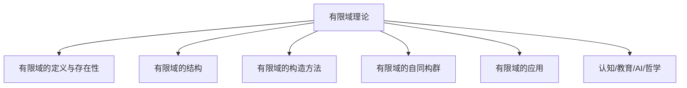

# 03-有限域理论

---

## 目录导航

- [1. 有限域的定义与存在性](#1-有限域的定义与存在性)
- [2. 有限域的结构](#2-有限域的结构)
- [3. 有限域的构造方法](#3-有限域的构造方法)
- [4. 有限域的自同构群](#4-有限域的自同构群)
- [5. 有限域的应用](#5-有限域的应用)
- [6. 认知/教育/AI/哲学视角](#6-认知教育ai哲学视角)
- [7. 参考文献与资源](#7-参考文献与资源)

---

## 交叉引用与分支跳转

- [域的定义与性质](./01-域的定义与性质.md)
- [域的扩张理论](./02-域的扩张理论.md)
- [群论总览](../02-群论/00-群论总览.md)
- [环论总览](../03-环论/00-环论总览.md)
- [模论总览](../05-模论/00-模论总览.md)
- [线性代数总览](../07-线性代数/00-线性代数总览.md)
- [范畴论基础](../08-范畴论/00-范畴论基础总览.md)
- [数论与离散数学](../06-数论与离散数学/00-数论与离散数学总览.md)

---

## 多表征内容导航

- [形式定义与公理化](#1-有限域的定义与存在性)
- [结构图与概念图（Mermaid）](#结构图)
- [典型例题与证明](#2-有限域的结构)
- [代码实现（Python/Rust/Haskell/Lean）](#3-有限域的构造方法)
- [表格与对比](#2-有限域的结构)
- [认知/教育/AI/哲学分析](#6-认知教育ai哲学视角)

---

## 1. 有限域的基本概念

### 1.1 有限域的定义

**有限域**（Finite Field）是指包含有限个元素的域。由于有限域是域，它必须满足域的所有公理，包括加法和乘法的封闭性、结合律、分配律，以及加法和非零元素乘法的交换律和逆元存在性。

有限域通常记为 $\mathbb{F}_q$ 或 $GF(q)$（Galois Field），其中 $q$ 是有限域的元素个数。

### 1.2 有限域的特征

任何有限域的特征必定是素数。如果有限域 $\mathbb{F}$ 的特征为 $p$，则 $\mathbb{F}$ 包含一个与 $\mathbb{F}_p = \mathbb{Z}/p\mathbb{Z}$ 同构的子域，称为 $\mathbb{F}$ 的**素数子域**。

有限域 $\mathbb{F}_q$ 的特征 $p$ 和元素个数 $q$ 之间存在关系：$q = p^n$，其中 $n$ 是正整数。也就是说，任何有限域的元素个数必定是素数的幂。

## 2. 有限域的存在性与唯一性

### 2.1 存在性定理

对于任意素数 $p$ 和正整数 $n$，存在一个有 $p^n$ 个元素的有限域。

**证明思路**：

1. 考虑 $\mathbb{F}_p$ 上的多项式环 $\mathbb{F}_p[x]$。
2. 在 $\mathbb{F}_p[x]$ 中找一个 $n$ 次不可约多项式 $f(x)$。
3. 构造商环 $\mathbb{F}_p[x]/(f(x))$，它是一个有 $p^n$ 个元素的域。

### 2.2 唯一性定理

对于给定的素数 $p$ 和正整数 $n$，所有有 $p^n$ 个元素的有限域在同构意义下是唯一的。

这意味着虽然可以用不同的方式构造有 $p^n$ 个元素的有限域（例如使用不同的不可约多项式），但所得到的域在代数结构上是等价的。

因此，我们可以无歧义地将有 $p^n$ 个元素的有限域记为 $\mathbb{F}_{p^n}$ 或 $GF(p^n)$。

## 3. 有限域的构造方法

### 3.1 素数域的构造

对于素数 $p$，素数域 $\mathbb{F}_p$ 可以通过整数模 $p$ 的剩余类构造：

$\mathbb{F}_p = \{0, 1, 2, \ldots, p-1\}$

其中加法和乘法都是模 $p$ 进行的。

### 3.2 通过不可约多项式构造扩张域

对于 $q = p^n$，其中 $n > 1$，构造 $\mathbb{F}_q$ 的标准方法是：

1. 在 $\mathbb{F}_p[x]$ 中找一个 $n$ 次不可约多项式 $f(x)$。
2. 构造商环 $\mathbb{F}_p[x]/(f(x))$。

这个商环是一个域，其元素可以表示为：

$\mathbb{F}_q = \{a_0 + a_1\alpha + a_2\alpha^2 + \cdots + a_{n-1}\alpha^{n-1} \mid a_i \in \mathbb{F}_p\}$

其中 $\alpha$ 是 $f(x)$ 的一个根。

### 3.3 Conway多项式和标准表示

为了在计算机系统中统一有限域的表示，通常使用**Conway多项式**作为构造有限域的标准不可约多项式。Conway多项式是满足特定条件的不可约多项式，使得不同有限域之间的兼容性最佳。

例如，$\mathbb{F}_4$ 的Conway多项式是 $x^2 + x + 1$，$\mathbb{F}_8$ 的Conway多项式是 $x^3 + x + 1$。

## 4. 有限域的结构性质

### 4.1 加法群结构

有限域 $\mathbb{F}_{p^n}$ 的加法群 $(\mathbb{F}_{p^n}, +)$ 同构于 $n$ 个循环群 $\mathbb{Z}/p\mathbb{Z}$ 的直积：

$(\mathbb{F}_{p^n}, +) \cong (\mathbb{Z}/p\mathbb{Z})^n$

这是一个秩为 $n$ 的初等 $p$-群，阶为 $p^n$。

### 4.2 乘法群结构

有限域 $\mathbb{F}_{p^n}$ 的乘法群 $\mathbb{F}_{p^n}^* = \mathbb{F}_{p^n} \setminus \{0\}$ 是一个循环群，阶为 $p^n - 1$。

这一重要性质意味着存在一个元素 $g \in \mathbb{F}_{p^n}^*$，称为**原根**或**生成元**，使得：

$\mathbb{F}_{p^n}^* = \{g^0, g^1, g^2, \ldots, g^{p^n-2}\}$

即 $\mathbb{F}_{p^n}^*$ 中的每个非零元素都可以表示为 $g$ 的幂。

### 4.3 子域结构

有限域 $\mathbb{F}_{p^n}$ 的子域结构完全由 $n$ 的因子决定：

$\mathbb{F}_{p^m}$ 是 $\mathbb{F}_{p^n}$ 的子域当且仅当 $m$ 整除 $n$。

例如，$\mathbb{F}_{p^2}$ 的唯一子域是 $\mathbb{F}_p$；而 $\mathbb{F}_{p^6}$ 的子域有 $\mathbb{F}_p$、$\mathbb{F}_{p^2}$、$\mathbb{F}_{p^3}$ 和 $\mathbb{F}_{p^6}$ 自身。

### 4.4 Frobenius自同构

对于有限域 $\mathbb{F}_{p^n}$，映射 $\sigma: \mathbb{F}_{p^n} \to \mathbb{F}_{p^n}$，定义为 $\sigma(x) = x^p$，是 $\mathbb{F}_{p^n}$ 的一个自同构，称为**Frobenius自同构**。

Frobenius自同构有以下性质：

1. $\sigma$ 固定 $\mathbb{F}_p$ 中的所有元素。
2. $\sigma^n$ 是恒等映射。
3. $\sigma$ 生成 $\mathbb{F}_{p^n}/\mathbb{F}_p$ 的伽罗瓦群，即 $\text{Gal}(\mathbb{F}_{p^n}/\mathbb{F}_p) = \langle \sigma \rangle \cong \mathbb{Z}/n\mathbb{Z}$。

### 4.5 迹和范

有限域 $\mathbb{F}_{p^n}$ 相对于其子域 $\mathbb{F}_p$ 的**迹**（Trace）和**范**（Norm）是两个重要的映射：

**迹**：$\text{Tr}_{\mathbb{F}_{p^n}/\mathbb{F}_p}: \mathbb{F}_{p^n} \to \mathbb{F}_p$，定义为：

$\text{Tr}_{\mathbb{F}_{p^n}/\mathbb{F}_p}(\alpha) = \alpha + \alpha^p + \alpha^{p^2} + \cdots + \alpha^{p^{n-1}}$

**范**：$\text{N}_{\mathbb{F}_{p^n}/\mathbb{F}_p}: \mathbb{F}_{p^n} \to \mathbb{F}_p$，定义为：

$\text{N}_{\mathbb{F}_{p^n}/\mathbb{F}_p}(\alpha) = \alpha \cdot \alpha^p \cdot \alpha^{p^2} \cdots \alpha^{p^{n-1}} = \alpha^{(p^n-1)/(p-1)}$

迹和范有许多重要性质，在有限域的应用中起着关键作用。

## 5. 有限域的多项式

### 5.1 有限域上的多项式

有限域 $\mathbb{F}_q$ 上的多项式环 $\mathbb{F}_q[x]$ 具有许多与无限域上多项式环类似的性质，但也有一些特殊性质：

1. $\mathbb{F}_q[x]$ 是唯一分解整环。
2. $\mathbb{F}_q[x]$ 中的每个多项式都可以唯一地分解为不可约多项式的乘积。
3. $\mathbb{F}_q[x]$ 中次数为 $n$ 的不可约多项式的数量可以通过特定公式计算。

### 5.2 因式分解

在有限域 $\mathbb{F}_q$ 上，多项式 $x^q - x$ 有一个重要性质：它等于 $\mathbb{F}_q$ 中所有元素对应的一次多项式的乘积：

$x^q - x = \prod_{\alpha \in \mathbb{F}_q} (x - \alpha)$

更一般地，对于任意正整数 $n$，多项式 $x^{q^n} - x$ 等于 $\mathbb{F}_{q^n}$ 中所有元素对应的一次多项式的乘积。

### 5.3 循环多项式

**循环多项式**是有限域理论中的重要概念，它们与循环码密切相关。

设 $n$ 是正整数，$q$ 是素数幂。$\mathbb{F}_q$ 上的 $n$ 次循环多项式定义为：

$\Phi_n(x) = \prod (x - \alpha)$

其中乘积取遍所有阶为 $n$ 的 $\mathbb{F}_q$ 的代数闭包中的元素 $\alpha$。

循环多项式在编码理论和密码学中有广泛应用。

## 6. 有限域的应用

### 6.1 编码理论

有限域在编码理论中有广泛应用，特别是在构造纠错码方面：

1. **线性码**：线性码可以看作是有限域上的向量子空间。
2. **循环码**：循环码与有限域上的多项式理想密切相关。
3. **Reed-Solomon码**：这是一类重要的纠错码，基于有限域上的多项式插值。
4. **BCH码**：BCH码是一类强大的循环码，其构造和解码都依赖于有限域理论。

### 6.2 密码学

有限域是现代密码学的基础：

1. **对称加密**：AES（高级加密标准）使用有限域 $\mathbb{F}_{2^8}$ 上的运算。
2. **公钥密码学**：RSA算法基于有限域上的数论性质。
3. **椭圆曲线密码学**：ECC基于定义在有限域上的椭圆曲线群。
4. **多方安全计算**：许多协议使用有限域上的秘密共享技术。

### 6.3 伪随机数生成

有限域可以用来构造高质量的伪随机数生成器：

1. **线性反馈移位寄存器**（LFSR）：基于有限域 $\mathbb{F}_2$ 上的线性递推关系。
2. **基于离散对数的生成器**：利用有限域中离散对数问题的复杂性。

### 6.4 代数几何

有限域在代数几何中有重要应用：

1. **有限域上的代数曲线**：研究定义在有限域上的代数曲线的性质。
2. **Zeta函数**：有限域上代数簇的Zeta函数是研究其结构的重要工具。
3. **代数几何码**：基于有限域上代数曲线的点构造的纠错码。

### 6.5 计算机代数

有限域在计算机代数系统中广泛使用：

1. **模运算**：大整数的模运算可以在有限域中进行。
2. **多项式因式分解**：有限域上的多项式因式分解算法是整数多项式因式分解的基础。
3. **符号计算**：许多符号计算算法在有限域上更高效。

## 7. 有限域的计算方法

### 7.1 表示方法

有限域元素在计算机中的表示有几种常见方法：

1. **多项式表示**：将 $\mathbb{F}_{p^n}$ 中的元素表示为 $\mathbb{F}_p$ 上的多项式。
2. **幂表示**：使用原根的幂来表示非零元素。
3. **正规基表示**：使用正规基来表示元素，适合某些特定运算。

### 7.2 基本运算算法

有限域上的基本运算包括：

1. **加法和减法**：通常是按位异或（特征为2的情况）或模加减法。
2. **乘法**：可以使用多项式乘法后取模，或使用对数表。
3. **求逆**：可以使用扩展欧几里得算法或费马小定理。
4. **幂运算**：通常使用平方-乘算法（square-and-multiply）。

### 7.3 高效实现技术

为了高效实现有限域运算，通常采用以下技术：

1. **查表法**：预计算小有限域的运算结果。
2. **复合域表示**：将 $\mathbb{F}_{p^{nm}}$ 看作 $\mathbb{F}_{p^n}$ 上的扩张域。
3. **特殊多项式**：选择特殊形式的不可约多项式以简化运算。
4. **位级并行**：利用计算机字长进行并行运算。

## 8. 习题与思考

1. 证明：对于素数 $p$，$\mathbb{F}_p$ 中的每个元素都满足方程 $x^p = x$。

2. 构造有限域 $\mathbb{F}_9$ 和 $\mathbb{F}_{16}$，并给出它们的加法表和乘法表。

3. 证明：有限域 $\mathbb{F}_{p^n}$ 中恰好有 $\frac{p^n-1}{d}$ 个阶为 $d$ 的元素，其中 $d$ 是 $p^n-1$ 的因子。

4. 找出有限域 $\mathbb{F}_{16}$ 中的一个原根，并用它表示 $\mathbb{F}_{16}$ 中的所有元素。

5. 证明：有限域 $\mathbb{F}_{p^n}$ 上的任意线性变换都可以用一个 $n \times n$ 矩阵表示，其元素来自 $\mathbb{F}_p$。

## 参考文献

1. Lang, S. (2002). *Algebra* (3rd ed.). Springer.
2. Dummit, D. S., & Foote, R. M. (2004). *Abstract Algebra* (3rd ed.). John Wiley & Sons.
3. Stewart, I. (2015). *Galois Theory* (4th ed.). Chapman and Hall/CRC.
4. Lidl, R., & Niederreiter, H. (1997). *Finite Fields* (2nd ed.). Cambridge University Press.
5. Morandi, P. (1996). *Field and Galois Theory*. Springer.
6. Roman, S. (2006). *Field Theory* (2nd ed.). Springer.
7. Fraleigh, J. B. (2003). *A First Course in Abstract Algebra* (7th ed.). Addison Wesley.
8. [nLab: Finite field](https://ncatlab.org/nlab/show/finite+field)
9. [Lean Community Mathlib: Finite field](https://leanprover-community.github.io/mathlib_docs/field_theory/finite.html)
10. [Visual Group Theory (YouTube)](https://www.youtube.com/playlist?list=PLZHQObOWTQDMsr9K-rj53DwVRMYO3t5Yr)

---

**创建日期**: 2025-06-28
**最后更新**: 2025-06-28

## 6. 认知/教育/AI/哲学视角

- **数学认知**：有限域理论训练抽象化、结构分解、递归等高阶代数思维。多表征（如图、代码、例题）有助于不同认知风格的学习者理解。
- **教育视角**：有限域理论是高等代数、编码理论、密码学等课程的核心内容，适合通过问题驱动、探究式学习，结合实际应用（如纠错码、加密算法、伽罗瓦理论）提升兴趣。
- **AI视角**：有限域结构及其算法在符号推理、自动定理证明、代数系统建模等AI领域有广泛应用。有限域相关算法是密码学和编码理论的基础。
- **哲学视角**：有限域理论体现了数学结构主义思想，强调对象间的关系与公理系统。其发展史反映了抽象代数从具体算术到一般结构的哲学转变。

---

## 7. 参考文献与资源

1. Lang, S. (2002). *Algebra* (3rd ed.). Springer.
2. Dummit, D. S., & Foote, R. M. (2004). *Abstract Algebra* (3rd ed.). John Wiley & Sons.
3. Stewart, I. (2015). *Galois Theory* (4th ed.). Chapman and Hall/CRC.
4. Lidl, R., & Niederreiter, H. (1997). *Finite Fields* (2nd ed.). Cambridge University Press.
5. Morandi, P. (1996). *Field and Galois Theory*. Springer.
6. Roman, S. (2006). *Field Theory* (2nd ed.). Springer.
7. Fraleigh, J. B. (2003). *A First Course in Abstract Algebra* (7th ed.). Addison Wesley.
8. [nLab: Finite field](https://ncatlab.org/nlab/show/finite+field)
9. [Lean Community Mathlib: Finite field](https://leanprover-community.github.io/mathlib_docs/field_theory/finite.html)
10. [Visual Group Theory (YouTube)](https://www.youtube.com/playlist?list=PLZHQObOWTQDMsr9K-rj53DwVRMYO3t5Yr)
