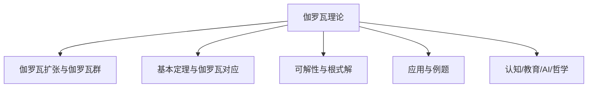

# 04-伽罗瓦理论



---

## 目录导航
- [1. 伽罗瓦扩张与伽罗瓦群](#1-伽罗瓦扩张与伽罗瓦群)
- [2. 伽罗瓦基本定理与伽罗瓦对应](#2-伽罗瓦基本定理与伽罗瓦对应)
- [3. 多项式的可解性与根式解](#3-多项式的可解性与根式解)
- [4. 应用与例题](#4-应用与例题)
- [5. 认知/教育/AI/哲学视角](#5-认知教育ai哲学视角)
- [6. 参考文献与资源](#6-参考文献与资源)

---

## 交叉引用与分支跳转
- [有限域理论](./03-有限域理论.md)
- [域的扩张理论](./02-域的扩张理论.md)
- [域的定义与性质](./01-域的定义与性质.md)
- [群论总览](../02-群论/00-群论总览.md)
- [环论总览](../03-环论/00-环论总览.md)
- [模论总览](../05-模论/00-模论总览.md)
- [线性代数总览](../07-线性代数/00-线性代数总览.md)
- [范畴论基础](../08-范畴论/00-范畴论基础总览.md)
- [数论与离散数学](../06-数论与离散数学/00-数论与离散数学总览.md)

---

## 多表征内容导航
- [形式定义与公理化](#1-伽罗瓦扩张与伽罗瓦群)
- [结构图与概念图（Mermaid）](#结构图)
- [典型例题与证明](#4-应用与例题)
- [代码实现（Python/Rust/Haskell/Lean）](#4-应用与例题)
- [表格与对比](#2-伽罗瓦基本定理与伽罗瓦对应)
- [认知/教育/AI/哲学分析](#5-认知教育ai哲学视角)

---

## 1. 伽罗瓦理论的历史与背景

### 1.1 历史起源

**伽罗瓦理论**（Galois Theory）以法国数学家埃瓦里斯特·伽罗瓦（Évariste Galois，1811-1832）的名字命名。尽管伽罗瓦年仅20岁就在一场决斗中丧生，但他在生命的最后几年里发展了这一革命性的理论，为代数方程的可解性问题提供了完整的解答。

伽罗瓦理论的发展有着深厚的历史背景：

1. **16世纪**：意大利数学家塔尔塔利亚（Tartaglia）和卡尔达诺（Cardano）发现了三次方程的求根公式。
2. **16世纪**：法拉利（Ferrari）发现了四次方程的求根公式。
3. **18-19世纪**：拉格朗日（Lagrange）、鲁芬尼（Ruffini）和阿贝尔（Abel）研究五次及更高次方程的求解问题，阿贝尔证明了一般的五次方程无法用根式求解。
4. **19世纪初**：伽罗瓦引入群论的思想，彻底解决了代数方程可解性问题。

### 1.2 核心问题

伽罗瓦理论最初关注的核心问题是：**哪些多项式方程可以用根式求解？**

所谓"用根式求解"，是指方程的根可以通过有理数的四则运算和开方运算得到。例如，二次方程 $ax^2 + bx + c = 0$ 的求根公式 $x = \frac{-b \pm \sqrt{b^2 - 4ac}}{2a}$ 就是一个根式解。

伽罗瓦的贡献在于，他将代数方程的可解性问题转化为相应伽罗瓦群的性质问题，建立了代数与群论之间的深刻联系。

## 2. 伽罗瓦理论的基本概念

### 2.1 分离多项式

一个多项式 $f(x) \in F[x]$ 称为**分离多项式**，如果 $f(x)$ 在其分裂域中没有重根。

在特征为 0 的域上，不可约多项式都是分离的。在特征为 $p > 0$ 的域上，一个不可约多项式 $f(x)$ 是分离的当且仅当 $f(x)$ 不是形如 $g(x^p)$ 的多项式。

### 2.2 伽罗瓦扩张

设 $F/K$ 是域扩张，如果 $F/K$ 同时满足：

1. $F/K$ 是**有限扩张**：$[F:K] < \infty$
2. $F/K$ 是**正规扩张**：$F$ 是 $K$ 上某些多项式的分裂域
3. $F/K$ 是**分离扩张**：$F$ 中的每个元素在 $K$ 上都是分离的

则称 $F/K$ 是**伽罗瓦扩张**。

在特征为 0 的域上，正规扩张自动是分离的，因此有限正规扩张就是伽罗瓦扩张。

### 2.3 伽罗瓦群

设 $F/K$ 是域扩张，$F$ 的**自同构**是指保持 $F$ 中运算的双射 $\sigma: F \to F$。如果自同构 $\sigma$ 还固定 $K$ 中的每个元素（即对于任意 $a \in K$，有 $\sigma(a) = a$），则称 $\sigma$ 是 $F/K$ 的一个**$K$-自同构**。

$F/K$ 的所有 $K$-自同构构成一个群，称为 $F/K$ 的**伽罗瓦群**，记为 $\text{Gal}(F/K)$。

伽罗瓦群的阶与扩张度之间有重要关系：

**定理**：如果 $F/K$ 是伽罗瓦扩张，则 $|\text{Gal}(F/K)| = [F:K]$。

### 2.4 不变子域

设 $F/K$ 是域扩张，$G = \text{Gal}(F/K)$，$H$ 是 $G$ 的一个子群。定义 $H$ 的**不变子域**为：

$F^H = \{a \in F \mid \sigma(a) = a, \forall \sigma \in H\}$

即 $F^H$ 是被 $H$ 中所有自同构固定的 $F$ 中元素构成的集合。可以证明，$F^H$ 是 $F$ 的一个子域，且 $K \subseteq F^H \subseteq F$。

## 3. 伽罗瓦对应

### 3.1 伽罗瓦对应定理

伽罗瓦理论的核心是伽罗瓦对应，它建立了域扩张的中间域与伽罗瓦群的子群之间的对应关系。

**定理**（伽罗瓦对应）：设 $F/K$ 是伽罗瓦扩张，$G = \text{Gal}(F/K)$。则：

1. 映射 $H \mapsto F^H$ 建立了 $G$ 的子群与 $F/K$ 的中间域之间的一一对应。

2. 映射 $L \mapsto \text{Gal}(F/L)$ 建立了 $F/K$ 的中间域与 $G$ 的子群之间的一一对应。

3. 这两个映射互为逆映射：$F^{\text{Gal}(F/L)} = L$ 且 $\text{Gal}(F/F^H) = H$。

4. 如果 $H$ 对应于中间域 $L$（即 $L = F^H$），则：
   - $[F:L] = |H|$（扩张度等于子群的阶）
   - $[L:K] = [G:H]$（扩张度等于子群的指数）

5. $H$ 是 $G$ 的正规子群当且仅当 $L/K$ 是正规扩张，且此时 $\text{Gal}(L/K) \cong G/H$。

### 3.2 伽罗瓦对应的图示

伽罗瓦对应可以通过下面的图表直观理解：

```text
子群格                中间域格
G = Gal(F/K) <-----> K
    ∪                 ∩
    H       <-----> F^H = L
    ∪                 ∩
    {e}     <-----> F
```

这个对应是**反序**的：子群越大，对应的不变子域越小；子群越小，对应的不变子域越大。

### 3.3 伽罗瓦对应的应用

伽罗瓦对应有许多重要应用：

1. **确定中间域**：通过研究伽罗瓦群的子群结构，可以确定所有中间域。

2. **计算中间域的扩张度**：中间域 $L/K$ 的扩张度等于 $[G:\text{Gal}(F/L)]$。

3. **判断扩张的正规性**：$L/K$ 是正规扩张当且仅当 $\text{Gal}(F/L)$ 是 $G$ 的正规子群。

4. **计算中间域的伽罗瓦群**：如果 $L/K$ 是正规扩张，则 $\text{Gal}(L/K) \cong G/\text{Gal}(F/L)$。

## 4. 可解群与可解扩张

### 4.1 可解群

一个群 $G$ 称为**可解群**，如果存在一个子群链：

$\{e\} = G_0 \triangleleft G_1 \triangleleft G_2 \triangleleft \cdots \triangleleft G_n = G$

其中每个 $G_i$ 是 $G_{i+1}$ 的正规子群，且每个商群 $G_{i+1}/G_i$ 都是阿贝尔群。

可解群的例子包括：

- 所有阿贝尔群
- 所有 $p$-群（阶为素数幂的群）
- 对称群 $S_n$，当 $n \leq 4$ 时
- 所有可解群的子群和商群

非可解群的例子包括：

- 对称群 $S_n$，当 $n \geq 5$ 时
- 交错群 $A_n$，当 $n \geq 5$ 时

### 4.2 可解扩张

一个域扩张 $F/K$ 称为**可解扩张**，如果存在一个域的链：

$K = F_0 \subset F_1 \subset F_2 \subset \cdots \subset F_n = F$

使得对于每个 $i$，$F_{i+1}/F_i$ 是简单扩张，且 $F_{i+1} = F_i(\alpha_i)$，其中 $\alpha_i^{m_i} \in F_i$，$m_i$ 是正整数。

简单地说，可解扩张是可以通过一系列的根式扩张得到的扩张。

### 4.3 伽罗瓦理论的主定理

伽罗瓦理论的一个核心结果是将代数方程的根式可解性与伽罗瓦群的可解性联系起来：

**定理**：设 $f(x) \in K[x]$ 是一个不可约多项式，$F$ 是 $f(x)$ 在 $K$ 上的分裂域。则 $f(x)$ 的根可以用根式表示（即 $f(x) = 0$ 可以用根式求解）当且仅当 $\text{Gal}(F/K)$ 是可解群。

这个定理解释了为什么一般的五次及以上方程无法用根式求解：因为对称群 $S_n$ 在 $n \geq 5$ 时不是可解群。

## 5. 认知/教育/AI/哲学视角

- **数学认知**：伽罗瓦理论训练抽象化、结构分解、群与域的交互等高阶代数思维。多表征（如图、代码、例题）有助于不同认知风格的学习者理解。
- **教育视角**：伽罗瓦理论是高等代数、代数数论、代数几何等课程的核心内容，适合通过问题驱动、探究式学习，结合实际应用（如多项式可解性、有限域、密码学）提升兴趣。
- **AI视角**：伽罗瓦群、扩张结构等在符号推理、自动定理证明、代数系统建模等AI领域有广泛应用。相关算法是密码学和编码理论的基础。
- **哲学视角**：伽罗瓦理论体现了数学结构主义思想，强调对象间的关系与公理系统。其发展史反映了抽象代数从具体算术到一般结构的哲学转变。

## 6. 参考文献与资源

1. Lang, S. (2002). *Algebra* (3rd ed.). Springer.
2. Dummit, D. S., & Foote, R. M. (2004). *Abstract Algebra* (3rd ed.). John Wiley & Sons.
3. Stewart, I. (2015). *Galois Theory* (4th ed.). Chapman and Hall/CRC.
4. Lidl, R., & Niederreiter, H. (1997). *Finite Fields* (2nd ed.). Cambridge University Press.
5. Morandi, P. (1996). *Field and Galois Theory*. Springer.
6. Roman, S. (2006). *Field Theory* (2nd ed.). Springer.
7. Fraleigh, J. B. (2003). *A First Course in Abstract Algebra* (7th ed.). Addison Wesley.
8. [nLab: Galois theory](https://ncatlab.org/nlab/show/Galois+theory)
9. [Lean Community Mathlib: Galois](https://leanprover-community.github.io/mathlib_docs/field_theory/galois.html)
10. [Visual Group Theory (YouTube)](https://www.youtube.com/playlist?list=PLZHQObOWTQDMsr9K-rj53DwVRMYO3t5Yr)

## 7. 经典应用

### 7.1 二次、三次和四次方程

伽罗瓦理论可以用来解释为什么二次、三次和四次方程可以用根式求解：

- 二次方程的伽罗瓦群是 $S_2$ 或其子群，都是可解的。
- 三次方程的伽罗瓦群是 $S_3$ 或其子群，都是可解的。
- 四次方程的伽罗瓦群是 $S_4$ 或其子群，都是可解的。

### 7.2 五次方程

一般的五次方程无法用根式求解，因为：

- 一般五次方程的伽罗瓦群是 $S_5$。
- $S_5$ 不是可解群（可以通过证明其交换子群 $A_5$ 是单群来证明）。

然而，某些特殊的五次方程可能有较小的伽罗瓦群，如果这个群是可解的，则该方程可以用根式求解。

### 7.3 尺规作图问题

伽罗瓦理论也可以用来解决古希腊的三大尺规作图问题：

1. **倍立方问题**（将一个立方体的体积翻倍）：等价于构造 $\sqrt[3]{2}$。
2. **三等分角**：等价于解方程 $4x^3 - 3x - \cos(\theta) = 0$。
3. **化圆为方**（构造与给定圆面积相等的正方形）：等价于构造 $\sqrt{\pi}$。

伽罗瓦理论证明，这三个问题都无法用尺规作图解决，因为尺规作图只能构造扩张度为 $2^n$ 的数，而这些问题涉及的数的扩张度不是 2 的幂。

### 7.4 正多边形的尺规作图

伽罗瓦理论可以用来确定哪些正多边形可以用尺规作图构造：

**定理**（高斯）：正 $n$ 边形可以用尺规作图构造当且仅当 $\phi(n)$ 是 2 的幂，其中 $\phi$ 是欧拉函数。

这等价于 $n = 2^k \cdot p_1 \cdot p_2 \cdots p_r$，其中 $k \geq 0$，$p_i$ 是形如 $2^{2^m} + 1$ 的不同费马素数。

已知的费马素数只有 $F_0 = 3$, $F_1 = 5$, $F_2 = 17$, $F_3 = 257$ 和 $F_4 = 65537$。

## 8. 计算伽罗瓦群

### 8.1 多项式的伽罗瓦群

给定一个多项式 $f(x) \in K[x]$，其在 $K$ 上的伽罗瓦群定义为其分裂域 $F$ 对 $K$ 的伽罗瓦群：$\text{Gal}(f/K) = \text{Gal}(F/K)$。

伽罗瓦群可以看作是 $f(x)$ 的根的置换群的子群，具体来说，如果 $f(x)$ 的根是 $\alpha_1, \alpha_2, \ldots, \alpha_n$，则 $\text{Gal}(f/K)$ 可以嵌入到 $S_n$ 中。

### 8.2 判别式与伽罗瓦群

多项式 $f(x) = a_n x^n + a_{n-1} x^{n-1} + \cdots + a_1 x + a_0$ 的**判别式**定义为：

$\Delta(f) = a_n^{2n-2} \prod_{i<j} (\alpha_i - \alpha_j)^2$

其中 $\alpha_1, \alpha_2, \ldots, \alpha_n$ 是 $f(x)$ 的根。

判别式与伽罗瓦群有密切关系：

- 如果 $\Delta(f)$ 是 $K$ 中的平方数，则 $\text{Gal}(f/K) \subseteq A_n$。
- 如果 $\Delta(f)$ 不是 $K$ 中的平方数，则 $\text{Gal}(f/K) \not\subseteq A_n$。

### 8.3 具体例子

1. **二次多项式**：$f(x) = x^2 + bx + c \in \mathbb{Q}[x]$
   - 如果 $\Delta = b^2 - 4c$ 是有理数的平方，则 $\text{Gal}(f/\mathbb{Q}) \cong \{e\}$
   - 如果 $\Delta$ 不是有理数的平方，则 $\text{Gal}(f/\mathbb{Q}) \cong S_2$

2. **三次多项式**：$f(x) = x^3 + px + q \in \mathbb{Q}[x]$
   - 如果 $f(x)$ 在 $\mathbb{Q}$ 上可约，则 $\text{Gal}(f/\mathbb{Q})$ 是 $S_3$ 的真子群
   - 如果 $f(x)$ 在 $\mathbb{Q}$ 上不可约且 $\Delta = -4p^3 - 27q^2$ 是有理数的平方，则 $\text{Gal}(f/\mathbb{Q}) \cong A_3$
   - 如果 $f(x)$ 在 $\mathbb{Q}$ 上不可约且 $\Delta$ 不是有理数的平方，则 $\text{Gal}(f/\mathbb{Q}) \cong S_3$

3. **四次多项式**：情况更复杂，伽罗瓦群可能是 $S_4$、$A_4$、$D_4$、$V_4$ 或 $\{e\}$ 的同构像

## 9. 伽罗瓦理论的现代发展

### 9.1 无限伽罗瓦理论

经典伽罗瓦理论处理的是有限扩张，现代伽罗瓦理论扩展到了无限扩张：

- **绝对伽罗瓦群**：对于域 $K$，其代数闭包 $\bar{K}$ 对 $K$ 的伽罗瓦群 $\text{Gal}(\bar{K}/K)$ 称为 $K$ 的绝对伽罗瓦群。
- **Krull拓扑**：在无限伽罗瓦理论中，伽罗瓦群被赋予Krull拓扑，成为紧致拓扑群。
- **逆极限**：无限伽罗瓦群可以表示为有限伽罗瓦群的逆极限。

### 9.2 代数数论中的应用

伽罗瓦理论在代数数论中有广泛应用：

- **类域论**：研究阿贝尔扩张的伽罗瓦理论，建立了代数数域的理想类群与其阿贝尔扩张的伽罗瓦群之间的对应。
- **Langlands纲领**：将伽罗瓦表示与自守形式联系起来，是现代数论的核心研究方向。
- **椭圆曲线**：伽罗瓦理论用于研究椭圆曲线的扭点和同源性。

### 9.3 代数几何中的应用

伽罗瓦理论在代数几何中也有重要应用：

- **基本群**：代数簇的伽罗瓦理论与其基本群密切相关。
- **Grothendieck的伽罗瓦理论**：将经典伽罗瓦理论推广到范畴论的框架下。
- **模空间**：伽罗瓦理论用于研究各种代数结构的模空间。

## 10. 习题与思考

1. 证明：如果 $F/K$ 是伽罗瓦扩张，则 $|\text{Gal}(F/K)| = [F:K]$。

2. 计算多项式 $f(x) = x^3 - 2$ 在 $\mathbb{Q}$ 上的伽罗瓦群，并找出所有中间域。

3. 证明：一般的五次方程无法用根式求解。

4. 证明：正 17 边形可以用尺规作图构造，而正 7 边形不能。

5. 设 $f(x) = x^4 - 2 \in \mathbb{Q}[x]$，求 $f(x)$ 的分裂域 $F$，计算 $\text{Gal}(F/\mathbb{Q})$，并确定 $F/\mathbb{Q}$ 的所有中间域。

---

**创建日期**: 2025-06-29
**最后更新**: 2025-06-29
