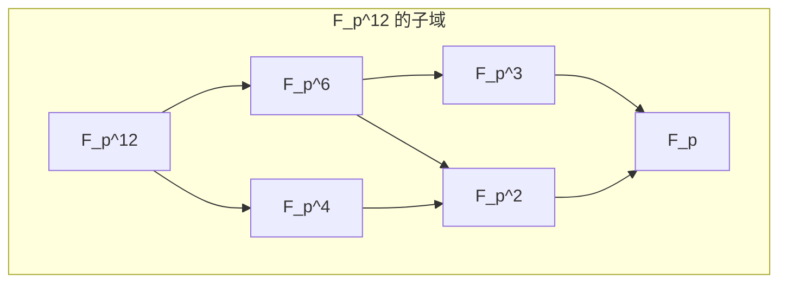

# 5. 有限域

**版本**: 1.0
**日期**: 2025-07-02

---

## 5.1. 核心思想

**有限域 (Finite Field)**，又称 **伽罗瓦域 (Galois Field)**，是元素个数有限的域。我们已经接触过的素域 $\mathbb{Z}_p$ (p为素数) 是最简单的有限域。

有限域的理论是代数中一个非常漂亮和完整的分支。它令人惊讶的结论是：有限域的阶（元素个数）必须是 **素数的幂** ($p^n$)，并且对于每一个这样的素数幂，都 **存在唯一的** 有限域。

有限域的结构清晰、性质优良，这使得它不仅在纯数学中扮演重要角色，更是在现代信息技术，如 **密码学** 和 **纠错码** 中，成为不可或缺的理论基石。

## 5.2. 有限域的存在性与唯一性

**定理 5.2.1 (有限域的阶)**:

设 $F$ 是一个有限域。那么 $F$ 的阶（元素个数）$|F|$ 必然是一个素数的幂，即 $|F|=p^n$，其中 $p$ 是 $F$ 的特征，n是 $F$ 作为其素域 $\mathbb{Z}_p$ 的扩张次数。

**定理 5.2.2 (有限域的存在性与唯一性)**:

对于每一个素数 $p$ 和正整数 $n$，都存在一个阶为 $p^n$ 的有限域。任何两个阶相同的有限域都是同构的。
这个唯一的阶为 $p^n$ 的域通常记为 $GF(p^n)$ 或 $\mathbb{F}_{p^n}$。

**构造方法**:
阶为 $p^n$ 的有限域 $\mathbb{F}_{p^n}$ 可以被构造为多项式 $x^{p^n} - x$ 在素域 $\mathbb{F}_p$ 上的分裂域。

## 5.3. 有限域的结构

**定理 5.3.1 (乘法群是循环群)**:

任何有限域 $F$ 的乘法群 $F^\times = F \setminus \{0\}$ 都是一个 **循环群**。

这意味着，存在一个元素 $g \in F^\times$（称为 **本原元 (primitive element)**），使得 $F^\times$ 中的所有元素都可以表示为 $g$ 的幂：$F^\times = \{1, g, g^2, \dots, g^{p^n-2}\}$。

**示例**: 考虑 $\mathbb{F}_5 = \mathbb{Z}_5$

* 它的乘法群是 $\mathbb{F}_5^\times = \{1, 2, 3, 4\}$。
* 2 是一个本原元: $2^1=2, 2^2=4, 2^3=8\equiv3, 2^4=16\equiv1$。
* 3 也是一个本原元。

**定理 5.3.2 (子域结构)**:

有限域 $\mathbb{F}_{p^n}$ 包含一个同构于 $\mathbb{F}_{p^m}$ 的子域，当且仅当 $m$ 整除 $n$。
并且，如果 $m|n$，则 $\mathbb{F}_{p^n}$ 中恰好只有一个阶为 $\mathbb{F}_{p^m}$ 的子域。

## 5.4. "大一新生之梦" (Freshman's Dream)

在特征为 $p$ 的域中，有一个非常著名的恒等式：
$$
(x+y)^p = x^p + y^p
$$
这个等式被称为"大一新生之梦"，因为它形式上很像初学者容易犯的错误，但在特征p的域中它却是完全正确的。这是因为二项式系数 $\binom{p}{k}$ (当 $1 \le k \le p-1$) 的分子有因子p而分母没有，导致这些系数都是p的倍数，在特征p的域中等于0。

这个性质在有限域的计算中非常有用。

---
[前往上一节: 04-分裂域与正规扩张.md](./04-分裂域与正规扩张.md) | [前往下一节: 06-伽罗瓦理论.md](./06-伽罗瓦理论.md) | [返回总览](./00-域论总览.md)
