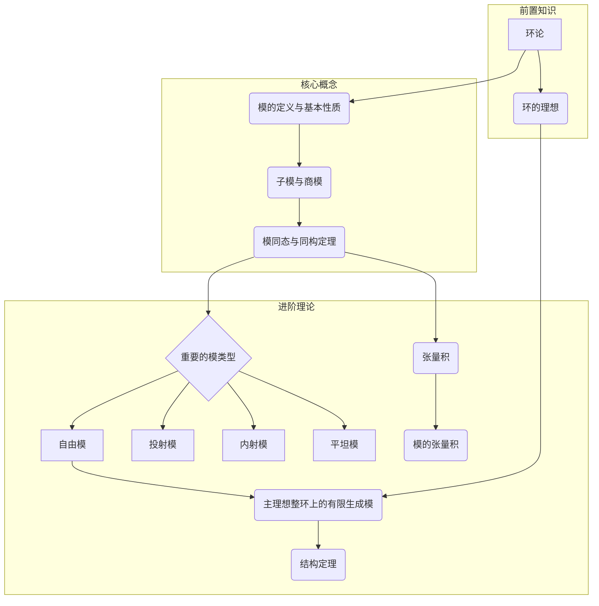

# 00-模论总览

## 1. 模论在代数结构中的位置

模论（Module Theory）是抽象代数的核心分支之一，它将线性代数中的向量空间概念推广到更一般的环上。如果说向量空间是"域"上的线性结构，那么"模"就是"环"上的线性结构。这种推广使得模论成为连接环论、群论和线性代数的关键桥梁。

- **上游知识**：环论、阿贝尔群。
- **下游知识**：同调代数、代数K理论、表示论、代数几何。

## 2. 模论核心概念

### 2.1. 基本定义

- **模 (Module)**：在一个环R上的一个Abel群M，定义了R中元素与M中元素的数乘运算，并满足分配律和结合律。
- **子模 (Submodule)**：模M的一个非空子集N，它本身在M的运算下也构成一个R-模。
- **商模 (Quotient Module)**：由子模N诱导的等价关系定义的模M/N。

### 2.2. 态射与同构

- **模同态 (Module Homomorphism)**：保持模结构的映射。
- **同构定理 (Isomorphism Theorems)**：类似于群论和环论中的同构定理，描述了子模、商模和同态像之间的关系。

### 2.3. 重要的模类型

- **自由模 (Free Module)**：具有"基"的模，最接近向量空间。
- **投射模 (Projective Module)**：自由模的推广，具有提升性质。
- **内射模 (Injective Module)**：投射模的对偶概念，具有扩张性质。
- **平坦模 (Flat Module)**：在张量积下保持单同态的模。

### 2.4. 结构理论

- **有限生成模 (Finitely Generated Module)**：由有限个元素生成的模。
- **主理想整环上的模结构定理 (Structure Theorem for Modules over a PID)**：这是模论的基石之一，它精确地刻画了主理想整环上所有有限生成模的结构，是有限维向量空间基底存在定理和有限生成阿贝尔群基本定理的深刻推广。
- **张量积 (Tensor Product)**：一种构造新模的普遍方式，在多重线性代数和同调代数中至关重要。

## 3. 学习路径与知识图谱

## 4. 章节内容安排

- **01-模的定义与基本性质.md**：引入模的概念，将其作为向量空间的自然推广，并讨论其基本性质。
- **02-模同态与商模.md**：定义模之间的结构保持映射（同态），并介绍子模、商模以及它们之间的基本关系（同构定理）。
- **03-特殊的模.md**：重点介绍几类具有良好性质的模，如自由模、投射模、内射模和平坦模，它们是后续理论的基石。
- **04-张量积.md**：介绍张量积这一强大的代数工具，它是从双线性映射构造线性映射的普遍方法。
- **05-主理想整环上的有限生成模结构定理.md**：详细阐述模论的中心定理之一，揭示PID上有限生成模的分解结构。
