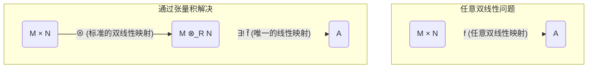

# 04-张量积

## 1. 核心思想：将"双线性"问题转化为"线性"问题

**张量积 (Tensor Product)**, 记作 $M \otimes_R N$，是抽象代数中一种强大而普适的构造，用于将两个模"乘"在一起得到一个新的模。

其最核心的动机，是提供一个标准化的框架，用以处理 **双线性映射 (Bilinear Map)**。一个双线性映射是"在两个参数上分别都是线性的"映射。张量积的构造目标，就是把任何一个关于两个变量 $(m, n)$ 的 **双线性** 问题，转化为一个关于单个变量 $m \otimes n$ 的 **线性** 问题来研究，从而允许我们使用强大的线性代数工具。

这个概念在初次接触时会显得非常抽象，但它在多重线性代数、微分几何（张量分析）、同调代数乃至物理学（量子力学中的量子纠缠）中都扮演着不可或缺的角色。

## 2. 万有性质：张量积的本质定义

尽管张量积有具体的元素构造方式，但其真正的数学本质由其 **万有性质 (Universal Property)** 所刻画。这个性质宣告了张量积是处理双线性映射的"最普适"的工具。

**定义 (张量积的万有性质)**
设 $M$ 是一个右R-模，$N$ 是一个左R-模。它们的张量积是一个阿贝尔群 $M \otimes_R N$ 和一个R-双线性映射 $\otimes: M \times N \to M \otimes_R N$ 构成的组合，它满足以下条件：

> 对于 **任何** 阿贝尔群 $A$ 和 **任何** R-双线性映射 $f: M \times N \to A$，都 **存在唯一的** 群同态 $\tilde{f}: M \otimes_R N \to A$，使得 $f$ 可以通过 $\otimes$ "分解"得到，即 $f = \tilde{f} \circ \otimes$。

**解读**: 这个性质意味着，我们无需再研究形形色色的双线性映射 $f$，只需研究那个唯一的、标准的线性映射 $\tilde{f}$ 即可。所有关于 $f$ 的信息都被编码在了 $\tilde{f}$ 中。

## 3. 张量积的元素

张量积 $M \otimes_R N$ 中的元素是形如 $m \otimes n$（称为 **纯张量 (pure tensor)**）的符号的 **有限和**：
\[
x = \sum_{i=1}^k c_i (m_i \otimes n_i)
\]
其中 $m_i \in M, n_i \in N, c_i \in \mathbb{Z}$。这些元素遵从由双线性性质引申出的运算规则：

1.  $(m_1 + m_2) \otimes n = m_1 \otimes n + m_2 \otimes n
2.  $m \otimes (n_1 + n_2) = m \otimes n_1 + m \otimes n_2$
3.  $(mr) \otimes n = m \otimes (rn)$  (标量可以"滑过"张量符号)

---
**重要警示**:
1.  **一般元素不是纯张量**: 张量积中的一个典型元素是纯张量的 **和**，它 **通常不能** 被简化为单个纯张量 $m \otimes n$ 的形式。
2.  **零张量不简单**: $m \otimes n = 0$ **不一定** 意味着 $m=0$ 或 $n=0$。例如，在 $\mathbb{Z}$-模的张量积 $\mathbb{Z}_2 \otimes_{\mathbb{Z}} \mathbb{Z}_3$ 中，对于任何元素 $\bar{a} \otimes \bar{b}$，我们有：
    $\bar{a} \otimes \bar{b} = \bar{a} \otimes (1 \cdot \bar{b}) = \bar{a} \otimes (3\cdot\bar{b} - 2\cdot\bar{b}) = \bar{a} \otimes \bar{0} - \bar{a} \otimes \bar{0} = 0$。因此 $\mathbb{Z}_2 \otimes_{\mathbb{Z}} \mathbb{Z}_3 = \{0\}$。
---

## 4. 关键应用：标量扩张

张量积最直接和强大的应用之一是 **标量扩张 (Extension of Scalars)**。它允许我们改变一个模的"标量环"。

设 $M$ 是一个 $R$-模，同时有一个环同态 $\phi: R \to S$，这使得 $S$ 可以看作一个R-模。此时，我们可以构造一个新的模：
\[
M_S = S \otimes_R M
\]
这个新的模 $M_S$ 不再是一个 $R$-模，而升级成了一个 **$S$-模**，其标量乘法定义为 $s_1(s_2 \otimes m) = (s_1s_2) \otimes m$。

**示例**:
-   **实化 (Realification)**: 将一个复向量空间 $V$ (一个 $\mathbb{C}$-模) 通过 $\mathbb{R} \otimes_{\mathbb{C}} V$ 变为一个实向量空间。
-   **多项式环**: 将一个域 $F$ 上的向量空间 $V$ 通过 $F[x] \otimes_F V$ 提升为一个定义在多项式环 $F[x]$ 上的模。 