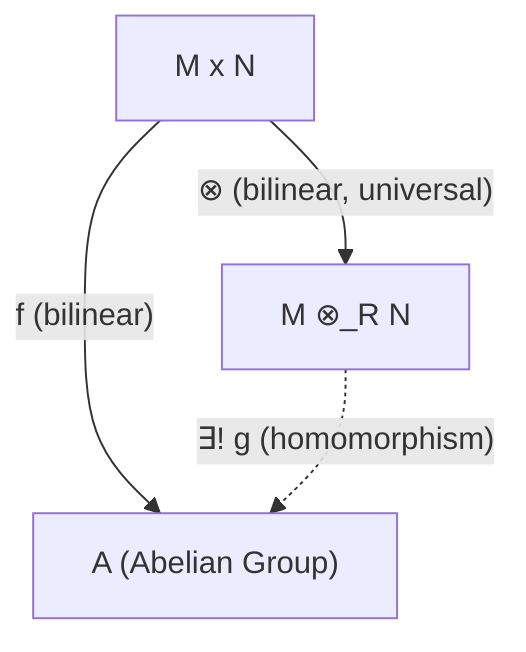

# 4. 模的张量积

**版本**: 1.0
**日期**: 2025-07-02

---

## 4.1. 核心思想

**张量积 (Tensor Product)** 是一种从已有的两个模构造出一个新模的普适方法。它的核心动机，是将一个关于两个变量的 **双线性 (bilinear)** 问题，转化为一个关于单个变量的 **线性 (linear)** 问题来研究，从而大大简化问题。

给定环 $R$ 上的右模 $M$ 和左模 $N$，它们的张量积 $M \otimes_R N$ 是一个新的阿贝尔群。张量积的构造是"最普适"的，它能接收任何从 $M \times N$ 出发的双线性映射。

这个概念在初次接触时可能显得抽象，但它在多重线性代数、微分几何、代数拓扑和物理学（如广义相对论中的张量分析）中是不可或缺的基本工具。

## 4.2. 构造与万有性质

张量积的正式构造比较技术性，但其本质由它的"万有性质"所定义。

**定义 4.2.1 (双线性映射)**:

设 $M$ 是一个右 $R$-模，$N$ 是一个左 $R$-模，$A$ 是一个阿贝尔群。一个映射 $f: M \times N \to A$ 被称为是 **R-双线性的**，如果它满足：

1. 对第一个变量是线性的: $f(m_1+m_2, n) = f(m_1, n) + f(m_2, n)$
2. 对第二个变量是线性的: $f(m, n_1+n_2) = f(m, n_1) + f(m, n_2)$
3. 满足标量结合律: $f(mr, n) = f(m, rn)$ for all $r \in R$

**定义 4.2.2 (张量积的万有性质)**:

$M$ 和 $N$ 在 $R$ 上的张量积，是一个阿贝尔群 $M \otimes_R N$ 与一个双线性映射 $\otimes: M \times N \to M \otimes_R N$ 组成的对，它满足如下的 **万有性质**：

对于 **任何** 阿贝尔群 $A$ 和 **任何** 双线性映射 $f: M \times N \to A$，都 **存在唯一的** 群同态 $g: M \otimes_R N \to A$，使得 $f = g \circ \otimes$。

这个性质说明，$M \otimes_R N$ 是接收双线性映射的"最普适"的容器。任何双线性映射都可以通过先映射到张量积，再通过一个唯一的线性映射到达目的地。

## 4.3. 张量积的元素

张量积 $M \otimes_R N$ 中的元素是形如 $m \otimes n$（称为 **纯张量**）的符号的 **有限和**：
$$
\sum_{i=1}^k m_i \otimes n_i
$$
这些元素满足以下运算规则:

1. $(m_1+m_2) \otimes n = m_1 \otimes n + m_2 \otimes n$
2. $m \otimes (n_1+n_2) = m \otimes n_1 + m \otimes n_2$
3. $(mr) \otimes n = m \otimes (rn)$

> **重要警告**:
>
> * 张量积中的一个 **一般元素** 是纯张量的和，它 **不能** 总被写成单个纯张量 $m \otimes n$ 的形式。
> * $m \otimes n = 0$ **不一定** 意味着 $m=0$ 或 $n=0$。例如，在 $\mathbb{Z}$-模的张量积 $\mathbb{Z}_2 \otimes_{\mathbb{Z}} \mathbb{Z}_3$ 中，任何元素 $a \otimes b$ 都等于0，所以整个张量积是 $\{0\}$。

## 4.4. 重要性质与应用

### 4.4.1 标量扩张 (Extension of Scalars)

张量积是改变模的标量环的有效工具。如果 $M$ 是一个 $R$-模，而 $S$ 是一个包含 $R$ 的环，那么 $S \otimes_R M$ 就成了一个 $S$-模。这个过程称为 **标量扩张**，它能将一个 $R$-模"提升"为一个 $S$-模。

### 4.4.2 函子性

张量积是一个 **函子 (Functor)**。这意味着给定两个模同态 $f: M \to M'$ 和 $g: N \to N'$，可以自然地得到一个张量积的同态 $f \otimes g: M \otimes_R N \to M' \otimes_R N'$。

### 4.4.3 伴随性质

张量积与同态模 (Hom) 是一对 **伴随函子 (Adjoint Functors)**，这是范畴论中的一个核心概念。粗略地说，这表现为以下同构关系：
$$
\text{Hom}_R(M \otimes_S N, P) \cong \text{Hom}_S(M, \text{Hom}_R(N, P))
$$
这个关系在现代代数中极为重要。

### 4.4.4 具体示例：向量空间的张量积

如果 $V$ 和 $W$ 是域 $F$ 上的两个向量空间，基分别为 $\{v_i\}$ 和 $\{w_j\}$。那么它们的张量积 $V \otimes_F W$ 也是 $F$ 上的一个向量空间，其一组基为 $\{v_i \otimes w_j\}$。
因此，它的维数为：
$$
\dim_F(V \otimes_F W) = (\dim_F V) \cdot (\dim_F W)
$$

---
[前往上一节: 03-特殊的模.md](./03-特殊的模.md) | [前往下一节: 05-主理想整环上的有限生成模结构定理.md](./05-主理想整环上的有限生成模结构定理.md) | [返回总览](./00-模论总览.md)
