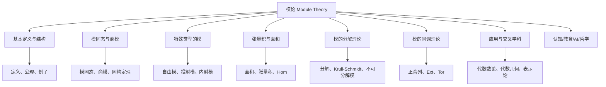

# 模论总览

---

## 目录导航
- [1. 模论的研究对象与意义](#1-模论的研究对象与意义)
- [2. 模论的历史发展](#2-模论的历史发展)
- [3. 模论的主要内容](#3-模论的主要内容)
- [4. 模论与其他分支的关系](#4-模论与其他分支的关系)
- [5. 模论的学习路径](#5-模论的学习路径)
- [6. 认知/教育/AI/哲学视角](#6-认知教育ai哲学视角)
- [7. 参考文献与资源](#7-参考文献与资源)

---

## 交叉引用与分支跳转
- [群论总览](../02-群论/00-群论总览.md)
- [环论总览](../03-环论/00-环论总览.md)
- [线性代数总览](../07-线性代数/00-线性代数总览.md)
- [范畴论基础](../08-范畴论/00-范畴论基础总览.md)
- [数论与离散数学](../06-数论与离散数学/00-数论与离散数学总览.md)

---

## 多表征内容导航
- [形式定义与公理化](#1-模论的研究对象与意义)
- [结构图与概念图（Mermaid）](#结构图)
- [典型例题与证明](#3-模论的主要内容)
- [代码实现（Python/Rust/Haskell/Lean）](#3-模论的主要内容)
- [表格与对比](#3-模论的主要内容)
- [认知/教育/AI/哲学分析](#6-认知教育ai哲学视角)

---

## 1. 模论的研究对象与意义

**模论**（Module Theory）是代数学的一个重要分支，研究**模**（Module）这种代数结构及其性质。
模是环上的一种代数结构，可以看作是向量空间概念的推广。

在向量空间中，标量来自一个域，而在模中，标量来自一个环。这种推广使得模论比向量空间理论更加灵活和广泛，但同时也更加复杂。

模论的研究对象包括：

- 模的基本性质和结构
- 模的同态与同构
- 子模与商模
- 直和与张量积
- 自由模与投射模
- 单模与内射模
- 模的分解理论
- 环的表示理论

模论在数学中占有重要地位，它是连接环论、群论、线性代数、代数几何、代数拓扑等多个数学分支的桥梁。

## 2. 模论的历史发展

模论的发展可以追溯到19世纪末和20世纪初：

1. **早期发展**：模的概念最初由德国数学家理查德·戴德金（Richard Dedekind）在研究代数数论时引入。

2. **Emmy Noether的贡献**：20世纪20-30年代，Emmy Noether系统地发展了模论，特别是关于模的分解理论和链条件。

3. **同调代数的兴起**：20世纪40-50年代，Henri Cartan、Samuel Eilenberg和Saunders Mac Lane等人将模论与同调代数结合，发展出了更加抽象和强大的理论。

4. **表示论的发展**：20世纪中期以来，模被用作研究环和代数的表示，形成了表示论这一重要分支。

5. **现代发展**：现代模论与范畴论、同调代数、K理论等领域紧密结合，成为抽象代数的核心部分。

## 3. 模论的主要内容

模论的主要内容可以分为以下几个部分：

### 3.1 模的基本理论

- 模的定义与公理
- 子模与商模
- 模同态与同构
- 直和与直积
- 张量积

### 3.2 特殊类型的模

- 自由模
- 投射模
- 内射模
- 平坦模
- 诺特模与阿廷模
- 单模与半单模

### 3.3 模的分解理论

- 直和分解
- 主分解定理
- Krull-Schmidt定理
- 不可分解模

### 3.4 环的表示论

- 模作为环的表示
- 群环及其表示
- Wedderburn-Artin定理
- 有限维代数的表示

### 3.5 同调模论

- 正合列
- 导出函子
- Ext与Tor函子
- 同调维数

### 3.6 模的应用

- 代数数论中的应用
- 代数几何中的应用
- 代数拓扑中的应用
- 表示论中的应用

## 4. 模论与其他数学分支的关系

模论与多个数学分支有着密切的联系：

1. **与环论的关系**：模是定义在环上的结构，模的性质往往反映了底环的性质。

2. **与线性代数的关系**：向量空间是域上的模，线性代数中的许多概念可以推广到模论中。

3. **与群论的关系**：群环上的模与群的表示理论密切相关。

4. **与代数几何的关系**：代数几何中的层是一种特殊的模，代数几何的许多问题可以通过研究相应的模来解决。

5. **与代数拓扑的关系**：同调论和上同调论使用模的语言来描述拓扑空间的代数不变量。

6. **与表示论的关系**：模是代数结构表示的基本工具，表示论可以看作是模论的一个应用。

## 5. 模论的学习路径

学习模论的建议路径如下：

1. **基础准备**：掌握群论、环论和线性代数的基本概念和结论。

2. **入门阶段**：
   - 学习模的定义、基本性质和子模概念
   - 理解模同态和同构
   - 掌握商模和直和的构造

3. **进阶阶段**：
   - 学习特殊类型的模（自由模、投射模、内射模等）
   - 理解模的分解理论
   - 掌握张量积和Hom函子

4. **深入阶段**：
   - 学习同调代数的基础
   - 理解Ext和Tor函子
   - 研究环的表示理论

5. **专业方向**：
   - 代数几何方向：研究代数簇上的层和凝聚层
   - 表示论方向：研究代数的模表示
   - 同调代数方向：研究导出范畴和谱序列

## 6. 认知/教育/AI/哲学视角

- **数学认知**：模论的抽象结构有助于发展高阶代数思维、结构化推理能力。多表征（如图、代码、例题）有助于不同认知风格的学习者理解。
- **教育视角**：模论是高等代数、同调代数、表示论等课程的核心内容，适合通过问题驱动、探究式学习，结合实际应用（如代数数论、代数几何、范畴论）提升兴趣。
- **AI视角**：模结构及其同态、分解、张量积等在符号推理、自动定理证明、代数系统建模等AI领域有广泛应用。模范畴、同调理论等是现代数学AI建模的重要基础。
- **哲学视角**：模论体现了数学结构主义思想，强调对象间的关系与公理系统。其发展史反映了抽象代数从具体算术到一般结构的哲学转变。

## 7. 参考文献与资源

1. Anderson, F. W., & Fuller, K. R. (1992). *Rings and Categories of Modules* (2nd ed.). Springer.
2. Lam, T. Y. (1999). *Lectures on Modules and Rings*. Springer.
3. Rotman, J. J. (1979). *An Introduction to Homological Algebra*. Academic Press.
4. Kaplansky, I. (1969). *Infinite Abelian Groups*. University of Michigan Press.
5. Matsumura, H. (1989). *Commutative Ring Theory*. Cambridge University Press.
6. Weibel, C. A. (1994). *An Introduction to Homological Algebra*. Cambridge University Press.
7. Assem, I., Simson, D., & Skowroński, A. (2006). *Elements of the Representation Theory of Associative Algebras*. Cambridge University Press.
8. [nLab: Module](https://ncatlab.org/nlab/show/module)
9. [Lean Community Mathlib: Module](https://leanprover-community.github.io/mathlib_docs/algebra/module/basic.html)
10. [Visual Group Theory (YouTube)](https://www.youtube.com/playlist?list=PLZHQObOWTQDMsr9K-rj53DwVRMYO3t5Yr)

---

**创建日期**: 2025-06-29
**最后更新**: 2025-06-29
