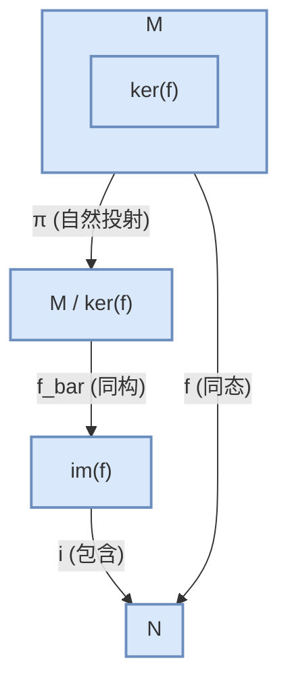

# 02-模同态与同构定理

## 1. 核心概念: 模同态

**定义 2.1 (模同态)**
设 $M$ 和 $N$ 是环 $R$ 上的两个（左）模。一个函数 $f: M \to N$ 被称为是一个**（左）R-模同态**，如果它满足对所有的 $m_1, m_2 \in M$ 和所有的 $r \in R$：
1.  **保持加法**: $f(m_1 + m_2) = f(m_1) + f(m_2)$ (群同态)
2.  **保持标量乘法**: $f(rm_1) = rf(m_1)$ (与 R-作用兼容)

- **类比**:
    - 若 $R$ 是域，模同态就是**线性变换**。
    - 若 $R = \mathbb{Z}$，模同态就是阿贝尔群之间的**群同态**。

- **术语**:
    - **同态 (Homomorphism)**: 满足以上条件的映射。
    - **自同态 (Endomorphism)**: 从一个模到其自身的同态 ($f: M \to M$)。
    - **同构 (Isomorphism)**: 一个双射的同态。若存在同构 $f: M \to N$，则称 $M$ 与 $N$ 同构，记作 $M \cong N$。
    - **自同构 (Automorphism)**: 一个从模到其自身的同构。

## 2. 核与像 (Kernel and Image)

设 $f: M \to N$ 是一个 R-模同态。

### 2.1. 核 (Kernel)

- **定义**: $f$ 的**核**是指 $M$ 中被 $f$ 映射到 $N$ 中零元的元素集合。
  $$ \ker(f) = \{ m \in M \mid f(m) = 0_N \} $$
- **性质**: $\ker(f)$ 是 $M$ 的一个**子模**。
- **单射判定**: 同态 $f$ 是单射当且仅当 $\ker(f) = \{0_M\}$。

### 2.2. 像 (Image)

- **定义**: $f$ 的**像**是指 $N$ 中所有形如 $f(m)$ 的元素的集合。
  $$ \text{im}(f) = \{ f(m) \in N \mid m \in M \} $$
- **性质**: $\text{im}(f)$ 是 $N$ 的一个**子模**。
- **满射判定**: 同态 $f$ 是满射当且仅当 $\text{im}(f) = N$。

## 3. 同构定理

模的同构定理与群和环的同构定理形式上完全一样，是构建商模与同态之间联系的基石。

### 3.1. 第一同构定理

设 $f: M \to N$ 是一个 R-模同态。则 $f$ 诱导了一个从商模 $M/\ker(f)$ 到像 $\text{im}(f)$ 的同构。
$$ M/\ker(f) \cong \text{im}(f) $$
这个同构由 $\bar{f}(m + \ker(f)) = f(m)$ 定义。

- **意义**: 任何同态的像，本质上（同构意义下）就是一个由其定义域对核作商得到的商模。

### 3.2. 第二同构定理 (子模的同构定理)

设 $M$ 是一个 R-模， $S$ 和 $T$ 是 $M$ 的两个子模。则
$$ (S+T)/T \cong S/(S \cap T) $$

### 3.3. 第三同构定理 (商模的同构定理)

设 $M$ 是一个 R-模，$N$ 是 $M$ 的一个子模。如果 $K$ 是 $M$ 的一个包含 $N$ 的子模（即 $N \subseteq K \subseteq M$），则 $K/N$ 是 $M/N$ 的一个子模，并且
$$ (M/N)/(K/N) \cong M/K $$
- **直观理解**: 对商模再作商，等于一步到位作商。

### 3.4. 第四同构定理 (格同构定理)

设 $N$ 是 R-模 $M$ 的一个子模。在 $M$ 的包含 $N$ 的子模集合与 $M/N$ 的子模集合之间存在一个一一对应关系。这个对应关系保持包含关系和交、和运算。

## 4. 内部链接

- [[01-模的定义与基本性质]]
- [[03-自由模与射影模]] 