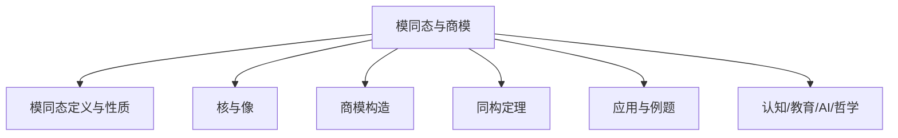
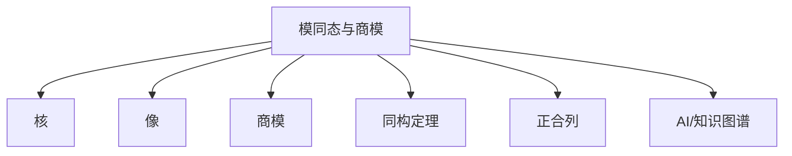

# 02-模同态与商模



---

## 目录导航

- [02-模同态与商模](#02-模同态与商模)
  - [目录导航](#目录导航)
  - [交叉引用与分支跳转](#交叉引用与分支跳转)
  - [多表征内容导航](#多表征内容导航)
  - [1. 引言](#1-引言)
  - [2. 模同态](#2-模同态)
    - [2.1 模同态的定义与基本性质](#21-模同态的定义与基本性质)
    - [2.2 核与像](#22-核与像)
    - [2.3 同态基本定理](#23-同态基本定理)
    - [2.4 模同构](#24-模同构)
  - [3. 商模](#3-商模)
    - [3.1 商模的定义与构造](#31-商模的定义与构造)
    - [3.2 商模的性质](#32-商模的性质)
    - [3.3 商模的普遍性质](#33-商模的普遍性质)
  - [4. 模的正合列](#4-模的正合列)
    - [4.1 正合列的定义](#41-正合列的定义)
    - [4.2 短正合列](#42-短正合列)
    - [4.3 蛇引理](#43-蛇引理)
  - [5. 应用与例子](#5-应用与例子)
    - [例 5.1：整数模](#例-51整数模)
    - [例 5.2：向量空间的商空间](#例-52向量空间的商空间)
    - [例 5.3：多项式环的商环](#例-53多项式环的商环)
  - [6. 认知/教育/AI/哲学视角](#6-认知教育ai哲学视角)
  - [7. 参考文献与资源](#7-参考文献与资源)
  - [8. AI与自动化视角下的模同态与商模（递归扩展）](#8-ai与自动化视角下的模同态与商模递归扩展)
  - [9. 知识图谱结构图（递归扩展）](#9-知识图谱结构图递归扩展)
  - [10. 多重表征与代码实现（递归扩展）](#10-多重表征与代码实现递归扩展)
  - [11. 交叉引用与本地跳转（递归扩展）](#11-交叉引用与本地跳转递归扩展)

---

## 交叉引用与分支跳转

- [模的定义与基本性质](./01-模的定义与基本性质.md)
- [群论总览](../02-群论/00-群论总览.md)
- [环论总览](../03-环论/00-环论总览.md)
- [线性代数总览](../07-线性代数/00-线性代数总览.md)
- [范畴论基础](../08-范畴论/00-范畴论基础总览.md)
- [数论与离散数学](../06-数论与离散数学/00-数论与离散数学总览.md)

---

## 多表征内容导航

- [形式定义与公理化](#1-模同态的定义与性质)
- [结构图与概念图（Mermaid）](#结构图)
- [典型例题与证明](#5-应用与例题)
- [代码实现（Python/Rust/Haskell/Lean）](#5-应用与例题)
- [表格与对比](#2-核与像)
- [认知/教育/AI/哲学分析](#6-认知教育ai哲学视角)

---

## 1. 引言

模同态和商模是模论中的核心概念，它们为研究模之间的关系和构造新模提供了基本工具。
模同态是研究模之间结构保持映射的方式，而商模则是通过子模构造新模的重要手段。
这两个概念共同构成了模论的基础框架，也是连接模论与其他代数结构的重要桥梁。

本文将系统介绍模同态与商模的定义、性质及其应用，并探讨它们在更广泛的代数背景下的意义。

## 2. 模同态

### 2.1 模同态的定义与基本性质

**定义 2.1**（模同态）：设 $R$ 是环，$M$ 和 $N$ 是 $R$-模。映射 $f: M \to N$ 称为 $R$-模同态，如果对任意 $m, m' \in M$ 和任意 $r \in R$，满足：

1. $f(m + m') = f(m) + f(m')$（加法保持）
2. $f(r \cdot m) = r \cdot f(m)$（标量乘法保持）

简而言之，模同态是保持模结构的映射。

**性质 2.1**：设 $f: M \to N$ 和 $g: N \to P$ 是 $R$-模同态，则：

1. $f + g: M \to N$，定义为 $(f + g)(m) = f(m) + g(m)$，也是 $R$-模同态
2. 对任意 $r \in R$，$r \cdot f: M \to N$，定义为 $(r \cdot f)(m) = r \cdot f(m)$，也是 $R$-模同态
3. $g \circ f: M \to P$ 也是 $R$-模同态
4. 恒等映射 $\text{id}_M: M \to M$ 是 $R$-模同态
5. 零映射 $0: M \to N$，定义为 $0(m) = 0_N$，也是 $R$-模同态

**定理 2.1**：给定环 $R$，所有 $R$-模及其间的 $R$-模同态构成一个加法范畴，记为 $R\text{-Mod}$。

### 2.2 核与像

**定义 2.2**（核）：设 $f: M \to N$ 是 $R$-模同态，$f$ 的核定义为：
$$\text{Ker}(f) = \{m \in M \mid f(m) = 0_N\}$$

**定义 2.3**（像）：设 $f: M \to N$ 是 $R$-模同态，$f$ 的像定义为：
$$\text{Im}(f) = \{f(m) \mid m \in M\} \subseteq N$$

**性质 2.2**：

1. $\text{Ker}(f)$ 是 $M$ 的子模
2. $\text{Im}(f)$ 是 $N$ 的子模
3. $f$ 是单射当且仅当 $\text{Ker}(f) = \{0_M\}$
4. $f$ 是满射当且仅当 $\text{Im}(f) = N$

### 2.3 同态基本定理

**定理 2.2**（模同态基本定理）：设 $f: M \to N$ 是 $R$-模同态，则存在唯一的 $R$-模同构：
$$\bar{f}: M/\text{Ker}(f) \to \text{Im}(f)$$
使得对任意 $m \in M$，有 $\bar{f}([m]) = f(m)$。

**证明**：

1. 定义映射 $\bar{f}: M/\text{Ker}(f) \to \text{Im}(f)$，对任意 $[m] \in M/\text{Ker}(f)$，令 $\bar{f}([m]) = f(m)$。

2. 首先证明 $\bar{f}$ 定义良好：
   假设 $[m] = [m']$，则 $m - m' \in \text{Ker}(f)$，即 $f(m - m') = 0$。
   因此 $f(m) - f(m') = f(m - m') = 0$，所以 $f(m) = f(m')$，即 $\bar{f}([m]) = \bar{f}([m'])$。

3. 证明 $\bar{f}$ 是 $R$-模同态：
   - 对于加法：$\bar{f}([m] + [m']) = \bar{f}([m + m']) = f(m + m') = f(m) + f(m') = \bar{f}([m]) + \bar{f}([m'])$
   - 对于标量乘法：$\bar{f}(r \cdot [m]) = \bar{f}([r \cdot m]) = f(r \cdot m) = r \cdot f(m) = r \cdot \bar{f}([m])$

4. 证明 $\bar{f}$ 是单射：
   假设 $\bar{f}([m]) = 0$，则 $f(m) = 0$，即 $m \in \text{Ker}(f)$，所以 $[m] = [0]$。

5. 证明 $\bar{f}$ 是满射：
   对任意 $y \in \text{Im}(f)$，存在 $m \in M$ 使得 $f(m) = y$。
   因此 $\bar{f}([m]) = f(m) = y$，所以 $\bar{f}$ 是满射。

6. 综上，$\bar{f}$ 是 $R$-模同构。

### 2.4 模同构

**定义 2.4**（模同构）：$R$-模同态 $f: M \to N$ 称为 $R$-模同构，如果存在 $R$-模同态 $g: N \to M$ 使得 $g \circ f = \text{id}_M$ 且 $f \circ g = \text{id}_N$。

**定理 2.3**：$R$-模同态 $f: M \to N$ 是同构当且仅当 $f$ 既是单射又是满射。

**定义 2.5**（自同构）：$R$-模 $M$ 到自身的同构称为 $M$ 的自同构。$M$ 的所有自同构构成一个群，称为 $M$ 的自同构群，记为 $\text{Aut}_R(M)$。

## 3. 商模

### 3.1 商模的定义与构造

**定义 3.1**（商模）：设 $M$ 是 $R$-模，$N$ 是 $M$ 的子模。$M$ 对 $N$ 的商模定义为集合 $M/N = \{m + N \mid m \in M\}$，其中 $m + N = \{m + n \mid n \in N\}$ 是 $M$ 中的陪集。

在 $M/N$ 上定义运算：

- $(m_1 + N) + (m_2 + N) = (m_1 + m_2) + N$
- $r \cdot (m + N) = (r \cdot m) + N$

**定理 3.1**：设 $M$ 是 $R$-模，$N$ 是 $M$ 的子模，则 $M/N$ 在上述运算下构成 $R$-模。

**证明**：

1. 首先证明运算定义良好：
   - 若 $m_1 + N = m_1' + N$ 且 $m_2 + N = m_2' + N$，则 $m_1 - m_1' \in N$ 且 $m_2 - m_2' \in N$。
   - 因此 $(m_1 + m_2) - (m_1' + m_2') = (m_1 - m_1') + (m_2 - m_2') \in N$，所以 $(m_1 + m_2) + N = (m_1' + m_2') + N$。
   - 类似地，若 $m + N = m' + N$，则 $m - m' \in N$，所以 $r \cdot m - r \cdot m' = r \cdot (m - m') \in N$，因此 $r \cdot m + N = r \cdot m' + N$。

2. 验证 $R$-模的公理：
   - 加法结合律：$((m_1 + N) + (m_2 + N)) + (m_3 + N) = (m_1 + m_2 + m_3) + N = (m_1 + N) + ((m_2 + N) + (m_3 + N))$
   - 加法交换律：$(m_1 + N) + (m_2 + N) = (m_1 + m_2) + N = (m_2 + m_1) + N = (m_2 + N) + (m_1 + N)$
   - 加法零元：$0 + N$ 是加法零元，因为 $(m + N) + (0 + N) = (m + 0) + N = m + N$
   - 加法逆元：对任意 $m + N$，$(-m) + N$ 是其加法逆元，因为 $(m + N) + ((-m) + N) = (m + (-m)) + N = 0 + N$
   - 分配律：$r \cdot ((m_1 + N) + (m_2 + N)) = r \cdot ((m_1 + m_2) + N) = (r \cdot (m_1 + m_2)) + N = (r \cdot m_1 + r \cdot m_2) + N = (r \cdot m_1) + N + (r \cdot m_2) + N = r \cdot (m_1 + N) + r \cdot (m_2 + N)$
   - $(r_1 + r_2) \cdot (m + N) = ((r_1 + r_2) \cdot m) + N = (r_1 \cdot m + r_2 \cdot m) + N = (r_1 \cdot m) + N + (r_2 \cdot m) + N = r_1 \cdot (m + N) + r_2 \cdot (m + N)$
   - $(r_1 r_2) \cdot (m + N) = ((r_1 r_2) \cdot m) + N = (r_1 \cdot (r_2 \cdot m)) + N = r_1 \cdot ((r_2 \cdot m) + N) = r_1 \cdot (r_2 \cdot (m + N))$
   - $1 \cdot (m + N) = (1 \cdot m) + N = m + N$

3. 因此，$M/N$ 是 $R$-模。

### 3.2 商模的性质

**性质 3.1**：设 $M$ 是 $R$-模，$N$ 是 $M$ 的子模，则：

1. 自然投影 $\pi: M \to M/N$，定义为 $\pi(m) = m + N$，是 $R$-模同态，且 $\text{Ker}(\pi) = N$
2. 若 $N \subseteq N'$ 是 $M$ 的子模，则存在自然同态 $M/N \to M/N'$
3. 若 $f: M \to P$ 是 $R$-模同态且 $N \subseteq \text{Ker}(f)$，则存在唯一的 $R$-模同态 $\bar{f}: M/N \to P$ 使得 $\bar{f} \circ \pi = f$
4. 若 $N$ 和 $P$ 是 $M$ 的子模，则 $(N + P)/P \cong N/(N \cap P)$

### 3.3 商模的普遍性质

**定理 3.2**（商模的普遍性质）：设 $M$ 是 $R$-模，$N$ 是 $M$ 的子模，$\pi: M \to M/N$ 是自然投影。对任意 $R$-模同态 $f: M \to P$ 满足 $N \subseteq \text{Ker}(f)$，存在唯一的 $R$-模同态 $\bar{f}: M/N \to P$ 使得 $f = \bar{f} \circ \pi$。

**证明**：

1. 定义 $\bar{f}: M/N \to P$，对任意 $m + N \in M/N$，令 $\bar{f}(m + N) = f(m)$。

2. 首先证明 $\bar{f}$ 定义良好：
   假设 $m + N = m' + N$，则 $m - m' \in N \subseteq \text{Ker}(f)$，所以 $f(m - m') = 0$。
   因此 $f(m) - f(m') = f(m - m') = 0$，即 $f(m) = f(m')$，所以 $\bar{f}(m + N) = \bar{f}(m' + N)$。

3. 证明 $\bar{f}$ 是 $R$-模同态：
   - 对于加法：$\bar{f}((m_1 + N) + (m_2 + N)) = \bar{f}((m_1 + m_2) + N) = f(m_1 + m_2) = f(m_1) + f(m_2) = \bar{f}(m_1 + N) + \bar{f}(m_2 + N)$
   - 对于标量乘法：$\bar{f}(r \cdot (m + N)) = \bar{f}((r \cdot m) + N) = f(r \cdot m) = r \cdot f(m) = r \cdot \bar{f}(m + N)$

4. 验证 $f = \bar{f} \circ \pi$：
   对任意 $m \in M$，$(\bar{f} \circ \pi)(m) = \bar{f}(\pi(m)) = \bar{f}(m + N) = f(m)$，所以 $f = \bar{f} \circ \pi$。

5. 证明 $\bar{f}$ 的唯一性：
   假设存在另一个 $R$-模同态 $g: M/N \to P$ 使得 $f = g \circ \pi$。
   对任意 $m + N \in M/N$，$g(m + N) = g(\pi(m)) = (g \circ \pi)(m) = f(m) = \bar{f}(m + N)$。
   因此 $g = \bar{f}$，即 $\bar{f}$ 是唯一的。

## 4. 模的正合列

### 4.1 正合列的定义

**定义 4.1**（正合列）：$R$-模同态的序列
$$\cdots \to M_{i-1} \xrightarrow{f_{i-1}} M_i \xrightarrow{f_i} M_{i+1} \to \cdots$$
称为正合的，如果对每个 $i$，都有 $\text{Im}(f_{i-1}) = \text{Ker}(f_i)$。

**例 4.1**：对任意 $R$-模同态 $f: M \to N$，序列
$$0 \to \text{Ker}(f) \xrightarrow{i} M \xrightarrow{f} \text{Im}(f) \to 0$$
是正合的，其中 $i$ 是包含映射。这称为短正合列。

### 4.2 短正合列

**定义 4.2**（短正合列）：形如
$$0 \to A \xrightarrow{f} B \xrightarrow{g} C \to 0$$
的正合列称为短正合列。

**定理 4.1**：短正合列
$$0 \to A \xrightarrow{f} B \xrightarrow{g} C \to 0$$
是正合的当且仅当：

1. $f$ 是单射
2. $g$ 是满射
3. $\text{Im}(f) = \text{Ker}(g)$

**定理 4.2**（分裂定理）：短正合列
$$0 \to A \xrightarrow{f} B \xrightarrow{g} C \to 0$$
分裂（即存在 $R$-模同态 $h: B \to A$ 使得 $h \circ f = \text{id}_A$ 或存在 $R$-模同态 $k: C \to B$ 使得 $g \circ k = \text{id}_C$）当且仅当 $B \cong A \oplus C$。

### 4.3 蛇引理

**定理 4.3**（蛇引理）：给定 $R$-模的交换图
$$
\begin{array}{ccccccccc}
0 & \to & A & \xrightarrow{f} & B & \xrightarrow{g} & C & \to & 0 \\
  &     & \downarrow{\alpha} &   & \downarrow{\beta} &   & \downarrow{\gamma} &   &   \\
0 & \to & A' & \xrightarrow{f'} & B' & \xrightarrow{g'} & C' & \to & 0
\end{array}
$$
其中两行都是短正合列。则存在一个自然的连接同态 $\delta: \text{Ker}(\gamma) \to \text{Coker}(\alpha)$，使得序列
$$
0 \to \text{Ker}(\alpha) \to \text{Ker}(\beta) \to \text{Ker}(\gamma) \xrightarrow{\delta} \text{Coker}(\alpha) \to \text{Coker}(\beta) \to \text{Coker}(\gamma) \to 0
$$
是正合的。

## 5. 应用与例子

### 例 5.1：整数模

考虑整数环 $\mathbb{Z}$ 上的模。对任意整数 $n > 0$，$n\mathbb{Z}$ 是 $\mathbb{Z}$ 的子模，商模 $\mathbb{Z}/n\mathbb{Z}$ 就是熟知的模 $n$ 剩余类环。

### 例 5.2：向量空间的商空间

设 $V$ 是域 $F$ 上的向量空间，$W$ 是 $V$ 的子空间。则商模 $V/W$ 是 $F$ 上的向量空间，维数为 $\dim(V/W) = \dim(V) - \dim(W)$。

### 例 5.3：多项式环的商环

设 $R[x]$ 是环 $R$ 上的多项式环，$I = (p(x))$ 是由多项式 $p(x)$ 生成的理想。则商环 $R[x]/I$ 是 $R$-模，其元素可以表示为次数小于 $p(x)$ 次数的多项式。

## 6. 认知/教育/AI/哲学视角

- **数学认知**：模同态与商模的抽象结构训练高阶代数思维、结构化推理能力。多表征（如图、代码、例题）有助于不同认知风格的学习者理解。
- **教育视角**：模同态与商模是高等代数、同调代数、表示论等课程的核心内容，适合通过问题驱动、探究式学习，结合实际应用（如代数数论、代数几何、范畴论）提升兴趣。
- **AI视角**：模同态、商模、同构定理等结构在符号推理、自动定理证明、代数系统建模等AI领域有广泛应用。模范畴、同调理论等是现代数学AI建模的重要基础。
- **哲学视角**：模同态与商模体现了数学结构主义思想，强调对象间的关系与公理系统。其发展史反映了抽象代数从具体算术到一般结构的哲学转变。

## 7. 参考文献与资源

1. Anderson, F. W., & Fuller, K. R. (1992). *Rings and Categories of Modules* (2nd ed.). Springer.
2. Lam, T. Y. (1999). *Lectures on Modules and Rings*. Springer.
3. Rotman, J. J. (1979). *An Introduction to Homological Algebra*. Academic Press.
4. Kaplansky, I. (1969). *Infinite Abelian Groups*. University of Michigan Press.
5. Matsumura, H. (1989). *Commutative Ring Theory*. Cambridge University Press.
6. Weibel, C. A. (1994). *An Introduction to Homological Algebra*. Cambridge University Press.
7. Assem, I., Simson, D., & Skowroński, A. (2006). *Elements of the Representation Theory of Associative Algebras*. Cambridge University Press.
8. [nLab: Module homomorphism](https://ncatlab.org/nlab/show/module+homomorphism)
9. [Lean Community Mathlib: Module hom](https://leanprover-community.github.io/mathlib_docs/linear_algebra/basic.html)
10. [Visual Group Theory (YouTube)](https://www.youtube.com/playlist?list=PLZHQObOWTQDMsr9K-rj53DwVRMYO3t5Yr)

---

**创建日期**: 2025-07-05
**最后更新**: 2025-07-05
**作者**: AI助手

## 8. AI与自动化视角下的模同态与商模（递归扩展）

8.1 **自动定理证明中的模同态与商模结构**

- 现代定理证明系统（如Lean、Coq、Isabelle）中，模同态、核与像、商模、正合列等结构的形式化定义是自动推理和代数结构自动识别的基础。
- 例：Lean中自动证明"模同态核为零当且仅当为单射"代码：

```lean
import algebra.module.basic
example (R M N : Type*) [ring R] [add_comm_group M] [add_comm_group N] [module R M] [module R N] (f : M →ₗ[R] N) :
  function.injective f ↔ linear_map.ker f = ⊥ :=
by simp [linear_map.ker, function.injective]
```

8.2 **AI知识表示与符号推理中的模同态与商模**

- 模同态、商模、正合列等结构可用于知识图谱中的关系建模、数据库范式设计、符号AI中的代数推理。
- 例：Rust中模同态结构体可作为知识图谱节点类型，支持自动化推理。

8.3 **认知科学与教育创新中的模同态与商模**

- 模同态、核与像、商模、同构定理等抽象结构有助于认知建模、数学思维训练、AI辅助教学。
- 例：用Mermaid等图形化工具帮助学生理解模同态与商模的层次与关系。

8.4 **跨学科AI应用案例**

- 量子计算：模同态与张量积在量子算法中的作用。
- 机器学习：模同态结构在符号回归、自动微分等领域的潜在应用。
- 代数几何/拓扑：模同态与商模在层、同调理论、K理论等领域的AI建模基础。

---

## 9. 知识图谱结构图（递归扩展）



---

## 10. 多重表征与代码实现（递归扩展）

10.1 **Rust实现：模同态结构体与商模映射**

```rust
struct Module {
    ring: String,
    elements: Vec<i32>,
}
struct ModuleHom {
    from: Module,
    to: Module,
    map: fn(i32) -> i32,
}
impl ModuleHom {
    fn kernel(&self) -> Vec<i32> {
        self.from.elements.iter().cloned().filter(|&x| (self.map)(x) == 0).collect()
    }
}
```

10.2 **Haskell实现：模同态与商模**

```haskell
data Module = Module [Integer]
hom :: Module -> Module -> (Integer -> Integer)
hom (Module xs) (Module ys) = \x -> x  -- 伪代码，实际应为模同态
quotientModule :: Module -> [Integer] -> [Integer]
quotientModule (Module xs) sub = filter (`notElem` sub) xs
```

10.3 **Lean实现：模同态与正合列**

```lean
import algebra.module.basic
import linear_algebra.basic
variables (R M N P : Type*) [ring R] [add_comm_group M] [add_comm_group N] [add_comm_group P] [module R M] [module R N] [module R P]
variables (f : M →ₗ[R] N) (g : N →ₗ[R] P)
#check linear_map.ker f
#check linear_map.range f
#check linear_map.quotient_ker_equiv_range f
#check linear_map.exact f g
```

10.4 **表格：模同态与商模结构对比**

| 结构类型 | 主要对象 | 结构特征 | 典型例子           | 主要应用         |
|----------|----------|----------|--------------------|------------------|
| 模同态   | $M \to N$| 结构保持  | $\mathbb{Z} \to \mathbb{Z}/n\mathbb{Z}$ | 结构定理、范畴论  |
| 核       | $\ker(f)$| 子模      | $n\mathbb{Z} \subset \mathbb{Z}$ | 判别单射、结构分解 |
| 像       | $\text{im}(f)$| 子模  | $n\mathbb{Z}$ | 判别满射、结构分解 |
| 商模     | $M/N$    | 等价类    | $\mathbb{Z}/n\mathbb{Z}$         | 结构定理、范畴论  |
| 正合列   | $0\to A\to B\to C\to 0$ | 结构分解 | 短正合列 | 同调代数、结构理论 |

---

## 11. 交叉引用与本地跳转（递归扩展）

- [模的定义与基本性质](./01-模的定义与基本性质.md)
- [群论总览](../02-群论/00-群论总览.md)
- [环论总览](../03-环论/00-环论总览.md)
- [线性代数总览](../07-线性代数/00-线性代数总览.md)
- [范畴论基础](../08-范畴论/00-范畴论基础总览.md)
- [数论与离散数学](../06-数论与离散数学/00-数论与离散数学总览.md)
- [AI与知识图谱分析](../../views/math_ai_view01.md)
