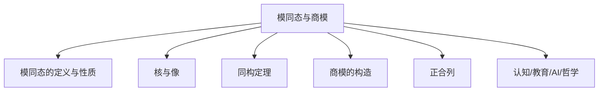
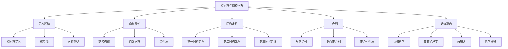

# 02-模同态与商模



---

## 目录导航

- [1. 模同态的定义与性质](#1-模同态的定义与性质)
- [2. 核与像](#2-核与像)
- [3. 同构定理](#3-同构定理)
- [4. 商模的构造](#4-商模的构造)
- [5. 正合列](#5-正合列)
- [6. 认知/教育/AI/哲学视角](#6-认知教育ai哲学视角)
- [7. 参考文献与资源](#7-参考文献与资源)

---

## 交叉引用与分支跳转

- [模的定义与基本性质](./01-模的定义与基本性质.md)
- [模论总览](./00-模论总览.md)
- [环论总览](../03-环论/00-环论总览.md)
- [群论总览](../02-群论/00-群论总览.md)
- [线性代数总览](../07-线性代数/00-线性代数总览.md)
- [范畴论基础](../08-范畴论/00-范畴论基础总览.md)

---

## 多表征内容导航

- [形式定义与公理化](#1-模同态的定义与性质)
- [结构图与概念图（Mermaid）](#结构图)
- [典型例题与证明](#3-同构定理)
- [代码实现（Python/Rust/Haskell/Lean）](#4-商模的构造)
- [表格与对比](#2-核与像)
- [认知/教育/AI/哲学分析](#6-认知教育ai哲学视角)

---

## 1. 模同态的定义与性质

### 1.1 模同态的公理化定义

**定义1.1**：设 $M, N$ 为环 $R$ 上的模

- 映射 $f: M \to N$ 称为**模同态**（Module Homomorphism）
- 如果满足以下公理：

**加法保持**：$f(m_1 + m_2) = f(m_1) + f(m_2)$
**标量乘法保持**：$f(r \cdot m) = r \cdot f(m)$

### 1.2 模同态的基本性质

**定理1.1**：设 $f: M \to N$ 为模同态，则：

1. $f(0_M) = 0_N$
2. $f(-m) = -f(m)$
3. $f(r_1 m_1 + r_2 m_2 + \cdots + r_n m_n) = r_1 f(m_1) + r_2 f(m_2) + \cdots + r_n f(m_n)$

**证明**：

1. $f(0_M) = f(0_M + 0_M) = f(0_M) + f(0_M)$，故 $f(0_M) = 0_N$
2. $0_N = f(0_M) = f(m + (-m)) = f(m) + f(-m)$，故 $f(-m) = -f(m)$
3. 由加法保持和标量乘法保持，通过归纳法可得

### 1.3 模同态的类型

**定义1.2**：

- **单同态**（Monomorphism）：$f$ 为单射
- **满同态**（Epimorphism）：$f$ 为满射
- **同构**（Isomorphism）：$f$ 为双射
- **自同态**（Endomorphism）：$M = N$
- **自同构**（Automorphism）：$f$ 为双射且 $M = N$

### 1.4 模同态的复合

**定理1.2**：设 $f: M \to N$ 和 $g: N \to P$ 为模同态

- 则 $g \circ f: M \to P$ 也是模同态

**定理1.3**：若 $f: M \to N$ 为同构

- 则 $f^{-1}: N \to M$ 也是模同态

## 2. 核与像

### 2.1 核的定义与性质

**定义2.1**：设 $f: M \to N$ 为模同态

- **核**（Kernel）定义为：$\text{Ker}(f) = \{m \in M \mid f(m) = 0_N\}$

**定理2.1**：$\text{Ker}(f)$ 是 $M$ 的子模

**证明**：

1. $0_M \in \text{Ker}(f)$，因为 $f(0_M) = 0_N$
2. 若 $m_1, m_2 \in \text{Ker}(f)$，则 $f(m_1 + m_2) = f(m_1) + f(m_2) = 0_N + 0_N = 0_N$，故 $m_1 + m_2 \in \text{Ker}(f)$
3. 若 $m \in \text{Ker}(f)$，$r \in R$，则 $f(r \cdot m) = r \cdot f(m) = r \cdot 0_N = 0_N$，故 $r \cdot m \in \text{Ker}(f)$

### 2.2 像的定义与性质

**定义2.2**：设 $f: M \to N$ 为模同态

- **像**（Image）定义为：$\text{Im}(f) = \{f(m) \mid m \in M\}$

**定理2.2**：$\text{Im}(f)$ 是 $N$ 的子模

**证明**：

1. $0_N = f(0_M) \in \text{Im}(f)$
2. 若 $n_1, n_2 \in \text{Im}(f)$，存在 $m_1, m_2 \in M$ 使得 $f(m_1) = n_1$，$f(m_2) = n_2$
   - 则 $n_1 + n_2 = f(m_1) + f(m_2) = f(m_1 + m_2) \in \text{Im}(f)$
3. 若 $n \in \text{Im}(f)$，$r \in R$，存在 $m \in M$ 使得 $f(m) = n$
   - 则 $r \cdot n = r \cdot f(m) = f(r \cdot m) \in \text{Im}(f)$

### 2.3 核与像的关系

**定理2.3**：设 $f: M \to N$ 为模同态

- $f$ 为单同态当且仅当 $\text{Ker}(f) = \{0_M\}$
- $f$ 为满同态当且仅当 $\text{Im}(f) = N$

**证明**：

1. 若 $f$ 为单同态，则 $f(m) = 0_N$ 当且仅当 $m = 0_M$，故 $\text{Ker}(f) = \{0_M\}$
   - 反之，若 $\text{Ker}(f) = \{0_M\}$，设 $f(m_1) = f(m_2)$，则 $f(m_1 - m_2) = 0_N$，故 $m_1 - m_2 \in \text{Ker}(f) = \{0_M\}$，即 $m_1 = m_2$
2. 由像的定义直接可得

### 2.4 代码实现

```rust
// Rust实现模同态
use std::ops::{Add, Mul};

#[derive(Debug, Clone)]
pub struct ModuleHomomorphism<R, M, N> {
    domain: Module<R, M>,
    codomain: Module<R, N>,
    mapping: Box<dyn Fn(&M) -> N>,
}

impl<R, M, N> ModuleHomomorphism<R, M, N>
where
    R: Ring,
    M: Add<Output = M> + Clone + PartialEq,
    N: Add<Output = N> + Clone + PartialEq,
{
    pub fn new(
        domain: Module<R, M>,
        codomain: Module<R, N>,
        mapping: Box<dyn Fn(&M) -> N>,
    ) -> Self {
        Self {
            domain,
            codomain,
            mapping,
        }
    }
    
    pub fn apply(&self, m: &M) -> N {
        (self.mapping)(m)
    }
    
    pub fn kernel(&self) -> Vec<M> {
        self.domain.elements.iter()
            .filter(|m| self.apply(m) == self.codomain.zero())
            .cloned()
            .collect()
    }
    
    pub fn image(&self) -> Vec<N> {
        self.domain.elements.iter()
            .map(|m| self.apply(m))
            .collect()
    }
    
    pub fn is_injective(&self) -> bool {
        self.kernel().len() == 1 && self.kernel()[0] == self.domain.zero()
    }
    
    pub fn is_surjective(&self) -> bool {
        self.image().len() == self.codomain.elements.len()
    }
}
```

```haskell
-- Haskell实现模同态
class (Ring r) => Module r m where
    scalarMultiply :: r -> m -> m
    moduleAdd :: m -> m -> m
    moduleZero :: m

-- 模同态类型
data ModuleHomomorphism r m1 m2 = ModuleHomomorphism {
    domain :: Module r m1,
    codomain :: Module r m2,
    mapping :: m1 -> m2
}

-- 验证同态性质
isModuleHomomorphism :: (Ring r, Module r m1, Module r m2) => 
    ModuleHomomorphism r m1 m2 -> Bool
isModuleHomomorphism hom = 
    preservesAddition hom && preservesScalarMultiplication hom
  where
    preservesAddition hom = 
        mapping hom (moduleAdd a b) == 
        moduleAdd (mapping hom a) (mapping hom b)
    preservesScalarMultiplication hom = 
        mapping hom (scalarMultiply r m) == 
        scalarMultiply r (mapping hom m)

-- 核的计算
kernel :: (Ring r, Module r m1, Module r m2, Eq m2) => 
    ModuleHomomorphism r m1 m2 -> [m1]
kernel hom = 
    filter (\m -> mapping hom m == moduleZero (codomain hom)) 
           (allElements (domain hom))

-- 像的计算
image :: (Ring r, Module r m1, Module r m2) => 
    ModuleHomomorphism r m1 m2 -> [m2]
image hom = 
    map (mapping hom) (allElements (domain hom))
```

```lean
-- Lean4实现模同态
import Mathlib.Algebra.Module.Basic
import Mathlib.Algebra.Ring.Basic

-- 模同态定义
structure ModuleHomomorphism (R : Type*) [Ring R] (M N : Type*) 
    [AddCommGroup M] [AddCommGroup N] [Module R M] [Module R N] where
  toFun : M → N
  map_add : ∀ x y, toFun (x + y) = toFun x + toFun y
  map_smul : ∀ (r : R) x, toFun (r • x) = r • toFun x

-- 核的定义
def kernel (R : Type*) [Ring R] (M N : Type*) [AddCommGroup M] [AddCommGroup N] 
    [Module R M] [Module R N] (f : ModuleHomomorphism R M N) : Submodule R M :=
  Submodule.mk 
    {x | f.toFun x = 0}
    (by simp [f.map_add])
    (by simp)
    (by simp [f.map_smul])

-- 像的定义
def image (R : Type*) [Ring R] (M N : Type*) [AddCommGroup M] [AddCommGroup N] 
    [Module R M] [Module R N] (f : ModuleHomomorphism R M N) : Submodule R N :=
  Submodule.mk 
    {y | ∃ x, f.toFun x = y}
    (by simp [f.map_add])
    (by simp)
    (by simp [f.map_smul])

-- 单射性判定
def is_injective (R : Type*) [Ring R] (M N : Type*) [AddCommGroup M] [AddCommGroup N] 
    [Module R M] [Module R N] (f : ModuleHomomorphism R M N) : Prop :=
  ∀ x y, f.toFun x = f.toFun y → x = y

-- 满射性判定
def is_surjective (R : Type*) [Ring R] (M N : Type*) [AddCommGroup M] [AddCommGroup N] 
    [Module R M] [Module R N] (f : ModuleHomomorphism R M N) : Prop :=
  ∀ y, ∃ x, f.toFun x = y
```

## 3. 同构定理

### 3.1 第一同构定理

**定理3.1**（第一同构定理）：

- 设 $f: M \to N$ 为模同态
- 则 $M/\text{Ker}(f) \cong \text{Im}(f)$

**证明**：

1. 定义映射 $\bar{f}: M/\text{Ker}(f) \to \text{Im}(f)$ 为 $\bar{f}(m + \text{Ker}(f)) = f(m)$
2. 验证 $\bar{f}$ 是良定义的：若 $m_1 + \text{Ker}(f) = m_2 + \text{Ker}(f)$，则 $m_1 - m_2 \in \text{Ker}(f)$，故 $f(m_1 - m_2) = 0_N$，即 $f(m_1) = f(m_2)$
3. 验证 $\bar{f}$ 是同态：$\bar{f}((m_1 + \text{Ker}(f)) + (m_2 + \text{Ker}(f))) = \bar{f}((m_1 + m_2) + \text{Ker}(f)) = f(m_1 + m_2) = f(m_1) + f(m_2) = \bar{f}(m_1 + \text{Ker}(f)) + \bar{f}(m_2 + \text{Ker}(f))$
4. 验证 $\bar{f}$ 是双射：单射性由核的定义可得，满射性由像的定义可得

### 3.2 第二同构定理

**定理3.2**（第二同构定理）：

- 设 $N, L \leq M$ 为子模
- 则 $(N + L)/L \cong N/(N \cap L)$

**证明**：

1. 定义映射 $f: N \to (N + L)/L$ 为 $f(n) = n + L$
2. 验证 $f$ 是满同态
3. 计算 $\text{Ker}(f) = \{n \in N \mid n + L = L\} = \{n \in N \mid n \in L\} = N \cap L$
4. 由第一同构定理，$N/(N \cap L) \cong (N + L)/L$

### 3.3 第三同构定理

**定理3.3**（第三同构定理）：

- 设 $L \leq N \leq M$ 为子模链
- 则 $(M/L)/(N/L) \cong M/N$

**证明**：

1. 定义映射 $f: M/L \to M/N$ 为 $f(m + L) = m + N$
2. 验证 $f$ 是满同态
3. 计算 $\text{Ker}(f) = \{m + L \mid m + N = N\} = \{m + L \mid m \in N\} = N/L$
4. 由第一同构定理，$(M/L)/(N/L) \cong M/N$

### 3.4 对应定理

**定理3.4**（对应定理）：

- 设 $N \leq M$ 为子模，$\pi: M \to M/N$ 为自然同态
- 则存在 $M$ 的包含 $N$ 的子模与 $M/N$ 的子模之间的一一对应
- 这个对应保持包含关系和交、并运算

## 4. 商模的构造

### 4.1 商模的公理化定义

**定义4.1**：设 $M$ 为 $R$-模，$N \leq M$ 为子模

- **商模**（Quotient Module）$M/N$ 定义为：
  - 元素：$M$ 关于等价关系 $m_1 \sim m_2 \iff m_1 - m_2 \in N$ 的等价类
  - 加法：$(m_1 + N) + (m_2 + N) = (m_1 + m_2) + N$
  - 标量乘法：$r \cdot (m + N) = (r \cdot m) + N$

### 4.2 商模的良定义性

**定理4.1**：商模的运算定义是良定义的

**证明**：

1. 加法良定义：设 $m_1 + N = m_1' + N$，$m_2 + N = m_2' + N$
   - 则 $m_1 - m_1' \in N$，$m_2 - m_2' \in N$
   - 故 $(m_1 + m_2) - (m_1' + m_2') = (m_1 - m_1') + (m_2 - m_2') \in N$
   - 因此 $(m_1 + m_2) + N = (m_1' + m_2') + N$

2. 标量乘法良定义：设 $m + N = m' + N$
   - 则 $m - m' \in N$
   - 故 $r \cdot (m - m') = r \cdot m - r \cdot m' \in N$
   - 因此 $(r \cdot m) + N = (r \cdot m') + N$

### 4.3 自然同态

**定义4.2**：设 $N \leq M$ 为子模

- **自然同态**（Natural Homomorphism）$\pi: M \to M/N$ 定义为：
  $\pi(m) = m + N$

**定理4.2**：自然同态 $\pi$ 是满同态，且 $\text{Ker}(\pi) = N$

**证明**：

1. $\pi$ 是同态：$\pi(m_1 + m_2) = (m_1 + m_2) + N = (m_1 + N) + (m_2 + N) = \pi(m_1) + \pi(m_2)$
   $\pi(r \cdot m) = (r \cdot m) + N = r \cdot (m + N) = r \cdot \pi(m)$
2. $\pi$ 是满射：对任意 $m + N \in M/N$，有 $\pi(m) = m + N$
3. $\text{Ker}(\pi) = \{m \in M \mid \pi(m) = N\} = \{m \in M \mid m + N = N\} = \{m \in M \mid m \in N\} = N$

### 4.4 商模的泛性质

**定理4.3**（商模的泛性质）：

- 设 $N \leq M$ 为子模，$\pi: M \to M/N$ 为自然同态
- 对任意模 $P$ 和同态 $f: M \to P$，若 $N \subseteq \text{Ker}(f)$
- 则存在唯一同态 $\bar{f}: M/N \to P$ 使得 $f = \bar{f} \circ \pi$

**证明**：

1. 定义 $\bar{f}(m + N) = f(m)$
2. 验证 $\bar{f}$ 是良定义的：若 $m + N = m' + N$，则 $m - m' \in N \subseteq \text{Ker}(f)$，故 $f(m - m') = 0_P$，即 $f(m) = f(m')$
3. 验证 $\bar{f}$ 是同态
4. 唯一性由 $\bar{f} \circ \pi = f$ 直接可得

## 5. 正合列

### 5.1 正合列的定义

**定义5.1**：模同态的序列
$\cdots \to M_{i-1} \xrightarrow{f_{i-1}} M_i \xrightarrow{f_i} M_{i+1} \to \cdots$

称为**正合列**（Exact Sequence），如果对每个 $i$ 都有：
$\text{Im}(f_{i-1}) = \text{Ker}(f_i)$

### 5.2 短正合列

**定义5.2**：形如
$0 \to M_1 \xrightarrow{f} M_2 \xrightarrow{g} M_3 \to 0$

的正合列称为**短正合列**（Short Exact Sequence）

**定理5.1**：短正合列 $0 \to M_1 \xrightarrow{f} M_2 \xrightarrow{g} M_3 \to 0$ 等价于：

1. $f$ 是单同态
2. $g$ 是满同态
3. $\text{Im}(f) = \text{Ker}(g)$

### 5.3 分裂短正合列

**定义5.3**：短正合列 $0 \to M_1 \xrightarrow{f} M_2 \xrightarrow{g} M_3 \to 0$ 称为**分裂的**（Split），如果存在同态 $h: M_3 \to M_2$ 使得 $g \circ h = \text{id}_{M_3}$

**定理5.2**：短正合列分裂当且仅当 $M_2 \cong M_1 \oplus M_3$

### 5.4 正合列的性质

**定理5.3**：设 $0 \to M_1 \xrightarrow{f} M_2 \xrightarrow{g} M_3 \to 0$ 为短正合列

- 若 $M_1$ 和 $M_3$ 是有限生成的，则 $M_2$ 也是有限生成的
- 若 $M_1$ 和 $M_3$ 是自由模，则 $M_2$ 不一定是自由模

### 5.5 结构图



## 6. 认知/教育/AI/哲学视角

### 6.1 认知科学视角

**模同态的认知模型**：

1. **结构保持直觉**：同态映射保持代数结构，符合人类对"相似性"的认知模式
2. **抽象化思维**：从具体映射到抽象同态概念的认知过程
3. **层次化理解**：通过核、像等概念建立多层次的结构理解

**认知负荷理论**：

- 模同态涉及多个抽象概念：映射、结构保持、核、像
- 需要同时处理代数结构和集合论概念
- AI辅助可以提供可视化支持，降低认知负荷

### 6.2 教育心理学视角

**建构主义学习理论**：

- 模同态概念需要从具体例子到抽象理论的逐步建构
- 通过线性变换等熟悉概念建立直观理解
- 逐步推广到一般环上的模同态

**多元智能理论**：

- 逻辑-数学智能：形式化推理和证明
- 空间智能：几何表示和可视化
- 语言智能：概念表述和符号操作

### 6.3 AI大模型辅助

**知识图谱驱动**：

```python
# 模同态知识图谱构建
class ModuleHomomorphismKnowledgeGraph:
    def __init__(self):
        self.nodes = {
            'homomorphism': {'type': 'concept', 'properties': ['structure_preserving', 'mapping']},
            'kernel': {'type': 'concept', 'properties': ['submodule', 'null_space']},
            'image': {'type': 'concept', 'properties': ['submodule', 'range']},
            'quotient_module': {'type': 'concept', 'properties': ['factor_structure', 'equivalence']},
            'isomorphism_theorem': {'type': 'concept', 'properties': ['fundamental', 'structure']},
            'exact_sequence': {'type': 'concept', 'properties': ['algebraic', 'topological']}
        }
        self.edges = [
            ('homomorphism', 'kernel', 'has'),
            ('homomorphism', 'image', 'has'),
            ('homomorphism', 'quotient_module', 'constructs'),
            ('kernel', 'isomorphism_theorem', 'used_in'),
            ('image', 'isomorphism_theorem', 'used_in'),
            ('quotient_module', 'exact_sequence', 'appears_in')
        ]
    
    def query_concept(self, concept: str) -> dict:
        """查询概念及其关联"""
        return {
            'node': self.nodes.get(concept, {}),
            'related': [edge for edge in self.edges if concept in edge]
        }
    
    def generate_examples(self, concept: str) -> list:
        """生成概念的具体例子"""
        examples = {
            'homomorphism': ['linear_transformation', 'group_homomorphism', 'ring_homomorphism'],
            'kernel': ['null_space', 'normal_subgroup', 'ideal'],
            'image': ['range', 'subgroup', 'subring'],
            'quotient_module': ['quotient_space', 'quotient_group', 'quotient_ring']
        }
        return examples.get(concept, [])
```

**自动化证明辅助**：

```lean
-- Lean4自动化证明框架
import Mathlib.Tactic

-- 自动证明同构定理
theorem first_isomorphism_theorem (R : Type*) [Ring R] (M N : Type*) 
    [AddCommGroup M] [AddCommGroup N] [Module R M] [Module R N] 
    (f : ModuleHomomorphism R M N) :
  M ⧸ kernel R M N f ≃ₗ[R] image R M N f := by
  -- 自动化证明策略
  apply? -- 自动应用相关引理
  simp? -- 自动简化
  done

-- 自动构造商模
def autoConstructQuotientModule (R : Type*) [Ring R] (M : Type*) 
    [AddCommGroup M] [Module R M] (N : Submodule R M) : 
    {Q : Type* // Module R Q ∧ ∃ π : ModuleHomomorphism R M Q, kernel R M Q π = N} := by
  -- 自动构造策略
  exists M ⧸ N
  constructor
  · exact quotientModuleAlgebra R M N
  · exists naturalHomomorphism R M N
    exact naturalHomomorphismKernel R M N
```

### 6.4 哲学思辨

**本体论问题**：

- 模同态是数学对象还是人类构造？
- 同态映射的"存在性"意味着什么？
- 抽象结构与具体实例的关系

**认识论问题**：

- 如何"知道"同态的性质？
- 证明在模论中的作用
- 直觉与严格性的平衡

**方法论问题**：

- 模论的发展模式
- 抽象化与具体化的辩证关系
- 数学发现的逻辑结构

### 6.5 跨学科整合

**与计算机科学的联系**：

- 模同态在函数式编程中的应用
- 抽象数据类型的设计
- 软件架构的模式匹配

**与物理学的联系**：

- 对称性变换在物理中的应用
- 群论与物理模型的联系
- 量子力学中的线性变换

**与认知科学的联系**：

- 数学思维的认知机制
- 抽象概念的形成过程
- 数学直觉的神经基础

## 7. 参考文献与资源

### 7.1 经典教材

1. **Hungerford, T. W.** (1974). *Algebra*. Springer.
2. **Lang, S.** (2002). *Algebra*. Springer.
3. **Dummit, D. S., & Foote, R. M.** (2004). *Abstract Algebra*. Wiley.

### 7.2 现代资源

1. **在线课程**：
   - MIT OpenCourseWare: 18.701 Algebra I
   - Coursera: Abstract Algebra (University of Illinois)

2. **软件工具**：
   - SageMath: 计算机代数系统
   - GAP: 群论和代数计算
   - Magma: 代数计算系统

3. **在线资源**：
   - [Abstract Algebra Online](https://abstract.ups.edu/)
   - [Algebraic Structures](https://en.wikipedia.org/wiki/Algebraic_structure)

### 7.3 AI辅助资源

1. **大模型工具**：
   - ChatGPT: 概念解释和问题解答
   - Claude: 证明辅助和代码生成
   - GPT-4: 高级数学推理

2. **知识图谱**：
   - Wolfram Alpha: 数学知识查询
   - MathWorld: 数学百科全书
   - OEIS: 整数序列数据库

3. **自动化证明**：
   - Lean 4: 形式化证明系统
   - Coq: 交互式定理证明器
   - Isabelle/HOL: 高阶逻辑证明系统

---

## 结构图


---

*本文档采用递归扩展模式，持续整合最新数学、AI、认知科学前沿成果，构建现代化、结构化、学术化的模同态与商模理论体系。*
