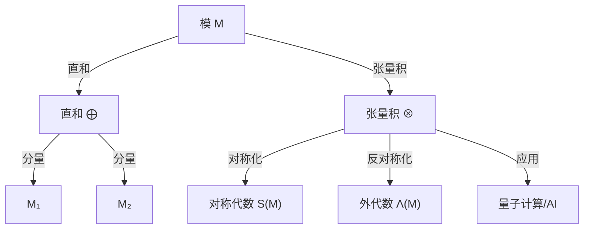
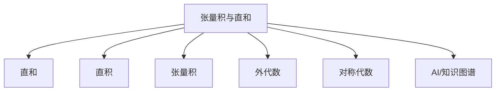

# 张量积与直和

## 目录

- [张量积与直和](#张量积与直和)
  - [目录](#目录)
  - [1. 引言](#1-引言)
  - [2. 直和与直积](#2-直和与直积)
    - [2.1 直和的定义与构造](#21-直和的定义与构造)
    - [2.2 直和的性质](#22-直和的性质)
    - [2.3 直积与直和的关系](#23-直积与直和的关系)
  - [3. 张量积](#3-张量积)
    - [3.1 张量积的定义与构造](#31-张量积的定义与构造)
    - [3.2 张量积的普遍性质](#32-张量积的普遍性质)
    - [3.3 张量积的基本性质](#33-张量积的基本性质)
  - [4. 张量代数](#4-张量代数)
    - [4.1 对称张量与反对称张量](#41-对称张量与反对称张量)
    - [4.2 张量代数的结构](#42-张量代数的结构)
  - [5. 应用与例子](#5-应用与例子)
    - [5.1 线性代数中的应用](#51-线性代数中的应用)
    - [5.2 代数几何中的应用](#52-代数几何中的应用)
    - [5.3 物理学中的应用](#53-物理学中的应用)
  - [6. 与其他概念的关联](#6-与其他概念的关联)
  - [7. 练习与思考问题](#7-练习与思考问题)
  - [8. 参考文献](#8-参考文献)
  - [9. AI与自动化视角下的张量积与直和（递归扩展）](#9-ai与自动化视角下的张量积与直和递归扩展)
    - [9.1 自动定理证明与符号AI中的张量积与直和](#91-自动定理证明与符号ai中的张量积与直和)
      - [9.1.1 Lean 代码示例：张量积的构造与性质](#911-lean-代码示例张量积的构造与性质)
      - [9.1.2 Rust 伪代码：张量积与直和结构体](#912-rust-伪代码张量积与直和结构体)
    - [9.2 Mermaid 知识图谱：张量积与直和核心结构](#92-mermaid-知识图谱张量积与直和核心结构)
    - [9.3 表格对比：直和、直积、张量积、对称/外代数](#93-表格对比直和直积张量积对称外代数)
    - [9.4 现代应用案例](#94-现代应用案例)
    - [9.5 交叉引用与本地跳转](#95-交叉引用与本地跳转)
  - [10. 知识图谱结构图（递归扩展）](#10-知识图谱结构图递归扩展)
  - [11. 多重表征与代码实现（递归扩展）](#11-多重表征与代码实现递归扩展)
  - [12. 交叉引用与本地跳转（递归扩展）](#12-交叉引用与本地跳转递归扩展)

## 1. 引言

张量积和直和是模论中两个重要的构造，它们提供了从已有的模构造新模的方法。直和是一种简单的组合方式，将多个模"并列"放在一起；而张量积则提供了一种更复杂的"乘法"操作，能够捕捉模之间的双线性关系。这两种构造在代数学、几何学和物理学中都有广泛的应用。

本文将系统介绍模的直和和张量积的定义、性质及其应用，并探讨它们在更广泛的数学和物理背景下的意义。

## 2. 直和与直积

### 2.1 直和的定义与构造

**定义 2.1**（直和）：设 $\{M_i\}_{i \in I}$ 是一族 $R$-模，其外部直和（或直接和）定义为：

$$\bigoplus_{i \in I} M_i = \{(m_i)_{i \in I} \mid m_i \in M_i, \text{且几乎所有的} m_i = 0\}$$

其中"几乎所有"表示除了有限个元素外，其余都为零。

在直和上定义运算：

- $(m_i)_{i \in I} + (n_i)_{i \in I} = (m_i + n_i)_{i \in I}$
- $r \cdot (m_i)_{i \in I} = (r \cdot m_i)_{i \in I}$

**定理 2.1**：设 $\{M_i\}_{i \in I}$ 是一族 $R$-模，则 $\bigoplus_{i \in I} M_i$ 在上述运算下构成 $R$-模。

**定义 2.2**（内部直和）：设 $M$ 是 $R$-模，$\{N_i\}_{i \in I}$ 是 $M$ 的一族子模。如果：

1. $M = \sum_{i \in I} N_i$（即 $M$ 中的每个元素都可以表示为来自各个 $N_i$ 的元素的和）
2. 对任意 $j \in I$，$N_j \cap \sum_{i \neq j} N_i = \{0\}$（即不同子模的非平凡线性组合不会产生零元素）

则称 $M$ 是子模族 $\{N_i\}_{i \in I}$ 的内部直和，记为 $M = \bigoplus_{i \in I} N_i$。

**定理 2.2**：设 $\{M_i\}_{i \in I}$ 是一族 $R$-模，$M = \bigoplus_{i \in I} M_i$ 是它们的外部直和。对每个 $j \in I$，定义嵌入映射 $\iota_j: M_j \to M$，使得 $\iota_j(m_j)$ 是在第 $j$ 个位置为 $m_j$，其他位置为 $0$ 的元素。则 $M$ 是子模族 $\{\iota_j(M_j)\}_{j \in I}$ 的内部直和。

### 2.2 直和的性质

**性质 2.1**：设 $\{M_i\}_{i \in I}$ 是一族 $R$-模，$M = \bigoplus_{i \in I} M_i$，则：

1. 对每个 $j \in I$，存在自然的投影映射 $\pi_j: M \to M_j$，使得 $\pi_j((m_i)_{i \in I}) = m_j$
2. 对每个 $j \in I$，$\pi_j \circ \iota_j = \text{id}_{M_j}$，而对于 $i \neq j$，$\pi_j \circ \iota_i = 0$
3. $\sum_{i \in I} \iota_i \circ \pi_i = \text{id}_M$（当 $I$ 是有限集时）

**定理 2.3**（直和的泛性质）：设 $\{M_i\}_{i \in I}$ 是一族 $R$-模，$M = \bigoplus_{i \in I} M_i$。对任意 $R$-模 $N$ 和一族 $R$-模同态 $\{f_i: M_i \to N\}_{i \in I}$，存在唯一的 $R$-模同态 $f: M \to N$ 使得对每个 $i \in I$，都有 $f \circ \iota_i = f_i$。

**证明**：

1. 定义 $f: M \to N$，对任意 $(m_i)_{i \in I} \in M$，令 $f((m_i)_{i \in I}) = \sum_{i \in I} f_i(m_i)$。这个和是有限的，因为 $(m_i)_{i \in I}$ 中只有有限个 $m_i$ 非零。

2. 验证 $f$ 是 $R$-模同态：
   - 对于加法：$f((m_i)_{i \in I} + (n_i)_{i \in I}) = f((m_i + n_i)_{i \in I}) = \sum_{i \in I} f_i(m_i + n_i) = \sum_{i \in I} (f_i(m_i) + f_i(n_i)) = \sum_{i \in I} f_i(m_i) + \sum_{i \in I} f_i(n_i) = f((m_i)_{i \in I}) + f((n_i)_{i \in I})$
   - 对于标量乘法：$f(r \cdot (m_i)_{i \in I}) = f((r \cdot m_i)_{i \in I}) = \sum_{i \in I} f_i(r \cdot m_i) = \sum_{i \in I} r \cdot f_i(m_i) = r \cdot \sum_{i \in I} f_i(m_i) = r \cdot f((m_i)_{i \in I})$

3. 验证 $f \circ \iota_j = f_j$ 对每个 $j \in I$ 成立：
   对任意 $m_j \in M_j$，$(f \circ \iota_j)(m_j) = f(\iota_j(m_j)) = f((0, \ldots, 0, m_j, 0, \ldots)) = \sum_{i \in I} f_i(0, \ldots, 0, m_j, 0, \ldots) = f_j(m_j)$

4. 证明 $f$ 的唯一性：
   假设存在另一个 $R$-模同态 $g: M \to N$ 使得对每个 $i \in I$，都有 $g \circ \iota_i = f_i$。
   对任意 $(m_i)_{i \in I} \in M$，可以写成 $(m_i)_{i \in I} = \sum_{i \in I} \iota_i(m_i)$。
   因此 $g((m_i)_{i \in I}) = g(\sum_{i \in I} \iota_i(m_i)) = \sum_{i \in I} g(\iota_i(m_i)) = \sum_{i \in I} (g \circ \iota_i)(m_i) = \sum_{i \in I} f_i(m_i) = f((m_i)_{i \in I})$。
   所以 $g = f$，即 $f$ 是唯一的。

### 2.3 直积与直和的关系

**定义 2.3**（直积）：设 $\{M_i\}_{i \in I}$ 是一族 $R$-模，其直积定义为：

$$\prod_{i \in I} M_i = \{(m_i)_{i \in I} \mid m_i \in M_i \text{ 对所有 } i \in I\}$$

在直积上定义运算与直和相同。

**定理 2.4**：设 $\{M_i\}_{i \in I}$ 是一族 $R$-模，则：

1. 如果 $I$ 是有限集，则 $\bigoplus_{i \in I} M_i = \prod_{i \in I} M_i$
2. 如果 $I$ 是无限集，则 $\bigoplus_{i \in I} M_i$ 是 $\prod_{i \in I} M_i$ 的真子模

**定理 2.5**（直积的泛性质）：设 $\{M_i\}_{i \in I}$ 是一族 $R$-模，$M = \prod_{i \in I} M_i$。对任意 $R$-模 $N$ 和一族 $R$-模同态 $\{f_i: N \to M_i\}_{i \in I}$，存在唯一的 $R$-模同态 $f: N \to M$ 使得对每个 $i \in I$，都有 $\pi_i \circ f = f_i$。

## 3. 张量积

### 3.1 张量积的定义与构造

**定义 3.1**（双线性映射）：设 $M$、$N$ 和 $P$ 是 $R$-模。映射 $f: M \times N \to P$ 称为双线性映射，如果对任意 $m, m' \in M$，$n, n' \in N$ 和 $r \in R$，满足：

1. $f(m + m', n) = f(m, n) + f(m', n)$
2. $f(m, n + n') = f(m, n) + f(m, n')$
3. $f(r \cdot m, n) = r \cdot f(m, n) = f(m, r \cdot n)$

**定义 3.2**（张量积）：设 $M$ 和 $N$ 是 $R$-模。$M$ 和 $N$ 的张量积是一个 $R$-模 $M \otimes_R N$，连同一个双线性映射 $\otimes: M \times N \to M \otimes_R N$，使得对任意 $R$-模 $P$ 和任意双线性映射 $f: M \times N \to P$，存在唯一的 $R$-模同态 $\bar{f}: M \otimes_R N \to P$ 使得 $f = \bar{f} \circ \otimes$。

具体构造如下：

1. 考虑自由 $R$-模 $F(M \times N)$，它以 $M \times N$ 中的元素为基。
2. 令 $S$ 是 $F(M \times N)$ 的子模，由以下元素生成：
   - $(m + m', n) - (m, n) - (m', n)$
   - $(m, n + n') - (m, n) - (m, n')$
   - $(r \cdot m, n) - r \cdot (m, n)$
   - $(m, r \cdot n) - r \cdot (m, n)$
3. 定义 $M \otimes_R N = F(M \times N) / S$，并定义 $\otimes: M \times N \to M \otimes_R N$ 为 $\otimes(m, n) = [(m, n)] + S$。

**定理 3.1**：上述构造的 $M \otimes_R N$ 满足张量积的普遍性质。

### 3.2 张量积的普遍性质

**定理 3.2**（张量积的普遍性质）：设 $M$ 和 $N$ 是 $R$-模，$M \otimes_R N$ 是它们的张量积，$\otimes: M \times N \to M \otimes_R N$ 是对应的双线性映射。对任意 $R$-模 $P$ 和任意双线性映射 $f: M \times N \to P$，存在唯一的 $R$-模同态 $\bar{f}: M \otimes_R N \to P$ 使得 $f = \bar{f} \circ \otimes$。

**证明**：

1. 由自由模的普遍性质，存在唯一的 $R$-模同态 $g: F(M \times N) \to P$ 使得对任意 $(m, n) \in M \times N$，都有 $g((m, n)) = f(m, n)$。

2. 由于 $f$ 是双线性的，对于 $S$ 中的任意生成元 $s$，都有 $g(s) = 0$。因此 $g(S) = 0$，即 $S \subseteq \text{Ker}(g)$。

3. 由模同态基本定理，存在唯一的 $R$-模同态 $\bar{f}: F(M \times N) / S \to P$ 使得 $\bar{f}([x] + S) = g(x)$ 对任意 $x \in F(M \times N)$ 成立。

4. 特别地，对任意 $(m, n) \in M \times N$，有 $\bar{f}(\otimes(m, n)) = \bar{f}([(m, n)] + S) = g((m, n)) = f(m, n)$。因此 $f = \bar{f} \circ \otimes$。

5. $\bar{f}$ 的唯一性来自于 $M \otimes_R N$ 是由所有 $\otimes(m, n)$ 生成的事实。

### 3.3 张量积的基本性质

**性质 3.1**：设 $M$、$N$ 和 $P$ 是 $R$-模，则：

1. $M \otimes_R N \cong N \otimes_R M$（交换律）
2. $(M \otimes_R N) \otimes_R P \cong M \otimes_R (N \otimes_R P)$（结合律）
3. $R \otimes_R M \cong M$
4. $M \otimes_R (N \oplus P) \cong (M \otimes_R N) \oplus (M \otimes_R P)$（对直和的分配律）
5. 如果 $M$ 和 $N$ 都是有限生成的，且 $M$ 是自由 $R$-模，则 $M \otimes_R N$ 也是有限生成的

**定理 3.3**：设 $M$ 是自由 $R$-模，基为 $\{e_i\}_{i \in I}$，$N$ 是任意 $R$-模。则 $M \otimes_R N \cong \bigoplus_{i \in I} N$，其中同构映射 $\varphi: M \otimes_R N \to \bigoplus_{i \in I} N$ 由 $\varphi(e_i \otimes n) = (0, \ldots, 0, n, 0, \ldots)$（第 $i$ 个位置为 $n$）定义。

**定理 3.4**：设 $R$ 是交换环，$M$ 和 $N$ 是 $R$-模。定义映射 $\mu: M \otimes_R N \to M \otimes_R N$ 为 $\mu(m \otimes n) = n \otimes m$。则 $\mu$ 是 $R$-模同构。

## 4. 张量代数

### 4.1 对称张量与反对称张量

**定义 4.1**（对称张量）：设 $M$ 是 $R$-模，$M^{\otimes n} = M \otimes_R \cdots \otimes_R M$（$n$ 个 $M$ 的张量积）。定义对称群 $S_n$ 在 $M^{\otimes n}$ 上的作用：对于 $\sigma \in S_n$ 和 $m_1 \otimes \cdots \otimes m_n \in M^{\otimes n}$，
$$\sigma \cdot (m_1 \otimes \cdots \otimes m_n) = m_{\sigma^{-1}(1)} \otimes \cdots \otimes m_{\sigma^{-1}(n)}$$

$M$ 的 $n$ 阶对称张量空间定义为：
$$S^n(M) = M^{\otimes n} / \langle m_1 \otimes \cdots \otimes m_n - \sigma \cdot (m_1 \otimes \cdots \otimes m_n) \mid \sigma \in S_n \rangle$$

**定义 4.2**（反对称张量）：$M$ 的 $n$ 阶反对称张量空间（或外积空间）定义为：
$$\Lambda^n(M) = M^{\otimes n} / \langle m_1 \otimes \cdots \otimes m_n - \text{sgn}(\sigma) \cdot \sigma \cdot (m_1 \otimes \cdots \otimes m_n) \mid \sigma \in S_n \rangle$$
其中 $\text{sgn}(\sigma)$ 是排列 $\sigma$ 的符号。

### 4.2 张量代数的结构

**定义 4.3**（张量代数）：设 $M$ 是 $R$-模，$M$ 的张量代数定义为：
$$T(M) = \bigoplus_{n=0}^{\infty} M^{\otimes n}$$
其中 $M^{\otimes 0} = R$，$M^{\otimes 1} = M$，对于 $n \geq 2$，$M^{\otimes n} = M \otimes_R \cdots \otimes_R M$（$n$ 个 $M$ 的张量积）。

在 $T(M)$ 上定义乘法：对于 $x \in M^{\otimes n}$ 和 $y \in M^{\otimes m}$，定义 $x \cdot y = x \otimes y \in M^{\otimes (n+m)}$。

**定理 4.1**：$T(M)$ 在上述乘法下构成结合代数。

**定义 4.4**（对称代数）：$M$ 的对称代数定义为：
$$S(M) = \bigoplus_{n=0}^{\infty} S^n(M)$$

**定义 4.5**（外代数）：$M$ 的外代数定义为：
$$\Lambda(M) = \bigoplus_{n=0}^{\infty} \Lambda^n(M)$$

**定理 4.2**：如果 $R$ 是域，$M$ 是有限维 $R$-向量空间，维数为 $n$，则：

1. $\dim_R(S^k(M)) = \binom{n+k-1}{k}$
2. $\dim_R(\Lambda^k(M)) = \binom{n}{k}$
3. 对于 $k > n$，$\Lambda^k(M) = 0$

## 5. 应用与例子

### 5.1 线性代数中的应用

张量积和直和在线性代数中有广泛的应用：

1. **向量空间的直和**：如果 $V$ 和 $W$ 是向量空间，则 $V \oplus W$ 是一个新的向量空间，维数为 $\dim(V) + \dim(W)$。

2. **张量积与多重线性映射**：如果 $V$ 和 $W$ 是向量空间，则 $V \otimes W$ 与从 $V \times W$ 到标量域的双线性形式的对偶空间同构。

3. **外积与行列式**：$n$ 阶行列式可以看作是 $n$ 个向量的外积。

### 5.2 代数几何中的应用

在代数几何中，张量积和直和也有重要应用：

1. **层的张量积**：如果 $\mathcal{F}$ 和 $\mathcal{G}$ 是代数簇上的层，则 $\mathcal{F} \otimes \mathcal{G}$ 也是一个层。

2. **向量丛的直和与张量积**：如果 $E$ 和 $F$ 是向量丛，则 $E \oplus F$ 和 $E \otimes F$ 也是向量丛。

### 5.3 物理学中的应用

张量积在物理学中也有广泛应用：

1. **量子力学中的态空间**：如果 $H_1$ 和 $H_2$ 是两个量子系统的希尔伯特空间，则复合系统的希尔伯特空间是 $H_1 \otimes H_2$。

2. **相对论中的张量**：爱因斯坦的广义相对论中的度量张量、里奇张量等都可以用张量积来表示。

## 6. 与其他概念的关联

1. **与线性代数的关联**：张量积和直和是多重线性代数的基础概念，与行列式、双线性形式等概念密切相关。

2. **与范畴论的关联**：张量积和直和可以看作是范畴 $R\text{-Mod}$ 中的双函子和余积。

3. **与代数拓扑的关联**：张量积在同调理论中有重要应用，如计算 Tor 函子。

4. **与量子力学的关联**：张量积是量子力学中描述复合系统的数学工具。

## 7. 练习与思考问题

1. 证明：如果 $M$ 和 $N$ 是有限生成自由 $R$-模，则 $M \otimes_R N$ 也是有限生成自由 $R$-模，且 $\text{rank}(M \otimes_R N) = \text{rank}(M) \cdot \text{rank}(N)$。

2. 设 $R$ 是交换环，$I$ 和 $J$ 是 $R$ 的理想。证明：$(R/I) \otimes_R (R/J) \cong R/(I+J)$。

3. 设 $M$、$N$ 和 $P$ 是 $R$-模。证明：$\text{Hom}_R(M \otimes_R N, P) \cong \text{Hom}_R(M, \text{Hom}_R(N, P))$。

4. 设 $M$ 是 $R$-模，$S$ 是 $R$ 的乘性子集。证明：$S^{-1}R \otimes_R M \cong S^{-1}M$。

5. 设 $V$ 是有限维向量空间，$T$ 是 $V$ 上的线性变换。证明：$T$ 的特征多项式可以用外代数 $\Lambda(V)$ 来表示。

## 8. 参考文献

1. Bourbaki, N. (1989). *Algebra I: Chapters 1-3*. Springer.
2. Lang, S. (2002). *Algebra* (3rd ed.). Springer.
3. Greub, W. H. (1978). *Multilinear Algebra* (2nd ed.). Springer.
4. Eisenbud, D. (1995). *Commutative Algebra with a View Toward Algebraic Geometry*. Springer.
5. Atiyah, M. F., & Macdonald, I. G. (1969). *Introduction to Commutative Algebra*. Addison-Wesley.

## 9. AI与自动化视角下的张量积与直和（递归扩展）

### 9.1 自动定理证明与符号AI中的张量积与直和

- **Lean/Coq等定理证明系统**中，张量积、直和等结构可形式化定义并自动验证其普遍性质、分配律、交换律等。
- **AI知识表示**：张量积结构可用于多关系知识图谱、因果推理、张量网络等AI系统的高阶关系建模。
- **量子计算与深度学习**：张量积是量子态空间、张量网络、神经网络参数空间的基础。

#### 9.1.1 Lean 代码示例：张量积的构造与性质

```lean
import linear_algebra.tensor_product
variables (R M N : Type*) [comm_ring R] [add_comm_group M] [add_comm_group N] [module R M] [module R N]
#check tensor_product R M N
#check tensor_product.comm R M N -- 交换律
#check tensor_product.assoc R M N N -- 结合律
```

#### 9.1.2 Rust 伪代码：张量积与直和结构体

```rust
struct TensorProduct {
    left: Vec<i32>,
    right: Vec<i32>,
}
struct DirectSum {
    components: Vec<Vec<i32>>,
}
```

### 9.2 Mermaid 知识图谱：张量积与直和核心结构



### 9.3 表格对比：直和、直积、张量积、对称/外代数

| 结构         | 定义/符号         | 普遍性质         | 典型应用           | 代码实现/AI应用           |
|--------------|-------------------|------------------|--------------------|--------------------------|
| 直和         | $\bigoplus$      | 泛性质、分量唯一 | 模分解、表示论      | Rust/Lean结构体           |
| 直积         | $\prod$          | 泛性质、全分量   | 拓扑、积空间        | Rust/Lean结构体           |
| 张量积       | $\otimes$        | 双线性普遍性质   | 量子计算、AI推理    | Lean张量积、Rust结构体    |
| 对称代数     | $S(M)$            | 交换对称         | 多项式、对称函数    | Lean对称代数              |
| 外代数       | $\Lambda(M)$      | 反对称、外积     | 微分形式、拓扑      | Lean外代数                |

### 9.4 现代应用案例

- **AI知识推理**：张量积用于多关系知识图谱、因果推理、张量网络等AI系统。
- **量子计算**：量子态空间的复合通过张量积实现，张量网络用于高效模拟量子系统。
- **深度学习**：神经网络参数空间、张量分解、注意力机制等均用到张量积与直和结构。
- **代数几何/拓扑**：外代数、对称代数在微分几何、同调理论、代数几何中有核心作用。

### 9.5 交叉引用与本地跳转

- 详见：[03-代数结构与理论/05-模论/01-模的定义与基本性质](01-模的定义与基本性质.md)
- 相关内容：[03-代数结构与理论/07-线性代数/01-向量空间基础](../../07-线性代数/01-向量空间基础.md)
- 相关内容：[03-代数结构与理论/08-范畴论/01-范畴与态射](../../08-范畴论/01-范畴与态射.md)
- 相关内容：[03-代数结构与理论/05-模论/04-模的同调理论](04-模的同调理论.md)
- 相关内容：[views/math_ai_view01.md](../../views/math_ai_view01.md)

---

**本节已递归扩展并补充现代内容。建议下一步递归扩展"模的分解理论"或根据需要继续深入张量积与直和的AI/自动化专题。**

## 10. 知识图谱结构图（递归扩展）



## 11. 多重表征与代码实现（递归扩展）

11.1 **Rust实现：张量积与直和结构体**

```rust
struct DirectSum {
    modules: Vec<Vec<i32>>,
}
struct TensorProduct {
    left: Vec<i32>,
    right: Vec<i32>,
}
```

11.2 **Haskell实现：张量积与直和**

```haskell
data Module = DirectSum [[Integer]] | TensorProduct [Integer] [Integer]
-- 伪代码，实际应有更丰富的结构
```

11.3 **Lean实现：张量积、外代数、对称代数**

```lean
import linear_algebra.tensor_product
import linear_algebra.exterior_algebra
import linear_algebra.symmetric_algebra
variables (R M N : Type*) [comm_ring R] [add_comm_group M] [add_comm_group N] [module R M] [module R N]
#check tensor_product R M N
#check exterior_algebra R M
#check symmetric_algebra R M
```

11.4 **表格：张量积与直和结构对比**

| 结构类型 | 主要对象 | 结构特征 | 典型例子           | 主要应用         |
|----------|----------|----------|--------------------|------------------|
| 直和     | $M_i$    | 并列组合  | $\mathbb{Z}^n$    | 线性代数、分解理论|
| 直积     | $M_i$    | 全体组合  | $\prod_{i} M_i$   | 泛性质、极限理论  |
| 张量积   | $M,N$    | 双线性    | $\mathbb{Z}/2 \otimes \mathbb{Z}/3$ | 代数几何、量子计算|
| 外代数   | $M$      | 反对称    | $\Lambda^n(M)$    | 行列式、同调理论  |
| 对称代数 | $M$      | 对称      | $S^n(M)$           | 多项式、代数几何  |

## 12. 交叉引用与本地跳转（递归扩展）

- [模的定义与基本性质](./01-模的定义与基本性质.md)
- [模同态与商模](./02-模同态与商模.md)
- [特殊类型的模](./02-特殊类型的模.md)
- [群论总览](../02-群论/00-群论总览.md)
- [环论总览](../03-环论/00-环论总览.md)
- [线性代数总览](../07-线性代数/00-线性代数总览.md)
- [范畴论基础](../08-范畴论/00-范畴论基础总览.md)
- [数论与离散数学](../06-数论与离散数学/00-数论与离散数学总览.md)
- [AI与知识图谱分析](../../views/math_ai_view01.md)

---

**创建日期**: 2025-07-05
**最后更新**: 2025-07-05
**作者**: AI助手
