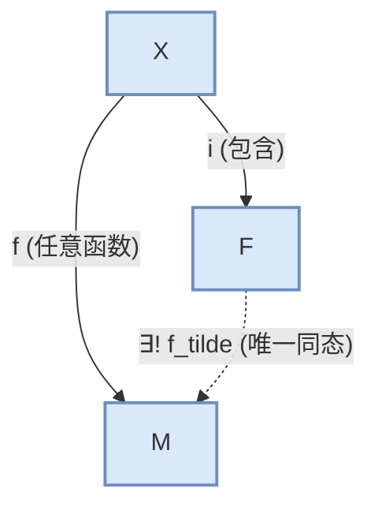

# 03-自由模、射影模与内射模

## 1. 自由模 (Free Module)

### 1.1. 核心概念: 基 (Basis)

- **线性无关**: R-模 $M$ 的一个子集 $S$ 被称为是**线性无关**的，如果对于 $S$ 中任意有限个不同元素 $s_1, \dots, s_n$，方程 $r_1s_1 + \dots + r_ns_n = 0$ ($r_i \in R$) 成立的唯一方式是所有的系数 $r_i=0$。
- **生成集**: 模 $M$ 的一个子集 $S$ 是一个**生成集**，如果 $M$ 中每个元素都可以写成 $S$ 中元素的有限线性组合。
- **基 (Basis)**: 如果 $M$ 的一个子集 $S$ 既是线性无关的，又是生成集，则称 $S$ 是 $M$ 的一个**基**。
- **自由模**: 一个拥有基的 R-模被称为**自由模**。

### 1.2. 性质与区别

- **与向量空间的巨大差异**:
    1. **不是所有模都是自由模**。例如，$\mathbb{Z}$-模 $\mathbb{Z}_n$ (n>1) 就不是自由模，因为对于任何元素 $x \in \mathbb{Z}_n$，都有 $nx=0$，所以它不可能是线性无关的。
    2. **基的势不唯一**。对于某些环 $R$，一个自由 R-模可能拥有两个元素个数不同的基。然而，对于**交换环** $R$，自由模的基的势（如果存在）是唯一的，这个势称为模的**秩 (Rank)**。

- **普适性质**: 一个 R-模 $F$ 是自由的，当且仅当存在一个集合 $X$，使得对于任何 R-模 $M$ 和任何函数 $f: X \to M$，都存在唯一的模同态 $\tilde{f}: F \to M$ 使得 $\tilde{f}$ 在 $X$ 上的限制就是 $f$。这说明自由模是"无约束"的，从基到任意模的映射可以唯一地扩展为整个模的同态。



## 2. 射影模 (Projective Module)

射影模是自由模概念的推广，它保留了自由模最重要的"提升"性质。

### 2.1. 定义

一个 R-模 $P$ 被称为是**射影模**，如果它满足以下等价条件之一：

1. **提升性质 (Lifting Property)**: 对于任何满射模同态 $f: N \to M$ 和任何模同态 $g: P \to M$，都存在一个模同态 $h: P \to N$ 使得 $f \circ h = g$。

    ```mermaid
    graph TD
        P -- "g" --> M
        P -.->| "∃ h (提升)" | N
        N -- "f (满射)" --> M
    ```

2. **直和项性质**: $P$ 是某个自由模的直和项。即，存在一个模 $K$ 使得 $F = P \oplus K$，其中 $F$ 是一个自由模。
3. **分裂性质**: 任何以 $P$ 为商模的短正合列 $0 \to K \to N \to P \to 0$ 都是可分裂的。

### 2.2. 关系

- **自由模 $\implies$ 射影模**: 任何自由模都是射影模。
- **反之不成立**: 存在是射影模但不是自由模的例子。例如，在环 $R = \mathbb{Z}_6$ 中，理想 $(2)$ 和 $(3)$ 都是射影模，但不是自由模。$R = (2) \oplus (3)$，所以它们是自由模 $R$ 的直和项。

## 3. 内射模 (Injective Module)

内射模是射影模的**对偶 (Dual)** 概念，其定义中的箭头方向正好相反。

### 3.1. 定义

一个 R-模 $Q$ 被称为是**内射模**，如果它满足以下等价条件之一：

1. **延伸性质 (Extension Property)**: 对于任何单射模同态 $f: N \to M$ 和任何模同态 $g: N \to Q$，都存在一个模同态 $h: M \to Q$ 使得 $h \circ f = g$。

    ```mermaid
    graph TD
        Q
        N -- "g" --> Q
        M -.->| "∃ h (延伸)" | Q
        N -- "f (单射)" --> M
    ```

2. **贝尔判别法 (Baer's Criterion)**: 一个模 $Q$ 是内射的，当且仅当对 $R$ 的任意（左）理想 $I$，任意模同态 $g: I \to Q$都能延伸为 $R \to Q$ 的同态。
3. **直和项性质**: $Q$ 是任何包含它的模的直和项。

### 3.2. 重要示例

- **可除群 (Divisible Group)**: 一个阿贝尔群 $A$ 是可除的，如果对任意 $a \in A$ 和任意非零整数 $n \in \mathbb{Z}$，都存在 $x \in A$ 使得 $nx=a$。
- **定理**: 一个 $\mathbb{Z}$-模是内射模，当且仅当它是一个可除群。例如 $\mathbb{Q}$ 和 $\mathbb{Q}/\mathbb{Z}$ 都是内射 $\mathbb{Z}$-模。

## 4. 内部链接

- [[02-模同态与同构定理]]
- [[04-张量积]]
