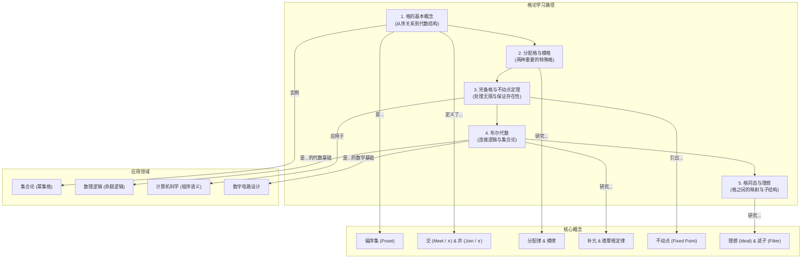

# 1. 格论总览

**版本**: 2.0
**日期**: 2025-07-02

---

## 1.1. 引言：什么是格论？

**格论 (Lattice Theory)** 是研究配备了"交"和"并"两种运算的 **偏序集 (partially ordered set)** 的代数学分支。与群、环、域等主要关注代数运算的结构不同，格论的出发点是 **序关系**。它研究的核心是任何两个元素是否都存在唯一的 **最小上界 (join/supremum)** 和 **最大下界 (meet/infimum)**。

格的结构无处不在。一个集合的所有子集在"包含关系"下构成一个格；逻辑命题在"蕴含关系"下构成一个格；整数在"整除关系"下也构成一个格。格论为这些看似无关的领域提供了一套统一的语言和强大的工具，尤其在计算机科学（布尔代数、形式化方法、类型论）、逻辑学和集合论中扮演着基础性角色。

## 1.2. 知识地图 (Mermaid)

## 1.3. 学习路径

1. **[01-格的基本概念.md](./01-格的基本概念.md)**: 从偏序集 (Poset) 出发，理解上下界、最大最小元等概念，最终引出格的形式化定义、对偶性原则和子格。
2. **[02-分配格与模格.md](./02-分配格与模格.md)**: 学习两种附加了重要性质的格。**分配格** 要求交、并运算像集合的交、并一样满足分配律，而 **模格** 则是其一种弱化形式。
3. **[03-完备格与不动点定理.md](./03-完备格与不动点定理.md)**: 学习 **完备格**，其中 **任意** 子集都存在上下确界。并基于此介绍强大的 **克纳斯特-塔斯基不动点定理**。
4. **[04-布尔代数.md](./04-布尔代数.md)**: 聚焦于一类完美的代数结构——**有补分配格**。它是连接集合论、经典逻辑和数字电路的数学基石。
5. **[05-格同态与理想.md](./05-格同态与理想.md)**: 介绍保持格结构的映射（**同态**），以及作为商格基础的特殊子集（**理想**与**滤子**），完成格论核心知识体系的闭环。

## 1.4. 格的两种定义视角

格可以从两个等价的视角来定义：

1. **序理论视角**: 一个偏序集 $(L, \le)$，其中任意两个元素 $\{a, b\}$ 都存在唯一的最小上界（记为 $a \lor b$）和最大下界（记为 $a \wedge b$）。
2. **代数视角**: 一个集合 $L$ 配备了两种满足结合律、交换律和吸收律的二元运算 $\lor$ 和 $\wedge$。

这两个视角是完全等价的，可以相互推导。

---
[返回上一级: 03-代数结构与理论](../00-代数结构与理论总览.md) | [返回项目总览](../../09-项目总览/00-项目总览.md) 