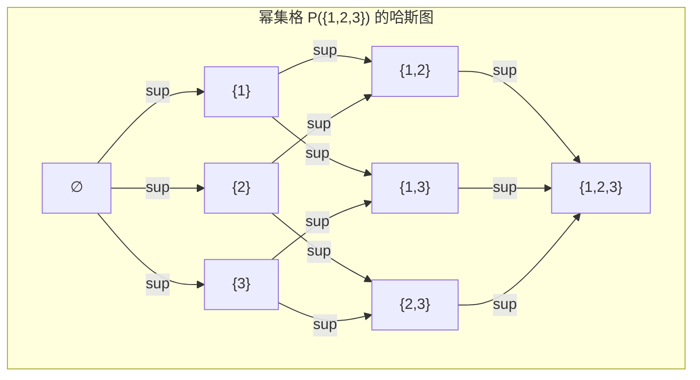

# 01-格的基本概念

## 1. 从偏序集到格

### 1.1. 偏序集 (Partially Ordered Set, Poset)

- **定义**: 一个**偏序集**是一个集合 $P$ 配备一个二元关系 $\le$，它满足自反性、反对称性和传递性。
  - **自反性**: $a \le a$
  - **反对称性**: 若 $a \le b$ 且 $b \le a$，则 $a=b$
  - **传递性**: 若 $a \le b$ 且 $b \le c$，则 $a \le c$
- **与全序集区别**: 偏序集中并非所有元素都必须是可比较的。例如，在"整除"关系构成的偏序集 $(\mathbb{Z}^+, |)$ 中，2 和 3 就无法比较大小。

### 1.2. 上界与下界

设 $(P, \le)$ 是一个偏序集，$S$ 是 $P$ 的一个子集。

- **上界 (Upper Bound)**: $u \in P$ 是 $S$ 的一个上界，如果对所有 $s \in S$ 都有 $s \le u$。
- **下界 (Lower Bound)**: $l \in P$ 是 $S$ 的一个下界，如果对所有 $s \in S$ 都有 $l \le s$。
- **最小上界 (Least Upper Bound, Supremum)**: $S$ 的上界中的最小元，记作 $\sup(S)$ 或 $\bigvee S$。
- **最大下界 (Greatest Lower Bound, Infimum)**: $S$ 的下界中的最大元，记作 $\inf(S)$ 或 $\bigwedge S$。

**注意**: 上下界可能不存在，即使存在也可能不唯一。但最小上界/最大下界如果存在，则一定是唯一的。

## 2. 格的等价定义

### 2.1. 定义一: 基于序结构

- **定义**: 一个偏序集 $(L, \le)$ 被称为一个**格**，如果对于 $L$ 中任意两个元素 $a, b$，它们的二元子集 $\{a, b\}$ 都存在最小上界和最大下界。
- **运算**:
  - **并 (Join)**: $a \lor b = \sup(\{a, b\})$ (最小上界)
  - **交 (Meet)**: $a \land b = \inf(\{a, b\})$ (最大下界)

### 2.2. 定义二: 基于代数结构

- **定义**: 一个集合 $L$ 配备两个二元运算 $\land$ (交) 和 $\lor$ (并) 被称为一个**格**，如果它们满足对所有 $a, b, c \in L$：
    1. **交换律**: $a \land b = b \land a$, $a \lor b = b \lor a$
    2. **结合律**: $a \land (b \land c) = (a \land b) \land c$, $a \lor (b \lor c) = (a \lor b) \lor c$
    3. **吸收律**: $a \land (a \lor b) = a$, $a \lor (a \land b) = a$
    4. **幂等律**: $a \land a = a$, $a \lor a = a$ (可由吸收律推出)

### 2.3. 两种定义的等价性

- 从序结构到代数结构：若 $(L, \le)$ 是格，定义交、并运算后，它们自然满足交换、结合、吸收和幂等律。
- 从代数结构到序结构：若 $(L, \land, \lor)$ 是格，可以定义一个偏序关系：$a \le b \iff a \land b = a$ (或等价地，$a \lor b = b$)。这个关系将使 $L$ 成为一个偏序集，并且其交、并操作与原操作一致。

## 3. 基本概念与可视化

### 3.1. 哈斯图 (Hasse Diagram)

- **定义**: 一种用于可视化**有限**偏序集结构的图形。
- **画法**:
    1. 每个元素是一个节点。
    2. 如果 $a < b$ 并且不存在 $c$ 使得 $a < c < b$ (称 $b$ **覆盖** $a$)，则从 $a$ 到 $b$ 画一条向上的线段。
    3. 省略因自反性（无环）和传递性（无捷径）而多余的线。
- **在格中的应用**: 在哈斯图中，任意两点 $a, b$ 的交 $a \land b$ 是从它们出发一路向下能汇聚到的第一个公共点；并 $a \lor b$ 是一路向上能汇聚到的第一个公共点。

### 3.2. 示例

- **幂集格**: 集合 $S=\{1,2,3\}$ 的幂集 $\mathcal{P}(S)$ 在集合包含关系 $\subseteq$ 下构成一个格。
  - $A \land B = A \cap B$
  - $A \lor B = A \cup B$

### 3.3. 对偶原理 (Duality Principle)

- **原理**: 对于任何一个关于格的命题，如果我们将所有的 $\le$ 换成 $\ge$，$\land$ 换成 $\lor$，那么得到的命题仍然成立。
- **意义**: 证明一个命题，其对偶命题也自动得证，使理论体系的构建效率加倍。

## 4. 内部链接

- [[00-格论总览]]
- [[02-分配格与模格]]
