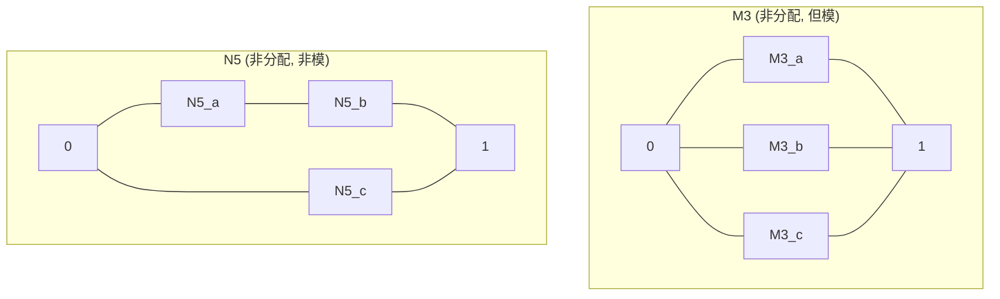
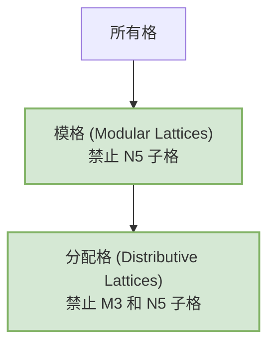

# 02-分配格与模格

## 1. 分配格 (Distributive Lattice)

### 1.1. 定义

一个格 $(L, \land, \lor)$ 被称为**分配格**，如果它的交运算和并运算相互满足分配律。即对所有 $a, b, c \in L$：

1. **交对并的分配律**: $a \land (b \lor c) = (a \land b) \lor (a \land c)$
2. **并对交的分配律**: $a \lor (b \land c) = (a \lor b) \land (a \lor c)$

- **事实**: 在任何格中，这两条分配律中的任意一条都可以推出另一条。同时，分配律的一个方向（例如 $a \land (b \lor c) \ge (a \land b) \lor (a \land c)$）在所有格中都成立，所以证明分配性只需证明另一个方向。

### 1.2. 示例

- **幂集格**: 集合的交运算和并运算满足分配律，因此任何幂集格都是分配格。
- **全序集**: 任何一个全序集（例如实数集 $\mathbb{R}$）都是一个分配格。其中 $a \land b = \min(a, b)$，$a \lor b = \max(a, b)$。

### 1.3. 禁止子格 (Forbidden Sublattice)

一个格是分配格，当且仅当它不包含任何与以下两个“五边形格 N5”和“钻石格 M3”同构的子格。这是格论中一个深刻的结构性定理。

- **钻石格 M3 (Diamond Lattice)**: 包含一个最小元，一个最大元，以及三个相互不可比较的原子。它破坏了分配律。
- **五边形格 N5 (Pentagon Lattice)**: 包含五个元素，其哈斯图形状像一个五边形。它也破坏了分配律。

## 2. 模格 (Modular Lattice)

模格是比分配格更弱（更具一般性）的一种格，它放宽了分配律的要求。

### 2.1. 定义

一个格 $(L, \land, \lor)$ 被称为**模格**，如果它满足**模律 (Modular Law)**：
> 对所有 $a, b, c \in L$，若 $a \le c$，则 $a \lor (b \land c) = (a \lor b) \land c$。

- **注意**: 模律是分配律在 $a \le c$ 条件下的一个弱化版本。因此，任何分配格都必然是模格。

### 2.2. 示例

- **群的子群格**: 一个群的**正规子群**格是模格。更一般地，一个群的全部子群格不一定是模格，但如果群是阿贝尔群，则其子群格是模格。
- **向量空间的子空间格**: 一个向量空间的所有子空间构成的格是模格。这与著名的维数公式相关：$\dim(U+W) = \dim(U) + \dim(W) - \dim(U \cap W)$。
- **钻石格 M3**: M3 是一个模格，但我们已知它不是分配格。

### 2.3. 禁止子格

一个格是模格，当且仅当它不包含任何与“五边形格 N5”同构的子格。

## 3. 关系总结

- **分配格 $\implies$ 模格**: 任何分配格一定是模格。
- **模格 $\not\implies$ 分配格**: 模格不一定是分配格（例如 M3）。
- **非模格 $\implies$ 非分配格**: 一个格如果连模格都不是（例如 N5），那它肯定不是分配格。

## 4. 内部链接

- [[01-格的基本概念]]
- [[03-完备格与不动点定理]]
