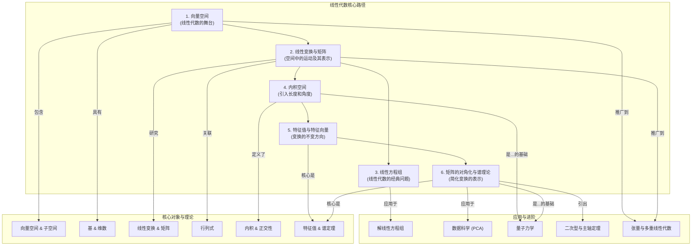

# 1. 线性代数总览

**版本**: 1.0
**日期**: 2025-07-02

---

## 1.1. 引言：什么是线性代数？

**线性代数 (Linear Algebra)** 是关于 **向量空间** 和 **线性变换** 的数学分支。它的核心思想是将几何问题代数化，将代数问题几何化，通过研究向量、向量空间以及空间之间的线性映射，为从物理学到计算机科学的众多领域提供了极其强大的分析工具。

从表面上看，线性代数处理的是线性方程组和矩阵。但其真正的精髓在于将这些计算工具抽象为一套优美的几何语言：

* **向量 (Vector)**: 不再仅仅是坐标系中的箭头，而是抽象向量空间中的一个元素。
* **矩阵 (Matrix)**: 不再仅仅是数字的排列，而是两个向量空间之间 **线性变换** 的一种具体表示。

掌握线性代数，就是掌握一种在多维空间中进行思考和推理的语言。

## 1.2. 知识地图 (Mermaid)

## 1.3. 学习路径

1. **[01-向量空间.md](./01-向量空间.md)**: 建立线性代数的公理化基础，理解向量空间、子空间、基、维数和坐标系等核心定义。这是所有后续内容展开的舞台。
2. **[02-线性变换与矩阵.md](./02-线性变换与矩阵.md)**: 探讨向量空间之间的结构保持映射——**线性变换**。并揭示其与 **矩阵** 之间的根本联系：矩阵是选定基下的线性变换的数值表示。
3. **[03-线性方程组的几何诠释.md](./03-线性方程组的几何诠释.md)**: 重新审视线性代数的经典问题，从行空间、列空间、零空间（核）和左零空间（余核）四个基本子空间的视角，深刻理解解的存在性、唯一性与解的结构。
4. **[04-内积空间.md](./04-内积空间.md)**: 为抽象的向量空间引入额外的结构——**内积**，从而定义向量的长度、向量间的夹角、正交性等几何概念。施密特正交化是核心计算工具。
5. **[05-特征值与特征向量.md](./05-特征值与特征向量.md)**: 研究线性变换的"不变性"。**特征向量** 是在变换中方向保持不变的向量，而 **特征值** 则是其长度变化的比例。这是理解变换本质的关键。
6. **[06-矩阵对角化与谱理论.md](./06-矩阵对角化与谱理论.md)**: 探究如何为线性变换找到一组最理想的基（由特征向量构成），使得变换的矩阵表示为一个简洁的 **对角矩阵**。这极大地简化了计算，其理论核心是 **谱定理**。

---
[返回上一级: 03-代数结构与理论](../00-代数结构与理论总览.md) | [返回项目总览](../../09-项目总览/00-项目总览.md)
