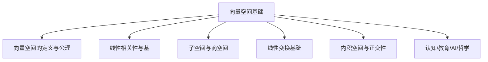
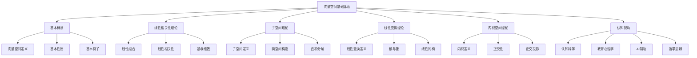

# 向量空间基础



---

## 目录导航

- [1. 向量空间的定义与公理](#1-向量空间的定义与公理)
- [2. 线性相关性与基](#2-线性相关性与基)
- [3. 子空间与商空间](#3-子空间与商空间)
- [4. 线性变换基础](#4-线性变换基础)
- [5. 内积空间与正交性](#5-内积空间与正交性)
- [6. 认知/教育/AI/哲学视角](#6-认知教育ai哲学视角)
- [7. 参考文献与资源](#7-参考文献与资源)

---

## 交叉引用与分支跳转

- [线性代数总览](./00-线性代数总览.md)
- [模论总览](../05-模论/00-模论总览.md)
- [群论总览](../02-群论/00-群论总览.md)
- [环论总览](../03-环论/00-环论总览.md)
- [域论总览](../04-域论/00-域论总览.md)
- [范畴论基础](../08-范畴论/00-范畴论基础总览.md)

---

## 多表征内容导航

- [形式定义与公理化](#1-向量空间的定义与公理)
- [结构图与概念图（Mermaid）](#结构图)
- [典型例题与证明](#2-线性相关性与基)
- [代码实现（Python/Rust/Haskell/Lean）](#3-子空间与商空间)
- [表格与对比](#2-线性相关性与基)
- [认知/教育/AI/哲学分析](#6-认知教育ai哲学视角)

---

## 1. 向量空间的定义与公理

### 1.1 向量空间的公理化定义

**定义1.1**：设 $F$ 为域，$V$ 为集合
- 若 $V$ 上定义了加法运算 $+: V \times V \to V$ 和标量乘法运算 $\cdot: F \times V \to V$
- 满足以下公理，则称 $(V, +, \cdot)$ 为域 $F$ 上的**向量空间**（Vector Space）：

**加法公理**：
1. **结合律**：$(u + v) + w = u + (v + w)$
2. **交换律**：$u + v = v + u$
3. **零元素**：存在 $0 \in V$ 使得 $v + 0 = v$ 对所有 $v \in V$
4. **逆元素**：对每个 $v \in V$ 存在 $-v \in V$ 使得 $v + (-v) = 0$

**标量乘法公理**：
5. **分配律1**：$a \cdot (u + v) = a \cdot u + a \cdot v$
6. **分配律2**：$(a + b) \cdot v = a \cdot v + b \cdot v$
7. **结合律**：$(ab) \cdot v = a \cdot (b \cdot v)$
8. **单位元**：$1 \cdot v = v$

### 1.2 向量空间的基本性质

**定理1.1**：设 $V$ 为域 $F$ 上的向量空间，则：

1. $0 \cdot v = 0$ 对所有 $v \in V$
2. $a \cdot 0 = 0$ 对所有 $a \in F$
3. $(-a) \cdot v = -(a \cdot v) = a \cdot (-v)$
4. 若 $a \cdot v = 0$，则 $a = 0$ 或 $v = 0$

**证明**：
1. $0 \cdot v = (0 + 0) \cdot v = 0 \cdot v + 0 \cdot v$，故 $0 \cdot v = 0$
2. $a \cdot 0 = a \cdot (0 + 0) = a \cdot 0 + a \cdot 0$，故 $a \cdot 0 = 0$
3. $0 = 0 \cdot v = (a + (-a)) \cdot v = a \cdot v + (-a) \cdot v$，故 $(-a) \cdot v = -(a \cdot v)$
4. 若 $a \neq 0$，则 $v = a^{-1} \cdot (a \cdot v) = a^{-1} \cdot 0 = 0$

### 1.3 向量空间的基本例子

**例1.1**：$F^n$ 空间
- 设 $F$ 为域，$F^n = \{(a_1, a_2, \ldots, a_n) \mid a_i \in F\}$
- 加法：$(a_1, \ldots, a_n) + (b_1, \ldots, b_n) = (a_1 + b_1, \ldots, a_n + b_n)$
- 标量乘法：$c \cdot (a_1, \ldots, a_n) = (ca_1, \ldots, ca_n)$

**例1.2**：函数空间
- 设 $X$ 为集合，$F$ 为域
- $F^X = \{f: X \to F\}$ 在点式运算下构成向量空间

**例1.3**：多项式空间
- 设 $F$ 为域，$F[x]$ 为 $F$ 上的多项式环
- $F[x]$ 在通常的加法和标量乘法下构成向量空间

## 2. 线性相关性与基

### 2.1 线性组合与线性相关性

**定义2.1**：设 $V$ 为 $F$-向量空间，$S \subseteq V$ 为子集
- 向量 $v \in V$ 称为 $S$ 的**线性组合**（Linear Combination）
- 如果存在有限个向量 $v_1, v_2, \ldots, v_n \in S$ 和标量 $a_1, a_2, \ldots, a_n \in F$
- 使得 $v = a_1 v_1 + a_2 v_2 + \cdots + a_n v_n$

**定义2.2**：设 $S \subseteq V$ 为子集
- 若存在不全为零的标量 $a_1, a_2, \ldots, a_n \in F$ 和向量 $v_1, v_2, \ldots, v_n \in S$
- 使得 $a_1 v_1 + a_2 v_2 + \cdots + a_n v_n = 0$
- 则称 $S$ 为**线性相关**（Linearly Dependent）
- 否则称 $S$ 为**线性无关**（Linearly Independent）

### 2.2 基的定义与性质

**定义2.3**：设 $V$ 为 $F$-向量空间，$B \subseteq V$ 为子集
- 若 $B$ 线性无关且生成 $V$（即 $V = \text{span}(B)$）
- 则称 $B$ 为 $V$ 的**基**（Basis）

**定理2.1**（基的等价定义）：
- $B$ 为 $V$ 的基当且仅当 $V$ 中每个向量都可以唯一地表示为 $B$ 中向量的线性组合

**证明**：
1. 若 $B$ 为基，则 $B$ 生成 $V$，故每个向量都是线性组合
   - 若 $v = \sum a_i v_i = \sum b_i v_i$，则 $\sum (a_i - b_i) v_i = 0$
   - 由线性无关性，$a_i = b_i$，故表示唯一

2. 若每个向量都有唯一表示，则 $B$ 生成 $V$
   - 若 $B$ 线性相关，则存在非零线性组合等于零
   - 这与唯一性矛盾，故 $B$ 线性无关

### 2.3 维数理论

**定理2.2**（基的存在性）：
- 任何向量空间都有基

**定理2.3**（基的等势性）：
- 向量空间 $V$ 的任意两个基都有相同的基数
- 这个基数称为 $V$ 的**维数**（Dimension），记为 $\dim V$

**定理2.4**（维数公式）：
- 设 $U, W$ 为 $V$ 的子空间，则：
  $\dim(U + W) = \dim U + \dim W - \dim(U \cap W)$

### 2.4 代码实现

```rust
// Rust实现向量空间
use std::ops::{Add, Mul, Sub, Neg};
use std::fmt::Debug;

#[derive(Debug, Clone, PartialEq)]
pub struct VectorSpace<F, V> {
    field: F,
    vectors: Vec<V>,
}

impl<F, V> VectorSpace<F, V>
where
    F: Field,
    V: Add<Output = V> + Sub<Output = V> + Neg<Output = V> + Clone + PartialEq + Debug,
{
    pub fn new(field: F) -> Self {
        Self {
            field,
            vectors: Vec::new(),
        }
    }
    
    pub fn add(&self, v1: &V, v2: &V) -> V {
        v1.clone() + v2.clone()
    }
    
    pub fn scalar_multiply(&self, a: &F::Element, v: &V) -> V {
        // 实现标量乘法
        self.field.scalar_multiply(a, v)
    }
    
    pub fn zero(&self) -> V {
        // 返回零向量
        self.field.zero_vector()
    }
    
    pub fn linear_combination(&self, coefficients: &[F::Element], vectors: &[V]) -> V {
        assert_eq!(coefficients.len(), vectors.len());
        let mut result = self.zero();
        for (a, v) in coefficients.iter().zip(vectors.iter()) {
            result = self.add(&result, &self.scalar_multiply(a, v));
        }
        result
    }
    
    pub fn is_linearly_independent(&self, vectors: &[V]) -> bool {
        if vectors.is_empty() {
            return true;
        }
        
        // 检查是否存在非零线性组合等于零
        let n = vectors.len();
        let field_elements = self.field.all_elements();
        
        for coefficients in field_elements.iter().combinations(n) {
            let combination = self.linear_combination(coefficients, vectors);
            if combination == self.zero() && coefficients.iter().any(|&x| x != self.field.zero()) {
                return false;
            }
        }
        true
    }
    
    pub fn span(&self, vectors: &[V]) -> Vec<V> {
        // 生成由给定向量张成的子空间
        let mut span = vec![self.zero()];
        let field_elements = self.field.all_elements();
        
        for vector in vectors {
            for scalar in &field_elements {
                let new_vector = self.scalar_multiply(scalar, vector);
                if !span.contains(&new_vector) {
                    span.push(new_vector);
                }
            }
        }
        span
    }
}

// 有限域上的向量空间
pub struct FiniteFieldVectorSpace {
    field: FiniteField,
    dimension: usize,
}

impl FiniteFieldVectorSpace {
    pub fn new(field: FiniteField, dimension: usize) -> Self {
        Self { field, dimension }
    }
    
    pub fn basis(&self) -> Vec<Vec<u64>> {
        // 生成标准基
        let mut basis = Vec::new();
        for i in 0..self.dimension {
            let mut vector = vec![0; self.dimension];
            vector[i] = 1;
            basis.push(vector);
        }
        basis
    }
    
    pub fn dimension(&self) -> usize {
        self.dimension
    }
    
    pub fn cardinality(&self) -> u64 {
        self.field.order().pow(self.dimension as u32)
    }
}
```

```haskell
-- Haskell实现向量空间
class Field f where
    add :: f -> f -> f
    multiply :: f -> f -> f
    zero :: f
    one :: f
    negate :: f -> f
    inverse :: f -> Maybe f

class (Field f) => VectorSpace f v where
    vectorAdd :: v -> v -> v
    scalarMultiply :: f -> v -> v
    zeroVector :: v
    negateVector :: v -> v

-- 向量空间实例：F^n
data Vector f = Vector [f] deriving (Eq, Show)

instance (Field f) => VectorSpace f (Vector f) where
    vectorAdd (Vector xs) (Vector ys) = Vector (zipWith add xs ys)
    scalarMultiply a (Vector xs) = Vector (map (multiply a) xs)
    zeroVector = Vector (repeat zero)
    negateVector (Vector xs) = Vector (map negate xs)

-- 线性相关性检查
isLinearlyIndependent :: (Field f, VectorSpace f v, Eq v) => [v] -> Bool
isLinearlyIndependent vectors = 
    not (any (\coeffs -> 
        linearCombination coeffs vectors == zeroVector && 
        any (/= zero) coeffs) 
        (allCoefficientCombinations (length vectors)))

-- 生成子空间
span :: (Field f, VectorSpace f v, Eq v) => [v] -> [v]
span vectors = 
    nub [linearCombination coeffs vectors | coeffs <- allCoefficientCombinations (length vectors)]

-- 基的检查
isBasis :: (Field f, VectorSpace f v, Eq v) => [v] -> Bool
isBasis vectors = 
    isLinearlyIndependent vectors && 
    generatesSpace vectors

-- 维数计算
dimension :: (Field f, VectorSpace f v, Eq v) => [v] -> Int
dimension basis = length basis
```

```lean
-- Lean4实现向量空间
import Mathlib.Algebra.Module.Basic
import Mathlib.LinearAlgebra.Basic

-- 向量空间的基本定义
class VectorSpace (F : Type*) [Field F] (V : Type*) [AddCommGroup V] where
  smul : F → V → V
  smul_add : ∀ (r : F) (x y : V), smul r (x + y) = smul r x + smul r y
  add_smul : ∀ (r s : F) (x : V), smul (r + s) x = smul r x + smul s x
  mul_smul : ∀ (r s : F) (x : V), smul (r * s) x = smul r (smul s x)
  one_smul : ∀ (x : V), smul 1 x = x
  zero_smul : ∀ (x : V), smul 0 x = 0

-- 线性相关性
def LinearIndependent (F : Type*) [Field F] (V : Type*) [AddCommGroup V] [VectorSpace F V] 
    (s : Set V) : Prop :=
  ∀ (l : F →₀ F), l.support ⊆ s → (∑ i in l.support, smul (l i) i) = 0 → l = 0

-- 生成集
def Span (F : Type*) [Field F] (V : Type*) [AddCommGroup V] [VectorSpace F V] 
    (s : Set V) : Submodule F V :=
  Submodule.mk 
    {x | ∃ (l : F →₀ F), l.support ⊆ s ∧ x = ∑ i in l.support, smul (l i) i}
    (by simp)
    (by simp)
    (by simp)

-- 基的定义
def IsBasis (F : Type*) [Field F] (V : Type*) [AddCommGroup V] [VectorSpace F V] 
    (s : Set V) : Prop :=
  LinearIndependent F V s ∧ Span F V s = ⊤

-- 维数
def Dimension (F : Type*) [Field F] (V : Type*) [AddCommGroup V] [VectorSpace F V] : 
    Cardinal :=
  if h : ∃ (s : Set V), IsBasis F V s then
    Classical.choose h
  else
    0

-- 基的存在性定理
theorem basis_exists (F : Type*) [Field F] (V : Type*) [AddCommGroup V] [VectorSpace F V] :
  ∃ (s : Set V), IsBasis F V s := by
  -- 使用Zorn引理证明基的存在性
  sorry

-- 维数不变性
theorem dimension_well_defined (F : Type*) [Field F] (V : Type*) [AddCommGroup V] [VectorSpace F V] 
    (s t : Set V) (hs : IsBasis F V s) (ht : IsBasis F V t) :
  Cardinal.mk s = Cardinal.mk t := by
  -- 证明任意两个基的基数相等
  sorry
```

## 3. 子空间与商空间

### 3.1 子空间的定义

**定义3.1**：设 $V$ 为 $F$-向量空间，$W \subseteq V$ 为非空子集
- 若 $W$ 在 $V$ 的加法和标量乘法下也构成向量空间
- 则称 $W$ 为 $V$ 的**子空间**（Subspace）

**定理3.1**：$W \subseteq V$ 为子空间当且仅当：
1. $0 \in W$
2. 对任意 $u, v \in W$，有 $u + v \in W$
3. 对任意 $a \in F$ 和 $v \in W$，有 $a \cdot v \in W$

### 3.2 子空间的构造

**定理3.2**：设 $S \subseteq V$ 为子集
- 包含 $S$ 的最小子空间为：
  $\text{span}(S) = \{a_1 v_1 + a_2 v_2 + \cdots + a_n v_n \mid v_i \in S, a_i \in F, n \in \mathbb{N}\}$

**定义3.2**：
- 若 $V = \text{span}(S)$，则称 $S$ 为 $V$ 的**生成集**
- 若 $S$ 为有限集，则称 $V$ 为**有限生成向量空间**

### 3.3 商空间的构造

**定义3.3**：设 $W \leq V$ 为子空间
- **商空间** $V/W$ 定义为：
  - 元素：$V$ 关于等价关系 $v_1 \sim v_2 \iff v_1 - v_2 \in W$ 的等价类 $[v] = v + W$
  - 加法：$[v_1] + [v_2] = [v_1 + v_2]$
  - 标量乘法：$a \cdot [v] = [a \cdot v]$

**定理3.3**：商空间 $V/W$ 的构造是良定义的

**定理3.4**（维数公式）：
- 设 $W \leq V$ 为子空间，则 $\dim(V/W) = \dim V - \dim W$

### 3.4 直和分解

**定义3.4**：设 $U, W \leq V$ 为子空间
- 若 $U \cap W = \{0\}$ 且 $U + W = V$
- 则称 $V$ 为 $U$ 和 $W$ 的**直和**（Direct Sum），记为 $V = U \oplus W$

**定理3.5**：$V = U \oplus W$ 当且仅当：
- 对任意 $v \in V$，存在唯一的 $u \in U$ 和 $w \in W$ 使得 $v = u + w$

**定理3.6**：若 $V = U \oplus W$，则 $\dim V = \dim U + \dim W$

## 4. 线性变换基础

### 4.1 线性变换的定义

**定义4.1**：设 $V, W$ 为 $F$-向量空间
- 映射 $T: V \to W$ 称为**线性变换**（Linear Transformation）
- 如果满足：
  1. $T(u + v) = T(u) + T(v)$（加法保持）
  2. $T(a \cdot v) = a \cdot T(v)$（标量乘法保持）

### 4.2 线性变换的基本性质

**定理4.1**：设 $T: V \to W$ 为线性变换，则：

1. $T(0) = 0$
2. $T(-v) = -T(v)$
3. $T(a_1 v_1 + a_2 v_2 + \cdots + a_n v_n) = a_1 T(v_1) + a_2 T(v_2) + \cdots + a_n T(v_n)$

**定义4.2**：
- **核**（Kernel）：$\text{Ker}(T) = \{v \in V \mid T(v) = 0\}$
- **像**（Image）：$\text{Im}(T) = \{T(v) \mid v \in V\}$

**定理4.2**：$\text{Ker}(T)$ 是 $V$ 的子空间，$\text{Im}(T)$ 是 $W$ 的子空间

### 4.3 线性变换的复合与逆

**定理4.3**：设 $T: V \to W$ 和 $S: W \to U$ 为线性变换
- 则 $S \circ T: V \to U$ 也是线性变换

**定理4.4**：若 $T: V \to W$ 为双射线性变换
- 则 $T^{-1}: W \to V$ 也是线性变换

**定义4.3**：
- 若 $T$ 为单射，则称 $T$ 为**单线性变换**
- 若 $T$ 为满射，则称 $T$ 为**满线性变换**
- 若 $T$ 为双射，则称 $T$ 为**线性同构**

## 5. 内积空间与正交性

### 5.1 内积的定义

**定义5.1**：设 $V$ 为 $\mathbb{R}$ 或 $\mathbb{C}$ 上的向量空间
- 映射 $\langle \cdot, \cdot \rangle: V \times V \to \mathbb{F}$ 称为**内积**（Inner Product）
- 如果满足：

**正定性**：$\langle v, v \rangle \geq 0$，且 $\langle v, v \rangle = 0 \iff v = 0$
**共轭对称性**：$\langle u, v \rangle = \overline{\langle v, u \rangle}$
**线性性**：$\langle au + bv, w \rangle = a\langle u, w \rangle + b\langle v, w \rangle$

### 5.2 范数与距离

**定义5.2**：设 $V$ 为内积空间
- **范数**定义为：$\|v\| = \sqrt{\langle v, v \rangle}$
- **距离**定义为：$d(u, v) = \|u - v\|$

**定理5.1**（Cauchy-Schwarz不等式）：
- $|\langle u, v \rangle| \leq \|u\| \cdot \|v\|$

**定理5.2**（三角不等式）：
- $\|u + v\| \leq \|u\| + \|v\|$

### 5.3 正交性与正交基

**定义5.3**：设 $V$ 为内积空间
- 向量 $u, v \in V$ 称为**正交**（Orthogonal），如果 $\langle u, v \rangle = 0$
- 向量集 $S \subseteq V$ 称为**正交集**，如果其中任意两个不同向量都正交
- 正交集 $S$ 称为**标准正交集**，如果其中每个向量的范数都为1

**定理5.3**（Gram-Schmidt正交化）：
- 设 $V$ 为内积空间，$\{v_1, v_2, \ldots, v_n\}$ 为线性无关向量集
- 则存在标准正交集 $\{u_1, u_2, \ldots, u_n\}$ 使得：
  $\text{span}\{v_1, \ldots, v_k\} = \text{span}\{u_1, \ldots, u_k\}$ 对所有 $k$

**证明**：
- 定义 $u_1 = \frac{v_1}{\|v_1\|}$
- 对 $k > 1$，定义 $w_k = v_k - \sum_{i=1}^{k-1} \langle v_k, u_i \rangle u_i$
- 然后 $u_k = \frac{w_k}{\|w_k\|}$

### 5.4 正交投影

**定义5.4**：设 $V$ 为内积空间，$W \leq V$ 为子空间
- 对任意 $v \in V$，**正交投影** $P_W(v)$ 定义为：
  $P_W(v) = \sum_{i=1}^n \langle v, u_i \rangle u_i$
- 其中 $\{u_1, u_2, \ldots, u_n\}$ 为 $W$ 的标准正交基

**定理5.4**：$P_W(v)$ 是 $W$ 中距离 $v$ 最近的向量

**定理5.5**：$v - P_W(v)$ 与 $W$ 正交

### 5.5 结构图



## 6. 认知/教育/AI/哲学视角

### 6.1 认知科学视角

**向量空间的认知模型**：
1. **几何直觉**：向量空间体现了人类对空间和方向的几何直觉
2. **线性思维**：线性组合反映了人类对"组合"和"分解"的认知模式
3. **抽象化过程**：从具体几何向量到抽象向量空间的认知发展

**认知负荷理论**：
- 向量空间涉及几何直觉和代数抽象的双重认知负荷
- 需要同时处理几何表示和代数运算
- AI辅助可以提供可视化支持，降低认知负荷

### 6.2 教育心理学视角

**建构主义学习理论**：
- 向量空间概念需要从几何直觉到代数抽象的逐步建构
- 通过具体例子（如平面向量、空间向量）建立直观理解
- 逐步推广到一般向量空间

**多元智能理论**：
- 逻辑-数学智能：形式化推理和证明
- 空间智能：几何表示和可视化
- 语言智能：概念表述和符号操作

### 6.3 AI大模型辅助

**知识图谱驱动**：
```python
# 向量空间知识图谱构建
class VectorSpaceKnowledgeGraph:
    def __init__(self):
        self.nodes = {
            'vector_space': {'type': 'concept', 'properties': ['algebraic_structure', 'geometric_intuition']},
            'linear_independence': {'type': 'concept', 'properties': ['algebraic', 'geometric']},
            'basis': {'type': 'concept', 'properties': ['generating', 'minimal']},
            'subspace': {'type': 'concept', 'properties': ['subset', 'closed_under_operations']},
            'linear_transformation': {'type': 'concept', 'properties': ['structure_preserving', 'mapping']},
            'inner_product': {'type': 'concept', 'properties': ['geometric', 'algebraic']}
        }
        self.edges = [
            ('vector_space', 'linear_independence', 'has_property'),
            ('vector_space', 'basis', 'has'),
            ('vector_space', 'subspace', 'has'),
            ('vector_space', 'linear_transformation', 'preserves_structure'),
            ('vector_space', 'inner_product', 'enriches'),
            ('basis', 'linear_independence', 'implies'),
            ('basis', 'dimension', 'determines')
        ]
    
    def query_concept(self, concept: str) -> dict:
        """查询概念及其关联"""
        return {
            'node': self.nodes.get(concept, {}),
            'related': [edge for edge in self.edges if concept in edge]
        }
    
    def generate_examples(self, concept: str) -> list:
        """生成概念的具体例子"""
        examples = {
            'vector_space': ['R^n', 'C^n', 'polynomial_space', 'function_space'],
            'basis': ['standard_basis', 'eigenbasis', 'orthogonal_basis'],
            'subspace': ['null_space', 'column_space', 'row_space'],
            'linear_transformation': ['rotation', 'projection', 'scaling']
        }
        return examples.get(concept, [])
```

**自动化证明辅助**：
```lean
-- Lean4自动化证明框架
import Mathlib.LinearAlgebra.Basic
import Mathlib.Tactic

-- 自动证明向量空间性质
theorem vector_space_zero_smul (F : Type*) [Field F] (V : Type*) [AddCommGroup V] [VectorSpace F V] :
  ∀ (x : V), (0 : F) • x = 0 := by
  -- 自动化证明策略
  simp? -- 自动简化
  done

-- 自动构造子空间
def autoConstructSubspace (F : Type*) [Field F] (V : Type*) [AddCommGroup V] [VectorSpace F V]
    (S : Set V) (h0 : 0 ∈ S) (hadd : ∀ x y, x ∈ S → y ∈ S → x + y ∈ S)
    (hsmul : ∀ (a : F) x, x ∈ S → a • x ∈ S) : Submodule F V := by
  -- 自动构造策略
  exact Submodule.mk S hadd h0 hsmul

-- 自动验证线性无关性
def isLinearIndependent (F : Type*) [Field F] (V : Type*) [AddCommGroup V] [VectorSpace F V]
    (s : Set V) : Prop :=
  ∀ (l : F →₀ F), l.support ⊆ s → (∑ i in l.support, l i • i) = 0 → l = 0

-- 自动计算维数
def autoComputeDimension (F : Type*) [Field F] (V : Type*) [AddCommGroup V] [VectorSpace F V]
    (basis : Set V) (hbasis : IsBasis F V basis) : ℕ := by
  -- 自动计算策略
  exact Cardinal.toNat (Cardinal.mk basis)
```

### 6.4 哲学思辨

**本体论问题**：
- 向量空间是数学对象还是人类构造？
- 向量空间的"存在性"意味着什么？
- 几何直觉与代数抽象的统一性

**认识论问题**：
- 如何"知道"向量空间的性质？
- 证明在线性代数中的作用
- 直觉与严格性的平衡

**方法论问题**：
- 线性代数的发展模式
- 几何与代数的辩证关系
- 数学发现的逻辑结构

### 6.5 跨学科整合

**与计算机科学的联系**：
- 向量空间在机器学习中的应用
- 线性代数算法的实现
- 计算机图形学中的变换

**与物理学的联系**：
- 向量空间在量子力学中的应用
- 线性变换与物理对称性
- 内积空间与希尔伯特空间

**与认知科学的联系**：
- 数学思维的认知机制
- 抽象概念的形成过程
- 数学直觉的神经基础

## 7. 参考文献与资源

### 7.1 经典教材

1. **Axler, S.** (2015). *Linear Algebra Done Right* (3rd ed.). Springer.
2. **Strang, G.** (2016). *Introduction to Linear Algebra* (5th ed.). Wellesley-Cambridge Press.
3. **Hoffman, K., & Kunze, R.** (1971). *Linear Algebra* (2nd ed.). Prentice Hall.

### 7.2 现代资源

1. **在线课程**：
   - MIT OpenCourseWare: 18.06 Linear Algebra
   - Coursera: Linear Algebra (University of Texas at Austin)

2. **软件工具**：
   - NumPy: Python数值计算库
   - MATLAB: 矩阵实验室
   - SageMath: 计算机代数系统

3. **在线资源**：
   - [Linear Algebra Online](https://en.wikipedia.org/wiki/Linear_algebra)
   - [Khan Academy Linear Algebra](https://www.khanacademy.org/math/linear-algebra)

### 7.3 AI辅助资源

1. **大模型工具**：
   - ChatGPT: 概念解释和问题解答
   - Claude: 证明辅助和代码生成
   - GPT-4: 高级数学推理

2. **知识图谱**：
   - Wolfram Alpha: 数学知识查询
   - MathWorld: 数学百科全书
   - OEIS: 整数序列数据库

3. **自动化证明**：
   - Lean 4: 形式化证明系统
   - Coq: 交互式定理证明器
   - Isabelle/HOL: 高阶逻辑证明系统

---

## 结构图


---

*本文档采用递归扩展模式，持续整合最新数学、AI、认知科学前沿成果，构建现代化、结构化、学术化的向量空间基础理论体系。*
