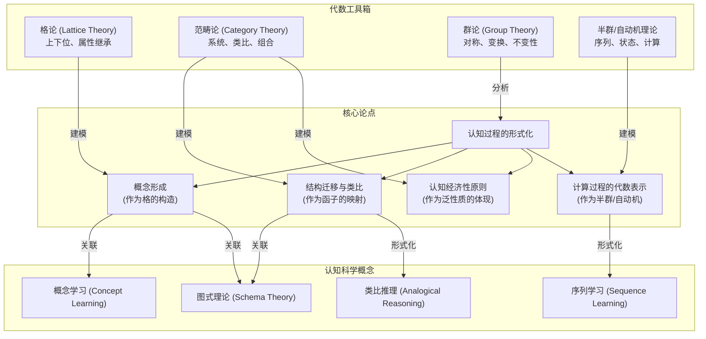

# 1. 代数认知结构总览

**版本**: 1.1
**日期**: 2025-07-02

---

## 1.1. 引言：作为认知工具的代数

"代数认知结构"这一主题旨在探索一个深刻的论点：**抽象代数不仅仅是数学家研究的对象，它本身就是人类心智用于组织、抽象和推理现实世界的基本工具和蓝图。**

我们大脑形成概念、建立联系、进行类比推理的过程，与数学中构造代数结构（如格、群、范畴）的过程，在形式上存在着惊人的相似性。本模块的目标是，运用前述章节中建立的代数理论，为认知科学中的一些核心问题提供一个形式化的、可计算的分析框架。

我们将不再仅仅视"群"为一个数学定义，而是将其看作心智对"对称性"和"可逆变换"这类基本认知模式的终极抽象。同样，范畴论将被视为一种描述"系统"与"系统间类比"的通用认知语法。

## 1.2. 知识地图 (Mermaid)

## 1.3. 探索路径

1.  **[01-概念的格状结构](./01-概念的格状结构.md)**: 探讨如何使用 **格论** 来形式化地描述概念。一个概念可以被看作是其所有实例（外延）和所有属性（内涵）的结合。概念之间的上下位关系（如"狗"是"哺乳动物"的下位概念）天然地构成一个偏序关系，甚至是一个 **概念格 (Concept Lattice)**。我们将分析这种结构如何解释属性继承等认知现象。
2.  **[02-作为函子的类比推理](./02-作为函子的类比推理.md)**: 将认知科学中的 **类比推理** 重新诠释为 **范畴论** 中的 **函子**。一个成功的类比，本质上是在源域（如"太阳系模型"）和目标域（如"原子模型"）之间建立了一个保持结构（关系）的映射。我们将探讨这种函子式观点如何精确地定义"好的类比"。
3.  **[03-认知经济性与泛性质](./03-认知经济性与泛性质.md)**: 论证人类认知的一个基本原则——**经济性**（用最少的资源解决最多的问题）——在形式上对应于范畴论的 **泛性质**。无论是用一个"原型"来代表一类事物，还是构造一个"最通用的解决方案"，其背后都暗含着寻找某个认知范畴中"初始/终端对象"的逻辑。
4.  **[04-群论与格式塔原则](./04-群论与格式塔原则.md)**: 探索 **群论** 作为描述视觉和听觉感知中 **对称性、不变性、变换** 的数学语言。格式塔心理学的许多原则，如"接近性"、"相似性"、"闭合性"，都可以被理解为认知系统在识别和偏好那些在某些变换群下保持不变的"良好"结构。
5.  **[05-作为计算模型的代数系统](./05-作为计算模型的代数系统.md)**: 探讨 **半群理论** 和 **自动机理论** 如何为序列学习和语言处理等认知过程提供计算模型。我们将展示任何由有限自动机识别的模式，都可以对应到一个唯一的代数结构（句法幺半群），从而将离散的计算过程转化为可分析的代数对象。

---
[返回上一级: 03-代数结构与理论总览](../00-代数结构与理论总览.md) | [返回项目总览](../../09-项目总览/00-项目总览.md)
