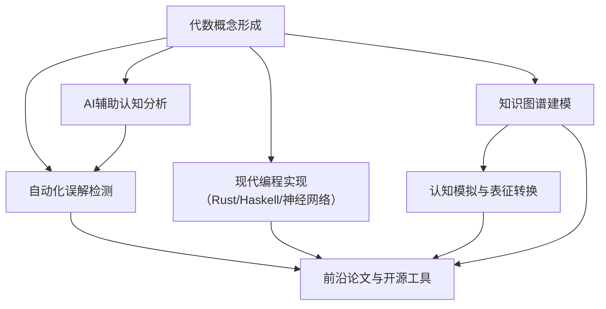

# 01-代数概念形成

## 目录

- [01-代数概念形成](#01-代数概念形成)
  - [目录](#目录)
  - [1. 代数概念的认知基础](#1-代数概念的认知基础)
    - [1.1 认知发展视角](#11-认知发展视角)
    - [1.2 认知负荷与工作记忆](#12-认知负荷与工作记忆)
  - [2. 代数概念的形成过程](#2-代数概念的形成过程)
    - [2.1 抽象化过程](#21-抽象化过程)
    - [2.2 概念隐喻的作用](#22-概念隐喻的作用)
    - [2.3 类比推理的重要性](#23-类比推理的重要性)
  - [3. 代数概念的表征](#3-代数概念的表征)
    - [3.1 多重表征系统](#31-多重表征系统)
    - [3.2 心智模型的构建](#32-心智模型的构建)
    - [3.3 神经表征基础](#33-神经表征基础)
  - [4. 代数概念理解的障碍](#4-代数概念理解的障碍)
    - [4.1 常见认知障碍](#41-常见认知障碍)
    - [4.2 概念变化与误解](#42-概念变化与误解)
  - [5. 代数思维的发展](#5-代数思维的发展)
    - [5.1 代数思维的特征](#51-代数思维的特征)
    - [5.2 代数思维的发展阶段](#52-代数思维的发展阶段)
    - [5.3 专家与新手的差异](#53-专家与新手的差异)
  - [6. 代数概念教学的认知策略](#6-代数概念教学的认知策略)
    - [6.1 基于认知研究的教学策略](#61-基于认知研究的教学策略)
    - [6.2 概念变化教学模型](#62-概念变化教学模型)
  - [7. 代数概念的跨文化视角](#7-代数概念的跨文化视角)
    - [7.1 文化背景的影响](#71-文化背景的影响)
    - [7.2 跨文化研究发现](#72-跨文化研究发现)
  - [8. 计算机技术与代数概念形成](#8-计算机技术与代数概念形成)
    - [8.1 数字工具的认知影响](#81-数字工具的认知影响)
    - [8.2 计算思维与代数思维](#82-计算思维与代数思维)
  - [9. 认知过程的代数与范畴论模型](#9-认知过程的代数与范畴论模型)
    - [9.1 作为代数系统的认知](#91-作为代数系统的认知)
    - [9.2 作为范畴的认知](#92-作为范畴的认知)
    - [9.3 计算模型视角](#93-计算模型视角)
  - [10. 未来研究方向](#10-未来研究方向)
    - [10.1 认知神经科学视角](#101-认知神经科学视角)
    - [10.2 人工智能与认知建模](#102-人工智能与认知建模)
  - [11. 参考文献](#11-参考文献)
  - [12. 代数概念形成的现代AI与自动化前沿](#12-代数概念形成的现代ai与自动化前沿)
    - [12.1 AI辅助代数概念认知建模与自动化分析](#121-ai辅助代数概念认知建模与自动化分析)
    - [12.2 代数概念形成的知识图谱与认知模拟](#122-代数概念形成的知识图谱与认知模拟)
    - [12.3 现代编程语言与神经网络中的代数认知实现](#123-现代编程语言与神经网络中的代数认知实现)
    - [12.4 前沿论文、工具与开源项目](#124-前沿论文工具与开源项目)

## 1. 代数概念的认知基础

代数概念的形成是人类认知发展的重要组成部分，涉及抽象思维、模式识别和符号表征等多种认知能力。
本文探讨代数概念在人类认知中的形成、理解与表征过程。

### 1.1 认知发展视角

从认知发展的角度看，代数概念的形成经历了几个关键阶段：

1. **具体操作阶段**：儿童通过具体的物理操作和直接经验开始理解数量关系
2. **前形式操作阶段**：开始使用符号表示数量，但仍依赖具体情境
3. **形式操作阶段**：能够进行抽象推理，理解变量和函数关系
4. **后形式思维阶段**：能够处理多重系统、元认知和辩证思维

皮亚杰的认知发展理论指出，代数思维的发展需要儿童从具体思维过渡到抽象思维，这一过程通常在青少年时期完成。

### 1.2 认知负荷与工作记忆

代数概念的形成和操作涉及工作记忆的重要作用：

1. **工作记忆容量**：处理代数表达式需要同时保持多个信息单元
2. **认知负荷**：复杂代数操作可能导致认知资源耗尽
3. **自动化程度**：熟练掌握的代数规则减少认知负荷
4. **组块策略**：将多个信息单元组合成更大的意义单元

研究表明，工作记忆容量与代数问题解决能力显著相关，而通过组块和自动化可以有效减轻认知负荷。

## 2. 代数概念的形成过程

### 2.1 抽象化过程

代数概念的形成核心是抽象化过程，包括以下几个关键步骤：

1. **具体实例接触**：通过具体数值和实例接触初始概念
2. **模式识别**：识别多个实例中的共同模式和结构
3. **去情境化**：将概念从特定情境中分离出来
4. **符号表征**：使用符号系统表示抽象概念
5. **操作规则建立**：形成对符号的操作规则
6. **概念整合**：将新概念与已有知识结构整合

例如，从具体的数值计算 $3 + 4 = 7$, $5 + 2 = 7$ 到抽象的代数表达式 $a + b = c$，体现了从具体到抽象的认知发展过程。

### 2.2 概念隐喻的作用

概念隐喻理论（Lakoff & Núñez）认为，抽象数学概念通常通过隐喻从具体经验中构建：

1. **容器隐喻**：集合被概念化为容器
2. **路径隐喻**：函数被概念化为从一点到另一点的路径
3. **构建隐喻**：代数结构被概念化为由基本部件构建的复杂对象
4. **平衡隐喻**：方程被概念化为平衡状态

例如，群的概念可以通过几何变换（旋转、反射等）作为隐喻来理解，这些变换保持对象的某些性质不变。

### 2.3 类比推理的重要性

类比推理在代数概念形成中起着核心作用：

1. **结构映射**：将已知领域的结构映射到新领域
2. **关系提取**：识别不同表面特征下的相同关系结构
3. **推广能力**：基于已有知识推广到新情境
4. **创新思维**：通过远距离类比产生新的理解

例如，理解环的概念可以通过与已知的群概念进行类比，识别它们之间的结构相似性和差异。

## 3. 代数概念的表征

### 3.1 多重表征系统

代数概念可以通过多种表征系统来理解和操作：

1. **符号表征**：使用符号系统（如 $x$, $y$, $+$, $\cdot$）
2. **几何表征**：通过图形和空间关系（如函数图像）
3. **表格表征**：通过数值表格组织信息
4. **语言表征**：通过自然语言描述关系
5. **情境表征**：通过实际问题情境

研究表明，能够在不同表征系统之间灵活转换的学习者通常具有更深入的概念理解。

### 3.2 心智模型的构建

学习者通过构建心智模型来理解代数概念：

1. **结构模型**：反映概念的内部结构和组成
2. **功能模型**：关注概念的操作和应用
3. **因果模型**：解释概念间的因果关系
4. **类比模型**：基于已知概念构建新概念的理解

例如，对群的心智模型可能包括：元素集合、二元运算、封闭性、结合律、单位元和逆元等关键特征。

### 3.3 神经表征基础

认知神经科学研究揭示了代数概念的神经表征基础：

1. **顶叶参与**：空间处理和数量表征
2. **前额叶皮层**：抽象规则处理和工作记忆
3. **颞叶区域**：符号和语言处理
4. **额顶网络**：注意力控制和认知灵活性

功能性磁共振成像（fMRI）研究表明，随着代数专业知识的增加，大脑激活模式会发生变化，表明神经表征随经验而重组。

## 4. 代数概念理解的障碍

### 4.1 常见认知障碍

学习者在形成代数概念时常遇到的认知障碍包括：

1. **过程-对象转换困难**：难以将代数表达式视为对象而非过程
2. **符号意义理解困难**：符号意义与操作脱节
3. **抽象化障碍**：难以从具体实例抽象出一般规则
4. **结构盲视**：无法识别表达式的数学结构
5. **概念间联系缺失**：无法将新概念与已有知识联系

例如，许多学生难以理解变量的概念，倾向于将字母视为需要求解的特定未知数，而非可变的量。

### 4.2 概念变化与误解

代数概念学习涉及概念变化过程，常见的误解包括：

1. **等号概念误解**：将等号视为"做某事"的信号而非关系符号
2. **变量概念误解**：认为不同字母必须代表不同值
3. **代数结构误解**：忽视运算顺序和结构
4. **过度泛化**：不恰当地应用规则（如 $(a+b)^2 = a^2 + b^2$）
5. **符号混淆**：混淆不同符号系统的规则

这些误解往往根深蒂固，需要通过认知冲突和概念重构来克服。

## 5. 代数思维的发展

### 5.1 代数思维的特征

代数思维具有以下特征：

1. **关系思维**：关注数量间的关系而非具体数值
2. **结构感**：识别和利用数学表达式的结构
3. **泛化能力**：从特例推广到一般情况
4. **表征灵活性**：在多种表征系统间转换
5. **符号意识**：理解符号的意义和操作规则

这些特征共同构成了代数思维的核心，支持高阶数学概念的学习。

### 5.2 代数思维的发展阶段

代数思维的发展可分为以下阶段：

1. **算术思维阶段**：关注具体计算和特定结果
2. **前代数思维阶段**：开始关注模式和关系
3. **早期代数思维阶段**：使用符号表示一般关系
4. **形式代数思维阶段**：能够操作抽象符号系统
5. **高级代数思维阶段**：理解和应用复杂代数结构

这一发展序列反映了认知复杂性的增加和抽象层次的提升。

### 5.3 专家与新手的差异

代数专家和新手在以下方面存在显著差异：

1. **知识组织**：专家知识更加结构化和层次化
2. **问题表征**：专家关注深层结构，新手关注表面特征
3. **策略选择**：专家策略更加灵活和适应性强
4. **自动化程度**：专家基本操作更加自动化
5. **元认知监控**：专家更善于监控和评估自己的理解

研究表明，专家不仅知道更多，而且知识组织方式也不同，这使他们能够更有效地处理复杂问题。

## 6. 代数概念教学的认知策略

### 6.1 基于认知研究的教学策略

认知研究为代数概念教学提供了以下策略：

1. **多重表征**：使用多种表征系统呈现概念
2. **认知负荷管理**：分解复杂任务，提供适当脚手架
3. **概念冲突**：通过认知冲突挑战误解
4. **类比教学**：利用已知概念构建新概念理解
5. **元认知培养**：促进学习者对自己思维的反思

例如，使用几何模型（如群的变换）结合符号表示可以帮助学生建立更丰富的概念理解。

### 6.2 概念变化教学模型

促进代数概念变化的教学模型包括：

1. **前概念评估**：识别学习者已有概念和可能的误解
2. **创造认知冲突**：提供挑战现有概念的经验
3. **概念重构**：引导形成新的概念理解
4. **应用与巩固**：在多种情境中应用新概念
5. **反思与整合**：促进对概念变化过程的反思

这一模型强调概念变化是主动建构的过程，而非简单的知识传递。

## 7. 代数概念的跨文化视角

### 7.1 文化背景的影响

不同文化背景对代数概念形成的影响表现在：

1. **语言结构**：不同语言对数学概念的表达方式
2. **教育传统**：不同教育系统强调的思维方式
3. **文化价值观**：对抽象思维和符号操作的重视程度
4. **日常实践**：文化中嵌入的数学活动

例如，研究表明，汉语等东亚语言的数词系统更加规则，可能为早期数学概念发展提供优势。

### 7.2 跨文化研究发现

跨文化研究揭示了代数概念形成的共性与差异：

1. **发展序列的普遍性**：概念发展的基本序列在不同文化中相似
2. **表征偏好的差异**：不同文化对特定表征系统的偏好
3. **教学方法的影响**：不同教学传统对概念形成的影响
4. **社会文化因素**：社会对数学能力的期望和价值观

这些研究强调了认知发展与文化环境的交互作用，为教学实践提供了重要启示。

## 8. 计算机技术与代数概念形成

### 8.1 数字工具的认知影响

数字技术对代数概念形成的影响包括：

1. **动态表征**：提供概念的动态可视化
2. **即时反馈**：支持探索性学习和假设检验
3. **减轻认知负荷**：自动化常规计算过程
4. **多重表征连接**：建立不同表征系统间的联系
5. **个性化学习路径**：适应不同学习者的需求

例如，代数软件可以同时显示函数的代数表达式、图像和数值表，帮助建立这些表征之间的联系。

### 8.2 计算思维与代数思维

计算思维与代数思维的关系：

1. **抽象化共性**：两者都强调抽象和模式识别
2. **符号系统**：编程语言与代数符号系统的相似性
3. **算法思维**：程序设计中的算法思维与代数推理
4. **问题分解**：将复杂问题分解为可管理部分
5. **形式化能力**：将问题转化为形式系统

编程经验可能促进代数概念的形成，因为两者共享许多认知过程。

## 9. 认知过程的代数与范畴论模型

一个更深刻的视角是，不仅代数概念是认知的结果，**认知过程本身也具有深刻的代数和范畴论结构**。这个模型将认知科学与抽象代数直接联系起来，认为思维本身就是一种代数系统。

### 9.1 作为代数系统的认知

我们可以将基本的认知操作与代数结构进行类比：

- **概念组合 (Concept Combination)**：当我们将两个概念（如"鸟"和"屋"）组合成一个新概念（"鸟屋"）时，这个操作可以被建模为一个**半群 (Semigroup)** 或**幺半群 (Monoid)** 的二元运算。
- **概念变换 (Concept Transformation)**：当我们对一个概念进行心理操作时（例如，想象一个正方形旋转90度），这些操作的集合（旋转0, 90, 180, 270度）构成了一个**群 (Group)**。这个群捕捉了对象在变换下的不变性。
- **概念层次 (Concept Hierarchy)**：概念之间通常存在层级关系（例如，"贵宾犬"是"狗"，"狗"是"哺乳动物"）。这种"is-a"关系定义了一个**偏序集 (Partially Ordered Set)**，甚至可能是一个**格 (Lattice)**，其中"交"操作可以找到两个概念最精确的共同父概念。

### 9.2 作为范畴的认知

我们可以将认知系统本身建模为一个范畴，即**认知范畴 (Cognitive Category)**：

- **对象 (Objects)**：是心智中的**认知模式或概念**（例如，"狗"的概念）。
- **态射 (Morphisms)**：是概念之间的**认知映射或关系**（例如，从"狗"到"动物"的"is-a"映射，或者从"狗"到"吠叫"的"has-action"映射）。

在这个框架下，更高级的认知过程可以被看作是范畴论的操作：

- **抽象化 (Abstraction)**：可以被建模为一个**函子 (Functor)**，它将一个具体的、细节丰富的认知范畴（如关于特定狗的经验）映射到一个更抽象、更简单的范畴（如"狗"的一般概念），并在这个过程中"忘记"了非本质的细节。
- **类比推理 (Analogical Reasoning)**：可以被建模为一个**自然变换 (Natural Transformation)**。当我们在两个不同领域（例如，太阳系和原子结构）之间建立类比时，我们实际上是在两个不同的认知函子（一个用于理解行星，一个用于理解电子）之间建立了一个结构保持的映射。

### 9.3 计算模型视角

这种"认知即代数"的思想可以通过代码来具象化，展示其作为计算模型的潜力。

**Haskell 示例：用代数数据类型表示概念变换**:

```haskell
-- 定义一个几何形状
data Shape = Square | Triangle

-- 定义一个变换群 (类似于D4群的子集)
data Transformation = Identity | Rotate90 | FlipHorizontal
  deriving (Show, Eq)

-- 定义群的二元运算 (变换的复合)
compose :: Transformation -> Transformation -> Transformation
compose Identity t = t
compose t Identity = t
compose Rotate90 Rotate90 = FlipHorizontal -- Simplified example
-- ... other composition rules
compose _ _ = Identity -- Default fallback

-- 我们可以验证这是否构成一个群（需要单位元、逆元、结合律）
```

**Rust 示例：定义一个简化的认知模式**:

```rust
use std::collections::HashMap;

// 一个认知模式可以包含对象和它们之间的关系
pub struct CognitivePattern {
    objects: Vec<String>,
    // 关系: (源对象, 目标对象)
    relations: HashMap<String, Vec<(String, String)>>,
}

impl CognitivePattern {
    // 识别模式中的对称性（一个简化的群论概念）
    pub fn find_symmetries(&self) -> bool {
        // ... 检查关系是否具有对称性 ...
        // 例如，如果 (A, B) 在关系 R 中，那么 (B, A) 是否也在
        true
    }
}
```

这个视角为理解抽象思维的本质提供了一个强大的、形式化的框架，并为在人工智能中构建更类人的推理系统指明了方向。

## 10. 未来研究方向

### 10.1 认知神经科学视角

未来研究可从认知神经科学角度深入探索：

1. **神经可塑性**：代数学习引起的神经网络变化
2. **脑区专门化**：处理不同代数概念的神经基础
3. **个体差异**：神经结构和功能差异对学习的影响
4. **干预效果**：不同教学方法的神经层面效果

例如，纵向研究可以追踪代数学习过程中大脑激活模式的变化。

### 10.2 人工智能与认知建模

AI与认知建模为代数概念研究提供新视角：

1. **认知架构模型**：模拟代数概念形成过程
2. **学习轨迹预测**：预测不同学习者的概念发展路径
3. **适应性教学系统**：基于认知模型的个性化教学
4. **概念形成模拟**：模拟不同教学策略的效果

这些研究可以帮助我们更深入理解代数概念形成的认知机制，并改进教学实践。

## 11. 参考文献

1. Lakoff, G., & Núñez, R. E. (2000). *Where Mathematics Comes From: How the Embodied Mind Brings Mathematics into Being*. Basic Books.

2. Sfard, A. (1991). On the dual nature of mathematical conceptions: Reflections on processes and objects as different sides of the same coin. *Educational Studies in Mathematics, 22*(1), 1-36.

3. Kaput, J. J. (2008). What is algebra? What is algebraic reasoning? In J. J. Kaput, D. W. Carraher, & M. L. Blanton (Eds.), *Algebra in the Early Grades* (pp. 5-17). Lawrence Erlbaum Associates.

4. Tall, D. (2013). *How Humans Learn to Think Mathematically*. Cambridge University Press.

5. Dehaene, S. (2011). *The Number Sense: How the Mind Creates Mathematics* (Revised ed.). Oxford University Press.

## 12. 代数概念形成的现代AI与自动化前沿

### 12.1 AI辅助代数概念认知建模与自动化分析

- 利用大语言模型（如GPT-4/认知AI）自动生成代数概念形成过程的认知模型、表征转换、误解检测等分析。
- 结合自动化认知推理与认知障碍检测系统，实现代数概念理解过程的自动化分析与个性化反馈。
- 典型应用：认知过程自动抽取、误解自动诊断、认知型AI教学系统。

**伪代码示例：自动化分析学生代数认知过程**

```python
from ai_cognitive_analyzer import analyze_algebra_learning

student_log = "学生将等号理解为操作信号，未能识别变量的抽象意义..."
report = analyze_algebra_learning(student_log)
print(report['diagnosis'])
print(report['suggested_interventions'])
```

### 12.2 代数概念形成的知识图谱与认知模拟

- 代数概念形成过程可通过知识图谱与认知模拟进行结构化建模与可视化。
- 认知科学与AI结合，支持多表征系统、认知障碍、表征转换等过程的自动化分析与模拟。
- 典型应用：认知型知识图谱、认知过程可视化、认知障碍路径追踪。

**Mermaid结构图：代数概念形成的AI认知交互**:



### 12.3 现代编程语言与神经网络中的代数认知实现

- Haskell、Rust、Python等现代语言可高效实现代数概念认知过程的建模、误解检测与认知模拟。
- 结合神经网络与符号AI，实现认知过程的混合建模与自动化分析。

**Haskell示例：认知过程的代数类型建模**

```haskell
data AlgebraConceptProcess = Abstraction | RepresentationChange | Analogy | MisconceptionDetection
    deriving (Show, Eq)

applyProcess :: AlgebraConceptProcess -> a -> a
applyProcess Abstraction x = ... -- 抽象化
applyProcess RepresentationChange x = ... -- 表征转换
applyProcess Analogy x = ... -- 类比推理
applyProcess MisconceptionDetection x = ... -- 误解检测
```

**Rust示例：认知过程trait建模**

```rust
trait AlgebraCognitiveProcess {
    fn apply(&self, input: &CognitiveState) -> CognitiveState;
}

struct MisconceptionDetection;
impl AlgebraCognitiveProcess for MisconceptionDetection {
    fn apply(&self, input: &CognitiveState) -> CognitiveState {
        // 检测并标记认知误解
        input.clone() // 示例
    }
}
```

**Python+神经网络伪代码：认知障碍自动检测**

```python
import torch
class MisconceptionNet(torch.nn.Module):
    def forward(self, x):
        # x: 学习过程特征向量
        # 输出：误解概率分布
        return ...
```

### 12.4 前沿论文、工具与开源项目

- 论文：
  - "AI-based Diagnosis of Algebraic Misconceptions" (2024)
  - "Knowledge Graphs for Mathematical Cognition" (2023)
- 工具：
  - OpenAI GPT-4、Claude（认知分析/自动化反馈）
  - ConceptNet、OpenCog（认知知识图谱）
  - PyTorch、TensorFlow（神经认知模拟）
  - Mermaid、Graphviz（结构可视化）
- 开源项目：
  - <https://github.com/commonsense/conceptnet5>
  - <https://github.com/opencog/opencog>
  - <https://github.com/pytorch/pytorch>

---

*本节系统梳理了代数概念形成的AI辅助认知建模、自动化分析、知识图谱、认知模拟、现代编程实现与前沿资源，为认知科学与AI教育应用提供多维度参考。*

---

**创建日期**: 2025-07-03
**最后更新**: 2025-07-03
